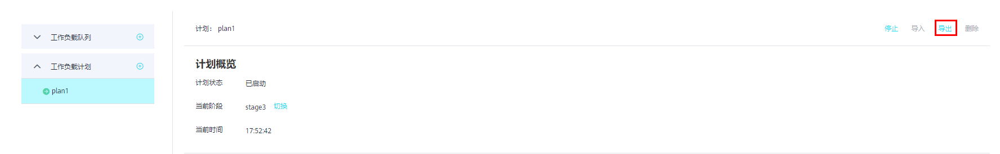
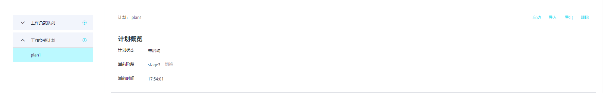

# 导入导出工作负载计划

在使用工作负载计划功能时，可以先在测试环境调测，再使用工作负载计划的导入导出功能将测试环境的计划配置导出，导入至生产环境。

## 导出工作负载计划

1.  登录GaussDB\(DWS\) 管理控制台。
2.  在集群列表中单击需要访问“工作负载管理”页面的集群名称。
3.  切换至“工作负载管理”页签。
4.  进入计划详情页面，点击导出按钮导出工作负载计划。

    

## 导入工作负载计划

1.  登录GaussDB\(DWS\) 管理控制台。
2.  在集群列表中单击需要访问“工作负载管理”页面的集群名称。
3.  切换至“工作负载管理”页签。
4.  进入计划详情页面，点击导入按钮并选择要导入的配置文件导入工作负载计划。

    > **须知：** 
    >-   正在运行的工作负载计划不支持导入。
    >-   导入时需要先创建工作负载队列。

    

