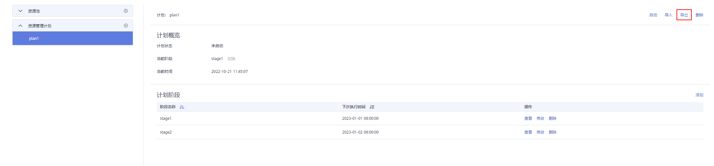
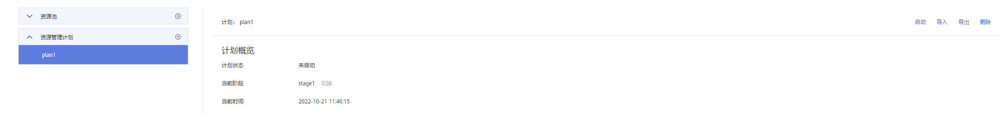

# 导入导出资源管理计划

## 导出资源管理计划

1.  登录GaussDB\(DWS\) 管理控制台。
2.  在集群列表中单击需要访问“资源管理”页面的集群名称。
3.  切换至“资源管理”页签。
4.  进入计划详情页面，点击导出按钮导出资源管理计划。

    

## 导入资源管理计划

1.  登录GaussDB\(DWS\) 管理控制台。
2.  在集群列表中单击需要访问“资源管理”页面的集群名称。
3.  切换至“资源管理”页签。
4.  进入计划详情页面，点击导入按钮并选择要导入的配置文件导入资源管理计划。

    > **须知：** 
    >-   正在运行的资源管理计划不支持导入。
    >-   导入时需要先创建资源池。

    

