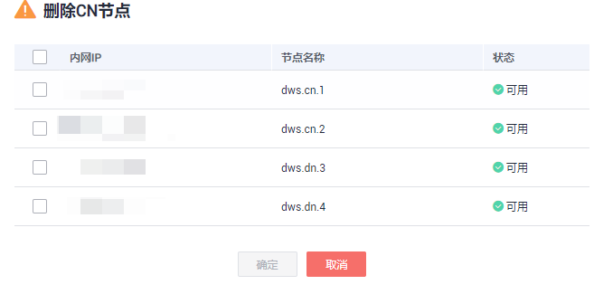

# 工作负载计划

## 工作负载计划简介

工作负载计划功能是GaussDB\(DWS\) 为客户提供的工作负载管理高级特性，客户可以通过创建工作负载计划，向计划中添加多个时间阶段，并为每个阶段配置不同的队列资源配比。当启动计划时，计划就会按照配置在不同的时间段自动切换队列资源配置。如果客户在不同的时间段运行不同的业务，而这些业务又会占用不同比重的资源，使用工作负载计划功能可以很好的帮助客户实现不同时间段的队列资源配置自动切换。

> **说明：** 
>-   工作负载计划支持8.1.0.100及以上版本。

## 添加工作负载计划

1.  登录GaussDB\(DWS\) 管理控制台。
2.  在集群列表中单击需要访问“工作负载管理”页面的集群名称。
3.  切换至“工作负载管理”页签。
4.  单击工作负载计划旁的“+”符号添加队列。
5.  填写工作负载计划的计划名称，并点击确认 。

    > **须知：** 
    >1. 创建工作负载计划之前必须提前规划并创建好工作负载队列，请参见[添加工作负载队列](添加工作负载队列.md)。
    >2. 最多支持创建10个工作负载计划。

    

## 启动工作负载计划

1.  登录GaussDB\(DWS\) 管理控制台。
2.  在集群列表中单击需要访问“工作负载管理”页面的集群名称。
3.  切换至“工作负载管理”页签。
4.  进入计划详情页面，点击启动按钮启动计划。

    > **须知：** 
    >-   每个集群只能启动一个计划。
    >-   一个计划至少要有两个阶段才能启动。

    

## 查看工作负载计划执行日志

1.  登录GaussDB\(DWS\) 管理控制台。
2.  在集群列表中单击需要访问“工作负载管理”页面的集群名称。
3.  切换至“工作负载管理”页签。
4.  进入计划详情页面，在计划执行日志区域查看计划阶段的切换日志。

    

    

## 停止工作负载计划

1.  登录GaussDB\(DWS\) 管理控制台。
2.  在集群列表中单击需要访问“工作负载管理”页面的集群名称。
3.  切换至“工作负载管理”页签。
4.  进入计划详情页面，点击停止按钮停止计划。

    

## 删除工作负载计划

1.  登录GaussDB\(DWS\) 管理控制台。
2.  在集群列表中单击需要访问“工作负载管理”页面的集群名称。
3.  切换至“工作负载管理”页签。
4.  进入计划详情页面，点击删除按钮删除当前工作负载计划。

    > **须知：** 
    >正在运行的工作负载计划不支持删除。

    

