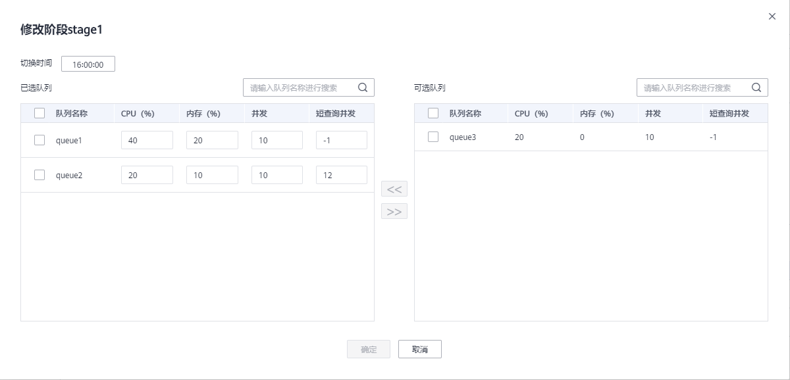

# 工作负载计划阶段

## 添加工作负载计划阶段

1.  登录GaussDB\(DWS\) 管理控制台。
2.  在集群列表中单击需要访问“工作负载管理”页面的集群名称。
3.  切换至“工作负载管理”页签。
4.  进入计划详情页面，点击计划阶段区域的“添加”按钮，在添加阶段页面填写阶段名称并配置队列信息，确认成功后点击确定按钮。

    > **须知：** 
    >-   添加负载阶段时必须停止工作负载计划，否则无法添加。
    >-   每个计划最多支持添加48个阶段。
    >-   一个计划中所有阶段的切换时间不能相同。

    

## 修改工作负载计划阶段

1.  登录GaussDB\(DWS\) 管理控制台。
2.  在集群列表中单击需要访问“工作负载管理”页面的集群名称。
3.  切换至“工作负载管理”页签。
4.  进入计划详情页面，点击计划阶段操作列的修改按钮。

    

5.  在修改计划阶段页面可修改阶段的切换时间，队列配置等信息。

    

## 手动切换工作负载计划阶段

运行中的计划如果需要提前切换至某个阶段，可以通过手动切换功能切换至目标阶段。

1.  登录GaussDB\(DWS\) 管理控制台。
2.  在集群列表中单击需要访问“工作负载管理”页面的集群名称。
3.  切换至“工作负载管理”页签。
4.  进入计划详情页面，点击计划概览处的切换按钮，选择要切换的目标阶段。

    

## 删除工作负载计划阶段

1.  登录GaussDB\(DWS\) 管理控制台。
2.  在集群列表中单击需要访问“工作负载管理”页面的集群名称。
3.  切换至“工作负载管理”页签。
4.  进入计划详情页面，点击计划阶段操作列的删除按钮。

    

> **说明：** 
>删除负载阶段时必须停止工作负载计划，否则无法删除。

