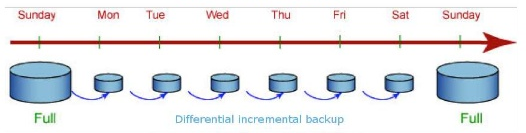

# 快照概述

快照是GaussDB\(DWS\) 集群在某一时间点的完整备份，记录了这一时刻指定集群的所有配置数据和业务数据，用于还原创建快照时的集群数据。快照存储在OBS中。

> **说明：** 
>-   GaussDB\(DWS\) 提供了部分免费存储空间，用于存放您的快照数据。当快照数据存储空间超过免费空间大小时，超出部分按照OBS的计费规则进行计费，参见[OBS价格详情](https://www.huaweicloud.com/pricing.html?tab=detail#/obs)。
>-   免费空间大小是您的集群的总存储空间大小，即单节点存储空间大小 \* 节点数。

快照中包含集群上运行的数据库的数据以及集群的相关信息，其中包括节点数量、节点规格和管理员用户名称等。如果您需要从快照恢复集群，GaussDB\(DWS\) 会使用这些集群信息创建新的集群，然后从快照数据中还原所有数据库。GaussDB\(DWS\) 从快照创建的新集群与制作快照的原始集群具有相同的配置（包括节点的数量和规格）。当您将快照恢复为新集群时，如果您没有指定其他值，则参数默认与快照中的备份信息保持一致。如何从快照恢复集群，请参见[恢复快照到新集群](恢复快照到新集群.md)。

快照有两种类型：手动快照和自动快照。

## 手动快照

您可以随时制作手动快照，手动快照采用全量备份，备份时间会较长。手动快照创建成功后会一直保存，直到您在GaussDB\(DWS\) 管理控制台将此快照删除。如何创建手动快照，请参见[手动创建快照](手动创建快照.md)。

## 自动快照

当您为集群启用了自动快照时，GaussDB\(DWS\) 将按照您设定的时间和周期创建该集群的快照，默认为每8小时一次。当您创建集群时，自动快照默认处于启用状态。自动快照有保留期，可设置为1\~10天，默认为3天，系统会在保留期结束时删除这些快照。您可以在GaussDB\(DWS\) 管理控制台设置集群的自动快照策略，具体操作请参见[设置自动快照策略](设置自动快照策略.md)。

如果要关闭自动快照，只需关闭自动快照开关即可。如果您关闭自动快照，则GaussDB\(DWS\) 会停止自动制作快照并删除相应集群的已有自动快照，请谨慎操作。

自动快照不支持手动删除，仅GaussDB\(DWS\) 系统能够删除自动快照。GaussDB\(DWS\) 会在如下情况下删除自动快照：自动快照保留期结束、您关闭了集群的自动快照或者删除了集群。

如果您想要将自动快照保留更长时间，则可以创建一份副本作为手动快照。自动快照会保留至保留期结束，而相应的手动快照在您将其手动删除前将会一直保留。如何复制自动快照，请参见[复制自动快照](复制自动快照.md)。

## 自动快照的备份与恢复策略

自动快照采用差异增量备份，第一次创建自动快照为全量备份，并且以后每间隔一段时间就会做一次全量备份，全量备份作为基础版本。两次全量备份之间都是做增量备份，增量备份记录基于前一次备份所发生的更改。在恢复快照时，GaussDB\(DWS\) 会将最近一次的全量备份到本次备份之间的所有备份一起用于恢复集群，因此不会产生数据丢失。为了保证每个增量快照都能够正常进行数据恢复，如果增量快照的保存时间超过了保留天数，GaussDB\(DWS\) 不会立即删除过期的增量快照，而是仍然会保留这部分快照，以便提供给后续其他增量快照恢复集群时使用。直到下一次做全量快照为止，GaussDB\(DWS\) 才会一并删除已过期的上一次的全量自动快照和相关的增量快照。如果对已有集群关闭自动快照功能，则会删除该集群所有的自动快照，但手动快照不会被删除。

