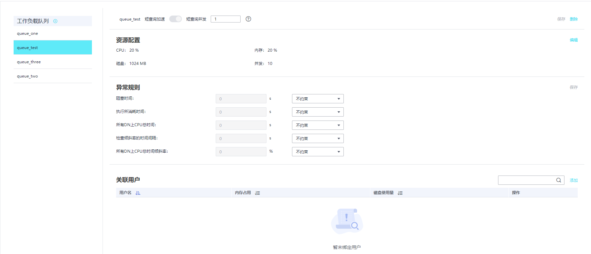
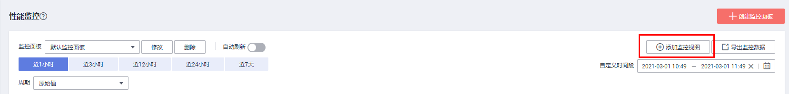
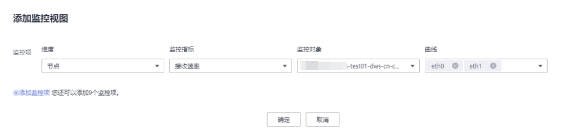
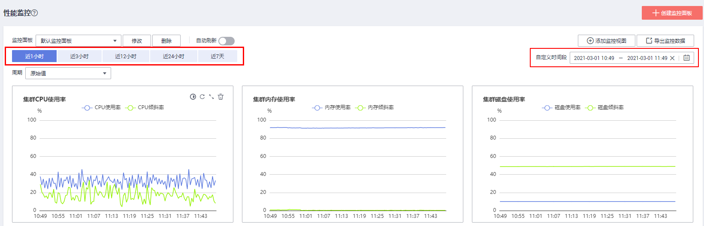
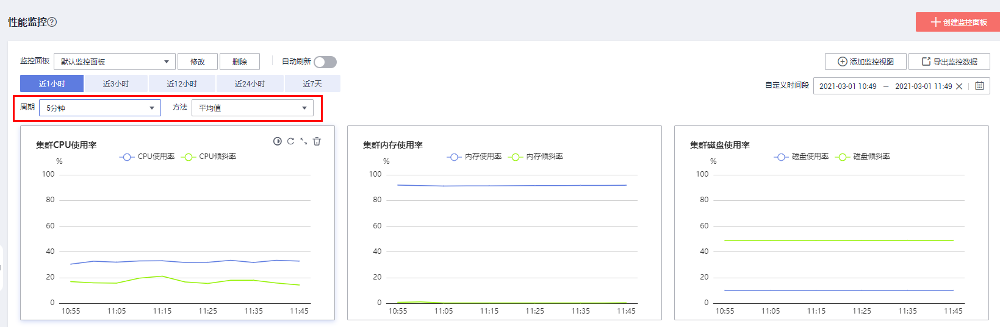

# 性能监控

## 进入性能监控页面

1.  登录GaussDB\(DWS\) 管理控制台。
2.  在“集群管理”页面，找到需要查看监控的集群。
3.  在指定集群所在行的“操作”列，单击“监控面板”，系统将显示数据库监控页面。
4.  在左侧导航栏选择“监控\>性能监控”，进入性能监控页面。

    在性能监控页面展示了集群，数据库，节点三个维度的资源消耗趋势。

## 监控面板

用户通过定义监控面板来配置相关的监控视图，监控面板与用户绑定，登录后可看到自定义的监控面板。

-   创建监控面板：用户可单击“创建监控面板”按钮定义自己的监控面板。
-   修改监控面板：用户可单击“修改”按钮修改监控面板的名称。
-   删除监控面板：用户可单击“删除”按钮删除监控面板，默认监控面板无法被删除。

## 添加监控视图

目前DMS提供集群、数据库两和节点三种维度的监控视图，用户可根据需求单击“添加监控视图”按钮添加。监控指标如下所示：

-   集群维度的监控指标：CPU使用率，内存使用率，磁盘使用率，磁盘I/O，网络I/O，状态，CN异常数量，只读，会话数量，查询数量，死锁数量，DN异常数量，DN实例CPU使用率，平均每秒事务数，平均每秒查询数。
-   数据库维度的监控指标：查询等待队列长度，会话数量，查询数量，插入行数，更新行数，删除行数，容量。
-   节点维度的监控指标：CPU使用率、CPU使用情况、内存使用率、内存使用情况、平均磁盘使用率、磁盘I/O、TCP协议栈重传率、网络IO、磁盘容量、磁盘使用率、磁盘读速率、磁盘写速率、I/O等待时间、I/O服务时间、I/O使用率、网卡状态、接收包数、发送包数、接收丢包数、接收速率、发送速率

    

    

    > **说明：** 
    >-   每个监控面板上最多可以添加20个监控视图，添加过多的视图会导致页面请求数据增多，所需的渲染时间增大，因此请合理的控制监控视图规模。
    >-   性能监控支持用户查看不同时间区间的趋势数据，目前支持五种不同的查看周期。
    >

## 导出监控数据

性能监控支持数据导出，用户可通过单击“导出监控数据”按钮导出数据做二次加工。目前默认导出用户当前页面上的所有监控视图中的数据，导出时间区间以用户选择的为准。

> **说明：** 
>性能监控还提供不同周期粒度的数据聚合能力，用户可根据需求按照相应的采样周期聚合原始数据以展示一个更长时间周期的趋势指标。
>

