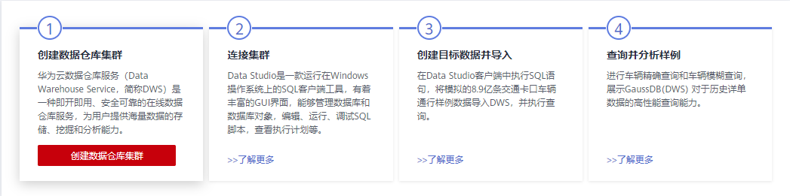
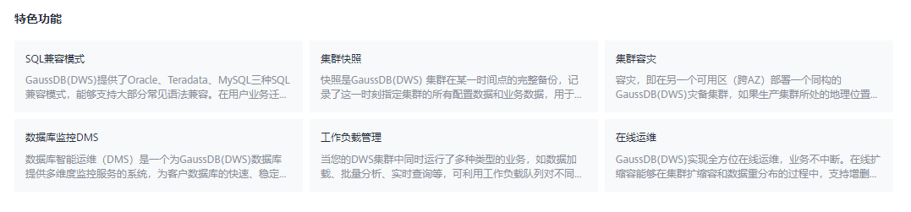
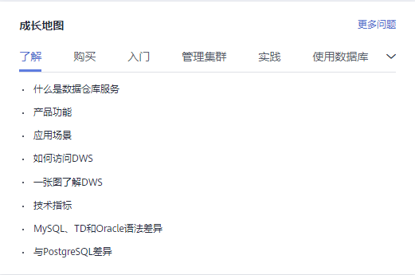
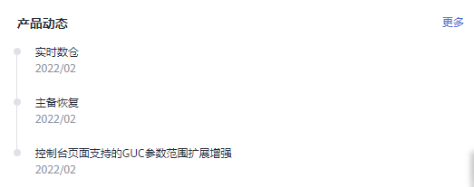
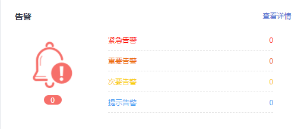

# 总览

总览页面分为[无集群总览页](#section1516835144714)和[有集群总览页](#section12313241506)，用户未购买集群会跳转至无集群总览页，若已购买集群则跳转至有集群总览页。

## 无集群总览页

无集群总览页主要由以下四部分组成：

-   流程指导

    本模块提供创建集群、连接集群并从OBS导入样例数据的操作指导，指导您快速上手数据仓库服务。详情可单击对应步骤中的“了解更多”按钮查看。

    

-   特色功能

    本模块提供了GaussDB\(DWS\)多种强大的特色功能概述，包括SQL兼容模式、集群快照、集群容灾、数据库监控DMS、资源管理、在线运维等。用户可快速掌握各功能原理并根据自身需求操作使用该功能。

    

-   成长地图

    本模块由浅入深，带您玩转实时、简单、安全可信的企业级数据仓库服务GaussDB\(DWS\)。

    

-   产品动态

    此模块默认展示数据仓库服务GaussDB\(DWS\)最新发布的三个功能，详情可单击“更多”按钮。

    

## 有集群总览页

有集群总览页面主要由以下七部分构成，其中成长地图、产品动态、DWS特色功能和无集群总览页面一致：

-   资源

    在“资源”一栏，您可以浏览当前可用资源数量，其中包括“可用集群和总集群（个）”、“可用节点和总节点（个）”、“总容量（GB）”。

    

-   告警

    告警分为紧急告警、重要告警、次要告警和提示告警，详情请参见[告警管理](告警管理.md)。

    

-   近期事件

    事件是用户集群状态发生变化的记录。它可以是由用户操作触发的，也有可能是集群服务状态变化引起的。详情请参见[事件通知](事件通知.md)。

    

-   集群主要指标
    -   集群CPU使用率
    -   集群内存使用率
    -   集群磁盘使用率

        

-   成长地图，详情请参见[•成长地图](#li16369152394910)。
-   产品动态，详情请参见[•产品动态](#li101491232588)
-   特色功能，详情请参见[•DWS特色功能](#li3847151520559)。

