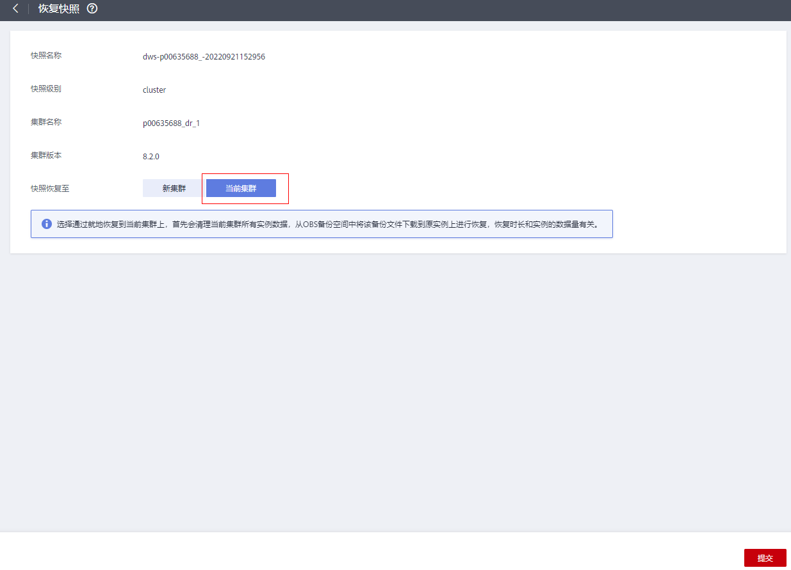

# 恢复快照到原集群

## 操作场景

恢复到原集群时，可以指定快照恢复到本集群。通常在集群故障或者需要将数据回滚到指定快照版本时，用户使用该功能。

> **须知：** 
>-   该功能仅8.1.3.200及以上集群版本支持。
>-   该功能目前支持备份设备为OBS的快照。
>-   快照状态为“可用”时，用户才可以进行快照恢复。
>-   不支持恢复逻辑集群与资源池到当前集群。

## 操作步骤

1.  登录GaussDB\(DWS\) 管理控制台。
2.  在左侧导航栏中，单击“集群管理”。
3.  点击任意集群名称，进入集群管理页面，单击“快照”。
4.  单击“恢复”按钮进入快照恢复页面。

    

5.  选择对应的快照进行就地恢复。

    

    > **说明：** 
    >快照就地恢复期间，集群不可用。

