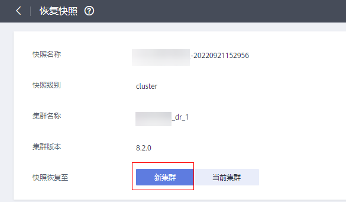
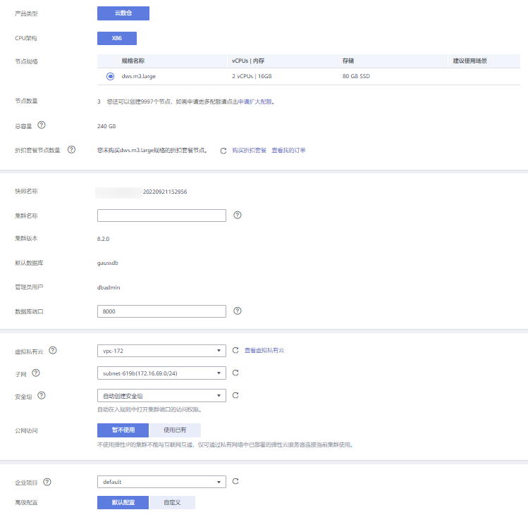

# 恢复快照到新集群

## 操作场景

用户需要查看集群过去某个时刻的快照数据时，必须先恢复快照到新集群。

恢复快照到新集群时，恢复时长是由快照备份的数据量所决定的。如果快照备份的数据量大，恢复就比较慢。如果快照备份的数据量小，恢复就相对比较快。

自动快照是增量备份，在恢复快照时，GaussDB\(DWS\) 会将最近一次的全量备份到本次快照之间的所有快照一起用于恢复集群。自动快照的备份频率是可以设置的，如果一周只备份一次，当增量数据量较大时，就会出现备份慢的情况，因此，建议适当地增加备份频率。

> **须知：** 
>-   恢复快照到新集群的功能目前仅支持备份设备为OBS的快照。
>-   恢复快照时默认创建一个与原始集群规格相同、节点数也相同的新集群。
>-   当前恢复到新集群操作可保证原业务不中断。
>-   使用冷热表后，不支持使用快照将冷数据恢复到新集群。
>-   暂不支持细粒度恢复绝对表空间或相对表空间下的表。
>-   不支持恢复逻辑集群与资源池到新集群。

## 前提条件

-   恢复到新集群时创建所需的资源小于或等于用户剩余配额。
-   用户进行恢复快照到新集群操作时，请确保快照状态为“可用”状态。

## 操作步骤

1.  登录GaussDB\(DWS\) 管理控制台。
2.  在左侧导航栏中，选择**“快照管理”**。默认显示用户所有的快照。
3.  在快照列表中，找到所需恢复的快照，在该快照所在行的“操作”列，单击“恢复”按钮。

    

4.  进入“恢复快照”页面，选择“新集群”并填写新集群的配置参数。

    

    

    恢复快照时，参数支持重新定义，具体请参见[表1](#zh-cn_topic_0000001360289709_zh-cn_topic_0000001180320217_table2991343171911)。其他参数默认与快照中的备份信息保持一致，具体请参见[表2](自动快照策略.md#zh-cn_topic_0000001360169333_zh-cn_topic_0000001231278872_table1355651818416)。

    **表 1**  新集群参数配置说明

    
    <table><thead align="left"><tr id="zh-cn_topic_0000001360289709_zh-cn_topic_0000001180320217_row19991204317197"><th class="cellrowborder" valign="top" width="21.22%" id="mcps1.2.3.1.1">
配置类型

    </th>
    <th class="cellrowborder" valign="top" width="78.78%" id="mcps1.2.3.1.2">
配置名称

    </th>
    </tr>
    </thead>
    <tbody><tr id="zh-cn_topic_0000001360289709_zh-cn_topic_0000001180320217_row11991194316199"><td class="cellrowborder" valign="top" width="21.22%" headers="mcps1.2.3.1.1 ">
基础配置

    </td>
    <td class="cellrowborder" valign="top" width="78.78%" headers="mcps1.2.3.1.2 ">
区域、可用区、节点规格、集群名称、数据库端口、虚拟私有云、子网、安全组、公网访问、企业项目。

    </td>
    </tr>
    <tr id="zh-cn_topic_0000001360289709_zh-cn_topic_0000001180320217_row1146920132016"><td class="cellrowborder" valign="top" width="21.22%" headers="mcps1.2.3.1.1 ">
高级配置

    </td>
    <td class="cellrowborder" valign="top" width="78.78%" headers="mcps1.2.3.1.2 ">
当配置为“自定义”时，设置以下参数：<ul id="zh-cn_topic_0000001360289709_zh-cn_topic_0000001180320217_ul5840537172013"><li>自动快照：当开关设置为开启时，设置以下参数：<ul id="zh-cn_topic_0000001360289709_zh-cn_topic_0000001180320217_ul1795240112615"><li>保留天数</li><li>开始时间</li><li>快照执行周期</li></ul>
    </li><li>标签：如果原集群开启了“加密数据库”，可设置“密钥名称”。</li></ul>
    

    </td>
    </tr>
    </tbody>
    </table>

5.  单击“立即恢复”，进入“规格确认”页面。
6.  规格确认无误后，单击“提交”，开始恢复快照到新集群。

    等待新集群状态变为“可用”，表示快照已恢复成功。

    集群快照恢复成功后，新集群的内网地址和弹性IP地址（如果“公网访问“设置为“现在购买”）会重新分配。

    > **说明：** 
    >如果申请的节点数（个）、vCPU（核）或内存（GB）超过了用户的剩余配额，系统会弹出警告窗口提示用户配额不足并显示详细的剩余配额和当前申请配额信息。用户可以在警告窗口单击“申请扩大配额“，以提工单的形式申请扩大配额。
    >关于配额，请参见[什么是用户配额？](https://support.huaweicloud.com/dws_faq/dws_03_0034.html)。

