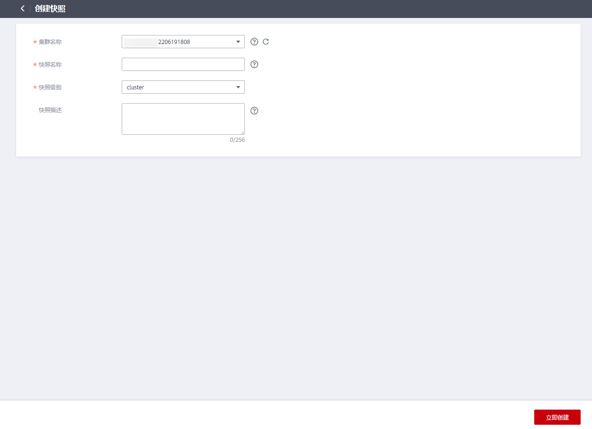

# 手动创建快照

## 操作场景

快照是DWS集群在某一时间点的完整备份，记录了这一时刻指定集群的所有配置数据和业务数据。用户根据业务需要备份集群数据时，可以在“快照管理“页面创建集群的快照。

## 对系统的影响

正在创建快照的集群，暂时无法提供完整服务。如无法执行重启、调整大小、重置密码、修改集群配置信息等操作。同时为保证快照数据的完整，创建快照时建议暂停写入新数据。

## 前提条件

待创建快照的集群，集群状态必须是“可用“、“只读“或者“低性能“任意一种状态。

## 操作步骤

1.  登录[DWS管理控制台](https://console.huaweicloud.com/dws)。
2.  在左侧导航栏中，单击“快照管理“。
3.  单击“创建快照“。

    -   “集群名称“：选择一个指定的DWS集群。只有状态为“可用“的集群会在下拉列表中显示。
    -   “快照名称“：填写快照的名称。

        快照名称长度为4～64个字符，必须以字母开头，不区分大小写，可以包含字母、数字、中划线或者下划线，不能包含其他的特殊字符。

    -   “快照描述“：填写快照的描述信息。

        此参数为可选参数。快照描述的字符长度为0～256，不支持特殊字符!<\>'=&"。

    **图 1**  创建快照  
    

4.  单击“确定“，开始为集群创建快照。

    创建快照时，正在创建快照的集群任务状态变为“创建快照中“。同时正在创建的快照，状态显示为“创建中“。快照创建完成后，快照的状态为“可用“。

    > **说明：**   
    >如果快照大小明显大于集群当前存储数据的大小，可能存在数据仅标记为删除但未真实清理回收，建议执行清理并重新创建快照，参见[如何清理与回收存储空间](https://support.huaweicloud.com/dws_faq/dws_03_0033.html)。  

