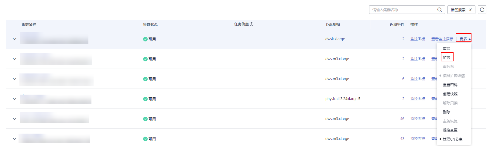

# 扩容逻辑集群

> **须知：** 
>-   逻辑集群在8.1.3及以上版本支持在线扩容。
>-   逻辑集群扩容需要先将集群转换为逻辑集群模式并创建逻辑集群。

1.  登录GaussDB\(DWS\) 管理控制台。
2.  集群列表中，在指定集群所在行的“操作”列选择“更多\>扩容”，进入扩容页面。

    

3.  在扩容页面选择需要扩容的逻辑集群或弹性集群，选择是否打开在线扩容，单击“下一步：规格确认”进行扩容。

    

