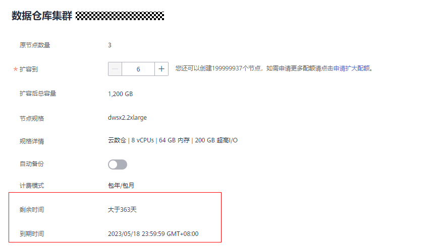
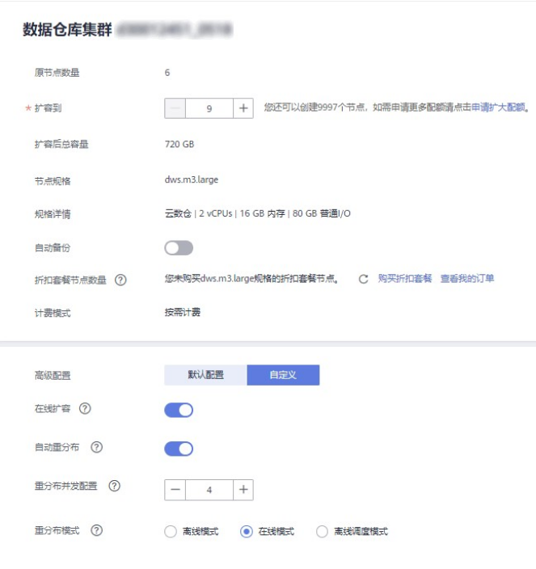
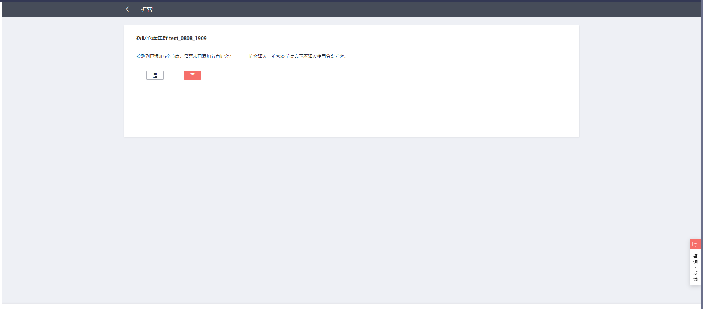
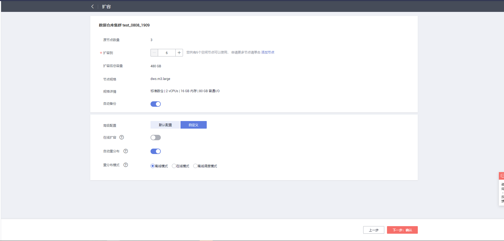
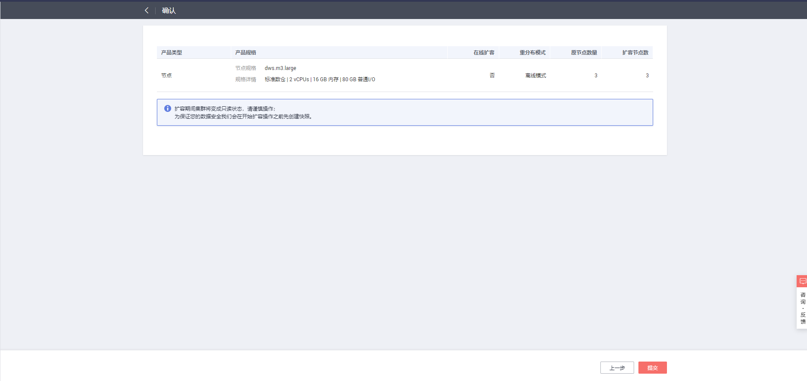
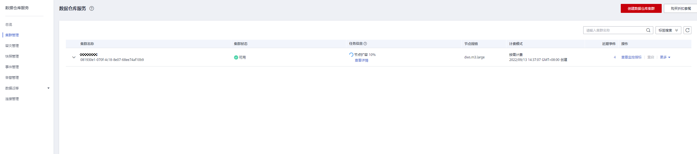

# 扩容集群

用户需要更多的计算资源或存储资源以满足业务需要时，可以在管理控制台对已有集群，通过增加节点进行扩容操作。

> **说明：** 
>-   如果当前集群是包年/包月计费模式，那么新增节点也是按照包年包月模式进行计费。
>-   云数仓集群扩容时使用与当前集群相同的存储规格。
>-   实时数仓（单机部署）不支持扩容集群。

如果您是因集群存储容量不足而扩容集群，建议您在扩容前先执行VACUUM清理和回收存储空间，GaussDB\(DWS\) 数据仓库中保存的数据在删除后，可能没有释放占用的磁盘空间形成脏数据，导致磁盘浪费。如果执行VACUUM后，已使用存储容量仍然占用过高，您再进行扩容。VACUUM的语法请参见《SQL语法参考》中的[VACUUM](https://support.huaweicloud.com/sqlreference-dws/dws_06_0228.html)章节。

## 扩容对系统的影响

-   扩容前，需退出创建了临时表的客户端连接，因为在扩容过程中及扩容成功之前创建的临时表将会失效，操作临时表也会失败。但是扩容后创建的临时表不受影响。
-   在执行“扩容“操作后，集群会进行一次自动快照，快照创建成功后进行集群扩容。
-   正在扩容的集群将禁用重启集群、扩容集群、创建快照、重置数据库管理员密码和删除集群的功能。
-   离线扩容过程中，集群会自动重启，因此集群会有一段时间变为“不可用“状态，重启成功后集群变回“可用“状态。然后在扩容结束阶段，系统会将集群中用户数据在全部节点重新动态分布。
-   离线扩容过程中，用户应该停止所有业务或运行少量查询语句。表重分布期间会对表加共享锁，所有插入、更新、删除操作和表DDL操作都会长时间阻塞，会出现等锁超时情况。一旦表重分布完成，用户可以正常访问该表。在重分布执行过程中，用户应当避免执行超过20分钟的查询（在重分布执行时申请写锁的默认时间为20分钟）。否则可能导致重分布出现等待加锁超时失败的问题。
-   在线扩容过程中，表重分布期间用户可以对该表执行插入、更新、删除，但重分布过程仍然会短时间阻塞用户的数据更新操作，会影响用户语句的执行性能。扩容重分布过程会消耗大量的CPU和IO资源，因此会对用户作业性能影响较大，用户应该尽可能在停止业务情况下或业务轻载的情况下执行扩容重分布。用户也可以考虑分段扩容重分布策略，在系统负载很小的情况下采用高并发进行扩容重分布，在系统负载大的情况下停止扩容重分布或采用低并发进行扩容重分布。
-   扩容后，如果集群创建新快照，将包含扩容节点上的数据。
-   如果集群扩容失败，数据库会在后台自动执行扩容回滚操作，集群会恢复到扩容前的节点个数。
    -   如果回滚成功，集群仍可以正常使用，用户可以重新执行“扩容“操作，如果仍扩容失败，请及时联系技术支持人员进行处理。
    -   如果数据库因为某些异常原因后台回滚失败，则集群可能会变为“不可用“状态，此时无法再执行“扩容“或重启集群的操作，请及时联系技术支持人员进行处理。

## 前提条件

-   请确定需要扩容的集群处于“可用“或者“非均衡“任意一种状态。
-   请确定计划扩容的节点数小于等于用户节点数的剩余配额，否则系统会无法进行扩容操作。
-   IAM子账号在进行扩容操作前，需确保IAM子账号拥有VPC、EVC/BMS操作权限。

## 扩容集群

> **说明：** 
>-   离线扩容期间集群将变为只读状态，请谨慎操作。
>-   为保证您的数据安全我们建议您在开始扩容操作之前创建手动快照或在扩容页面打开自动备份按钮。如何创建快照请参见[手动快照](手动快照.md)。
>-   在单击“确认”时会触发检查项的检查，若不通过会弹窗提示，用户按提示解决后可重试，详情请参见[扩容检查不通过怎么办？](https://support.huaweicloud.com/dws_faq/dws_03_2139.html)。

1.  登录GaussDB\(DWS\) 管理控制台。
2.  单击“集群管理“。

    默认显示用户所有的集群列表。

3.  在集群列表中，在指定集群所在行的“操作“列，选择“更多  \>  扩容“。系统将显示扩容页面，“自动备份”按钮默认关闭。

    > **说明：** 
    >当用户在包年/包月计费模式下，界面将会隐藏折扣套餐节点数量，并显示计费模式的“剩余时间”和”到期时间”。
    >

    **图 1**  扩容集群  
    

4.  在“扩容到“选择一个扩容后的节点数。
    -   扩容后的节点数量，在原节点数量的基础上，须至少增加3个节点，最多可增加的节点个数为节点剩余配额的最大值。并且，此处设置的扩容后的节点数量不能超过256个节点。

        如果可使用的节点配额不足，用户可以单击“申请扩大配额“，以提工单的形式申请更多节点配额。

    -   扩容增加的节点规格，默认与集群当前各节点的规格相同。
    -   扩容后的集群与原集群的虚拟私有云、子网和安全组也相同。

5.  设置高级配置。选择“自定义“时，您可以设置以下高级配置参数进行在线扩容操作，即打开“在线扩容”以及“自动重分布”按钮，“重分布模式”选择“在线重分布”，并在弹出的警告页面单击“确认”即可；重分布支持设置并发数量。

    若选择“默认配置“，“在线扩容”默认关闭，“自动重分布”默认开启，“重分布模式”默认为离线模式。

    

6.  单击“下一步：确认”。
7.  单击“提交“。
    -   提交扩容申请后，集群的“任务信息“显示为“节点扩容“，扩容需要时间请耐心等待。扩容过程中，集群会自动重启，因此会有一段时间“集群状态“显示为“不可用“，重启成功后“集群状态“会变成“可用“。然后在扩容结束阶段，集群将重新分布数据，重分布过程中“集群状态“为“只读“。
    -   只有“集群状态“显示为“可用“且“任务信息“显示的“节点扩容“状态结束，才表示扩容成功，用户可以开始使用集群。
    -   如果集群的“任务信息“显示为“扩容失败“，表示集群扩容失败。

## 使用空闲节点扩容

对于大规模的集群扩容，基于可靠性的考虑，可通过[添加节点](节点管理.md#section1755822564916)提前准备好需要扩容的ECS或BMS节点，在扩容时选择使用空闲节点扩容。

> **说明：** 
>-   在大规模扩容时建议关闭自动重分布，有利于扩容阶段失败重试，从而增加可靠性。
>-   扩容完成后，再手动执行[重分布](重分布.md)操作，保证重分布阶段也可进行多次失败重试。

**注意事项**

-   集群内必须提前添加好一定数量的可用节点才可以使用空闲节点扩容。
-   在反亲和部署模式下，使用空闲节点扩容的节点数量只能是安全环的整数倍。
-   在单击“确认”时会触发检查项的检查，若不通过会弹窗提示，用户按提示解决后可重试，详情请参见[扩容检查不通过怎么办？](https://support.huaweicloud.com/dws_faq/dws_03_2139.html)。

**操作步骤**

1.  登录GaussDB\(DWS\) 管理控制台。
2.  单击“集群管理“。默认显示用户所有的集群列表。
3.  集群列表中，在指定集群所在行的“操作“列，选择“更多  \>  扩容“。

    如果集群内存在空闲节点，系统将显示“是否从已添加节点扩容”的页面，否则直接显示常规扩容页面。

    

4.  扩容页面用户可根据自身需求选择，详情请参见[扩容集群](#section31992607155626)。

    配置好扩容和重分布参数后，单击“下一步：确认”。

    

5.  确认无误后，单击“提交”开始扩容。

    

## 查看扩容详情

1.  登录GaussDB\(DWS\) 管理控制台。
2.  单击“集群管理”，默认显示用户所有的集群列表。
3.  集群列表中，在指定集群所在行的“任务信息”列，点击“查看详情”。

    

4.  进入“扩容详情”页面，用户可查看集群此时的扩容状态。

    

