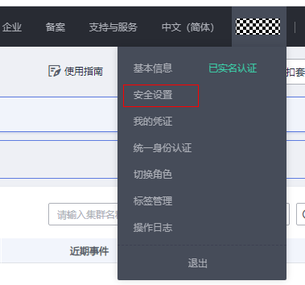
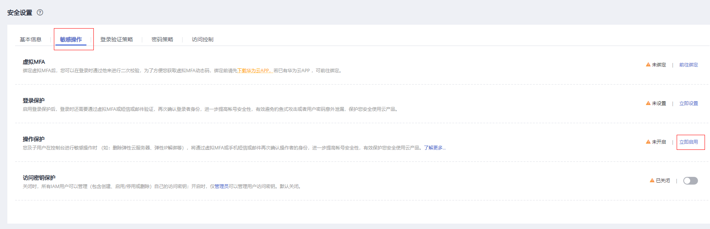
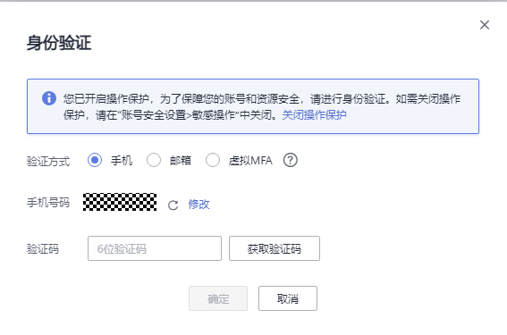
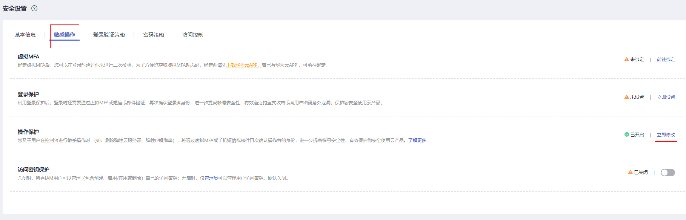

# 敏感操作保护

## 操作场景

GaussDB\(DWS\)支持敏感操作保护功能，当用户在控制台进行敏感操作时，则需要输入证明身份的凭证，身份验证通过后方可进行相关操作。为了帐号安全，建议开启操作保护功能，该功能对帐号以及帐号下的子用户都生效。

目前支持的操作：集群扩容、删除集群、重启集群、增加CN节点、删除CN节点。

## 开启操作保护

操作保护默认关闭，您可以参考以下步骤开启操作保护。

1.  登录GaussDB\(DWS\)管理控制台。
2.  在“控制台”页面，鼠标移动至右上方的用户名，在下拉列表中单击“安全设置”。

    **图 1**  安全设置  
    

3.  在“安全设置”页面中，切换至“敏感操作”页签，单击“操作保护”区域的“立即启用”。

    **图 2**  敏感操作  
    

4.  在“操作保护设置”页面中，选择“开启”，单击“确定”后，开启操作保护。

    > **说明：** 
    >-   用户如果进行敏感操作，将进入“操作保护”页面，选择认证方式，包括邮箱、手机和虚拟MFA三种认证方式。
    >    -   如果用户只绑定了手机，则认证方式只能选择手机。
    >    -   如果用户只绑定了邮箱，则认证方式只能选择邮件。
    >    -   如果用户未绑定邮箱、手机和虚拟MFA，进行敏感操作时，华为云将提示用户绑定邮箱、手机或虚拟MFA。
    >-   如需修改验证手机号、邮件地址，请在账户中心修改。详情请参见[IAM基本信息](https://support.huaweicloud.com/usermanual-iam/iam_01_0703.html)。

5.  当您开启操作保护，在进行敏感操作时，系统会先进行敏感操作保护。

    例如在您进行删除集群操作时，会弹出敏感操作保护验证框，需要选择一种验证方式进行验证，避免误操作带来的风险和损失。

    **图 3**  身份验证  
    

## 关闭操作保护

如需关闭操作保护，您可以按照以下步骤进行操作：

1.  登录GaussDB\(DWS\)管理控制台。
2.  在“控制台”页面，鼠标移动至右上方的用户名，在下拉列表中单击“安全设置”。

    **图 4**  安全设置  
    

3.  在“安全设置”页面中，切换至“敏感操作”页签，单击“操作保护”区域的“立即修改”。

    **图 5**  修改敏感操作  
    

4.  在“操作保护设置”页面中，选择“关闭”，单击“确定”后，关闭操作保护。

