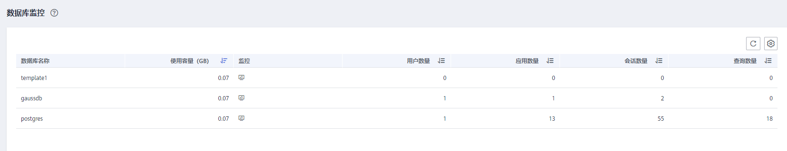
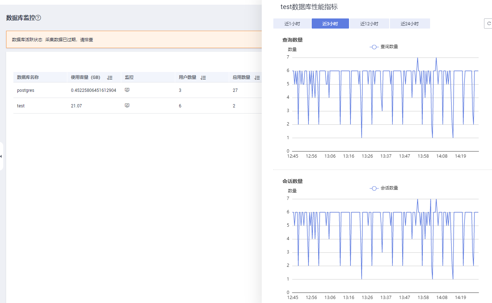

# 数据库监控

## 进入数据库监控页面

1.  登录GaussDB\(DWS\) 管理控制台。
2.  在“集群管理”页面，找到需要查看监控的集群。
3.  在指定集群所在行的“操作”列，单击“监控面板”。系统将显示数据库监控页面。
4.  在左侧导航栏选择“监控\>数据库监控”，进入数据库监控页面。

    在数据库监控页面展示了数据库级别的实时资源消耗和历史趋势指标。

## 数据库资源消耗

您可以根据数据库名称选中指定的数据库查看其资源消耗情况，指标项详情请参见[监控项列表](https://support.huaweicloud.com/mgtg-dws/dws_01_00136.html)。其中包括：

-   数据库名称
-   使用容量（GB）
-   监控
-   用户数量
-   应用数量
-   会话数量
-   查询数量
-   插入行数
-   更新行数
-   删除行数
-   死锁数
-   临时文件数量
-   临时文件容量

## 数据库趋势监控

在指定数据库所在行的“监控”列，单击图标，可查看数据库的性能指标。其中包括：

-   使用容量
-   会话数量
-   查询数量

