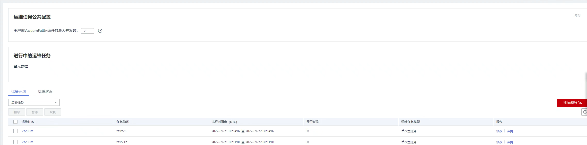

# 智能运维概览

智能运维是GaussDB\(DWS\)常驻运维工具，可帮助用户智能执行运维任务。智能运维会通过集群负载情况，选择合理时间窗、并发度完成用户指定的任务，在运维任务执行过程中，智能运维将时刻关注用户业务的变化，及时调整运维任务执行策略，以减轻对用户业务的影响。智能运维支持周期型和单次型任务的创建，执行时间窗可按照不同用户业务负载定制化。

智能运维具备一定的高可用性，在集群异常的情况下，智能运维将重新执行失败的运维任务，若由于集群异常导致运维任务部分步骤无法完成，智能运维将尝试跳过失败的步骤，以节省用户运维时间窗开销。

如图所示，智能运维界面主要由两部分构成：

-   运维任务公共配置：目前仅包含“用户表VacuumFull运维任务最大并发数”，该配置应用于每个用户表VacuumFull的运维任务。
-   进行中的运维任务：显示正在运行的运维任务信息（目前仅支持Vacuum运维任务，用户数据膨胀，磁盘内存不足可进行Vacuum操作，详情请参见[数据膨胀磁盘空间不足，导致性能降低](https://support.huaweicloud.com/trouble-dws/dws_09_0629.html)）。
    -   用户频繁创建、删除表，导致系统表膨胀严重，可对系统表执行Vacuum。
    -   用户频繁执行UPDATE、DELETE语句，导致用户表膨胀严重，可对用户表执行Vacuum/Vacuum Full。

-   运维详情：运维详情包括两部分，运维计划和运维状态。运维计划将展示全部运维任务基本信息，运维状态将展示运维任务运行状态信息。

> **说明：** 
>-   该特性仅8.1.3及以上版本支持。
>-   智能运维功能暂不支持实时数仓（单机部署）。
>-   运维任务公共配置模块仅8.1.3及以上集群版本支持，同时需保证Agent升级为8.2.0及以上版本。

