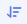
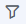
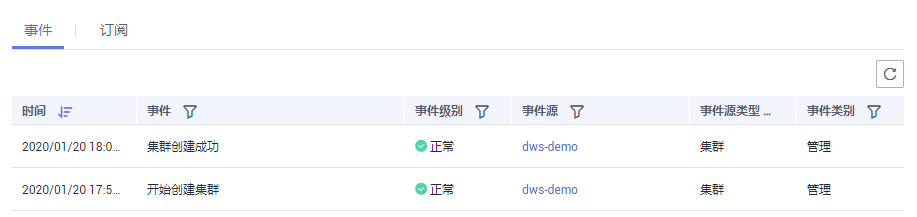

# 查看事件

介绍用户如何查找集群或快照发生的事件。

1.  登录GaussDB\(DWS\) 管理控制台。
2.  在左侧导航树，单击“事件管理“，进入“事件“页面。

    在事件列表中，默认显示当前所有集群或快照已发生的事件。

    在表头的字段名称“时间”旁，单击，可以将事件按时间的顺序或倒叙进行排列。

    在表头的字段（除“时间”以外）名称旁，单击，并在弹出菜单中选择相应字段的过滤条件，可以对事件进行筛选。

    **图 1**  事件页面  
    

