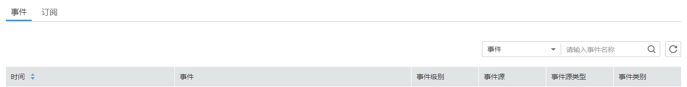

# 查看事件

介绍用户如何查找集群或快照发生的事件。

1.  在“事件管理“页面中单击“事件“，默认显示当前所有集群或快照已发生的事件。
2.  在事件列表右上方的下拉列表中通过选择不同的筛选条件搜索事件。

    **图 1**  搜索事件  
    

    请选择以下某一项筛选条件搜索事件：

    -   在下拉列表中选择“事件“，在输入框中输入发生的事件，例如“集群创建成功“。
    -   在下拉列表中选择“事件源“，在输入框中输入集群或快照名称，例如“demo“。
    -   在下拉列表中选择“事件源类型“，在输入框中输入“集群“或“快照“。
    -   在下拉列表中选择“事件类别“，在输入框中输入“管理“，“监控“或“安全“。
    -   在下拉列表中选择“事件级别“，在输入框中输入“正常“或“警告“。

3.  单击，显示筛选后的事件查询结果。

