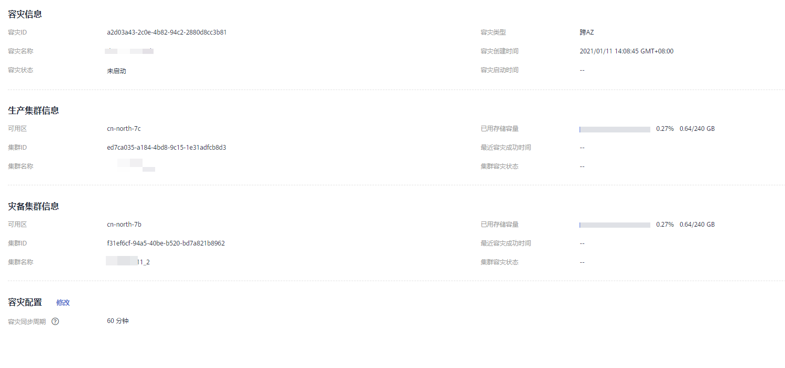

# 查看容灾信息

1.  登录GaussDB\(DWS\) 管理控制台。
2.  在左侧导航栏中，单击“容灾管理“。
3.  在容灾列表中找到所需要的容灾，然后单击容灾名称，进入容灾“基本信息“页面。

    在容灾“基本信息“页面，可以查看如下相关信息：

    -   集群信息：用户可查看容灾ID、容灾名称、容灾创建时间、容灾启动时间以及容灾状态。
    -   生产集群信息：用户可查看生产集群ID、集群名称、可用区、已用存储容量、集群容灾状态、最近容灾成功时间等相关信息。
    -   灾备集群信息：用户可查看灾备集群ID、集群名称、可用区、已用存储容量、集群容灾状态、最近容灾成功时间等相关信息。
    -   容灾配置：用户可查看并修改容灾同步周期。

    

    > **说明：** 
    >当容灾类型为跨Region容灾时，在容灾信息页面，不支持查看非当前Region集群的磁盘信息与可用区信息，需要用户手动切换到对应Region查看。

