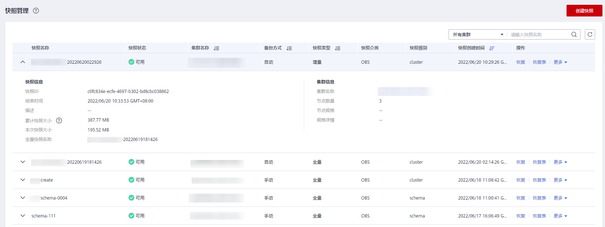

# 查看快照信息

用户创建快照后，可以在“快照管理“页面查看集群快照的信息。

## 查看快照信息

1.  登录GaussDB\(DWS\) 管理控制台。
2.  在左侧导航栏中，单击“快照管理“。

    在快照列表中，默认显示用户所有的快照。单击快照名称前的可显示该快照的详细信息。

    **图 1**  快照管理  
    

3.  在快照列表中，查看快照的“快照名称“、“快照状态“、“集群名称“、“快照类型“和“快照创建时间“。

    用户也可以在快照列表的右上角，输入快照名称或集群名称，并单击搜索指定的快照。支持模糊搜索名称的部分字符。

    快照状态如[表1](#table3259774163926)所示。

    **表 1**  快照状态说明

    
    <table><thead align="left"><tr id="r2d963a51fa864b3689b04a5b8cd5c0dd"><th class="cellrowborder" valign="top" width="23.14%" id="mcps1.2.3.1.1">
<strong id="a816cb4668a2f4064a090e5167d622d2c">状态</strong>

    </th>
    <th class="cellrowborder" valign="top" width="76.86%" id="mcps1.2.3.1.2">
<strong id="aa595a4cbe8d8489aa0d5bc7186ea6229">说明</strong>

    </th>
    </tr>
    </thead>
    <tbody><tr id="row43721954155529"><td class="cellrowborder" valign="top" width="23.14%" headers="mcps1.2.3.1.1 ">
“可用”

    </td>
    <td class="cellrowborder" valign="top" width="76.86%" headers="mcps1.2.3.1.2 ">
表示当前快照工作正常。

    </td>
    </tr>
    <tr id="r2f616610d43e4a66b61fce44aeede3d0"><td class="cellrowborder" valign="top" width="23.14%" headers="mcps1.2.3.1.1 ">
“创建中”

    </td>
    <td class="cellrowborder" valign="top" width="76.86%" headers="mcps1.2.3.1.2 ">
表示当前快照正在创建中。

    </td>
    </tr>
    <tr id="r4c26567fb82b4add8f1faf6f2f92e6cd"><td class="cellrowborder" valign="top" width="23.14%" headers="mcps1.2.3.1.1 ">
“不可用”

    </td>
    <td class="cellrowborder" valign="top" width="76.86%" headers="mcps1.2.3.1.2 ">
表示当前快照无法提供服务。

    </td>
    </tr>
    </tbody>
    </table>

    快照类型如[表2](#table875924217540)所示。

    **表 2**  快照类型

    
    <table><thead align="left"><tr id="row2075914275411"><th class="cellrowborder" valign="top" width="23.27%" id="mcps1.2.3.1.1">
类型

    </th>
    <th class="cellrowborder" valign="top" width="76.73%" id="mcps1.2.3.1.2">
说明

    </th>
    </tr>
    </thead>
    <tbody><tr id="row376084214544"><td class="cellrowborder" valign="top" width="23.27%" headers="mcps1.2.3.1.1 ">
手动

    </td>
    <td class="cellrowborder" valign="top" width="76.73%" headers="mcps1.2.3.1.2 ">
用户通过GaussDB(DWS) 管理控制台或者API接口手动创建的快照。用户可以删除手动快照。

    </td>
    </tr>
    <tr id="row11760174213546"><td class="cellrowborder" valign="top" width="23.27%" headers="mcps1.2.3.1.1 ">
自动

    </td>
    <td class="cellrowborder" valign="top" width="76.73%" headers="mcps1.2.3.1.2 ">
用户为集群开启快照自动备份策略后，系统自动创建的快照。用户不能删除自动快照，自动快照的保留天数超期后，系统会自动进行删除。

    </td>
    </tr>
    </tbody>
    </table>

