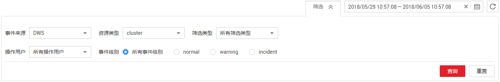
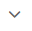
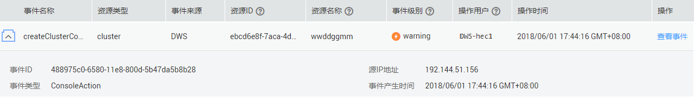
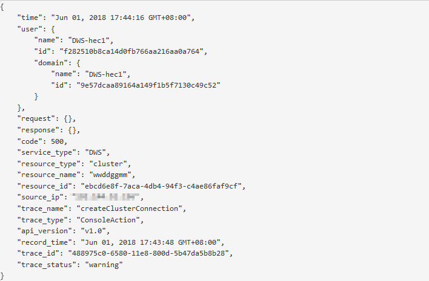

# 查看管理控制台关键操作审计日志

DWS使用云审计服务，可以记录DWS管理控制台的关键操作事件，记录下的日志可用于支撑安全分析、合规审计、资源跟踪和问题定位等常见应用场景。本章节包含如下内容：

-   [开启审计服务](#section129109290328)
-   [关闭审计日志](#section1247674310321)
-   [支持审计的关键操作列表](#section6775838155314)
-   [查看审计日志](#section5922593541)

## 开启审计服务

使用云审计服务前需要开启云审计服务，开启云审计服务后系统会自动创建一个追踪器，系统记录的所有操作将关联在该追踪器中。目前，一个云账户系统仅支持创建一个追踪器。

开通审计服务的详细操作，可以参考[《云审计服务快速入门》](https://support.huaweicloud.com/cts/index.html)中的“开启云审计服务”。

1.  在DWS管理控制台，选择“服务列表 \> 管理与部署 \> 云审计服务“，进入云审计服务信息页面。
2.  单击左侧导航树的“追踪器“，进入追踪器信息页面。
3.  单击“开通云审计服务“。
4.  在弹出的开通云审计服务页面，单击“开通“，完成开启云审计服务。

    开启云审计服务成功后，系统会自动分配一个追踪器，用户可以在追踪器页面查看已创建的追踪器的详细信息。

5.  在追踪器列表中找到所需要的追踪器，然后单击“配置“，设置OBS桶和操作事件文件前缀。
    -   “转储OBS桶“：在下拉列表中选择要转储的OBS桶。用户也可以通过单击“查看OBS桶“进入对象存储服务的控制台，然后单击“创建桶“创建新的桶，具体请参见《对象存储服务控制台指南》中的“创建桶“章节。
    -   “操作事件文件前缀“：输入记录操作事件转储文件的前缀名称。输入的长度范围为0到64个字符，只能由英文字母、数字、中划线、下划线和小数点组成。

6.  单击“确定“，完成开启云审计服务。

## 关闭审计日志

如果用户想关闭审计日志，需要在云审计服务中停用追踪器。

1.  在DWS管理控制台，选择“服务列表 \> 管理与部署\> 云审计服务“，进入云审计服务信息页面。
2.  单击左侧导航树的“追踪器“，进入追踪器信息页面。
3.  在追踪器列表中，单击“操作“列下的“停用“。
4.  在弹出的确认对话框中，单击“确定“，完成停用追踪器。

    追踪器停用成功后，“操作“列下的“停用“切换为“启用“。如果用户需要重新启用追踪器，单击“启用 \> 确定“，则系统重新开始记录新的操作。

    追踪器停用成功后，系统将不再记录新的操作，但是您依旧可以查看已有的操作记录。

## 支持审计的关键操作列表

通过云审计服务，您可以记录与DWS服务相关的操作事件，便于日后的查询、审计和回溯。

**表 1**  云审计服务支持审计的DWS操作列表

<table><thead align="left"><tr id="row13512483544"><th class="cellrowborder" valign="top" width="25.979999999999997%" id="mcps1.2.4.1.1">
操作名称

</th>
<th class="cellrowborder" valign="top" width="31.78%" id="mcps1.2.4.1.2">
资源类型

</th>
<th class="cellrowborder" valign="top" width="42.24%" id="mcps1.2.4.1.3">
事件名称

</th>
</tr>
</thead>
<tbody><tr id="row3934935145410"><td class="cellrowborder" valign="top" width="25.979999999999997%" headers="mcps1.2.4.1.1 ">
创建集群/恢复集群

</td>
<td class="cellrowborder" valign="top" width="31.78%" headers="mcps1.2.4.1.2 ">
cluster

</td>
<td class="cellrowborder" valign="top" width="42.24%" headers="mcps1.2.4.1.3 ">
createCluster

</td>
</tr>
<tr id="row1293463514543"><td class="cellrowborder" valign="top" width="25.979999999999997%" headers="mcps1.2.4.1.1 ">
删除集群

</td>
<td class="cellrowborder" valign="top" width="31.78%" headers="mcps1.2.4.1.2 ">
cluster

</td>
<td class="cellrowborder" valign="top" width="42.24%" headers="mcps1.2.4.1.3 ">
deleteCluster

</td>
</tr>
<tr id="row179346353547"><td class="cellrowborder" valign="top" width="25.979999999999997%" headers="mcps1.2.4.1.1 ">
扩容集群

</td>
<td class="cellrowborder" valign="top" width="31.78%" headers="mcps1.2.4.1.2 ">
cluster

</td>
<td class="cellrowborder" valign="top" width="42.24%" headers="mcps1.2.4.1.3 ">
growCluster

</td>
</tr>
<tr id="row4934203595417"><td class="cellrowborder" valign="top" width="25.979999999999997%" headers="mcps1.2.4.1.1 ">
重启集群

</td>
<td class="cellrowborder" valign="top" width="31.78%" headers="mcps1.2.4.1.2 ">
cluster

</td>
<td class="cellrowborder" valign="top" width="42.24%" headers="mcps1.2.4.1.3 ">
rebootCluster

</td>
</tr>
<tr id="row4935143555411"><td class="cellrowborder" valign="top" width="25.979999999999997%" headers="mcps1.2.4.1.1 ">
创建快照

</td>
<td class="cellrowborder" valign="top" width="31.78%" headers="mcps1.2.4.1.2 ">
backup

</td>
<td class="cellrowborder" valign="top" width="42.24%" headers="mcps1.2.4.1.3 ">
createBackup

</td>
</tr>
<tr id="row1893543510548"><td class="cellrowborder" valign="top" width="25.979999999999997%" headers="mcps1.2.4.1.1 ">
删除快照

</td>
<td class="cellrowborder" valign="top" width="31.78%" headers="mcps1.2.4.1.2 ">
backup

</td>
<td class="cellrowborder" valign="top" width="42.24%" headers="mcps1.2.4.1.3 ">
deleteBackup

</td>
</tr>
<tr id="row893593514540"><td class="cellrowborder" valign="top" width="25.979999999999997%" headers="mcps1.2.4.1.1 ">
设置安全参数

</td>
<td class="cellrowborder" valign="top" width="31.78%" headers="mcps1.2.4.1.2 ">
configurations

</td>
<td class="cellrowborder" valign="top" width="42.24%" headers="mcps1.2.4.1.3 ">
updateConfigurations

</td>
</tr>
<tr id="row17935113525410"><td class="cellrowborder" valign="top" width="25.979999999999997%" headers="mcps1.2.4.1.1 ">
创建MRS数据源

</td>
<td class="cellrowborder" valign="top" width="31.78%" headers="mcps1.2.4.1.2 ">
dataSource

</td>
<td class="cellrowborder" valign="top" width="42.24%" headers="mcps1.2.4.1.3 ">
createExtDataSource

</td>
</tr>
<tr id="row13935153525412"><td class="cellrowborder" valign="top" width="25.979999999999997%" headers="mcps1.2.4.1.1 ">
删除MRS数据源

</td>
<td class="cellrowborder" valign="top" width="31.78%" headers="mcps1.2.4.1.2 ">
dataSource

</td>
<td class="cellrowborder" valign="top" width="42.24%" headers="mcps1.2.4.1.3 ">
deleteExtDataSource

</td>
</tr>
<tr id="row119354358545"><td class="cellrowborder" valign="top" width="25.979999999999997%" headers="mcps1.2.4.1.1 ">
更新MRS数据源

</td>
<td class="cellrowborder" valign="top" width="31.78%" headers="mcps1.2.4.1.2 ">
dataSource

</td>
<td class="cellrowborder" valign="top" width="42.24%" headers="mcps1.2.4.1.3 ">
updateExtDataSource

</td>
</tr>
</tbody>
</table>

## 查看审计日志

1.  在DWS管理控制台，选择“服务列表 \> 管理与部署\> 云审计服务“，进入云审计服务信息页面。
2.  单击左侧导航树的“事件列表”，进入事件列表信息页面。
3.  单击事件列表右上方的“筛选”，设置对应的操作事件条件。

    当前事件列表支持四个维度的组合查询，详细信息如下：

    -   “事件来源”、“资源类型”和“筛选类型”。
        -   “事件来源”：选择“DWS”。
        -   “资源类型”：选择“所有资源类型”，或者指定具体的资源类型。
        -   “筛选类型”：选择“所有筛选类型”，或者选择以下任一选项。
            -   “按事件名称”：选择该选项时，还需选择某个具体的事件名称。
            -   “按资源ID”：选择该选项时，还需选择或者手动输入某个具体的资源ID。
            -   “按资源名称”：选择该选项时，还需选择或手动输入某个具体的资源名称。

    -   “操作用户”：在下拉框中选择某一具体的操作用户，此操作用户指用户级别，而非租户级别。
    -   “事件级别”：可选项为“所有事件级别”、“normal”、“warning”、“incident”，只可选择其中一项。
    -   “起始时间”、“结束时间”：可通过选择时间段查询操作事件。

        **图 1**  查询事件  
        

4.  单击“查询”，查看对应的操作事件。
5.  在需要查看的事件左侧，单击展开该记录的详细信息。

    **图 2**  事件  
    

6.  在需要查看的事件右侧，单击“查看事件”，弹出一个窗口，显示了该操作事件结构的详细信息。

    **图 3**  查看事件  
    

    关于云审计服务事件结构的关键字段详解，请参见《云审计服务用户指南》的“云审计服务事件参考 \> 事件结构”和“云审计服务事件参考 \> 事件样例”章节。

