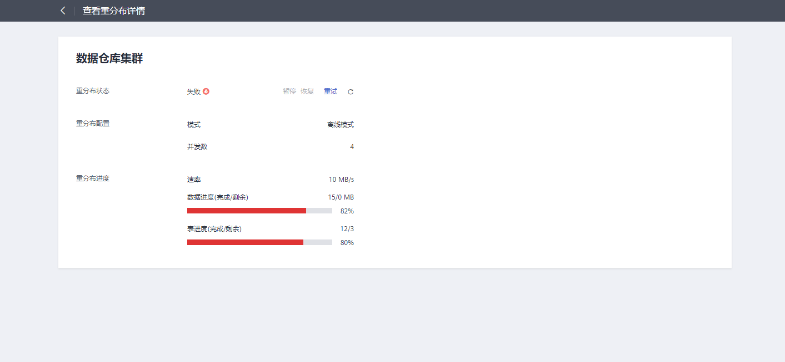
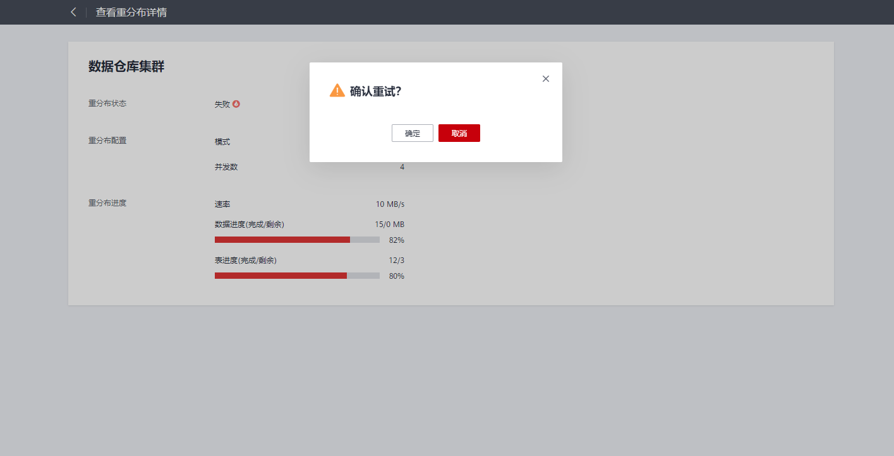

# 查看重分布详情

在“重分布详情”页面可以查看到当前集群的重分布模式、重分布进度等监控信息，在调度模式下可以对重分布进行暂停和恢复，修改调度配置等操作，重分布失败时还可以在“重分布详情”页面进行重试。

> **说明：** 
>-   查看重分布详情功能8.1.1.200及以上版本支持。
>-   离线调度重分布仅8.1.3及以上版本支持。
>-   IoT数仓暂不支持查看重分布详情。

**注意事项**

-   查看重分布详情功能只有集群处于重分布中、重分布失败或者重分布暂停状态下才能使用，其他时段该功能不可使用。

**操作步骤**

1.  登录GaussDB\(DWS\) 管理控制台。
2.  单击“集群管理“。默认显示用户所有的集群列表。
3.  集群列表中，在指定集群所在行的“任务信息“列，单击“查看详情”。

    

    -   离线或在线重分布模式会显示重分布状态、重分布配置以及重分布进度。

        

    > **说明：** 
    >如果重分布失败，可以在“重分布详情”页面单击“重试”按钮进行重试。
    >
    >

