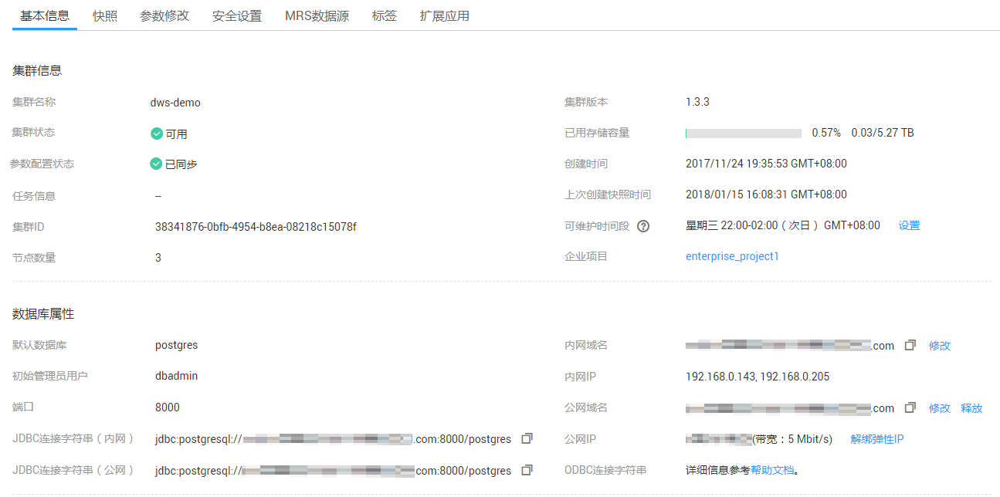

# 查看集群基本信息

登录DWS管理控制台，在左侧导航树，单击“集群管理”，在集群列表中找到所需要的集群，然后单击集群名称，进入集群“基本信息“页面。

**图 1**  集群基本信息  

在集群“基本信息“页面，可以查看如下相关信息：

-   集群信息：相关参数如[表1](#table275325811213)所示。
-   数据库属性：相关参数如[表2](#table112851640172712)所示
-   节点配置：相关参数如[表3](#table59611316811)所示。
-   网络：相关参数如[表4](#table1967915191613)所示。
-   数据加密信息：相关参数如[表5](#table4960321711)所示。

**表 1**  集群信息

<table><thead align="left"><tr id="row177611758111216"><th class="cellrowborder" valign="top" width="17.349999999999998%" id="mcps1.2.3.1.1">
参数

</th>
<th class="cellrowborder" valign="top" width="82.65%" id="mcps1.2.3.1.2">
参数说明

</th>
</tr>
</thead>
<tbody><tr id="row19768165811213"><td class="cellrowborder" valign="top" width="17.349999999999998%" headers="mcps1.2.3.1.1 ">
集群名称

</td>
<td class="cellrowborder" valign="top" width="82.65%" headers="mcps1.2.3.1.2 ">
集群的名称，创建集群时设置。

</td>
</tr>
<tr id="row4773185820126"><td class="cellrowborder" valign="top" width="17.349999999999998%" headers="mcps1.2.3.1.1 ">
集群状态

</td>
<td class="cellrowborder" valign="top" width="82.65%" headers="mcps1.2.3.1.2 ">
集群的状态信息，详情请参见<a href="集群列表简介.md#table344018476323">表2</a>。

</td>
</tr>
<tr id="row1217441612206"><td class="cellrowborder" valign="top" width="17.349999999999998%" headers="mcps1.2.3.1.1 ">
参数组

</td>
<td class="cellrowborder" valign="top" width="82.65%" headers="mcps1.2.3.1.2 ">
集群关联的参数组及配置状态。单击参数组名称，可进入参数组页面对参数组进行查看和编辑。

</td>
</tr>
<tr id="row57772582124"><td class="cellrowborder" valign="top" width="17.349999999999998%" headers="mcps1.2.3.1.1 ">
任务信息

</td>
<td class="cellrowborder" valign="top" width="82.65%" headers="mcps1.2.3.1.2 ">
集群任务的状态信息，详情请参见<a href="集群列表简介.md#table14807124711323">表3</a>。

</td>
</tr>
<tr id="row19251425132016"><td class="cellrowborder" valign="top" width="17.349999999999998%" headers="mcps1.2.3.1.1 ">
集群ID

</td>
<td class="cellrowborder" valign="top" width="82.65%" headers="mcps1.2.3.1.2 ">
集群的ID。

</td>
</tr>
<tr id="row382613346206"><td class="cellrowborder" valign="top" width="17.349999999999998%" headers="mcps1.2.3.1.1 ">
节点数量

</td>
<td class="cellrowborder" valign="top" width="82.65%" headers="mcps1.2.3.1.2 ">
集群的节点数量。

</td>
</tr>
<tr id="row1782195861212"><td class="cellrowborder" valign="top" width="17.349999999999998%" headers="mcps1.2.3.1.1 ">
集群版本

</td>
<td class="cellrowborder" valign="top" width="82.65%" headers="mcps1.2.3.1.2 ">
集群的版本信息。

</td>
</tr>
<tr id="row12788458111216"><td class="cellrowborder" valign="top" width="17.349999999999998%" headers="mcps1.2.3.1.1 ">
已用存储容量

</td>
<td class="cellrowborder" valign="top" width="82.65%" headers="mcps1.2.3.1.2 ">
集群已使用的存储容量。

</td>
</tr>
<tr id="row1148816611224"><td class="cellrowborder" valign="top" width="17.349999999999998%" headers="mcps1.2.3.1.1 ">
创建时间

</td>
<td class="cellrowborder" valign="top" width="82.65%" headers="mcps1.2.3.1.2 ">
集群创建的时间。

</td>
</tr>
<tr id="row7989141510225"><td class="cellrowborder" valign="top" width="17.349999999999998%" headers="mcps1.2.3.1.1 ">
上次创建快照时间

</td>
<td class="cellrowborder" valign="top" width="82.65%" headers="mcps1.2.3.1.2 ">
上一次创建快照的时间。

</td>
</tr>
<tr id="row78360355225"><td class="cellrowborder" valign="top" width="17.349999999999998%" headers="mcps1.2.3.1.1 ">
可维护时间段

</td>
<td class="cellrowborder" valign="top" width="82.65%" headers="mcps1.2.3.1.2 ">
集群的可维护时间段。

在可维护时间段右侧，单击“设置”，可以设置维护时间段，更多信息请参见<a href="升级集群.md#section1583412504297">设置可维护时间段</a>。

</td>
</tr>
<tr id="row13795258101218"><td class="cellrowborder" valign="top" width="17.349999999999998%" headers="mcps1.2.3.1.1 ">
企业项目

</td>
<td class="cellrowborder" valign="top" width="82.65%" headers="mcps1.2.3.1.2 ">
集群所属的企业项目。单击企业项目名称，可进入企业项目服务的Console页面对企业项目进行查看和编辑。

</td>
</tr>
</tbody>
</table>

**表 2**  数据库属性参数说明

<table><thead align="left"><tr id="dws_01_0033_row107835915393"><th class="cellrowborder" valign="top" width="19%" id="mcps1.2.3.1.1">
参数名

</th>
<th class="cellrowborder" valign="top" width="81%" id="mcps1.2.3.1.2">
参数解释

</th>
</tr>
</thead>
<tbody><tr id="dws_01_0033_row11404121572"><td class="cellrowborder" valign="top" width="19%" headers="mcps1.2.3.1.1 ">
默认数据库

</td>
<td class="cellrowborder" valign="top" width="81%" headers="mcps1.2.3.1.2 ">
创建集群时默认自动创建的数据库。当用户第一次连接集群时，需要连接到该默认数据库。

</td>
</tr>
<tr id="dws_01_0033_row1913311541965"><td class="cellrowborder" valign="top" width="19%" headers="mcps1.2.3.1.1 ">
初始管理员用户

</td>
<td class="cellrowborder" valign="top" width="81%" headers="mcps1.2.3.1.2 ">
创建集群时指定的管理员用户。当用户第一次连接集群时，需要使用初始管理员用户及其密码连接到默认数据库。

</td>
</tr>
<tr id="dws_01_0033_row1083211501964"><td class="cellrowborder" valign="top" width="19%" headers="mcps1.2.3.1.1 ">
端口

</td>
<td class="cellrowborder" valign="top" width="81%" headers="mcps1.2.3.1.2 ">
通过公网或者内网访问集群数据库的端口号。端口号在创建集群时指定，它是集群监听客户端连接的端口。

</td>
</tr>
<tr id="dws_01_0033_row129517471462"><td class="cellrowborder" valign="top" width="19%" headers="mcps1.2.3.1.1 ">
JDBC连接字符串（内网）

</td>
<td class="cellrowborder" valign="top" width="81%" headers="mcps1.2.3.1.2 ">
在内网环境中，当用户开发应用程序时，可通过JDBC连接字符串（内网）连接集群。

</td>
</tr>
<tr id="dws_01_0033_row58581742162"><td class="cellrowborder" valign="top" width="19%" headers="mcps1.2.3.1.1 ">
JDBC连接字符串（公网）

</td>
<td class="cellrowborder" valign="top" width="81%" headers="mcps1.2.3.1.2 ">
在公网环境中，当用户开发应用程序时，可通过JDBC连接字符串（公网）连接集群。

</td>
</tr>
<tr id="dws_01_0033_row1278775864518"><td class="cellrowborder" valign="top" width="19%" headers="mcps1.2.3.1.1 ">
内网域名

</td>
<td class="cellrowborder" valign="top" width="81%" headers="mcps1.2.3.1.2 ">
通过内部网络访问集群数据库的域名地址。内网访问域名在创建集群时自动生成。默认命名规则为：集群名称.dws.myhuaweicloud.com。

 说明： 

如果集群名称不符合域名规范，默认的访问域名前缀会相应做一些调整。

单击“修改”可以修改内网访问域名。访问域名由字母、数字、中划线组成，以大小写字母开头，长度为4~63个字符。

</td>
</tr>
<tr id="dws_01_0033_row197835916390"><td class="cellrowborder" valign="top" width="19%" headers="mcps1.2.3.1.1 ">
内网IP

</td>
<td class="cellrowborder" valign="top" width="81%" headers="mcps1.2.3.1.2 ">
通过内部网络访问集群数据库的IP地址。内网访问IP地址在创建集群时自动生成。

</td>
</tr>
<tr id="dws_01_0033_row16870618204610"><td class="cellrowborder" valign="top" width="19%" headers="mcps1.2.3.1.1 ">
公网域名

</td>
<td class="cellrowborder" valign="top" width="81%" headers="mcps1.2.3.1.2 ">
通过外部网络访问集群数据库的域名地址。

 说明： 
<ul id="dws_01_0033_ul4787192618461"><li>如果集群没有绑定弹性IP，则“公网访问IP”、“公网端口”和“公网访问域名”都显示为空。</li><li>如果集群在创建时绑定了弹性IP，公网访问域名在创建集群时自动生成。默认命名规则为：集群名称.dws.huaweiclouds.com。</li><li>如果需要为集群绑定公网访问域名，需要先为集群绑定弹性IP，然后再单击“创建”为集群绑定公网访问域名。</li><li>如果集群绑定了公网访问域名，单击“修改”可以修改访问域名。访问域名由字母、数字、中划线组成，以大小写字母开头，长度为4~63个字符。</li><li>单击“释放”可以释放集群的公网访问域名。</li></ul>

</td>
</tr>
<tr id="dws_01_0033_row16299125111411"><td class="cellrowborder" valign="top" width="19%" headers="mcps1.2.3.1.1 ">
公网IP

</td>
<td class="cellrowborder" valign="top" width="81%" headers="mcps1.2.3.1.2 ">
通过外部网络访问集群数据库的IP地址。

 说明： 
<ul id="dws_01_0033_ul198032619509"><li>如果创建集群时没有绑定弹性IP，“公网访问IP”显示为空，可以单击“绑定弹性IP”为集群绑定弹性IP。</li><li>如果创建集群时绑定了弹性IP，可以单击“解绑弹性IP”为集群解绑弹性IP。</li></ul>

</td>
</tr>
<tr id="dws_01_0033_row1816181020814"><td class="cellrowborder" valign="top" width="19%" headers="mcps1.2.3.1.1 ">
ODBC连接字符串

</td>
<td class="cellrowborder" valign="top" width="81%" headers="mcps1.2.3.1.2 ">
DWS支持使用ODBC应用程序连接数据库。应用程序可以在公有云环境的弹性云服务器中，或者互联网环境连接数据库。

</td>
</tr>
</tbody>
</table>

**表 3**  节点配置

<table><thead align="left"><tr id="row169701116516"><th class="cellrowborder" valign="top" width="17.580000000000002%" id="mcps1.2.3.1.1">
参数

</th>
<th class="cellrowborder" valign="top" width="82.42%" id="mcps1.2.3.1.2">
参数说明

</th>
</tr>
</thead>
<tbody><tr id="row1497911615112"><td class="cellrowborder" valign="top" width="17.580000000000002%" headers="mcps1.2.3.1.1 ">
节点规格

</td>
<td class="cellrowborder" valign="top" width="82.42%" headers="mcps1.2.3.1.2 ">
显示集群规格。

</td>
</tr>
<tr id="row1898416161918"><td class="cellrowborder" valign="top" width="17.580000000000002%" headers="mcps1.2.3.1.1 ">
规格详情

</td>
<td class="cellrowborder" valign="top" width="82.42%" headers="mcps1.2.3.1.2 ">
显示集群的节点规格详情。

</td>
</tr>
</tbody>
</table>

**表 4**  网络

<table><thead align="left"><tr id="row56881719116"><th class="cellrowborder" valign="top" width="17.69%" id="mcps1.2.3.1.1">
参数

</th>
<th class="cellrowborder" valign="top" width="82.31%" id="mcps1.2.3.1.2">
参数说明

</th>
</tr>
</thead>
<tbody><tr id="row96705556313"><td class="cellrowborder" valign="top" width="17.69%" headers="mcps1.2.3.1.1 ">
区域

</td>
<td class="cellrowborder" valign="top" width="82.31%" headers="mcps1.2.3.1.2 ">
集群的工作区域。

</td>
</tr>
<tr id="row111515118412"><td class="cellrowborder" valign="top" width="17.69%" headers="mcps1.2.3.1.1 ">
可用分区

</td>
<td class="cellrowborder" valign="top" width="82.31%" headers="mcps1.2.3.1.2 ">
显示创建集群时所选择的可用区信息。

</td>
</tr>
<tr id="row6697519712"><td class="cellrowborder" valign="top" width="17.69%" headers="mcps1.2.3.1.1 ">
虚拟私有云

</td>
<td class="cellrowborder" valign="top" width="82.31%" headers="mcps1.2.3.1.2 ">
VPC信息，创建集群时所选。

VPC即虚拟私有云，是通过逻辑方式进行网络隔离，提供安全、隔离的网络环境。

</td>
</tr>
<tr id="row107081519912"><td class="cellrowborder" valign="top" width="17.69%" headers="mcps1.2.3.1.1 ">
子网

</td>
<td class="cellrowborder" valign="top" width="82.31%" headers="mcps1.2.3.1.2 ">
子网信息，创建集群时所选。

通过子网提供与其他网络隔离的、可以独享的网络资源，以提高网络安全。

</td>
</tr>
<tr id="row97181719716"><td class="cellrowborder" valign="top" width="17.69%" headers="mcps1.2.3.1.1 ">
安全组

</td>
<td class="cellrowborder" valign="top" width="82.31%" headers="mcps1.2.3.1.2 ">
显示创建集群时所选择的安全组信息。

</td>
</tr>
</tbody>
</table>

**表 5**  数据加密信息

<table><thead align="left"><tr id="row189731721911"><th class="cellrowborder" valign="top" width="17.46%" id="mcps1.2.3.1.1">
参数

</th>
<th class="cellrowborder" valign="top" width="82.54%" id="mcps1.2.3.1.2">
参数说明

</th>
</tr>
</thead>
<tbody><tr id="row209831121914"><td class="cellrowborder" valign="top" width="17.46%" headers="mcps1.2.3.1.1 ">
密钥名称

</td>
<td class="cellrowborder" valign="top" width="82.54%" headers="mcps1.2.3.1.2 ">
显示集群的数据库加密密钥。

</td>
</tr>
<tr id="row179911521315"><td class="cellrowborder" valign="top" width="17.46%" headers="mcps1.2.3.1.1 ">
上次密钥轮转时间

</td>
<td class="cellrowborder" valign="top" width="82.54%" headers="mcps1.2.3.1.2 ">
显示上一次加密密钥轮转的时间。

</td>
</tr>
</tbody>
</table>

