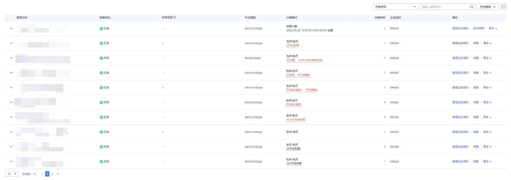

# 查看集群状态

在GaussDB\(DWS\) 管理控制台的“集群管理“页面，用户可以在集群列表中查看集群的概要信息，例如集群状态、任务信息、节点规格和近期事件等信息。

## 查看集群概览信息

登录GaussDB\(DWS\) 管理控制台，在左侧导航树，单击“集群管理”，在集群列表中会显示所有GaussDB\(DWS\) 集群，集群数量较多时，可采用翻页显示，您可以查看任何状态下的集群。

在集群列表上方，在“所有项目“所示的下拉列表中选择项目名称，或者，在搜索框中输入集群名称，单击，可以查找所需要的集群。单击，可以刷新集群状态、计费模式。您也可以单击“标签搜索“，然后根据标签过滤条件搜索集群，详情请参考[根据标签搜索集群](标签管理.md#section20922320396)。

集群列表默认按时间顺序排列，时间最近的集群显示在最前端。集群列表参数说明如[表1](#table3950169215120)所示。

**表 1**  集群列表参数

<table><thead align="left"><tr id="row2555468715120"><th class="cellrowborder" valign="top" width="16.07%" id="mcps1.2.3.1.1">
参数

</th>
<th class="cellrowborder" valign="top" width="83.93%" id="mcps1.2.3.1.2">
参数说明

</th>
</tr>
</thead>
<tbody><tr id="row3067086316226"><td class="cellrowborder" valign="top" width="16.07%" headers="mcps1.2.3.1.1 ">
集群名称

</td>
<td class="cellrowborder" valign="top" width="83.93%" headers="mcps1.2.3.1.2 ">
集群的名称，创建集群时设置。

</td>
</tr>
<tr id="row4848715816226"><td class="cellrowborder" valign="top" width="16.07%" headers="mcps1.2.3.1.1 ">
集群状态

</td>
<td class="cellrowborder" valign="top" width="83.93%" headers="mcps1.2.3.1.2 ">
集群的状态信息，详情请参见<a href="#section1594381611251">集群状态</a>。

</td>
</tr>
<tr id="row79178716226"><td class="cellrowborder" valign="top" width="16.07%" headers="mcps1.2.3.1.1 ">
任务信息

</td>
<td class="cellrowborder" valign="top" width="83.93%" headers="mcps1.2.3.1.2 ">
集群任务的状态信息，详情请参见<a href="#section17463325251">集群任务信息</a>。

</td>
</tr>
<tr id="row3434627416226"><td class="cellrowborder" valign="top" width="16.07%" headers="mcps1.2.3.1.1 ">
节点规格

</td>
<td class="cellrowborder" valign="top" width="83.93%" headers="mcps1.2.3.1.2 ">
集群的节点规格。节点规格详情请参见<a href="https://www.huaweicloud.com/pricing.html?tab=detail#/dws" target="_blank" rel="noopener noreferrer">GaussDB(DWS)价格详情</a>。

</td>
</tr>
<tr id="row197624459267"><td class="cellrowborder" valign="top" width="16.07%" headers="mcps1.2.3.1.1 ">
计费模式

</td>
<td class="cellrowborder" valign="top" width="83.93%" headers="mcps1.2.3.1.2 ">
集群计费模式如下：

<ul id="ul85341841102710"><li>按需计费：显示集群创建时间。</li><li>包年/包月：显示到期时间，详情请参见<a href="#section15216106111614">包年/包月计费模式</a>。</li></ul>
</td>
</tr>
<tr id="row4007178116226"><td class="cellrowborder" valign="top" width="16.07%" headers="mcps1.2.3.1.1 ">
近期事件

</td>
<td class="cellrowborder" valign="top" width="83.93%" headers="mcps1.2.3.1.2 ">
显示集群近期的事件个数，单击可查看事件详情。

</td>
</tr>
<tr id="row2563272716226"><td class="cellrowborder" valign="top" width="16.07%" headers="mcps1.2.3.1.1 ">
企业项目

</td>
<td class="cellrowborder" valign="top" width="83.93%" headers="mcps1.2.3.1.2 ">
集群所属的企业项目。

</td>
</tr>
<tr id="row1241899616226"><td class="cellrowborder" valign="top" width="16.07%" headers="mcps1.2.3.1.1 ">
操作

</td>
<td class="cellrowborder" valign="top" width="83.93%" headers="mcps1.2.3.1.2 "><ul id="ul8157907161719"><li>登录：请参见<a href="使用DAS连接集群.md">使用DAS连接集群</a>。</li><li>监控面板：请参见<a href="数据库监控.md">数据库监控</a>。</li><li>更多<ul id="ul63475607161741"><li>查看监控指标：请参见<a href="Cloud-Eye监控集群.md">Cloud Eye监控集群</a>。</li><li>重启：单击“重启”，重启集群。详情请参见<a href="重启集群.md">重启集群</a>。</li><li>扩容：请参见<a href="扩容集群.md">扩容集群</a>。</li><li>调整大小：请参见<a href="调整集群大小.md">调整集群大小</a>。</li><li>缩容：请参见<a href="缩容集群.md">缩容集群</a>。</li><li>重分布：请参见<a href="重分布.md">重分布</a>。</li><li>集群扩容详情：请参见<a href="查看重分布详情.md">查看重分布详情</a>。</li><li>磁盘扩容：请参见<a href="EVS集群磁盘扩容.md">EVS集群磁盘扩容</a>。</li><li>重置密码：请参见<a href="重置密码.md">重置密码</a>。</li><li>创建快照：请参见<a href="手动快照.md">手动快照</a>。</li><li>解除只读：请参见<a href="解除只读.md">解除只读</a>。</li><li>删除：单击“删除”，删除一个集群。详情请参见<a href="删除集群.md">删除集群</a>。</li><li>规格变更：请参见<a href="变更规格.md">变更规格</a>。</li><li>管理CN节点：请参见<a href="管理CN节点.md">管理CN节点</a>。</li></ul>
</li></ul>
</td>
</tr>
</tbody>
</table>

## 集群状态

**表 2**  集群状态说明

<table><thead align="left"><tr id="row109971233142812"><th class="cellrowborder" valign="top" width="16.07%" id="mcps1.2.3.1.1">
<strong id="b199718338283">状态</strong>

</th>
<th class="cellrowborder" valign="top" width="83.93%" id="mcps1.2.3.1.2">
<strong id="b099783313284">说明</strong>

</th>
</tr>
</thead>
<tbody><tr id="row139973339288"><td class="cellrowborder" valign="top" width="16.07%" headers="mcps1.2.3.1.1 ">
可用

</td>
<td class="cellrowborder" valign="top" width="83.93%" headers="mcps1.2.3.1.2 ">
表示集群工作正常。

</td>
</tr>
<tr id="row1997113392813"><td class="cellrowborder" valign="top" width="16.07%" headers="mcps1.2.3.1.1 ">
只读

</td>
<td class="cellrowborder" valign="top" width="83.93%" headers="mcps1.2.3.1.2 ">
集群存储容量使用率或单节点磁盘使用率大于90%时会进入此状态，该状态下集群仍可工作但只能支持查询操作，不支持任何写操作。当集群进入只读状态时，可通过<a href="解除只读.md">解除只读</a>功能进行解除，如解除失败请联系技术支持人员解除只读状态。

解除集群只读状态后，建议您参考以下措施进行处理：

<ul id="ul1599813312281"><li>使用SQL客户端工具，以管理员用户连接数据库，执行以下命令定期清理和回收存储空间。<pre class="screen" id="screen11474195825410">VACUUM FULL;</pre>

GaussDB(DWS) 数据仓库中保存的数据在删除后，可能没有释放占用的磁盘空间形成脏数据，导致磁盘浪费，建议定期清理存储空间。

</li><li>建议用户检查磁盘容量，分析现有集群规格是否满足业务需求，若不满足，建议您对集群进行扩容，具体操作请参见<a href="扩容集群.md">扩容集群</a>。</li></ul>
</td>
</tr>
<tr id="row19998193342812"><td class="cellrowborder" valign="top" width="16.07%" headers="mcps1.2.3.1.1 ">
非均衡

</td>
<td class="cellrowborder" valign="top" width="83.93%" headers="mcps1.2.3.1.2 ">
如果集群中存在gtm或dn的角色和初始角色不一致，就认为处于非均衡状态。 非均衡状态下会出现某些节点主实例增多，从而负载压力较大。这种情况下集群状态是正常的，但整体性能要不如均衡状态。建议业务低峰期，切换为可用状态，详情操作请参见<a href="集群主备恢复.md">集群主备恢复</a>。

</td>
</tr>
<tr id="row499811334283"><td class="cellrowborder" valign="top" width="16.07%" headers="mcps1.2.3.1.1 ">
重分布中

</td>
<td class="cellrowborder" valign="top" width="83.93%" headers="mcps1.2.3.1.2 ">
集群扩容时新节点添加完成后，原节点存储的业务数据明显多于新节点，此时系统自动在所有节点重新分布保存数据。该状态下集群仍可工作。

</td>
</tr>
<tr id="row129981833182818"><td class="cellrowborder" valign="top" width="16.07%" headers="mcps1.2.3.1.1 ">
重分布失败

</td>
<td class="cellrowborder" valign="top" width="83.93%" headers="mcps1.2.3.1.2 ">
调整数据分布情况失败，但没有数据丢失。该状态下集群仍可工作。建议用户联系技术支持人员进行处理。

</td>
</tr>
<tr id="row13998833182810"><td class="cellrowborder" valign="top" width="16.07%" headers="mcps1.2.3.1.1 ">
节点故障

</td>
<td class="cellrowborder" valign="top" width="83.93%" headers="mcps1.2.3.1.2 ">
表示集群中个别节点出现问题无法正常工作，但整个集群正常。建议用户联系技术支持人员进行处理。

</td>
</tr>
<tr id="row16999333112814"><td class="cellrowborder" valign="top" width="16.07%" headers="mcps1.2.3.1.1 ">
不可用

</td>
<td class="cellrowborder" valign="top" width="83.93%" headers="mcps1.2.3.1.2 ">
表示集群无法提供数据库服务。建议用户联系技术支持人员进行处理。

</td>
</tr>
<tr id="row209991933132813"><td class="cellrowborder" valign="top" width="16.07%" headers="mcps1.2.3.1.1 ">
创建中

</td>
<td class="cellrowborder" valign="top" width="83.93%" headers="mcps1.2.3.1.2 ">
表示集群正在创建中。

</td>
</tr>
<tr id="row99997334285"><td class="cellrowborder" valign="top" width="16.07%" headers="mcps1.2.3.1.1 ">
创建失败

</td>
<td class="cellrowborder" valign="top" width="83.93%" headers="mcps1.2.3.1.2 ">
表示集群创建失败。

</td>
</tr>
<tr id="row1599953318284"><td class="cellrowborder" valign="top" width="16.07%" headers="mcps1.2.3.1.1 ">
创建中，恢复中

</td>
<td class="cellrowborder" valign="top" width="83.93%" headers="mcps1.2.3.1.2 ">
表示集群正在创建中，且该集群是快照恢复而创建的集群，此时集群正在恢复中。当对快照执行了恢复操作时，会恢复快照到新集群，此时该新集群会进入此状态。

</td>
</tr>
<tr id="row47281856151916"><td class="cellrowborder" valign="top" width="16.07%" headers="mcps1.2.3.1.1 ">
删除中

</td>
<td class="cellrowborder" valign="top" width="83.93%" headers="mcps1.2.3.1.2 ">
表示集群正在删除中。

</td>
</tr>
<tr id="row9999433122818"><td class="cellrowborder" valign="top" width="16.07%" headers="mcps1.2.3.1.1 ">
已冻结

</td>
<td class="cellrowborder" valign="top" width="83.93%" headers="mcps1.2.3.1.2 ">
表示集群被冻结。

当您的账户余额不足导致系统扣费失败时，您的服务资源将会进入保留期，保留期内服务资源将被冻结而无法使用，但资源和数据会为您保留。

当集群状态为“已冻结”时，您需要给账户充值以确保账户余额不为0才能解冻，详细操作请参见<a href="https://support.huaweicloud.com/dws_faq/dws_03_0038.html" target="_blank" rel="noopener noreferrer">如何续费？</a>。如果您原先购买了折扣套餐，到期后转为按需计费，若出现因扣费失败导致集群被冻结的情况，也只能先通过账户充值进行解冻，然后再进行续费或重新购买套餐。冻结时，对折扣套餐进行续费或重新购买是无法解冻的。解冻后，集群状态将恢复为“可用”。

</td>
</tr>
<tr id="row196042359302"><td class="cellrowborder" valign="top" width="16.07%" headers="mcps1.2.3.1.1 ">
待重启

</td>
<td class="cellrowborder" valign="top" width="83.93%" headers="mcps1.2.3.1.2 ">
表示集群修改过GUC参数，需重启才能生效。若并未重启集群，此时部分运维操作会被限制。在用户手动重启集群后，GUC参数生效，集群状态将恢复为”可用”。

</td>
</tr>
</tbody>
</table>

## 集群任务信息

**表 3**  任务信息说明

<table><thead align="left"><tr id="row240519569253"><th class="cellrowborder" valign="top" width="16.41%" id="mcps1.2.3.1.1">
<strong id="b154057562251">状态</strong>

</th>
<th class="cellrowborder" valign="top" width="83.59%" id="mcps1.2.3.1.2">
<strong id="b340545692512">说明</strong>

</th>
</tr>
</thead>
<tbody><tr id="row1140516562251"><td class="cellrowborder" valign="top" width="16.41%" headers="mcps1.2.3.1.1 ">
创建快照中

</td>
<td class="cellrowborder" valign="top" width="83.59%" headers="mcps1.2.3.1.2 ">
表示集群正在执行创建快照的操作。

</td>
</tr>
<tr id="row2040615564254"><td class="cellrowborder" valign="top" width="16.41%" headers="mcps1.2.3.1.1 ">
创建快照失败

</td>
<td class="cellrowborder" valign="top" width="83.59%" headers="mcps1.2.3.1.2 ">
表示集群执行快照创建操作失败。

</td>
</tr>
<tr id="row44061756202514"><td class="cellrowborder" valign="top" width="16.41%" headers="mcps1.2.3.1.1 ">
配置中

</td>
<td class="cellrowborder" valign="top" width="83.59%" headers="mcps1.2.3.1.2 ">
表示系统正在保存集群参数的修改。

</td>
</tr>
<tr id="row1340795642516"><td class="cellrowborder" valign="top" width="16.41%" headers="mcps1.2.3.1.1 ">
重启中

</td>
<td class="cellrowborder" valign="top" width="83.59%" headers="mcps1.2.3.1.2 ">
表示集群正在重启过程中。

</td>
</tr>
<tr id="row8407125612259"><td class="cellrowborder" valign="top" width="16.41%" headers="mcps1.2.3.1.1 ">
重启失败

</td>
<td class="cellrowborder" valign="top" width="83.59%" headers="mcps1.2.3.1.2 ">
表示集群重启操作失败。

</td>
</tr>
<tr id="row114071856152516"><td class="cellrowborder" valign="top" width="16.41%" headers="mcps1.2.3.1.1 ">
节点扩容

</td>
<td class="cellrowborder" valign="top" width="83.59%" headers="mcps1.2.3.1.2 ">
表示集群正在扩容中。

</td>
</tr>
<tr id="row1740765622514"><td class="cellrowborder" valign="top" width="16.41%" headers="mcps1.2.3.1.1 ">
扩容失败

</td>
<td class="cellrowborder" valign="top" width="83.59%" headers="mcps1.2.3.1.2 ">
表示集群扩容失败。

</td>
</tr>
<tr id="row54491223194019"><td class="cellrowborder" valign="top" width="16.41%" headers="mcps1.2.3.1.1 ">
磁盘扩容中

</td>
<td class="cellrowborder" valign="top" width="83.59%" headers="mcps1.2.3.1.2 ">
表示集群正在磁盘扩容中。

</td>
</tr>
<tr id="row1863112719404"><td class="cellrowborder" valign="top" width="16.41%" headers="mcps1.2.3.1.1 ">
磁盘扩容失败

</td>
<td class="cellrowborder" valign="top" width="83.59%" headers="mcps1.2.3.1.2 ">
表示集群磁盘扩容失败。

</td>
</tr>
<tr id="row594518306407"><td class="cellrowborder" valign="top" width="16.41%" headers="mcps1.2.3.1.1 ">
弹性负载均衡绑定中

</td>
<td class="cellrowborder" valign="top" width="83.59%" headers="mcps1.2.3.1.2 ">
表示集群正在绑定弹性负载均衡。

</td>
</tr>
<tr id="row1672610347404"><td class="cellrowborder" valign="top" width="16.41%" headers="mcps1.2.3.1.1 ">
弹性负载均衡绑定失败

</td>
<td class="cellrowborder" valign="top" width="83.59%" headers="mcps1.2.3.1.2 ">
表示集群绑定弹性负载均衡失败。

</td>
</tr>
<tr id="row1113684216404"><td class="cellrowborder" valign="top" width="16.41%" headers="mcps1.2.3.1.1 ">
弹性负载均衡解绑中

</td>
<td class="cellrowborder" valign="top" width="83.59%" headers="mcps1.2.3.1.2 ">
表示集群正在解绑弹性负载均衡。

</td>
</tr>
<tr id="row31101419174012"><td class="cellrowborder" valign="top" width="16.41%" headers="mcps1.2.3.1.1 ">
弹性负载均衡解绑失败

</td>
<td class="cellrowborder" valign="top" width="83.59%" headers="mcps1.2.3.1.2 ">
表示集群解绑弹性负载均衡失败。

</td>
</tr>
<tr id="row1951304519159"><td class="cellrowborder" valign="top" width="16.41%" headers="mcps1.2.3.1.1 ">
缩容检测中

</td>
<td class="cellrowborder" valign="top" width="83.59%" headers="mcps1.2.3.1.2 ">
表示集群正在检测是否满足缩容条件。

</td>
</tr>
<tr id="row879454851516"><td class="cellrowborder" valign="top" width="16.41%" headers="mcps1.2.3.1.1 ">
缩容检测失败

</td>
<td class="cellrowborder" valign="top" width="83.59%" headers="mcps1.2.3.1.2 ">
表示集群目前的状态不满足缩容：

<ul id="ul182931438420"><li>集群default_storage_nodegroup参数值不为installation。</li><li>集群数据库下data_redis为预留重分布schema，该schema中存在用户表。</li><li>用户集群磁盘空间不满足缩容条件，详情请参见<a href="缩容集群.md">缩容集群</a>。</li></ul>
</td>
</tr>
<tr id="row11636105113210"><td class="cellrowborder" valign="top" width="16.41%" headers="mcps1.2.3.1.1 ">
缩容中

</td>
<td class="cellrowborder" valign="top" width="83.59%" headers="mcps1.2.3.1.2 ">
表示集群正在缩容中。

</td>
</tr>
<tr id="row1033581010321"><td class="cellrowborder" valign="top" width="16.41%" headers="mcps1.2.3.1.1 ">
缩容失败

</td>
<td class="cellrowborder" valign="top" width="83.59%" headers="mcps1.2.3.1.2 ">
表示集群缩容失败，需要用户尽快手动重新执行缩容，否则会影响业务。

</td>
</tr>
<tr id="row3230173619533"><td class="cellrowborder" valign="top" width="16.41%" headers="mcps1.2.3.1.1 ">
主备恢复中

</td>
<td class="cellrowborder" valign="top" width="83.59%" headers="mcps1.2.3.1.2 ">
表示集群正在主备恢复中。

</td>
</tr>
<tr id="row9685530175318"><td class="cellrowborder" valign="top" width="16.41%" headers="mcps1.2.3.1.1 ">
主备恢复失败

</td>
<td class="cellrowborder" valign="top" width="83.59%" headers="mcps1.2.3.1.2 ">
表示集群主备恢复失败，失败原因有以下几种情况，详情请参见<a href="https://support.huaweicloud.com/errorcode-dws/dws_08_0583.html" target="_blank" rel="noopener noreferrer">管控面错误码参考</a>：

<ul id="ul167599107397"><li>正在执行DN REDO，请稍后重试， 等待redo做完之后重试主备恢复。</li><li>查询DN REDO失败，请查看租户侧日志分析失败原因。</li><li>存在主备追赶，请稍后重试，等待主备追赶做完之后重试主备恢复。</li><li>查询主备追赶失败，请查看租户侧日志分析失败原因。</li><li>主备恢复失败，请联系技术支持人员或稍后重试。请查看租户侧日志分析失败原因。</li><li>集群状态异常，无法进行主备恢复操作，请检查集群状态是否是normal状态。</li></ul>
</td>
</tr>
<tr id="row20336154614305"><td class="cellrowborder" valign="top" width="16.41%" headers="mcps1.2.3.1.1 ">
规格变更中

</td>
<td class="cellrowborder" valign="top" width="83.59%" headers="mcps1.2.3.1.2 ">
表示集群正在变更集群规格中。

</td>
</tr>
<tr id="row18755949113010"><td class="cellrowborder" valign="top" width="16.41%" headers="mcps1.2.3.1.1 ">
规格变更失败

</td>
<td class="cellrowborder" valign="top" width="83.59%" headers="mcps1.2.3.1.2 ">
表示集群规格变更失败。

</td>
</tr>
<tr id="row7465174200"><td class="cellrowborder" valign="top" width="16.41%" headers="mcps1.2.3.1.1 ">
订单待支付

</td>
<td class="cellrowborder" valign="top" width="83.59%" headers="mcps1.2.3.1.2 ">
表示按需集群转包周期集群订单未支付，完成订单支付或取消订单该状态消失。

</td>
</tr>
</tbody>
</table>

## 包年/包月计费模式

**表 4**  包年/包月计费模式显示说明

<table><thead align="left"><tr id="row321566101614"><th class="cellrowborder" valign="top" width="16.400000000000002%" id="mcps1.2.3.1.1">
状态

</th>
<th class="cellrowborder" valign="top" width="83.6%" id="mcps1.2.3.1.2">
说明

</th>
</tr>
</thead>
<tbody><tr id="row721506111617"><td class="cellrowborder" valign="top" width="16.400000000000002%" headers="mcps1.2.3.1.1 ">
XX后到期

</td>
<td class="cellrowborder" valign="top" width="83.6%" headers="mcps1.2.3.1.2 ">
包周期集群剩余时长。可进行续费、转按需、退订操作。

</td>
</tr>
<tr id="row021516641615"><td class="cellrowborder" valign="top" width="16.400000000000002%" headers="mcps1.2.3.1.1 ">
已过期， XX后冻结

</td>
<td class="cellrowborder" valign="top" width="83.6%" headers="mcps1.2.3.1.2 ">
包周期集群购买时长到期，未续费时会进入宽限期。宽限期包周期集群正常使用，可进行续费操作，不可进行转按需、退订操作。

</td>
</tr>
<tr id="row112151664166"><td class="cellrowborder" valign="top" width="16.400000000000002%" headers="mcps1.2.3.1.1 ">
已冻结， XX后删除

</td>
<td class="cellrowborder" valign="top" width="83.6%" headers="mcps1.2.3.1.2 ">
包周期集群宽限期结束，进入保留期。可进行续费操作，不可进行转按需、退订操作。

</td>
</tr>
<tr id="row62159611165"><td class="cellrowborder" valign="top" width="16.400000000000002%" headers="mcps1.2.3.1.1 ">
XX后转按需

</td>
<td class="cellrowborder" valign="top" width="83.6%" headers="mcps1.2.3.1.2 ">
包周期集群购买时长到期后转成按需集群。可进行续费、退订操作，不可进行转按需操作。

</td>
</tr>
<tr id="row1921616641617"><td class="cellrowborder" valign="top" width="16.400000000000002%" headers="mcps1.2.3.1.1 ">
已冻结(违规)

</td>
<td class="cellrowborder" valign="top" width="83.6%" headers="mcps1.2.3.1.2 ">
公安冻结资源。可进行续费操作，不可进行转按需、退订操作。冻结期间会继续收取费用。

</td>
</tr>
<tr id="row82167618166"><td class="cellrowborder" valign="top" width="16.400000000000002%" headers="mcps1.2.3.1.1 ">
已冻结(违规)， XX后删除

</td>
<td class="cellrowborder" valign="top" width="83.6%" headers="mcps1.2.3.1.2 ">
违规冻结资源。可进行续费操作，不可进行转按需、退订操作。冻结期间会继续收取费用。

</td>
</tr>
</tbody>
</table>

