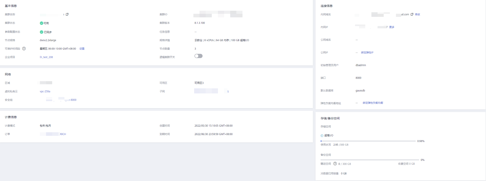

# 查看集群详情

登录GaussDB\(DWS\) 管理控制台，在左侧导航树，单击“集群管理”，在集群列表中找到所需要的集群，然后单击集群名称，进入“集群详情“页面。

在集群“集群详情“页面，可以查看如下相关信息：

-   基本信息：相关参数如[表1](#table275325811213)所示。
-   连接信息：相关参数如[表2](#table112851640172712)所示。
-   网络：相关参数如[表3](#table1967915191613)所示。
-   计费信息：相关参数如[表4](#table88041612463)所示。
-   存储/备份空间：相关参数如[表5](#table4960321711)所示。

**表 1**  基本信息

<table><thead align="left"><tr id="row177611758111216"><th class="cellrowborder" valign="top" width="17.37%" id="mcps1.2.3.1.1">
参数

</th>
<th class="cellrowborder" valign="top" width="82.63000000000001%" id="mcps1.2.3.1.2">
参数说明

</th>
</tr>
</thead>
<tbody><tr id="row19768165811213"><td class="cellrowborder" valign="top" width="17.37%" headers="mcps1.2.3.1.1 ">
集群名称

</td>
<td class="cellrowborder" valign="top" width="82.63000000000001%" headers="mcps1.2.3.1.2 ">
集群的名称，创建集群时设置。

</td>
</tr>
<tr id="row4773185820126"><td class="cellrowborder" valign="top" width="17.37%" headers="mcps1.2.3.1.1 ">
集群状态

</td>
<td class="cellrowborder" valign="top" width="82.63000000000001%" headers="mcps1.2.3.1.2 ">
集群的状态信息，详情请参见<a href="查看集群状态.md#section1594381611251">集群状态</a>。

</td>
</tr>
<tr id="row106115912111"><td class="cellrowborder" valign="top" width="17.37%" headers="mcps1.2.3.1.1 ">
参数配置状态

</td>
<td class="cellrowborder" valign="top" width="82.63000000000001%" headers="mcps1.2.3.1.2 ">
显示集群关联的参数配置状态。

</td>
</tr>
<tr id="row57772582124"><td class="cellrowborder" valign="top" width="17.37%" headers="mcps1.2.3.1.1 ">
任务信息

</td>
<td class="cellrowborder" valign="top" width="82.63000000000001%" headers="mcps1.2.3.1.2 ">
集群任务的状态信息，详情请参见<a href="查看集群状态.md#section17463325251">集群任务信息</a>。

</td>
</tr>
<tr id="row1032514181410"><td class="cellrowborder" valign="top" width="17.37%" headers="mcps1.2.3.1.1 ">
规格详情

</td>
<td class="cellrowborder" valign="top" width="82.63000000000001%" headers="mcps1.2.3.1.2 ">
显示集群的节点规格详情。

</td>
</tr>
<tr id="row7460101161516"><td class="cellrowborder" valign="top" width="17.37%" headers="mcps1.2.3.1.1 ">
节点数量

</td>
<td class="cellrowborder" valign="top" width="82.63000000000001%" headers="mcps1.2.3.1.2 ">
集群的节点数量。

</td>
</tr>
<tr id="row14422160121719"><td class="cellrowborder" valign="top" width="17.37%" headers="mcps1.2.3.1.1 ">
逻辑集群开关

</td>
<td class="cellrowborder" valign="top" width="82.63000000000001%" headers="mcps1.2.3.1.2 ">
用户可根据需求打开“逻辑集群开关”，页面将出现“逻辑集群管理”页签。

</td>
</tr>
<tr id="row19251425132016"><td class="cellrowborder" valign="top" width="17.37%" headers="mcps1.2.3.1.1 ">
集群ID

</td>
<td class="cellrowborder" valign="top" width="82.63000000000001%" headers="mcps1.2.3.1.2 ">
集群的ID。

</td>
</tr>
<tr id="row1782195861212"><td class="cellrowborder" valign="top" width="17.37%" headers="mcps1.2.3.1.1 ">
集群版本

</td>
<td class="cellrowborder" valign="top" width="82.63000000000001%" headers="mcps1.2.3.1.2 ">
集群的版本信息。

</td>
</tr>
<tr id="row1148816611224"><td class="cellrowborder" valign="top" width="17.37%" headers="mcps1.2.3.1.1 ">
创建时间

</td>
<td class="cellrowborder" valign="top" width="82.63000000000001%" headers="mcps1.2.3.1.2 ">
集群创建的时间。

</td>
</tr>
<tr id="row1957845561511"><td class="cellrowborder" valign="top" width="17.37%" headers="mcps1.2.3.1.1 ">
节点规格

</td>
<td class="cellrowborder" valign="top" width="82.63000000000001%" headers="mcps1.2.3.1.2 ">
显示集群规格。

</td>
</tr>
<tr id="row78360355225"><td class="cellrowborder" valign="top" width="17.37%" headers="mcps1.2.3.1.1 ">
可维护时间段

</td>
<td class="cellrowborder" valign="top" width="82.63000000000001%" headers="mcps1.2.3.1.2 ">
集群的可维护时间段。

在可维护时间段右侧，单击“设置”，可以设置维护时间段，更多信息请参见<a href="升级集群.md#section1583412504297">设置可维护时间段</a>。

</td>
</tr>
<tr id="row13795258101218"><td class="cellrowborder" valign="top" width="17.37%" headers="mcps1.2.3.1.1 ">
企业项目

</td>
<td class="cellrowborder" valign="top" width="82.63000000000001%" headers="mcps1.2.3.1.2 ">
集群所属的企业项目。单击企业项目名称，可进入企业项目服务的Console页面对企业项目进行查看和编辑。

</td>
</tr>
</tbody>
</table>

**表 2**  连接信息

<table><thead align="left"><tr id="r2b6913f2352a423d92e248eee4ed7ccf"><th class="cellrowborder" valign="top" width="19%" id="mcps1.2.3.1.1">
参数名

</th>
<th class="cellrowborder" valign="top" width="81%" id="mcps1.2.3.1.2">
参数解释

</th>
</tr>
</thead>
<tbody><tr id="row614113283186"><td class="cellrowborder" valign="top" width="19%" headers="mcps1.2.3.1.1 ">
内网域名

</td>
<td class="cellrowborder" valign="top" width="81%" headers="mcps1.2.3.1.2 ">
通过内部网络访问集群数据库的域名地址。内网访问域名在创建集群时自动生成。默认命名规则为：<em id="i1521904017188">集群名称.</em>dws.myhuaweicloud.com。通过域名访问DWS集群，域名解析器具有负载均衡的功能。

 说明： 

如果集群名称不符合域名规范，默认的访问域名前缀会相应做一些调整。

单击“修改”可以修改内网访问域名。访问域名由字母、数字、中划线组成，以大小写字母开头，长度为4~63个字符。

更多信息请参见<a href="管理集群访问域名.md">管理集群访问域名</a>。

</td>
</tr>
<tr id="row1267154711810"><td class="cellrowborder" valign="top" width="19%" headers="mcps1.2.3.1.1 ">
内网IP

</td>
<td class="cellrowborder" valign="top" width="81%" headers="mcps1.2.3.1.2 ">
通过内部网络访问集群数据库的IP地址。

 说明： 
<ul id="ul173316457329"><li>内网访问IP地址在创建集群时自动生成，生成后的IP地址是固定的。</li><li>内网访问IP的数量对应的是CN节点的个数，可以通过登录任一节点连接到集群。</li><li>通过内网访问某个固定的IP，工作负载会集中在一个CN上。</li></ul>

</td>
</tr>
<tr id="row1496320459196"><td class="cellrowborder" valign="top" width="19%" headers="mcps1.2.3.1.1 ">
公网域名

</td>
<td class="cellrowborder" valign="top" width="81%" headers="mcps1.2.3.1.2 ">
通过外部网络访问集群数据库的域名地址。

更多信息请参见<a href="管理集群访问域名.md">管理集群访问域名</a>。

</td>
</tr>
<tr id="row14468195011915"><td class="cellrowborder" valign="top" width="19%" headers="mcps1.2.3.1.1 ">
公网IP

</td>
<td class="cellrowborder" valign="top" width="81%" headers="mcps1.2.3.1.2 ">
通过外部网络访问集群数据库的IP地址。

 说明： 
<ul id="ul176051606208"><li>如果创建集群时没有绑定弹性IP，“公网IP”显示为空，可以单击“绑定弹性IP”为集群绑定弹性IP。</li><li>如果创建集群时绑定了弹性IP，可以单击“解绑弹性IP”为集群解绑弹性IP。</li></ul>

</td>
</tr>
<tr id="r4ff9b08ec9b64c62bd6bf3272c6eac82"><td class="cellrowborder" valign="top" width="19%" headers="mcps1.2.3.1.1 ">
初始管理员用户

</td>
<td class="cellrowborder" valign="top" width="81%" headers="mcps1.2.3.1.2 ">
创建集群时指定的数据库管理员用户。当用户第一次连接集群时，需要使用初始数据库管理员用户及其密码连接到默认数据库。

</td>
</tr>
<tr id="r758c339bb9794651bc85a7d94aea003a"><td class="cellrowborder" valign="top" width="19%" headers="mcps1.2.3.1.1 ">
端口

</td>
<td class="cellrowborder" valign="top" width="81%" headers="mcps1.2.3.1.2 ">
通过公网或者内网访问集群数据库的端口号。端口号在创建集群时指定，它是集群监听客户端连接的端口。

</td>
</tr>
<tr id="row11775171714206"><td class="cellrowborder" valign="top" width="19%" headers="mcps1.2.3.1.1 ">
默认数据库

</td>
<td class="cellrowborder" valign="top" width="81%" headers="mcps1.2.3.1.2 ">
创建集群时默认自动创建的数据库。当用户第一次连接集群时，需要连接到该默认数据库。

</td>
</tr>
<tr id="row6395626202611"><td class="cellrowborder" valign="top" width="19%" headers="mcps1.2.3.1.1 ">
弹性负载均衡地址

</td>
<td class="cellrowborder" valign="top" width="81%" headers="mcps1.2.3.1.2 ">
为实现集群高可用，解决CN单点问题，集群创建后需手动绑定弹性负载均衡（ELB），连接集群时建议连接ELB地址。

</td>
</tr>
</tbody>
</table>

**表 3**  网络

<table><thead align="left"><tr id="row56881719116"><th class="cellrowborder" valign="top" width="17.69%" id="mcps1.2.3.1.1">
参数

</th>
<th class="cellrowborder" valign="top" width="82.31%" id="mcps1.2.3.1.2">
参数说明

</th>
</tr>
</thead>
<tbody><tr id="row96705556313"><td class="cellrowborder" valign="top" width="17.69%" headers="mcps1.2.3.1.1 ">
区域

</td>
<td class="cellrowborder" valign="top" width="82.31%" headers="mcps1.2.3.1.2 ">
集群的工作区域。

</td>
</tr>
<tr id="row111515118412"><td class="cellrowborder" valign="top" width="17.69%" headers="mcps1.2.3.1.1 ">
可用区

</td>
<td class="cellrowborder" valign="top" width="82.31%" headers="mcps1.2.3.1.2 ">
显示创建集群时所选择的可用区信息。

</td>
</tr>
<tr id="row6697519712"><td class="cellrowborder" valign="top" width="17.69%" headers="mcps1.2.3.1.1 ">
虚拟私有云

</td>
<td class="cellrowborder" valign="top" width="82.31%" headers="mcps1.2.3.1.2 ">
VPC信息，创建集群时所选。

VPC即虚拟私有云，是通过逻辑方式进行网络隔离，提供安全、隔离的网络环境。

GaussDB(DWS) 集群创建成功后，其虚拟私有云将不能更改为其他的虚拟私有云，但是您可以编辑和修改当前的虚拟私有云。单击此处的虚拟私有云名称，进入虚拟私有云详情页面，您可以对虚拟私有进行设置。有关虚拟私有云的详细操作，请参见《虚拟私有云用户指南》中的<a href="https://support.huaweicloud.com/usermanual-vpc/zh-cn_topic_0030969462.html" target="_blank" rel="noopener noreferrer">修改虚拟私有云</a>。

</td>
</tr>
<tr id="row107081519912"><td class="cellrowborder" valign="top" width="17.69%" headers="mcps1.2.3.1.1 ">
子网

</td>
<td class="cellrowborder" valign="top" width="82.31%" headers="mcps1.2.3.1.2 ">
子网信息，创建集群时所选。

通过子网提供与其他网络隔离的、可以独享的网络资源，以提高网络安全。

GaussDB(DWS) 集群创建成功后，其子网将不能更改为其他子网，但是您可以编辑和修改当前的子网。单击此处的子网名称，进入子网详情页面，您可以对子网进行设置。有关子网的详细操作，请参见《虚拟私有云用户指南》中的<a href="https://support.huaweicloud.com/usermanual-vpc/vpc_vpc_0001.html" target="_blank" rel="noopener noreferrer">修改子网网络信息</a>。

</td>
</tr>
<tr id="row97181719716"><td class="cellrowborder" valign="top" width="17.69%" headers="mcps1.2.3.1.1 ">
安全组

</td>
<td class="cellrowborder" valign="top" width="82.31%" headers="mcps1.2.3.1.2 ">
显示创建集群时所选择的安全组信息。

GaussDB(DWS) 集群创建成功后，其安全组将不能更改为其他安全组，但是您可以编辑和修改当前的安全组，在当前的安全组中添加、删除或修改安全组规则。

单击此处的安全组名称，进入安全组详情页面，您可以对安全组进行设置。有关安全组的详细操作，请参见《虚拟私有云用户指南》中的<a href="https://support.huaweicloud.com/usermanual-vpc/zh-cn_topic_0030969470.html" target="_blank" rel="noopener noreferrer">安全组</a>。

</td>
</tr>
</tbody>
</table>

**表 4**  计费信息

<table><thead align="left"><tr id="row148081615461"><th class="cellrowborder" valign="top" width="19.18%" id="mcps1.2.3.1.1">
参数

</th>
<th class="cellrowborder" valign="top" width="80.82000000000001%" id="mcps1.2.3.1.2">
参数说明

</th>
</tr>
</thead>
<tbody><tr id="row2809162466"><td class="cellrowborder" valign="top" width="19.18%" headers="mcps1.2.3.1.1 ">
计费模式

</td>
<td class="cellrowborder" valign="top" width="80.82000000000001%" headers="mcps1.2.3.1.2 ">
计费模式有：

<ul id="ul1801133414482"><li>按需计费</li><li>包年/包月</li></ul>
</td>
</tr>
<tr id="row178061654616"><td class="cellrowborder" valign="top" width="19.18%" headers="mcps1.2.3.1.1 ">
创建时间

</td>
<td class="cellrowborder" valign="top" width="80.82000000000001%" headers="mcps1.2.3.1.2 ">
按需集群或包年/包月计费集群创建时间。

</td>
</tr>
<tr id="row1480316164610"><td class="cellrowborder" valign="top" width="19.18%" headers="mcps1.2.3.1.1 ">
订单（包年/包月参数）

</td>
<td class="cellrowborder" valign="top" width="80.82000000000001%" headers="mcps1.2.3.1.2 ">
包年/包月计费模式订单号。

</td>
</tr>
<tr id="row1199315025014"><td class="cellrowborder" valign="top" width="19.18%" headers="mcps1.2.3.1.1 ">
到期时间（包年/包月参数）

</td>
<td class="cellrowborder" valign="top" width="80.82000000000001%" headers="mcps1.2.3.1.2 ">
包年/包月计费模式到期时间。

</td>
</tr>
</tbody>
</table>

**表 5**  存储/备份空间

<table><thead align="left"><tr id="row189731721911"><th class="cellrowborder" valign="top" width="17.46%" id="mcps1.2.3.1.1">
参数

</th>
<th class="cellrowborder" valign="top" width="82.54%" id="mcps1.2.3.1.2">
参数说明

</th>
</tr>
</thead>
<tbody><tr id="row209831121914"><td class="cellrowborder" valign="top" width="17.46%" headers="mcps1.2.3.1.1 ">
存储空间

</td>
<td class="cellrowborder" valign="top" width="82.54%" headers="mcps1.2.3.1.2 ">
显示存储类型为超高I/O，以及集群存储空间的使用状况。

 说明： 

已使用存储容量不包含外表OBS上的数据，只包含单独的GaussDB(DWS)本身的数据，其中包括文件，日志，快照，索引等数据。

</td>
</tr>
<tr id="row179911521315"><td class="cellrowborder" valign="top" width="17.46%" headers="mcps1.2.3.1.1 ">
备份空间

</td>
<td class="cellrowborder" valign="top" width="82.54%" headers="mcps1.2.3.1.2 ">
显示集群备份已使用的容量空间、备份的赠送空间以及备份已使用的超出赠送空间外的收费空间。

</td>
</tr>
<tr id="row12341184017252"><td class="cellrowborder" valign="top" width="17.46%" headers="mcps1.2.3.1.1 ">
冷数据已用容量

</td>
<td class="cellrowborder" valign="top" width="82.54%" headers="mcps1.2.3.1.2 ">
冷数据已使用的OBS容量。

</td>
</tr>
</tbody>
</table>

