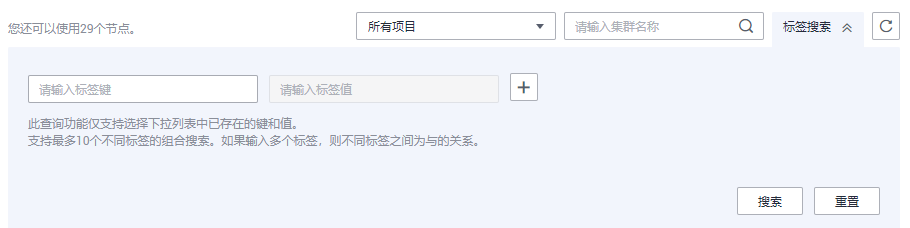
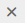
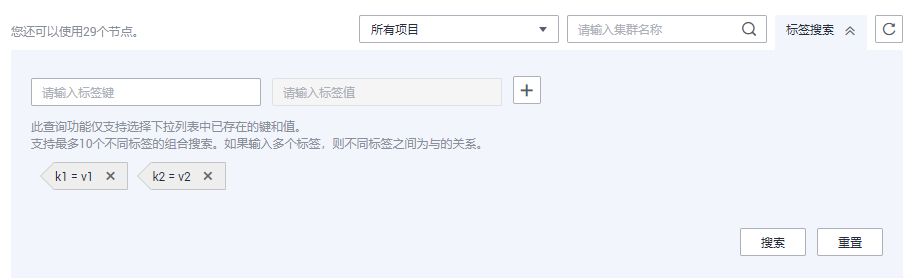
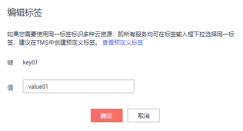

# 标签管理

本章节介绍如何根据标签搜索集群，以及如何为集群添加标签、修改标签和删除标签。

## 为集群添加标签

1.  在“集群管理“页面，单击需要添加标签的集群的名称，然后单击“标签“页签。

    **图 1**  hec-en  
    

2.  单击“添加标签“，弹出“添加标签“对话框。
3.  在“添加标签“对话框中配置标签参数。

    **图 2**  添加标签  
    

    **表 1**  标签配置参数

    
    <table><thead align="left"><tr id="row17486121763113"><th class="cellrowborder" valign="top" width="8.799999999999999%" id="mcps1.2.4.1.1">
参数

    </th>
    <th class="cellrowborder" valign="top" width="77.12%" id="mcps1.2.4.1.2">
参数说明

    </th>
    <th class="cellrowborder" valign="top" width="14.08%" id="mcps1.2.4.1.3">
样例值

    </th>
    </tr>
    </thead>
    <tbody><tr id="row11486131733111"><td class="cellrowborder" valign="top" width="8.799999999999999%" headers="mcps1.2.4.1.1 ">
键

    </td>
    <td class="cellrowborder" valign="top" width="77.12%" headers="mcps1.2.4.1.2 ">
您可以选择：

    <ul id="ul149381653121514"><li>在输入框的下拉列表中选择预定义标签键或集群已有的资源标签键。
 说明： 

如果添加预定义标签，用户需要预先在标签管理服务中创建好预定义标签，然后在“键”的下拉框中进行选择。用户可以通过单击“查看预定义标签”进入标签管理服务的“预定义标签”页面，然后单击“创建标签”来创建新的预定义标签。更多信息请参见《标签管理服务用户指南》中的<a href="https://support.huaweicloud.com/usermanual-tms/zh-cn_topic_0144368884.html" target="_blank" rel="noopener noreferrer">创建预定义标签</a>。

    

    </li></ul>
    <ul id="ul154819568159"><li>在输入框中输入标签键名称。输入标签键的最大长度为36个字符，不能为空字符串。
只能包含数字、英文字母、下划线、中划线和中文。

    

 说明： 

同一集群中的键名不能重复。

    

    

    </li></ul>
    </td>
    <td class="cellrowborder" valign="top" width="14.08%" headers="mcps1.2.4.1.3 ">
key01

    </td>
    </tr>
    <tr id="row19486151715318"><td class="cellrowborder" valign="top" width="8.799999999999999%" headers="mcps1.2.4.1.1 ">
值

    </td>
    <td class="cellrowborder" valign="top" width="77.12%" headers="mcps1.2.4.1.2 ">
您可以选择：

    <ul id="ul12885203215142"><li>在输入框的下拉列表中选择预定义标签值或集群的资源标签值。</li><li>在输入框中输入标签值。输入标签值的最大长度为43个字符，不能为空字符串。
只能包含数字、英文字母、下划线、点、中划线和中文。

    

    </li></ul>
    </td>
    <td class="cellrowborder" valign="top" width="14.08%" headers="mcps1.2.4.1.3 ">
value01

    </td>
    </tr>
    </tbody>
    </table>

4.  单击“确定“。

## 根据标签搜索集群

对于已经添加过标签的集群，用户可以通过设置标签过滤条件进行搜索，以便快速查找到集群。

1.  登录GaussDB\(DWS\) 管理控制台。
2.  单击“集群管理“。
3.  单击集群列表右上方的“标签搜索“隐藏页签，展开标签搜索页面。

    **图 3**  标签搜索  
    

4.  在标签搜索区域，单击“标签键“输入框，在下拉列表中选择要搜索的标签键，然后单击“标签值“输入框，在下拉列表中选择对应的标签值。

    标签搜索仅支持“标签键“和“标签值“下拉列表中已存在的键和值。如果没有可用的标签键和值，请先为集群创建标签，具体参见[为集群添加标签](#section77515910494)。

5.  单击，添加选定的标签到输入框下方。
    -   在输入框中继续选择其他标签，单击，可添加不同标签组合搜索。集群支持最多10个不同标签的组合搜索，且多个不同标签之间为与的关系。
    -   单击已添加标签后的，可删除该单个标签。
    -   单击“重置“将会清空所有已添加的搜索标签。

        **图 4**  添加查询的键和值  
        

6.  单击“搜索“，在集群列表中将显示搜索到的集群。

## 修改集群的标签

1.  在“集群管理“页面，单击需要修改标签的集群的名称，然后单击“标签“页签。
2.  在所要修改的标签所在行，单击“操作“列中的“编辑“，弹出“编辑“对话框。

    **图 5**  编辑标签  
    

3.  在对话框的“值“中输入修改后的键值。
4.  单击“确定”。

## 删除集群的标签

1.  在“集群管理“页面，单击需要删除标签的集群的名称，然后单击“标签“页签。
2.  在所要删除的标签所在行，单击“操作“列中的“删除“，弹出“删除“确认对话框。

    **图 6**  删除标签  
    

3.  单击“是”，删除标签。

