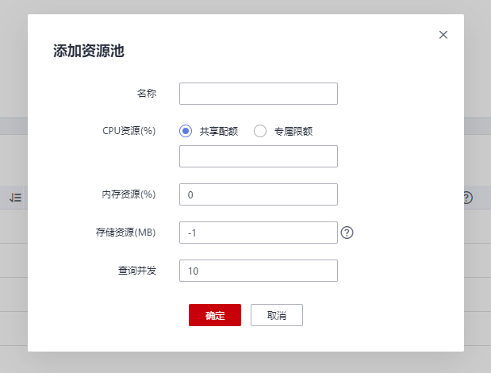
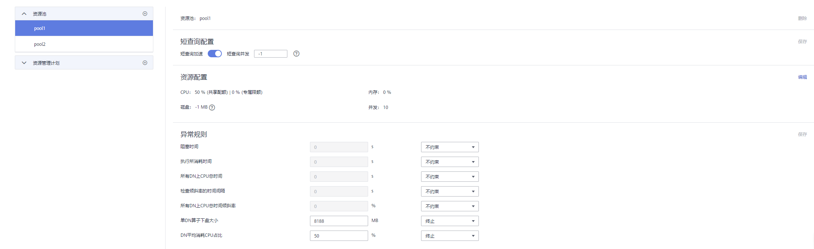

# 添加资源池

1.  登录GaussDB\(DWS\) 管理控制台。
2.  在集群列表中单击需要访问“资源管理”页面的集群名称。
3.  切换至“资源管理”页签。
4.  单击资源池列旁的“+”符号添加资源池。

    

    > **说明：** 
    >最多可创建63个资源池。

5.  参见[表 资源池参数](#zh-cn_topic_0000001076708629_t9f2b382ce2fe42968c6411f0d6ac5d98)填写资源池的名称和相关资源配置。

    

    **表 1**  资源池参数

    
    <table><thead align="left"><tr id="zh-cn_topic_0000001076708629_r45c4609ae0df47bfa1bb36943077276a"><th class="cellrowborder" valign="top" width="18.28%" id="mcps1.2.4.1.1">
参数项

    </th>
    <th class="cellrowborder" valign="top" width="65.36000000000001%" id="mcps1.2.4.1.2">
描述

    </th>
    <th class="cellrowborder" valign="top" width="16.360000000000003%" id="mcps1.2.4.1.3">
取值

    </th>
    </tr>
    </thead>
    <tbody><tr id="zh-cn_topic_0000001076708629_rccecdb3f69424915b2a90ae48134b9dd"><td class="cellrowborder" valign="top" width="18.28%" headers="mcps1.2.4.1.1 ">
名称

    </td>
    <td class="cellrowborder" valign="top" width="65.36000000000001%" headers="mcps1.2.4.1.2 ">
资源池的名称。

    </td>
    <td class="cellrowborder" valign="top" width="16.360000000000003%" headers="mcps1.2.4.1.3 ">
queue_test

    </td>
    </tr>
    <tr id="row1833914319256"><td class="cellrowborder" valign="top" width="18.28%" headers="mcps1.2.4.1.1 ">
CPU资源（%）

    </td>
    <td class="cellrowborder" valign="top" width="65.36000000000001%" headers="mcps1.2.4.1.2 "><ul id="ul14235101682820"><li>共享配额：关联在当前资源池的用户在执行作业时可以使用的CPU时间比例。</li><li>专属限额：限定资源池中数据库用户在执行作业时可使用的最大CPU核数占总核数的百分比。</li></ul>
    
 说明： 
<ul id="ul6756113052718"><li>所有资源池的总和不能超过99%。当配置CPU共享配额后，如果当前只有一个资源池时，该参数不生效。</li><li>共享配额非绝对限制，只有在发生CPU竞争时才生效。例如，资源池A和B被绑定在CPU1运行，当AB均运行时参数生效，只有A运行则参数不生效。</li><li>所有资源池的CPU专属限额总和最大不能超过100%，系统默认的CPU专属限额（%）为0。</li></ul>
    

    </td>
    <td class="cellrowborder" valign="top" width="16.360000000000003%" headers="mcps1.2.4.1.3 ">
-

    </td>
    </tr>
    <tr id="zh-cn_topic_0000001076708629_rb9afdcb77de5450f991ad26596962299"><td class="cellrowborder" valign="top" width="18.28%" headers="mcps1.2.4.1.1 ">
内存资源（%）

    </td>
    <td class="cellrowborder" valign="top" width="65.36000000000001%" headers="mcps1.2.4.1.2 ">
资源池所占用的内存百分比。

    
 注意： 

内存和查询并发支持单独管控和联合管控，联合管控时必须同时满足并发和内存要求时作业才能下发。

    

    </td>
    <td class="cellrowborder" valign="top" width="16.360000000000003%" headers="mcps1.2.4.1.3 ">
20

    </td>
    </tr>
    <tr id="zh-cn_topic_0000001076708629_rfc6a58e60ad5428fa32064926e00f43f"><td class="cellrowborder" valign="top" width="18.28%" headers="mcps1.2.4.1.1 ">
存储资源（MB）

    </td>
    <td class="cellrowborder" valign="top" width="65.36000000000001%" headers="mcps1.2.4.1.2 ">
可使用的永久表空间大小。

    
 注意： 

该值是资源池下所有DN的表空间总值，单DN节点可用空间=设置值 / DN节点数。

    

    </td>
    <td class="cellrowborder" valign="top" width="16.360000000000003%" headers="mcps1.2.4.1.3 ">
1024

    </td>
    </tr>
    <tr id="zh-cn_topic_0000001076708629_r1aabed4322f84ee68229882568cef559"><td class="cellrowborder" valign="top" width="18.28%" headers="mcps1.2.4.1.1 ">
查询并发

    </td>
    <td class="cellrowborder" valign="top" width="65.36000000000001%" headers="mcps1.2.4.1.2 ">
资源池中的最大查询并发数。

    
 注意： 

内存和查询并发支持单独管控和联合管控，联合管控时必须同时满足并发和内存要求时作业才能下发。

    

    </td>
    <td class="cellrowborder" valign="top" width="16.360000000000003%" headers="mcps1.2.4.1.3 ">
10

    </td>
    </tr>
    </tbody>
    </table>

    > **说明：** 
    >CPU专属限额仅8.1.3及以上版本支持。

6.  核对信息后，单击“确定”，添加资源池完成。

    

