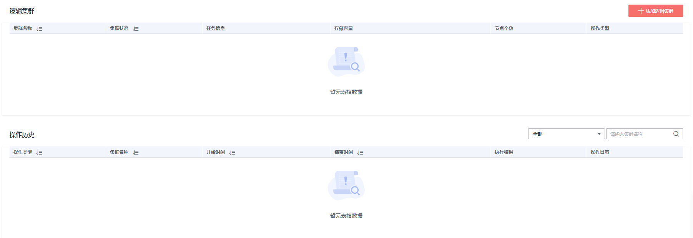

# 添加逻辑集群

1.  登录GaussDB\(DWS\) 管理控制台。
2.  在集群列表中单击指定集群名称。
3.  进入集群“基本信息”页面，打开“逻辑集群开关”，出现“逻辑集群管理”页签。

    

    

4.  切换至“逻辑集群管理”页签，单击“添加逻辑集群”按钮。

    

5.  在弹出窗口中从右侧选择要添加的环移动到左侧，并填写逻辑集群名称，单击“确定”。

    

> **注意：** 
>-   在初次进入到“逻辑集群管理”页面时，若有从后台创建的逻辑集群，则会进行前后台的逻辑集群元数据同步。同步之后可以在前台页面看到之前在后台创建的逻辑集群信息，但不支持同名大小写不同的逻辑集群同步，如lc1和LC1。

