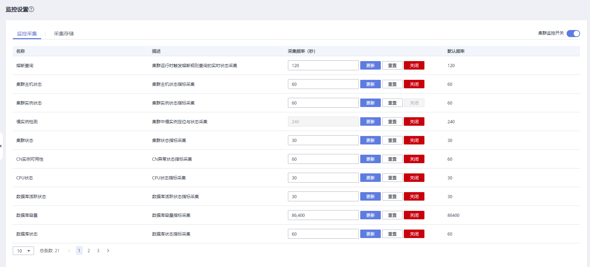
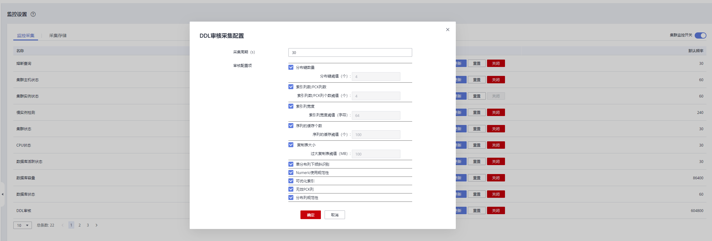
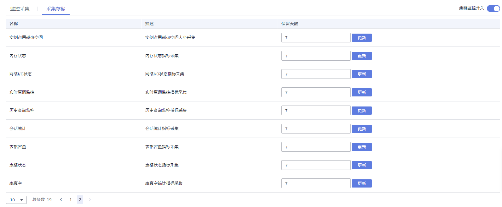

# 监控设置

监控设置页面展示了监控指标的采集周期及数据老化周期。

> **说明：** 
>-   集群监控开关按钮默认开启。
>-   当集群处于修复过程中时应该先关闭集群监控开关。当修复完成后，再开启集群监控服务。
>-   当集群中有节点下电或集群管理IP网络不通时，集群监控开关和集群采集指标配置按钮不可用。

## 监控采集

1.  登录GaussDB\(DWS\) 管理控制台。
2.  在“集群管理”页面，找到需要查看监控的集群。
3.  在指定集群所在行的“操作”列，选择“监控面板”，系统将显示数据库监控页面。
4.  在左侧导航栏单击“设置\>监控设置”，选择监控采集信息栏，用户可重新设置采集频率或关闭该监控检测项。

    

    > **说明：** 
    >用户可单击“更新”按钮重新设置自动审核频率或审核项。
    >

## 采集存储

1.  登录GaussDB\(DWS\) 管理控制台。
2.  在“集群管理”页面，找到需要查看监控的集群。
3.  在指定集群所在行的“操作”列，选择“监控面板”，系统将显示数据库监控页面。
4.  在左侧导航栏单击“设置\>监控设置”，选择采集存储信息栏，用户可更新保留天数。

    

