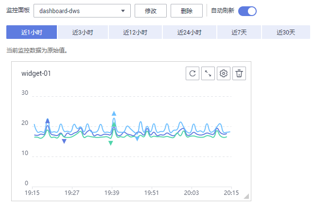
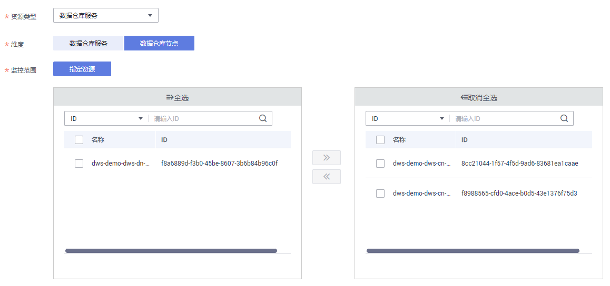
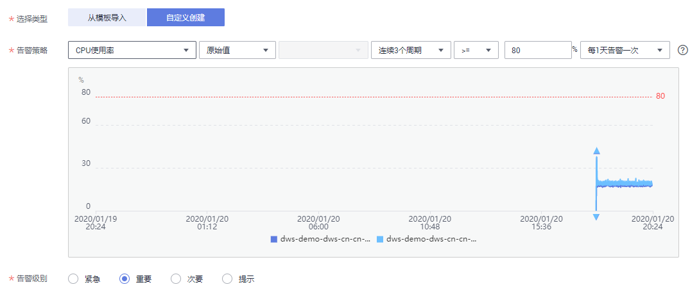

# 监控集群

## 功能说明

用户需要查看集群的监控指标信息时，可以通过云监控（Cloud Eye）确认集群各项指标情况。通过监控集群运行时的各项指标，用户可以识别出数据库集群状态异常的时间段，然后在数据库日志中，分析可能存在问题的活动，从而优化数据库性能。本章节定义了数据仓库服务上报云监控服务的监控指标的命名空间、监控指标列表和维度定义。用户可以通过云监控服务提供的管理控制台或[API接口](https://support.huaweicloud.com/api-ces/zh-cn_topic_0171212514.html)来检索数据仓库服务产生的监控指标和告警信息。

## 命名空间

SYS.DWS

## 集群监控指标

通过云监控提供的数据仓库服务相关监控指标，用户可以获取有关集群运行状况和性能的信息，并深入了解节点级别的对应信息。

数据仓库服务相关监控指标，具体请参见[表1](#table17857105810438)。

**表 1**  数据仓库服务监控指标

<table><thead align="left"><tr id="row3845105854319"><th class="cellrowborder" valign="top" width="19.560000000000002%" id="mcps1.2.7.1.1">
<strong id="b1667212298376">指标ID</strong>

</th>
<th class="cellrowborder" valign="top" width="15.240000000000004%" id="mcps1.2.7.1.2">
<strong id="b884518582433">指标名称</strong>

</th>
<th class="cellrowborder" valign="top" width="28.370000000000005%" id="mcps1.2.7.1.3">
<strong id="b14845858114310">含义</strong>

</th>
<th class="cellrowborder" valign="top" width="13.600000000000003%" id="mcps1.2.7.1.4">
<strong id="b6845105817433">取值范围</strong>

</th>
<th class="cellrowborder" valign="top" width="16.28%" id="mcps1.2.7.1.5">
<strong id="b38451589434">测量对象&amp;维度</strong>

</th>
<th class="cellrowborder" valign="top" width="6.950000000000002%" id="mcps1.2.7.1.6">
<strong id="b1098016551365">监控周期（原始指标）</strong>

</th>
</tr>
</thead>
<tbody><tr id="row128461658104319"><td class="cellrowborder" valign="top" width="19.560000000000002%" headers="mcps1.2.7.1.1 ">
dws001_shared_buffer_hit_ratio

</td>
<td class="cellrowborder" valign="top" width="15.240000000000004%" headers="mcps1.2.7.1.2 ">
缓存命中率

</td>
<td class="cellrowborder" valign="top" width="28.370000000000005%" headers="mcps1.2.7.1.3 ">
该指标用于表示需要访问的数据，在内存中可以直接获取的数据量比例，以百分比为单位。

</td>
<td class="cellrowborder" valign="top" width="13.600000000000003%" headers="mcps1.2.7.1.4 ">
0%～100%

</td>
<td class="cellrowborder" valign="top" width="16.28%" headers="mcps1.2.7.1.5 ">
测量对象：数据仓库集群

测量维度：datastore_id

</td>
<td class="cellrowborder" valign="top" width="6.950000000000002%" headers="mcps1.2.7.1.6 ">
4分钟

</td>
</tr>
<tr id="row1084745818438"><td class="cellrowborder" valign="top" width="19.560000000000002%" headers="mcps1.2.7.1.1 ">
dws002_in_memory_sort_ratio

</td>
<td class="cellrowborder" valign="top" width="15.240000000000004%" headers="mcps1.2.7.1.2 ">
内存中排序比率

</td>
<td class="cellrowborder" valign="top" width="28.370000000000005%" headers="mcps1.2.7.1.3 ">
该指标用于表示在数据进行排序时，可以直接在内存中排序的数据量比例，以百分比为单位。

</td>
<td class="cellrowborder" valign="top" width="13.600000000000003%" headers="mcps1.2.7.1.4 ">
0%～100%

</td>
<td class="cellrowborder" valign="top" width="16.28%" headers="mcps1.2.7.1.5 ">
测量对象：数据仓库集群

测量维度：datastore_id

</td>
<td class="cellrowborder" valign="top" width="6.950000000000002%" headers="mcps1.2.7.1.6 ">
4分钟

</td>
</tr>
<tr id="row1384711586430"><td class="cellrowborder" valign="top" width="19.560000000000002%" headers="mcps1.2.7.1.1 ">
dws003_physical_reads

</td>
<td class="cellrowborder" valign="top" width="15.240000000000004%" headers="mcps1.2.7.1.2 ">
文件读取次数

</td>
<td class="cellrowborder" valign="top" width="28.370000000000005%" headers="mcps1.2.7.1.3 ">
该指标用于表示读取数据库文件的累计次数。

</td>
<td class="cellrowborder" valign="top" width="13.600000000000003%" headers="mcps1.2.7.1.4 ">
&gt; 0

</td>
<td class="cellrowborder" valign="top" width="16.28%" headers="mcps1.2.7.1.5 ">
测量对象：数据仓库集群

测量维度：datastore_id

</td>
<td class="cellrowborder" valign="top" width="6.950000000000002%" headers="mcps1.2.7.1.6 ">
4分钟

</td>
</tr>
<tr id="row1984835818434"><td class="cellrowborder" valign="top" width="19.560000000000002%" headers="mcps1.2.7.1.1 ">
dws004_physical_writes

</td>
<td class="cellrowborder" valign="top" width="15.240000000000004%" headers="mcps1.2.7.1.2 ">
文件写入次数

</td>
<td class="cellrowborder" valign="top" width="28.370000000000005%" headers="mcps1.2.7.1.3 ">
该指标用于表示写入数据库文件的累计次数。

</td>
<td class="cellrowborder" valign="top" width="13.600000000000003%" headers="mcps1.2.7.1.4 ">
&gt; 0

</td>
<td class="cellrowborder" valign="top" width="16.28%" headers="mcps1.2.7.1.5 ">
测量对象：数据仓库集群

测量维度：datastore_id

</td>
<td class="cellrowborder" valign="top" width="6.950000000000002%" headers="mcps1.2.7.1.6 ">
4分钟

</td>
</tr>
<tr id="row6848195824313"><td class="cellrowborder" valign="top" width="19.560000000000002%" headers="mcps1.2.7.1.1 ">
dws006_physical_writes_per_second

</td>
<td class="cellrowborder" valign="top" width="15.240000000000004%" headers="mcps1.2.7.1.2 ">
每秒文件读取次数

</td>
<td class="cellrowborder" valign="top" width="28.370000000000005%" headers="mcps1.2.7.1.3 ">
该指标用于表示每秒读取数据库文件的次数。

</td>
<td class="cellrowborder" valign="top" width="13.600000000000003%" headers="mcps1.2.7.1.4 ">
≥ 0

</td>
<td class="cellrowborder" valign="top" width="16.28%" headers="mcps1.2.7.1.5 ">
测量对象：数据仓库集群

测量维度：datastore_id

</td>
<td class="cellrowborder" valign="top" width="6.950000000000002%" headers="mcps1.2.7.1.6 ">
4分钟

</td>
</tr>
<tr id="row28491058174310"><td class="cellrowborder" valign="top" width="19.560000000000002%" headers="mcps1.2.7.1.1 ">
dws005_physical_reads_per_second

</td>
<td class="cellrowborder" valign="top" width="15.240000000000004%" headers="mcps1.2.7.1.2 ">
每秒文件写入次数

</td>
<td class="cellrowborder" valign="top" width="28.370000000000005%" headers="mcps1.2.7.1.3 ">
该指标用于表示每秒写入数据库文件的次数。

</td>
<td class="cellrowborder" valign="top" width="13.600000000000003%" headers="mcps1.2.7.1.4 ">
≥ 0

</td>
<td class="cellrowborder" valign="top" width="16.28%" headers="mcps1.2.7.1.5 ">
测量对象：数据仓库集群

测量维度：datastore_id

</td>
<td class="cellrowborder" valign="top" width="6.950000000000002%" headers="mcps1.2.7.1.6 ">
4分钟

</td>
</tr>
<tr id="row11849195834313"><td class="cellrowborder" valign="top" width="19.560000000000002%" headers="mcps1.2.7.1.1 ">
dws007_db_size

</td>
<td class="cellrowborder" valign="top" width="15.240000000000004%" headers="mcps1.2.7.1.2 ">
数据量大小

</td>
<td class="cellrowborder" valign="top" width="28.370000000000005%" headers="mcps1.2.7.1.3 ">
该指标用于表示数据库中所有数据总量大小。

单位：兆字节（MB）

</td>
<td class="cellrowborder" valign="top" width="13.600000000000003%" headers="mcps1.2.7.1.4 ">
0MB～36000MB

</td>
<td class="cellrowborder" valign="top" width="16.28%" headers="mcps1.2.7.1.5 ">
测量对象：数据仓库集群

测量维度：datastore_id

</td>
<td class="cellrowborder" valign="top" width="6.950000000000002%" headers="mcps1.2.7.1.6 ">
4分钟

</td>
</tr>
<tr id="row1285095884312"><td class="cellrowborder" valign="top" width="19.560000000000002%" headers="mcps1.2.7.1.1 ">
dws008_active_sql_count

</td>
<td class="cellrowborder" valign="top" width="15.240000000000004%" headers="mcps1.2.7.1.2 ">
活跃SQL数

</td>
<td class="cellrowborder" valign="top" width="28.370000000000005%" headers="mcps1.2.7.1.3 ">
该指标用于表示数据库当前活动的SQL个数。

</td>
<td class="cellrowborder" valign="top" width="13.600000000000003%" headers="mcps1.2.7.1.4 ">
≥ 0

</td>
<td class="cellrowborder" valign="top" width="16.28%" headers="mcps1.2.7.1.5 ">
测量对象：数据仓库集群

测量维度：datastore_id

</td>
<td class="cellrowborder" valign="top" width="6.950000000000002%" headers="mcps1.2.7.1.6 ">
4分钟

</td>
</tr>
<tr id="row385012587435"><td class="cellrowborder" valign="top" width="19.560000000000002%" headers="mcps1.2.7.1.1 ">
dws009_session_count

</td>
<td class="cellrowborder" valign="top" width="15.240000000000004%" headers="mcps1.2.7.1.2 ">
会话数

</td>
<td class="cellrowborder" valign="top" width="28.370000000000005%" headers="mcps1.2.7.1.3 ">
该指标用于表示数据库当前访问的连接个数。

</td>
<td class="cellrowborder" valign="top" width="13.600000000000003%" headers="mcps1.2.7.1.4 ">
≥ 0

</td>
<td class="cellrowborder" valign="top" width="16.28%" headers="mcps1.2.7.1.5 ">
测量对象：数据仓库集群

测量维度：datastore_id

</td>
<td class="cellrowborder" valign="top" width="6.950000000000002%" headers="mcps1.2.7.1.6 ">
4分钟

</td>
</tr>
<tr id="row08511458144319"><td class="cellrowborder" valign="top" width="19.560000000000002%" headers="mcps1.2.7.1.1 ">
dws010_cpu_usage

</td>
<td class="cellrowborder" valign="top" width="15.240000000000004%" headers="mcps1.2.7.1.2 ">
CPU使用率

</td>
<td class="cellrowborder" valign="top" width="28.370000000000005%" headers="mcps1.2.7.1.3 ">
该指标用于统计每个集群节点的CPU使用率，以百分比为单位。

</td>
<td class="cellrowborder" valign="top" width="13.600000000000003%" headers="mcps1.2.7.1.4 ">
0%～100%

</td>
<td class="cellrowborder" valign="top" width="16.28%" headers="mcps1.2.7.1.5 ">
测量对象：数据仓库节点

测量维度：dws_instance_id

</td>
<td class="cellrowborder" valign="top" width="6.950000000000002%" headers="mcps1.2.7.1.6 ">
1分钟

</td>
</tr>
<tr id="row2851458144317"><td class="cellrowborder" valign="top" width="19.560000000000002%" headers="mcps1.2.7.1.1 ">
dws011_mem_usage

</td>
<td class="cellrowborder" valign="top" width="15.240000000000004%" headers="mcps1.2.7.1.2 ">
内存使用率

</td>
<td class="cellrowborder" valign="top" width="28.370000000000005%" headers="mcps1.2.7.1.3 ">
该指标用于统计每个集群节点的内存使用率，以百分比为单位。

</td>
<td class="cellrowborder" valign="top" width="13.600000000000003%" headers="mcps1.2.7.1.4 ">
0%～100%

</td>
<td class="cellrowborder" valign="top" width="16.28%" headers="mcps1.2.7.1.5 ">
测量对象：数据仓库节点

测量维度：dws_instance_id

</td>
<td class="cellrowborder" valign="top" width="6.950000000000002%" headers="mcps1.2.7.1.6 ">
1分钟

</td>
</tr>
<tr id="row3851135815433"><td class="cellrowborder" valign="top" width="19.560000000000002%" headers="mcps1.2.7.1.1 ">
dws012_iops

</td>
<td class="cellrowborder" valign="top" width="15.240000000000004%" headers="mcps1.2.7.1.2 ">
IOPS

</td>
<td class="cellrowborder" valign="top" width="28.370000000000005%" headers="mcps1.2.7.1.3 ">
该指标用于统计每个集群节点每秒处理的I/O请求数量。

</td>
<td class="cellrowborder" valign="top" width="13.600000000000003%" headers="mcps1.2.7.1.4 ">
≥ 0

</td>
<td class="cellrowborder" valign="top" width="16.28%" headers="mcps1.2.7.1.5 ">
测量对象：数据仓库节点

测量维度：dws_instance_id

</td>
<td class="cellrowborder" valign="top" width="6.950000000000002%" headers="mcps1.2.7.1.6 ">
1分钟

</td>
</tr>
<tr id="row14853125812437"><td class="cellrowborder" valign="top" width="19.560000000000002%" headers="mcps1.2.7.1.1 ">
dws013_bytes_in

</td>
<td class="cellrowborder" valign="top" width="15.240000000000004%" headers="mcps1.2.7.1.2 ">
网络输入吞吐量

</td>
<td class="cellrowborder" valign="top" width="28.370000000000005%" headers="mcps1.2.7.1.3 ">
该指标用于统计每秒从网络输入每个集群节点的数据总量。

单位：字节/秒

</td>
<td class="cellrowborder" valign="top" width="13.600000000000003%" headers="mcps1.2.7.1.4 ">
≥ 0字节/秒

</td>
<td class="cellrowborder" valign="top" width="16.28%" headers="mcps1.2.7.1.5 ">
测量对象：数据仓库节点

测量维度：dws_instance_id

</td>
<td class="cellrowborder" valign="top" width="6.950000000000002%" headers="mcps1.2.7.1.6 ">
1分钟

</td>
</tr>
<tr id="row20853195816432"><td class="cellrowborder" valign="top" width="19.560000000000002%" headers="mcps1.2.7.1.1 ">
dws014_bytes_out

</td>
<td class="cellrowborder" valign="top" width="15.240000000000004%" headers="mcps1.2.7.1.2 ">
网络输出吞吐量

</td>
<td class="cellrowborder" valign="top" width="28.370000000000005%" headers="mcps1.2.7.1.3 ">
该指标用于统计从每个节点每秒发送到网络的数据总量。

单位：字节/秒

</td>
<td class="cellrowborder" valign="top" width="13.600000000000003%" headers="mcps1.2.7.1.4 ">
≥ 0字节/秒

</td>
<td class="cellrowborder" valign="top" width="16.28%" headers="mcps1.2.7.1.5 ">
测量对象：数据仓库节点

测量维度：dws_instance_id

</td>
<td class="cellrowborder" valign="top" width="6.950000000000002%" headers="mcps1.2.7.1.6 ">
1分钟

</td>
</tr>
<tr id="row158532585437"><td class="cellrowborder" valign="top" width="19.560000000000002%" headers="mcps1.2.7.1.1 ">
dws015_disk_usage

</td>
<td class="cellrowborder" valign="top" width="15.240000000000004%" headers="mcps1.2.7.1.2 ">
磁盘利用率

</td>
<td class="cellrowborder" valign="top" width="28.370000000000005%" headers="mcps1.2.7.1.3 ">
该指标用于统计每个集群节点的磁盘使用情况，以百分比为单位。

</td>
<td class="cellrowborder" valign="top" width="13.600000000000003%" headers="mcps1.2.7.1.4 ">
0%～100%

</td>
<td class="cellrowborder" valign="top" width="16.28%" headers="mcps1.2.7.1.5 ">
测量对象：数据仓库节点

测量维度：dws_instance_id

</td>
<td class="cellrowborder" valign="top" width="6.950000000000002%" headers="mcps1.2.7.1.6 ">
1分钟

</td>
</tr>
<tr id="row7854358184310"><td class="cellrowborder" valign="top" width="19.560000000000002%" headers="mcps1.2.7.1.1 ">
dws016_disk_total_size

</td>
<td class="cellrowborder" valign="top" width="15.240000000000004%" headers="mcps1.2.7.1.2 ">
磁盘总大小

</td>
<td class="cellrowborder" valign="top" width="28.370000000000005%" headers="mcps1.2.7.1.3 ">
该指标用于统计每个集群节点的数据磁盘总大小。

单位：吉字节（GB）

</td>
<td class="cellrowborder" valign="top" width="13.600000000000003%" headers="mcps1.2.7.1.4 ">
100GB～2000GB

</td>
<td class="cellrowborder" valign="top" width="16.28%" headers="mcps1.2.7.1.5 ">
测量对象：数据仓库节点

测量维度：dws_instance_id

</td>
<td class="cellrowborder" valign="top" width="6.950000000000002%" headers="mcps1.2.7.1.6 ">
1分钟

</td>
</tr>
<tr id="row138541258204314"><td class="cellrowborder" valign="top" width="19.560000000000002%" headers="mcps1.2.7.1.1 ">
dws017_disk_used_size

</td>
<td class="cellrowborder" valign="top" width="15.240000000000004%" headers="mcps1.2.7.1.2 ">
磁盘使用量

</td>
<td class="cellrowborder" valign="top" width="28.370000000000005%" headers="mcps1.2.7.1.3 ">
该指标用于统计每个集群节点的数据磁盘已用大小。

单位：吉字节（GB）

</td>
<td class="cellrowborder" valign="top" width="13.600000000000003%" headers="mcps1.2.7.1.4 ">
0GB～3600GB

</td>
<td class="cellrowborder" valign="top" width="16.28%" headers="mcps1.2.7.1.5 ">
测量对象：数据仓库节点

测量维度：dws_instance_id

</td>
<td class="cellrowborder" valign="top" width="6.950000000000002%" headers="mcps1.2.7.1.6 ">
1分钟

</td>
</tr>
<tr id="row17854958194315"><td class="cellrowborder" valign="top" width="19.560000000000002%" headers="mcps1.2.7.1.1 ">
dws018_disk_read_throughput

</td>
<td class="cellrowborder" valign="top" width="15.240000000000004%" headers="mcps1.2.7.1.2 ">
磁盘读吞吐量

</td>
<td class="cellrowborder" valign="top" width="28.370000000000005%" headers="mcps1.2.7.1.3 ">
该指标用于统计集群节点数据磁盘每秒读取的数据量。

单位：字节/秒

</td>
<td class="cellrowborder" valign="top" width="13.600000000000003%" headers="mcps1.2.7.1.4 ">
≥ 0字节/秒

</td>
<td class="cellrowborder" valign="top" width="16.28%" headers="mcps1.2.7.1.5 ">
测量对象：数据仓库节点

测量维度：dws_instance_id

</td>
<td class="cellrowborder" valign="top" width="6.950000000000002%" headers="mcps1.2.7.1.6 ">
1分钟

</td>
</tr>
<tr id="row1385425815435"><td class="cellrowborder" valign="top" width="19.560000000000002%" headers="mcps1.2.7.1.1 ">
dws019_disk_write_throughput

</td>
<td class="cellrowborder" valign="top" width="15.240000000000004%" headers="mcps1.2.7.1.2 ">
磁盘写吞吐量

</td>
<td class="cellrowborder" valign="top" width="28.370000000000005%" headers="mcps1.2.7.1.3 ">
该指标用于统计集群节点数据磁盘每秒写入的数据量。

单位：字节/秒

</td>
<td class="cellrowborder" valign="top" width="13.600000000000003%" headers="mcps1.2.7.1.4 ">
≥ 0字节/秒

</td>
<td class="cellrowborder" valign="top" width="16.28%" headers="mcps1.2.7.1.5 ">
测量对象：数据仓库节点

测量维度：dws_instance_id

</td>
<td class="cellrowborder" valign="top" width="6.950000000000002%" headers="mcps1.2.7.1.6 ">
1分钟

</td>
</tr>
<tr id="row7855195834313"><td class="cellrowborder" valign="top" width="19.560000000000002%" headers="mcps1.2.7.1.1 ">
dws020_avg_disk_sec_per_read

</td>
<td class="cellrowborder" valign="top" width="15.240000000000004%" headers="mcps1.2.7.1.2 ">
磁盘读耗时

</td>
<td class="cellrowborder" valign="top" width="28.370000000000005%" headers="mcps1.2.7.1.3 ">
该指标用于统计集群节点数据磁盘每次读取数据的平均耗时。

单位：秒

</td>
<td class="cellrowborder" valign="top" width="13.600000000000003%" headers="mcps1.2.7.1.4 ">
&gt; 0秒

</td>
<td class="cellrowborder" valign="top" width="16.28%" headers="mcps1.2.7.1.5 ">
测量对象：数据仓库节点

测量维度：dws_instance_id

</td>
<td class="cellrowborder" valign="top" width="6.950000000000002%" headers="mcps1.2.7.1.6 ">
1分钟

</td>
</tr>
<tr id="row38551583436"><td class="cellrowborder" valign="top" width="19.560000000000002%" headers="mcps1.2.7.1.1 ">
dws021_avg_disk_sec_per_write

</td>
<td class="cellrowborder" valign="top" width="15.240000000000004%" headers="mcps1.2.7.1.2 ">
磁盘写耗时

</td>
<td class="cellrowborder" valign="top" width="28.370000000000005%" headers="mcps1.2.7.1.3 ">
该指标用于统计集群节点数据磁盘每次写入数据的平均耗时。

单位：秒

</td>
<td class="cellrowborder" valign="top" width="13.600000000000003%" headers="mcps1.2.7.1.4 ">
&gt; 0秒

</td>
<td class="cellrowborder" valign="top" width="16.28%" headers="mcps1.2.7.1.5 ">
测量对象：数据仓库节点

测量维度：dws_instance_id

</td>
<td class="cellrowborder" valign="top" width="6.950000000000002%" headers="mcps1.2.7.1.6 ">
1分钟

</td>
</tr>
<tr id="row385715581436"><td class="cellrowborder" valign="top" width="19.560000000000002%" headers="mcps1.2.7.1.1 ">
dws022_avg_disk_queue_length

</td>
<td class="cellrowborder" valign="top" width="15.240000000000004%" headers="mcps1.2.7.1.2 ">
磁盘平均队列长度

</td>
<td class="cellrowborder" valign="top" width="28.370000000000005%" headers="mcps1.2.7.1.3 ">
该指标用于统计每个集群节点数据磁盘平均的I/O队列长度。

</td>
<td class="cellrowborder" valign="top" width="13.600000000000003%" headers="mcps1.2.7.1.4 ">
≥ 0

</td>
<td class="cellrowborder" valign="top" width="16.28%" headers="mcps1.2.7.1.5 ">
测量对象：数据仓库节点

测量维度：dws_instance_id

</td>
<td class="cellrowborder" valign="top" width="6.950000000000002%" headers="mcps1.2.7.1.6 ">
1分钟

</td>
</tr>
</tbody>
</table>

## 维度

<table><thead align="left"><tr id="row15596641121813"><th class="cellrowborder" valign="top" width="46.07%" id="mcps1.1.3.1.1">
Key

</th>
<th class="cellrowborder" valign="top" width="53.93%" id="mcps1.1.3.1.2">
Value

</th>
</tr>
</thead>
<tbody><tr id="row1359614113186"><td class="cellrowborder" valign="top" width="46.07%" headers="mcps1.1.3.1.1 ">
datastore_id

</td>
<td class="cellrowborder" valign="top" width="53.93%" headers="mcps1.1.3.1.2 ">
数据仓库集群ID

</td>
</tr>
<tr id="row165971241201816"><td class="cellrowborder" valign="top" width="46.07%" headers="mcps1.1.3.1.1 ">
dws_instance_id

</td>
<td class="cellrowborder" valign="top" width="53.93%" headers="mcps1.1.3.1.2 ">
数据仓库节点ID

</td>
</tr>
</tbody>
</table>

## 查看集群监控信息

1.  登录[DWS管理控制台](https://console.huaweicloud.com/dws)，进入“集群管理“页面。
2.  在集群列表中，在指定集群所在行，单击“查看监控指标“，打开云监控管理控制台。

    云监控支持查看数据仓库服务中数据仓库集群的监控信息，支持查看集群中各个节点各项监控信息。用户可以根据需要，选择指定的监控指标名称以及时间范围，从而显示监控指标的性能曲线。

    云监控也支持多个节点间的监控指标对比，具体操作请参见[多节点间的监控指标对比](#section20548025153518)。

## 多节点间的监控指标对比

1.  在云监控管理控制台的左侧导航栏中，单击“总览  \>  监控面板“。
2.  在“监控面板“页面，单击“创建监控面板“，在弹出对话框中，输入“名称“后，单击“确定“。
3.  在“监控面板“页面，单击右上角的“添加监控视图“。
4.  在弹出的“添加监控视图“窗口中，配置标题和监控项。

    > **说明：**   
    >单击“添加监控项“可以添加多个监控指标。  

    **图 1**  添加监控视图  
    

    以对比两个节点间的CPU使用率为例，参数设置如下表所示。

    **表 2**  配置样例

    
    <table><thead align="left"><tr id="row4060451616736"><th class="cellrowborder" valign="top" width="43.169999999999995%" id="mcps1.2.3.1.1">
参数名

    </th>
    <th class="cellrowborder" valign="top" width="56.830000000000005%" id="mcps1.2.3.1.2">
样例值

    </th>
    </tr>
    </thead>
    <tbody><tr id="row4982610116736"><td class="cellrowborder" valign="top" width="43.169999999999995%" headers="mcps1.2.3.1.1 ">
资源类型

    </td>
    <td class="cellrowborder" valign="top" width="56.830000000000005%" headers="mcps1.2.3.1.2 ">
数据仓库服务

    </td>
    </tr>
    <tr id="row6173605316736"><td class="cellrowborder" valign="top" width="43.169999999999995%" headers="mcps1.2.3.1.1 ">
维度

    </td>
    <td class="cellrowborder" valign="top" width="56.830000000000005%" headers="mcps1.2.3.1.2 ">
数据仓库节点

    </td>
    </tr>
    <tr id="row3162373816736"><td class="cellrowborder" valign="top" width="43.169999999999995%" headers="mcps1.2.3.1.1 ">
监控对象

    </td>
    <td class="cellrowborder" valign="top" width="56.830000000000005%" headers="mcps1.2.3.1.2 ">
dws-demo-dws-cn-cn-2-1

    
dws-demo-dws-cn-cn-1-1

    
dws-demo-dws-dn-1-1

    </td>
    </tr>
    <tr id="row4150216216921"><td class="cellrowborder" valign="top" width="43.169999999999995%" headers="mcps1.2.3.1.1 ">
监控指标

    </td>
    <td class="cellrowborder" valign="top" width="56.830000000000005%" headers="mcps1.2.3.1.2 ">
CPU使用率

    </td>
    </tr>
    </tbody>
    </table>

5.  单击“确定“。

    添加成功后，可在“监控面板“区域看到对应的监控视图。鼠标移至监控视图单击右上角的，可放大监控视图，查看详细的指标对比数据。

    **图 2**  查看监控视图  
    

## 创建告警规则

通过设置DWS的告警规则，用户可以自定义监控目标和通知策略，及时了解DWS运行状态，从而起到预警作用。

设置DWS的告警规则包括设置告警规则名称、监控对象、监控指标、告警阈值、监控周期和是否发送通知等参数。本节介绍设置DWS规则的具体方法。

1.  通过访问以下地址登录DWS管理控制台：[https://console.huaweicloud.com/dws](https://console.huaweicloud.com/dws)。
2.  在左侧导航栏中选择“集群管理”。
3.  在指定集群所在行的“操作”列中，单击“查看监控指标”，进入云监控管理控制台，查看数据仓库服务监控信息。

    确认待查看“监控信息”的集群状态必须为“可用”，否则不能进行创建告警操作。

4.  在云监控管理控制台的左侧导航树上，选择“告警 \> 告警规则“。
5.  在“告警规则”界面，单击右上方“创建告警规则”。
6.  在“创建告警规则”界面，根据界面提示配置参数。
    1.  配置规则名称和描述。
    2.  配置告警内容，根据界面提示配置参数。

        **图 3**  选择监控对象  
        

        **图 4**  设置告警策略  
        

        **表 3**  配置告警内容

        
        <table><thead align="left"><tr id="row1471833113618"><th class="cellrowborder" valign="top" width="16.36163616361636%" id="mcps1.2.4.1.1">
参数名称

        </th>
        <th class="cellrowborder" valign="top" width="50.305030503050304%" id="mcps1.2.4.1.2">
参数说明

        </th>
        <th class="cellrowborder" valign="top" width="33.33333333333333%" id="mcps1.2.4.1.3">
取值样例

        </th>
        </tr>
        </thead>
        <tbody><tr id="row571873153613"><td class="cellrowborder" valign="top" width="16.36163616361636%" headers="mcps1.2.4.1.1 ">
资源类型

        </td>
        <td class="cellrowborder" valign="top" width="50.305030503050304%" headers="mcps1.2.4.1.2 ">
配置告警规则监控的云服务资源名称。

        </td>
        <td class="cellrowborder" valign="top" width="33.33333333333333%" headers="mcps1.2.4.1.3 ">
数据仓库服务

        </td>
        </tr>
        <tr id="row67197315367"><td class="cellrowborder" valign="top" width="16.36163616361636%" headers="mcps1.2.4.1.1 ">
维度

        </td>
        <td class="cellrowborder" valign="top" width="50.305030503050304%" headers="mcps1.2.4.1.2 ">
用于指定告警规则对应指标的维度名称。可以选择“数据仓库节点”或“数据仓库服务”。

        </td>
        <td class="cellrowborder" valign="top" width="33.33333333333333%" headers="mcps1.2.4.1.3 ">
数据仓库节点

        </td>
        </tr>
        <tr id="row77191311367"><td class="cellrowborder" valign="top" width="16.36163616361636%" headers="mcps1.2.4.1.1 ">
监控范围

        </td>
        <td class="cellrowborder" valign="top" width="50.305030503050304%" headers="mcps1.2.4.1.2 ">
告警规则适用的资源范围，选择“指定资源”，然后勾选具体的监控对象，可以是一个或多个。对于DWS而言，选择您创建的集群实例ID或节点ID。单击将监控对象同步到右侧对话框。

        </td>
        <td class="cellrowborder" valign="top" width="33.33333333333333%" headers="mcps1.2.4.1.3 ">
指定资源

        </td>
        </tr>
        <tr id="row694314468559"><td class="cellrowborder" valign="top" width="16.36163616361636%" headers="mcps1.2.4.1.1 ">
选择类型

        </td>
        <td class="cellrowborder" valign="top" width="50.305030503050304%" headers="mcps1.2.4.1.2 ">
根据需要可选择从模板导入或自定义创建。

        <ul id="ul72371548161018"><li>如果当前没有告警模板，“选择类型”设置为“自定义创建”，然后根据界面提示配置参数创建自定义告警规则。</li><li>如果当前已有告警模板，可以将“选择类型”设置为“从模板导入”，从而可以使用告警模板快速创建告警规则。</li></ul>
        </td>
        <td class="cellrowborder" valign="top" width="33.33333333333333%" headers="mcps1.2.4.1.3 ">
自定义创建

        </td>
        </tr>
        <tr id="row9378193220581"><td class="cellrowborder" valign="top" width="16.36163616361636%" headers="mcps1.2.4.1.1 ">
模板

        </td>
        <td class="cellrowborder" valign="top" width="50.305030503050304%" headers="mcps1.2.4.1.2 ">
当告警内容选择从模板导入时，该参数有效。

        
选择需要导入的模板。如果当前没有告警模板，可以单击“创建自定义告警模板”创建一个符合您需求的告警模板。

        </td>
        <td class="cellrowborder" valign="top" width="33.33333333333333%" headers="mcps1.2.4.1.3 ">
-

        </td>
        </tr>
        <tr id="row152721236175813"><td class="cellrowborder" valign="top" width="16.36163616361636%" headers="mcps1.2.4.1.1 ">
告警策略

        </td>
        <td class="cellrowborder" valign="top" width="50.305030503050304%" headers="mcps1.2.4.1.2 ">
当告警内容选择从自定义创建时，该参数有效。

        
设置触发告警的告警策略。例如，CPU使用率连续三个周期原始值≥80%。

        
数据仓库服务支持的监控指标请参见<a href="#table17857105810438">表1</a>。

        </td>
        <td class="cellrowborder" valign="top" width="33.33333333333333%" headers="mcps1.2.4.1.3 ">
-

        </td>
        </tr>
        <tr id="row974019216566"><td class="cellrowborder" valign="top" width="16.36163616361636%" headers="mcps1.2.4.1.1 ">
告警级别

        </td>
        <td class="cellrowborder" valign="top" width="50.305030503050304%" headers="mcps1.2.4.1.2 ">
根据告警的严重程度不同等级，可选择紧急、重要、次要、提示。

        </td>
        <td class="cellrowborder" valign="top" width="33.33333333333333%" headers="mcps1.2.4.1.3 ">
重要

        </td>
        </tr>
        </tbody>
        </table>

    3.  配置告警通知，根据界面提示配置参数。

        **图 5**  配置告警通知  
        

        **表 4**  配置告警通知

        
        <table><thead align="left"><tr id="row1113755311716"><th class="cellrowborder" valign="top" width="14.879999999999999%" id="mcps1.2.4.1.1">
参数名称

        </th>
        <th class="cellrowborder" valign="top" width="66.08000000000001%" id="mcps1.2.4.1.2">
参数说明

        </th>
        <th class="cellrowborder" valign="top" width="19.040000000000003%" id="mcps1.2.4.1.3">
取值样例

        </th>
        </tr>
        </thead>
        <tbody><tr id="row213965351715"><td class="cellrowborder" valign="top" width="14.879999999999999%" headers="mcps1.2.4.1.1 ">
发送通知

        </td>
        <td class="cellrowborder" valign="top" width="66.08000000000001%" headers="mcps1.2.4.1.2 ">
配置是否发送邮件、短信、HTTP和HTTPS通知用户。

        
选择“是”（推荐选择），会发送通知；选择“否”，不会发送通知。

        </td>
        <td class="cellrowborder" valign="top" width="19.040000000000003%" headers="mcps1.2.4.1.3 ">
是

        </td>
        </tr>
        <tr id="row1314035311178"><td class="cellrowborder" valign="top" width="14.879999999999999%" headers="mcps1.2.4.1.1 ">
生效时间

        </td>
        <td class="cellrowborder" valign="top" width="66.08000000000001%" headers="mcps1.2.4.1.2 ">
该告警规则仅在生效时间内发送通知消息。

        
如生效时间为00:00-8:00，则该告警规则仅在00:00-8:00发送通知消息。

        </td>
        <td class="cellrowborder" valign="top" width="19.040000000000003%" headers="mcps1.2.4.1.3 ">
-

        </td>
        </tr>
        <tr id="row11140753141720"><td class="cellrowborder" valign="top" width="14.879999999999999%" headers="mcps1.2.4.1.1 ">
通知对象

        </td>
        <td class="cellrowborder" valign="top" width="66.08000000000001%" headers="mcps1.2.4.1.2 ">
需要发送告警通知的主题名称。

        
当发送通知选择“是”时，需要选择已有的主题名称，若此处没有需要的主题则需先创建主题，该功能会调用消息通知服务（SMN），创建主题请参见《消息通知服务用户指南》。

        </td>
        <td class="cellrowborder" valign="top" width="19.040000000000003%" headers="mcps1.2.4.1.3 ">
-

        </td>
        </tr>
        <tr id="row1814017539172"><td class="cellrowborder" valign="top" width="14.879999999999999%" headers="mcps1.2.4.1.1 ">
触发条件

        </td>
        <td class="cellrowborder" valign="top" width="66.08000000000001%" headers="mcps1.2.4.1.2 ">
可以选择“出现告警”、“恢复正常”两种状态，作为触发告警通知的条件。

        </td>
        <td class="cellrowborder" valign="top" width="19.040000000000003%" headers="mcps1.2.4.1.3 ">
-

        </td>
        </tr>
        </tbody>
        </table>

    4.  配置完成后，单击“立即创建“，完成告警规则的创建。

        告警规则添加完成后，当监控指标触发设定的阈值时，云监控会在第一时间通过消息通知服务实时告知您资源异常，以免因此造成业务损失。

## 配置OBS转储

云监控各监控指标的原始数据的保留周期为两天，超过保留周期后原始数据将不再保存。用户可以开通对象存储服务，然后将原始数据同步保存至OBS，以保存更长时间。

关于如何配置OBS转储，具体请参见《云监控服务用户指南》中的[配置数据存储](https://support.huaweicloud.com/usermanual-ces/ces_01_0065.html)章节。

## 相关链接

-   [资源负载管理](https://support.huaweicloud.com/devg-dws/dws_04_0921.html)
-   [资源监控](https://support.huaweicloud.com/devg-dws/dws_04_0663.html)

