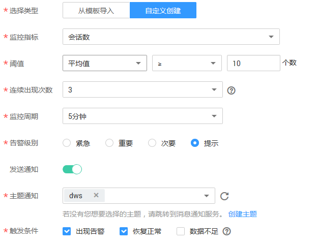

# 监控集群

## 操作场景

用户需要查看集群的监控指标信息时，可以通过云监控（Cloud Eye）确认集群各项指标情况。通过监控集群运行时的各项指标，用户可以识别出数据库集群状态异常的时间段，然后在数据库日志中，分析可能存在问题的活动，从而优化数据库性能。本章节包含如下内容：

-   [集群监控指标](#section185715586432)
-   [查看集群监控信息](#section26007147165750)
-   [多节点间的监控指标对比](#section20548025153518)
-   [创建告警规则](#section76461040113)
-   [配置OBS转储](#section61821139193716)

## 集群监控指标

通过云监控提供的数据仓库服务相关监控指标，用户可以获取有关集群运行状况和性能的信息，并深入了解节点级别的对应信息。

数据仓库服务相关监控指标，具体请参见[表1](#table17857105810438)。

**表 1**  数据仓库服务监控指标

<table><thead align="left"><tr id="row3845105854319"><th class="cellrowborder" valign="top" width="18.6%" id="mcps1.2.5.1.1">
<strong id="b884518582433">指标名称</strong>

</th>
<th class="cellrowborder" valign="top" width="50.949999999999996%" id="mcps1.2.5.1.2">
<strong id="b14845858114310">解释</strong>

</th>
<th class="cellrowborder" valign="top" width="17.29%" id="mcps1.2.5.1.3">
<strong id="b6845105817433">取值范围</strong>

</th>
<th class="cellrowborder" valign="top" width="13.16%" id="mcps1.2.5.1.4">
<strong id="b38451589434">指标主体</strong>

</th>
</tr>
</thead>
<tbody><tr id="row128461658104319"><td class="cellrowborder" valign="top" width="18.6%" headers="mcps1.2.5.1.1 ">
缓存命中率

</td>
<td class="cellrowborder" valign="top" width="50.949999999999996%" headers="mcps1.2.5.1.2 ">
该指标用于表示需要访问的数据，在内存中可以直接获取的数据量比例，以百分比为单位。

</td>
<td class="cellrowborder" valign="top" width="17.29%" headers="mcps1.2.5.1.3 ">
0%～100%

</td>
<td class="cellrowborder" rowspan="9" valign="top" width="13.16%" headers="mcps1.2.5.1.4 ">
数据仓库集群

</td>
</tr>
<tr id="row1084745818438"><td class="cellrowborder" valign="top" headers="mcps1.2.5.1.1 ">
内存中排序比率

</td>
<td class="cellrowborder" valign="top" headers="mcps1.2.5.1.2 ">
该指标用于表示在数据进行排序时，可以直接在内存中排序的数据量比例，以百分比为单位。

</td>
<td class="cellrowborder" valign="top" headers="mcps1.2.5.1.3 ">
0%～100%

</td>
</tr>
<tr id="row1384711586430"><td class="cellrowborder" valign="top" headers="mcps1.2.5.1.1 ">
文件读取次数

</td>
<td class="cellrowborder" valign="top" headers="mcps1.2.5.1.2 ">
该指标用于表示读取数据库文件的累计次数。

</td>
<td class="cellrowborder" valign="top" headers="mcps1.2.5.1.3 ">
&gt; 0

</td>
</tr>
<tr id="row1984835818434"><td class="cellrowborder" valign="top" headers="mcps1.2.5.1.1 ">
文件写入次数

</td>
<td class="cellrowborder" valign="top" headers="mcps1.2.5.1.2 ">
该指标用于表示写入数据库文件的累计次数。

</td>
<td class="cellrowborder" valign="top" headers="mcps1.2.5.1.3 ">
&gt; 0

</td>
</tr>
<tr id="row6848195824313"><td class="cellrowborder" valign="top" headers="mcps1.2.5.1.1 ">
每秒文件读取次数

</td>
<td class="cellrowborder" valign="top" headers="mcps1.2.5.1.2 ">
该指标用于表示每秒读取数据库文件的次数。

</td>
<td class="cellrowborder" valign="top" headers="mcps1.2.5.1.3 ">
≥ 0

</td>
</tr>
<tr id="row28491058174310"><td class="cellrowborder" valign="top" headers="mcps1.2.5.1.1 ">
每秒文件写入次数

</td>
<td class="cellrowborder" valign="top" headers="mcps1.2.5.1.2 ">
该指标用于表示每秒写入数据库文件的次数。

</td>
<td class="cellrowborder" valign="top" headers="mcps1.2.5.1.3 ">
≥ 0

</td>
</tr>
<tr id="row11849195834313"><td class="cellrowborder" valign="top" headers="mcps1.2.5.1.1 ">
数据量大小

</td>
<td class="cellrowborder" valign="top" headers="mcps1.2.5.1.2 ">
该指标用于表示数据库中所有数据总量大小，以兆字节（MB）为单位。

</td>
<td class="cellrowborder" valign="top" headers="mcps1.2.5.1.3 ">
0MB～36000MB

</td>
</tr>
<tr id="row1285095884312"><td class="cellrowborder" valign="top" headers="mcps1.2.5.1.1 ">
活跃SQL数

</td>
<td class="cellrowborder" valign="top" headers="mcps1.2.5.1.2 ">
该指标用于表示数据库当前活动的SQL个数。

</td>
<td class="cellrowborder" valign="top" headers="mcps1.2.5.1.3 ">
≥ 0

</td>
</tr>
<tr id="row385012587435"><td class="cellrowborder" valign="top" headers="mcps1.2.5.1.1 ">
会话数

</td>
<td class="cellrowborder" valign="top" headers="mcps1.2.5.1.2 ">
该指标用于表示数据库当前访问的连接个数。

</td>
<td class="cellrowborder" valign="top" headers="mcps1.2.5.1.3 ">
≥ 0

</td>
</tr>
<tr id="row08511458144319"><td class="cellrowborder" valign="top" width="18.6%" headers="mcps1.2.5.1.1 ">
CPU使用率

</td>
<td class="cellrowborder" valign="top" width="50.949999999999996%" headers="mcps1.2.5.1.2 ">
该指标用于统计每个集群节点的CPU使用率，以百分比为单位。

</td>
<td class="cellrowborder" valign="top" width="17.29%" headers="mcps1.2.5.1.3 ">
0%～100%

</td>
<td class="cellrowborder" rowspan="13" valign="top" width="13.16%" headers="mcps1.2.5.1.4 ">
集群节点

</td>
</tr>
<tr id="row2851458144317"><td class="cellrowborder" valign="top" headers="mcps1.2.5.1.1 ">
内存使用率

</td>
<td class="cellrowborder" valign="top" headers="mcps1.2.5.1.2 ">
该指标用于统计每个集群节点的内存使用率，以百分比为单位。

</td>
<td class="cellrowborder" valign="top" headers="mcps1.2.5.1.3 ">
0%～100%

</td>
</tr>
<tr id="row3851135815433"><td class="cellrowborder" valign="top" headers="mcps1.2.5.1.1 ">
IOPS

</td>
<td class="cellrowborder" valign="top" headers="mcps1.2.5.1.2 ">
该指标用于统计每个集群节点每秒处理的I/O请求数量。

</td>
<td class="cellrowborder" valign="top" headers="mcps1.2.5.1.3 ">
≥ 0

</td>
</tr>
<tr id="row14853125812437"><td class="cellrowborder" valign="top" headers="mcps1.2.5.1.1 ">
网络输入吞吐量

</td>
<td class="cellrowborder" valign="top" headers="mcps1.2.5.1.2 ">
该指标用于统计每秒从网络输入每个集群节点的数据总量。

</td>
<td class="cellrowborder" valign="top" headers="mcps1.2.5.1.3 ">
≥ 0字节/秒

</td>
</tr>
<tr id="row20853195816432"><td class="cellrowborder" valign="top" headers="mcps1.2.5.1.1 ">
网络输出吞吐量

</td>
<td class="cellrowborder" valign="top" headers="mcps1.2.5.1.2 ">
该指标用于统计从每个节点每秒发送到网络的数据总量。

</td>
<td class="cellrowborder" valign="top" headers="mcps1.2.5.1.3 ">
≥ 0字节/秒

</td>
</tr>
<tr id="row158532585437"><td class="cellrowborder" valign="top" headers="mcps1.2.5.1.1 ">
磁盘使用率

</td>
<td class="cellrowborder" valign="top" headers="mcps1.2.5.1.2 ">
该指标用于统计每个集群节点的磁盘使用情况，以百分比为单位。

</td>
<td class="cellrowborder" valign="top" headers="mcps1.2.5.1.3 ">
0%～100%

</td>
</tr>
<tr id="row7854358184310"><td class="cellrowborder" valign="top" headers="mcps1.2.5.1.1 ">
磁盘总大小

</td>
<td class="cellrowborder" valign="top" headers="mcps1.2.5.1.2 ">
该指标用于统计每个集群节点的数据磁盘总大小，以吉字节（GB）为单位。

</td>
<td class="cellrowborder" valign="top" headers="mcps1.2.5.1.3 ">
100GB～2000GB

</td>
</tr>
<tr id="row138541258204314"><td class="cellrowborder" valign="top" headers="mcps1.2.5.1.1 ">
磁盘使用量

</td>
<td class="cellrowborder" valign="top" headers="mcps1.2.5.1.2 ">
该指标用于统计每个集群节点的数据磁盘已用大小，以吉字节（GB）为单位。

</td>
<td class="cellrowborder" valign="top" headers="mcps1.2.5.1.3 ">
0GB～3600GB

</td>
</tr>
<tr id="row17854958194315"><td class="cellrowborder" valign="top" headers="mcps1.2.5.1.1 ">
磁盘读吞吐量

</td>
<td class="cellrowborder" valign="top" headers="mcps1.2.5.1.2 ">
该指标用于统计集群节点数据磁盘每秒读取的数据量，以字节/秒为单位。

</td>
<td class="cellrowborder" valign="top" headers="mcps1.2.5.1.3 ">
≥ 0字节/秒

</td>
</tr>
<tr id="row1385425815435"><td class="cellrowborder" valign="top" headers="mcps1.2.5.1.1 ">
磁盘写吞吐量

</td>
<td class="cellrowborder" valign="top" headers="mcps1.2.5.1.2 ">
该指标用于统计集群节点数据磁盘每秒写入的数据量，以字节/秒为单位。

</td>
<td class="cellrowborder" valign="top" headers="mcps1.2.5.1.3 ">
≥ 0字节/秒

</td>
</tr>
<tr id="row7855195834313"><td class="cellrowborder" valign="top" headers="mcps1.2.5.1.1 ">
磁盘读耗时

</td>
<td class="cellrowborder" valign="top" headers="mcps1.2.5.1.2 ">
该指标用于统计集群节点数据磁盘每次读取数据的平均耗时，以秒为单位。

</td>
<td class="cellrowborder" valign="top" headers="mcps1.2.5.1.3 ">
&gt; 0秒

</td>
</tr>
<tr id="row38551583436"><td class="cellrowborder" valign="top" headers="mcps1.2.5.1.1 ">
磁盘写耗时

</td>
<td class="cellrowborder" valign="top" headers="mcps1.2.5.1.2 ">
该指标用于统计集群节点数据磁盘每次写入数据的平均耗时，以秒为单位。

</td>
<td class="cellrowborder" valign="top" headers="mcps1.2.5.1.3 ">
&gt; 0秒

</td>
</tr>
<tr id="row385715581436"><td class="cellrowborder" valign="top" headers="mcps1.2.5.1.1 ">
磁盘平均队列长度

</td>
<td class="cellrowborder" valign="top" headers="mcps1.2.5.1.2 ">
该指标用于统计每个集群节点数据磁盘平均的I/O队列长度。

</td>
<td class="cellrowborder" valign="top" headers="mcps1.2.5.1.3 ">
≥ 0

</td>
</tr>
</tbody>
</table>

## 查看集群监控信息

1.  登录[DWS管理控制台](https://console.huaweicloud.com/dws)。
2.  单击“集群管理“。
3.  在集群列表中，在指定集群所在行，单击“查看监控指标“，打开云监控管理控制台。

    云监控支持查看数据仓库服务中数据仓库集群的监控信息，支持查看集群中各个节点各项监控信息。用户可以根据需要，选择指定的监控指标名称以及时间范围，从而显示监控指标的性能曲线。

    云监控也支持多个节点间的监控指标对比，具体操作请参见[多节点间的监控指标对比](#section20548025153518)。

## 多节点间的监控指标对比

1.  在云监控管理控制台的左侧导航栏中，单击“总览  \>  监控面板“。
2.  在“监控面板“页面，单击“创建监控面板“，在弹出对话框中，输入“名称“后，单击“确定“。
3.  在“监控面板“页面，单击左上角的“添加监控视图“。
4.  在弹出的“添加监控视图“窗口中，配置标题和监控项。

    > **说明：**   
    >单击“添加监控项“可以添加多个监控指标。  

    **图 1**  添加监控视图  
    

    以对比两个节点间的CPU使用率为例，参数设置如下表所示。

    **表 2**  配置样例

    
    <table><thead align="left"><tr id="row4060451616736"><th class="cellrowborder" valign="top" width="50%" id="mcps1.2.3.1.1">
参数名

    </th>
    <th class="cellrowborder" valign="top" width="50%" id="mcps1.2.3.1.2">
样例值

    </th>
    </tr>
    </thead>
    <tbody><tr id="row4982610116736"><td class="cellrowborder" valign="top" width="50%" headers="mcps1.2.3.1.1 ">
资源类型

    </td>
    <td class="cellrowborder" valign="top" width="50%" headers="mcps1.2.3.1.2 ">
数据仓库服务

    </td>
    </tr>
    <tr id="row6173605316736"><td class="cellrowborder" valign="top" width="50%" headers="mcps1.2.3.1.1 ">
维度

    </td>
    <td class="cellrowborder" valign="top" width="50%" headers="mcps1.2.3.1.2 ">
数据仓库节点

    </td>
    </tr>
    <tr id="row3162373816736"><td class="cellrowborder" valign="top" width="50%" headers="mcps1.2.3.1.1 ">
监控对象

    </td>
    <td class="cellrowborder" valign="top" width="50%" headers="mcps1.2.3.1.2 ">
dws-64a3-dws-dn-1-1

    
dws-64a3-dws-cn-cn-1-1

    </td>
    </tr>
    <tr id="row4150216216921"><td class="cellrowborder" valign="top" width="50%" headers="mcps1.2.3.1.1 ">
监控指标

    </td>
    <td class="cellrowborder" valign="top" width="50%" headers="mcps1.2.3.1.2 ">
CPU使用率

    </td>
    </tr>
    </tbody>
    </table>

5.  单击“确定“。

    添加成功后，可在“监控面板“区域看到对应的监控视图。鼠标移至监控视图单击左上角的，可放大监控视图，查看详细的指标对比数据。

## 创建告警规则

通过设置DWS的告警规则，用户可以自定义监控目标和通知策略，及时了解DWS运行状态，从而起到预警作用。

设置DWS的告警规则包括设置告警规则名称、监控对象、监控指标、告警阈值、监控周期和是否发送通知等参数。本节介绍设置DWS规则的具体方法。

1.  通过访问以下地址登录DWS管理控制台：[https://console.huaweicloud.com/dws](https://console.huaweicloud.com/dws)。
2.  在左侧导航栏中选择“集群管理”。
3.  在指定集群所在行的“操作”列中，单击“查看监控信息”，进入云监控管理控制台，查看数据仓库服务监控信息。

    确认待查看“监控信息”的集群状态必须为“服务中”，否则不能进行创建告警操作。

4.  在左侧导航树栏，选择“告警 \> 告警规则“。
5.  在“告警规则”界面，单击右上方“创建告警规则”，或者选择已有的告警规则进行修改，设置数据仓库服务的告警规则。

    -   已有告警模板，请使用告警模板创建告警规则。
    -   没有告警模板，则根据云监控提供的创建自定义告警功能创建自定义告警规则。
        1.  选择监控对象，根据界面提示配置参数，然后单击“下一步”。

            **图 2**  选择监控对象  
            

            -   服务类型：选择“数据仓库服务”。
            -   服务维度：选择“数据仓库节点”。
            -   监控对象：选择您创建的集群实例ID。

        2.  选择监控指标，根据界面配置参数，然后单击“下一步”。

            **图 3**  选择监控指标  
            

            -   选择类型：可以选择从模板导入和自定义创建。数据仓库服务当前未提供模板，请选择自定义创建。
            -   监控指标：从数据仓库服务支持的监控指标中选择。请参见[表1](#table17857105810438)。
            -   阈值：由聚合类型（原始值、平均值、最大值、最小值、求和值和方差值）、判断条件（\>、\>=、<、<=、=）、临界值三部分组成，用来配置告警条件，例如“平均值\>80”就是一个告警条件。用户可以按需自定义设置。
            -   连续出现次数：触发告警时的采样点数目。 例如：出现次数配置为n，则告警规则的采样点是连续n个监控周期（原始数据使用5分钟的默认监控周期）的采样点，当这些采样点全部满足阈值中配置的告警条件，告警规的状态才会刷新为告警。您可以按需自定义设置。
            -   监控周期：告警规则刷新告警状态的周期。用户可以按需自定义设置。
            -   发送通知：选择发送通知。
            -   主题名称：可以选择已经存在的主题名称，也可以自定义创建新的主题。
            -   触发条件：可以选择出现告警、恢复正常或数据不足，作为说明触发告警的条件。

        3.  规则信息，根据界面提示配置参数，然后单击“添加”。完成告警规则的添加。
            -   名称：系统会随机产生一个名称，用户也可以进行修改。
            -   描述：告警规则描述（此参数非必填项）。

    DWS告警规则设置完成后，当符合规则的告警产生时，系统会自动进行通知。

    当需要修改告警规则时，可以参见[《云监控用户指南》](https://support.huaweicloud.com/ces/index.html)进行修改。

## 配置OBS转储

云监控各监控指标的原始数据的保留周期为两天，超过保留周期后原始数据将不再保存。用户可以开通对象存储服务，然后将原始数据同步保存至OBS，以保存更长时间。

关于如何配置OBS转储，具体请参见[《云监控服务用户指南》](https://support.huaweicloud.com/ces/index.html)中“配置OBS转储“章节。

