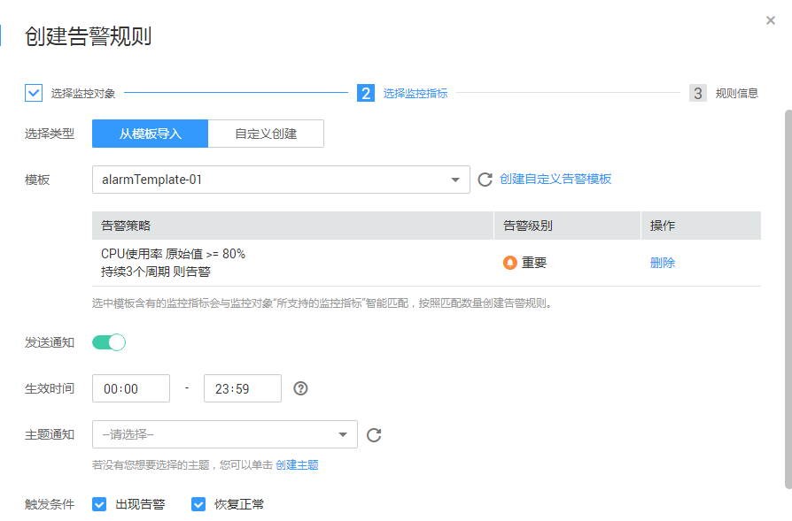

# 监控集群

## 操作场景

用户需要查看集群的监控指标信息时，可以通过云监控（Cloud Eye）确认集群各项指标情况。通过监控集群运行时的各项指标，用户可以识别出数据库集群状态异常的时间段，然后在数据库日志中，分析可能存在问题的活动，从而优化数据库性能。本章节包含如下内容：

-   [集群监控指标](#section185715586432)
-   [查看集群监控信息](#section26007147165750)
-   [多节点间的监控指标对比](#section20548025153518)
-   [创建告警规则](#section76461040113)
-   [配置OBS转储](#section61821139193716)

## 集群监控指标

通过云监控提供的数据仓库服务相关监控指标，用户可以获取有关集群运行状况和性能的信息，并深入了解节点级别的对应信息。

数据仓库服务相关监控指标，具体请参见[表1](#table17857105810438)。

**表 1**  数据仓库服务监控指标

<table><thead align="left"><tr id="row3845105854319"><th class="cellrowborder" valign="top" width="18.6%" id="mcps1.2.5.1.1">
<strong id="b884518582433">指标名称</strong>

</th>
<th class="cellrowborder" valign="top" width="50.949999999999996%" id="mcps1.2.5.1.2">
<strong id="b14845858114310">解释</strong>

</th>
<th class="cellrowborder" valign="top" width="17.29%" id="mcps1.2.5.1.3">
<strong id="b6845105817433">取值范围</strong>

</th>
<th class="cellrowborder" valign="top" width="13.16%" id="mcps1.2.5.1.4">
<strong id="b38451589434">指标主体</strong>

</th>
</tr>
</thead>
<tbody><tr id="row128461658104319"><td class="cellrowborder" valign="top" width="18.6%" headers="mcps1.2.5.1.1 ">
缓存命中率

</td>
<td class="cellrowborder" valign="top" width="50.949999999999996%" headers="mcps1.2.5.1.2 ">
该指标用于表示需要访问的数据，在内存中可以直接获取的数据量比例，以百分比为单位。

</td>
<td class="cellrowborder" valign="top" width="17.29%" headers="mcps1.2.5.1.3 ">
0%～100%

</td>
<td class="cellrowborder" rowspan="9" valign="top" width="13.16%" headers="mcps1.2.5.1.4 ">
数据仓库集群

</td>
</tr>
<tr id="row1084745818438"><td class="cellrowborder" valign="top" headers="mcps1.2.5.1.1 ">
内存中排序比率

</td>
<td class="cellrowborder" valign="top" headers="mcps1.2.5.1.2 ">
该指标用于表示在数据进行排序时，可以直接在内存中排序的数据量比例，以百分比为单位。

</td>
<td class="cellrowborder" valign="top" headers="mcps1.2.5.1.3 ">
0%～100%

</td>
</tr>
<tr id="row1384711586430"><td class="cellrowborder" valign="top" headers="mcps1.2.5.1.1 ">
文件读取次数

</td>
<td class="cellrowborder" valign="top" headers="mcps1.2.5.1.2 ">
该指标用于表示读取数据库文件的累计次数。

</td>
<td class="cellrowborder" valign="top" headers="mcps1.2.5.1.3 ">
&gt; 0

</td>
</tr>
<tr id="row1984835818434"><td class="cellrowborder" valign="top" headers="mcps1.2.5.1.1 ">
文件写入次数

</td>
<td class="cellrowborder" valign="top" headers="mcps1.2.5.1.2 ">
该指标用于表示写入数据库文件的累计次数。

</td>
<td class="cellrowborder" valign="top" headers="mcps1.2.5.1.3 ">
&gt; 0

</td>
</tr>
<tr id="row6848195824313"><td class="cellrowborder" valign="top" headers="mcps1.2.5.1.1 ">
每秒文件读取次数

</td>
<td class="cellrowborder" valign="top" headers="mcps1.2.5.1.2 ">
该指标用于表示每秒读取数据库文件的次数。

</td>
<td class="cellrowborder" valign="top" headers="mcps1.2.5.1.3 ">
≥ 0

</td>
</tr>
<tr id="row28491058174310"><td class="cellrowborder" valign="top" headers="mcps1.2.5.1.1 ">
每秒文件写入次数

</td>
<td class="cellrowborder" valign="top" headers="mcps1.2.5.1.2 ">
该指标用于表示每秒写入数据库文件的次数。

</td>
<td class="cellrowborder" valign="top" headers="mcps1.2.5.1.3 ">
≥ 0

</td>
</tr>
<tr id="row11849195834313"><td class="cellrowborder" valign="top" headers="mcps1.2.5.1.1 ">
数据量大小

</td>
<td class="cellrowborder" valign="top" headers="mcps1.2.5.1.2 ">
该指标用于表示数据库中所有数据总量大小，以兆字节（MB）为单位。

</td>
<td class="cellrowborder" valign="top" headers="mcps1.2.5.1.3 ">
0MB～36000MB

</td>
</tr>
<tr id="row1285095884312"><td class="cellrowborder" valign="top" headers="mcps1.2.5.1.1 ">
活跃SQL数

</td>
<td class="cellrowborder" valign="top" headers="mcps1.2.5.1.2 ">
该指标用于表示数据库当前活动的SQL个数。

</td>
<td class="cellrowborder" valign="top" headers="mcps1.2.5.1.3 ">
≥ 0

</td>
</tr>
<tr id="row385012587435"><td class="cellrowborder" valign="top" headers="mcps1.2.5.1.1 ">
会话数

</td>
<td class="cellrowborder" valign="top" headers="mcps1.2.5.1.2 ">
该指标用于表示数据库当前访问的连接个数。

</td>
<td class="cellrowborder" valign="top" headers="mcps1.2.5.1.3 ">
≥ 0

</td>
</tr>
<tr id="row08511458144319"><td class="cellrowborder" valign="top" width="18.6%" headers="mcps1.2.5.1.1 ">
CPU使用率

</td>
<td class="cellrowborder" valign="top" width="50.949999999999996%" headers="mcps1.2.5.1.2 ">
该指标用于统计每个集群节点的CPU使用率，以百分比为单位。

</td>
<td class="cellrowborder" valign="top" width="17.29%" headers="mcps1.2.5.1.3 ">
0%～100%

</td>
<td class="cellrowborder" rowspan="13" valign="top" width="13.16%" headers="mcps1.2.5.1.4 ">
集群节点

</td>
</tr>
<tr id="row2851458144317"><td class="cellrowborder" valign="top" headers="mcps1.2.5.1.1 ">
内存使用率

</td>
<td class="cellrowborder" valign="top" headers="mcps1.2.5.1.2 ">
该指标用于统计每个集群节点的内存使用率，以百分比为单位。

</td>
<td class="cellrowborder" valign="top" headers="mcps1.2.5.1.3 ">
0%～100%

</td>
</tr>
<tr id="row3851135815433"><td class="cellrowborder" valign="top" headers="mcps1.2.5.1.1 ">
IOPS

</td>
<td class="cellrowborder" valign="top" headers="mcps1.2.5.1.2 ">
该指标用于统计每个集群节点每秒处理的I/O请求数量。

</td>
<td class="cellrowborder" valign="top" headers="mcps1.2.5.1.3 ">
≥ 0

</td>
</tr>
<tr id="row14853125812437"><td class="cellrowborder" valign="top" headers="mcps1.2.5.1.1 ">
网络输入吞吐量

</td>
<td class="cellrowborder" valign="top" headers="mcps1.2.5.1.2 ">
该指标用于统计每秒从网络输入每个集群节点的数据总量。

</td>
<td class="cellrowborder" valign="top" headers="mcps1.2.5.1.3 ">
≥ 0字节/秒

</td>
</tr>
<tr id="row20853195816432"><td class="cellrowborder" valign="top" headers="mcps1.2.5.1.1 ">
网络输出吞吐量

</td>
<td class="cellrowborder" valign="top" headers="mcps1.2.5.1.2 ">
该指标用于统计从每个节点每秒发送到网络的数据总量。

</td>
<td class="cellrowborder" valign="top" headers="mcps1.2.5.1.3 ">
≥ 0字节/秒

</td>
</tr>
<tr id="row158532585437"><td class="cellrowborder" valign="top" headers="mcps1.2.5.1.1 ">
磁盘利用率

</td>
<td class="cellrowborder" valign="top" headers="mcps1.2.5.1.2 ">
该指标用于统计每个集群节点的磁盘使用情况，以百分比为单位。

</td>
<td class="cellrowborder" valign="top" headers="mcps1.2.5.1.3 ">
0%～100%

</td>
</tr>
<tr id="row7854358184310"><td class="cellrowborder" valign="top" headers="mcps1.2.5.1.1 ">
磁盘总大小

</td>
<td class="cellrowborder" valign="top" headers="mcps1.2.5.1.2 ">
该指标用于统计每个集群节点的数据磁盘总大小，以吉字节（GB）为单位。

</td>
<td class="cellrowborder" valign="top" headers="mcps1.2.5.1.3 ">
100GB～2000GB

</td>
</tr>
<tr id="row138541258204314"><td class="cellrowborder" valign="top" headers="mcps1.2.5.1.1 ">
磁盘使用量

</td>
<td class="cellrowborder" valign="top" headers="mcps1.2.5.1.2 ">
该指标用于统计每个集群节点的数据磁盘已用大小，以吉字节（GB）为单位。

</td>
<td class="cellrowborder" valign="top" headers="mcps1.2.5.1.3 ">
0GB～3600GB

</td>
</tr>
<tr id="row17854958194315"><td class="cellrowborder" valign="top" headers="mcps1.2.5.1.1 ">
磁盘读吞吐量

</td>
<td class="cellrowborder" valign="top" headers="mcps1.2.5.1.2 ">
该指标用于统计集群节点数据磁盘每秒读取的数据量，以字节/秒为单位。

</td>
<td class="cellrowborder" valign="top" headers="mcps1.2.5.1.3 ">
≥ 0字节/秒

</td>
</tr>
<tr id="row1385425815435"><td class="cellrowborder" valign="top" headers="mcps1.2.5.1.1 ">
磁盘写吞吐量

</td>
<td class="cellrowborder" valign="top" headers="mcps1.2.5.1.2 ">
该指标用于统计集群节点数据磁盘每秒写入的数据量，以字节/秒为单位。

</td>
<td class="cellrowborder" valign="top" headers="mcps1.2.5.1.3 ">
≥ 0字节/秒

</td>
</tr>
<tr id="row7855195834313"><td class="cellrowborder" valign="top" headers="mcps1.2.5.1.1 ">
磁盘读耗时

</td>
<td class="cellrowborder" valign="top" headers="mcps1.2.5.1.2 ">
该指标用于统计集群节点数据磁盘每次读取数据的平均耗时，以秒为单位。

</td>
<td class="cellrowborder" valign="top" headers="mcps1.2.5.1.3 ">
&gt; 0秒

</td>
</tr>
<tr id="row38551583436"><td class="cellrowborder" valign="top" headers="mcps1.2.5.1.1 ">
磁盘写耗时

</td>
<td class="cellrowborder" valign="top" headers="mcps1.2.5.1.2 ">
该指标用于统计集群节点数据磁盘每次写入数据的平均耗时，以秒为单位。

</td>
<td class="cellrowborder" valign="top" headers="mcps1.2.5.1.3 ">
&gt; 0秒

</td>
</tr>
<tr id="row385715581436"><td class="cellrowborder" valign="top" headers="mcps1.2.5.1.1 ">
磁盘平均队列长度

</td>
<td class="cellrowborder" valign="top" headers="mcps1.2.5.1.2 ">
该指标用于统计每个集群节点数据磁盘平均的I/O队列长度。

</td>
<td class="cellrowborder" valign="top" headers="mcps1.2.5.1.3 ">
≥ 0

</td>
</tr>
</tbody>
</table>

## 查看集群监控信息

1.  登录[DWS管理控制台](https://console.huaweicloud.com/dws)。
2.  单击“集群管理“。
3.  在集群列表中，在指定集群所在行，单击“查看监控指标“，打开云监控管理控制台。

    云监控支持查看数据仓库服务中数据仓库集群的监控信息，支持查看集群中各个节点各项监控信息。用户可以根据需要，选择指定的监控指标名称以及时间范围，从而显示监控指标的性能曲线。

    云监控也支持多个节点间的监控指标对比，具体操作请参见[多节点间的监控指标对比](#section20548025153518)。

## 多节点间的监控指标对比

1.  在云监控管理控制台的左侧导航栏中，单击“总览  \>  监控面板“。
2.  在“监控面板“页面，单击“创建监控面板“，在弹出对话框中，输入“名称“后，单击“确定“。
3.  在“监控面板“页面，单击右上角的“添加监控视图“。
4.  在弹出的“添加监控视图“窗口中，配置标题和监控项。

    > **说明：**   
    >单击“添加监控项“可以添加多个监控指标。  

    **图 1**  添加监控视图  
    

    以对比两个节点间的CPU使用率为例，参数设置如下表所示。

    **表 2**  配置样例

    
    <table><thead align="left"><tr id="row4060451616736"><th class="cellrowborder" valign="top" width="50%" id="mcps1.2.3.1.1">
参数名

    </th>
    <th class="cellrowborder" valign="top" width="50%" id="mcps1.2.3.1.2">
样例值

    </th>
    </tr>
    </thead>
    <tbody><tr id="row4982610116736"><td class="cellrowborder" valign="top" width="50%" headers="mcps1.2.3.1.1 ">
资源类型

    </td>
    <td class="cellrowborder" valign="top" width="50%" headers="mcps1.2.3.1.2 ">
数据仓库服务

    </td>
    </tr>
    <tr id="row6173605316736"><td class="cellrowborder" valign="top" width="50%" headers="mcps1.2.3.1.1 ">
维度

    </td>
    <td class="cellrowborder" valign="top" width="50%" headers="mcps1.2.3.1.2 ">
数据仓库节点

    </td>
    </tr>
    <tr id="row3162373816736"><td class="cellrowborder" valign="top" width="50%" headers="mcps1.2.3.1.1 ">
监控对象

    </td>
    <td class="cellrowborder" valign="top" width="50%" headers="mcps1.2.3.1.2 ">
dws-64a3-dws-dn-1-1

    
dws-64a3-dws-cn-cn-1-1

    </td>
    </tr>
    <tr id="row4150216216921"><td class="cellrowborder" valign="top" width="50%" headers="mcps1.2.3.1.1 ">
监控指标

    </td>
    <td class="cellrowborder" valign="top" width="50%" headers="mcps1.2.3.1.2 ">
CPU使用率

    </td>
    </tr>
    </tbody>
    </table>

5.  单击“确定“。

    添加成功后，可在“监控面板“区域看到对应的监控视图。鼠标移至监控视图单击右上角的，可放大监控视图，查看详细的指标对比数据。

## 创建告警规则

通过设置DWS的告警规则，用户可以自定义监控目标和通知策略，及时了解DWS运行状态，从而起到预警作用。

设置DWS的告警规则包括设置告警规则名称、监控对象、监控指标、告警阈值、监控周期和是否发送通知等参数。本节介绍设置DWS规则的具体方法。

1.  通过访问以下地址登录DWS管理控制台：[https://console.huaweicloud.com/dws](https://console.huaweicloud.com/dws)。
2.  在左侧导航栏中选择“集群管理”。
3.  在指定集群所在行的“操作”列中，单击“查看监控指标”，进入云监控管理控制台，查看数据仓库服务监控信息。

    确认待查看“监控信息”的集群状态必须为“服务中”，否则不能进行创建告警操作。

4.  在云监控管理控制台的左侧导航树上，选择“告警 \> 告警规则“。
5.  在“告警规则”界面，单击右上方“创建告警规则”。
6.  在“创建告警规则”界面，根据界面提示配置参数。
    1.  选择监控对象，根据界面提示配置参数，然后单击“下一步”。

        **图 2**  选择监控对象  
        

        **表 3**  选择监控对象

        
        <table><thead align="left"><tr id="row191782040141114"><th class="cellrowborder" valign="top" width="16.36163616361636%" id="mcps1.2.4.1.1">
参数名称

        </th>
        <th class="cellrowborder" valign="top" width="50.305030503050304%" id="mcps1.2.4.1.2">
参数说明

        </th>
        <th class="cellrowborder" valign="top" width="33.33333333333333%" id="mcps1.2.4.1.3">
取值样例

        </th>
        </tr>
        </thead>
        <tbody><tr id="row10178144021113"><td class="cellrowborder" valign="top" width="16.36163616361636%" headers="mcps1.2.4.1.1 ">
资源类型

        </td>
        <td class="cellrowborder" valign="top" width="50.305030503050304%" headers="mcps1.2.4.1.2 ">
配置告警规则监控的云服务资源名称。

        </td>
        <td class="cellrowborder" valign="top" width="33.33333333333333%" headers="mcps1.2.4.1.3 ">
数据仓库服务

        </td>
        </tr>
        <tr id="row17179184031110"><td class="cellrowborder" valign="top" width="16.36163616361636%" headers="mcps1.2.4.1.1 ">
维度

        </td>
        <td class="cellrowborder" valign="top" width="50.305030503050304%" headers="mcps1.2.4.1.2 ">
用于指定告警规则对应指标的维度名称。可以选择“数据仓库节点”或“数据仓库服务”。

        </td>
        <td class="cellrowborder" valign="top" width="33.33333333333333%" headers="mcps1.2.4.1.3 ">
数据仓库服务

        </td>
        </tr>
        <tr id="row817919406116"><td class="cellrowborder" valign="top" width="16.36163616361636%" headers="mcps1.2.4.1.1 ">
监控范围

        </td>
        <td class="cellrowborder" valign="top" width="50.305030503050304%" headers="mcps1.2.4.1.2 ">
告警规则适用的资源范围，选择“指定资源”。

        </td>
        <td class="cellrowborder" valign="top" width="33.33333333333333%" headers="mcps1.2.4.1.3 ">
指定资源

        </td>
        </tr>
        <tr id="row131791440101112"><td class="cellrowborder" valign="top" width="16.36163616361636%" headers="mcps1.2.4.1.1 ">
监控对象

        </td>
        <td class="cellrowborder" valign="top" width="50.305030503050304%" headers="mcps1.2.4.1.2 ">
用来配置该告警规则针对的具体资源，可以是一个或多个。对于DWS而言，选择您创建的集群实例ID或节点ID。

        </td>
        <td class="cellrowborder" valign="top" width="33.33333333333333%" headers="mcps1.2.4.1.3 ">
-

        </td>
        </tr>
        </tbody>
        </table>

    2.  选择监控指标，可以选择以下两种“选择类型“的任意一种，然后参照界面提示设置参数。
        -   **自定义创建**

            如果当前没有告警模板，“选择类型“设置为“自定义创建“，然后根据界面提示配置参数创建自定义告警规则。

            **图 3**  选择监控指标  
            

            **表 4**  自定义创建告警规则

            
            <table><thead align="left"><tr id="row1047141585716"><th class="cellrowborder" valign="top" width="14.881488148814881%" id="mcps1.2.4.1.1">
参数

            </th>
            <th class="cellrowborder" valign="top" width="66.07660766076607%" id="mcps1.2.4.1.2">
参数说明

            </th>
            <th class="cellrowborder" valign="top" width="19.041904190419046%" id="mcps1.2.4.1.3">
取值样例

            </th>
            </tr>
            </thead>
            <tbody><tr id="row13471315145711"><td class="cellrowborder" valign="top" width="14.881488148814881%" headers="mcps1.2.4.1.1 ">
选择类型

            </td>
            <td class="cellrowborder" valign="top" width="66.07660766076607%" headers="mcps1.2.4.1.2 ">
选择“自定义创建”。

            </td>
            <td class="cellrowborder" valign="top" width="19.041904190419046%" headers="mcps1.2.4.1.3 ">
自定义创建

            </td>
            </tr>
            <tr id="row94761525715"><td class="cellrowborder" valign="top" width="14.881488148814881%" headers="mcps1.2.4.1.1 ">
监控指标

            </td>
            <td class="cellrowborder" valign="top" width="66.07660766076607%" headers="mcps1.2.4.1.2 ">
从数据仓库服务支持的监控指标中选择。请参见<a href="#table17857105810438">表1</a>。

            
例如：

            <ul id="ul18921055175712"><li>CPU使用率
该指标用于统计测量对象的CPU使用率，以百分比为单位。

            </li></ul>
            <ul id="ul18902165575710"><li>数据量大小
该指标用于表示数据库中所有数据总量大小，以兆字节（MB）为单位。

            </li></ul>
            </td>
            <td class="cellrowborder" valign="top" width="19.041904190419046%" headers="mcps1.2.4.1.3 ">
CPU使用率

            </td>
            </tr>
            <tr id="row114771595719"><td class="cellrowborder" valign="top" width="14.881488148814881%" headers="mcps1.2.4.1.1 ">
告警策略

            </td>
            <td class="cellrowborder" valign="top" width="66.07660766076607%" headers="mcps1.2.4.1.2 ">
触发告警的告警策略。

            
例如：监控周期为5分钟，连续三个周期原始值≥80%

            </td>
            <td class="cellrowborder" valign="top" width="19.041904190419046%" headers="mcps1.2.4.1.3 ">
-

            </td>
            </tr>
            <tr id="row14721520572"><td class="cellrowborder" valign="top" width="14.881488148814881%" headers="mcps1.2.4.1.1 ">
告警级别

            </td>
            <td class="cellrowborder" valign="top" width="66.07660766076607%" headers="mcps1.2.4.1.2 ">
根据告警的严重程度不同等级，可选择紧急、重要、次要、提示。

            </td>
            <td class="cellrowborder" valign="top" width="19.041904190419046%" headers="mcps1.2.4.1.3 ">
重要

            </td>
            </tr>
            <tr id="row194813156573"><td class="cellrowborder" valign="top" width="14.881488148814881%" headers="mcps1.2.4.1.1 ">
发送通知

            </td>
            <td class="cellrowborder" valign="top" width="66.07660766076607%" headers="mcps1.2.4.1.2 ">
配置是否发送邮件、短信、HTTP和HTTPS通知用户。

            
选择“是”（推荐选择），会发送通知；选择“否”，不会发送通知。

            </td>
            <td class="cellrowborder" valign="top" width="19.041904190419046%" headers="mcps1.2.4.1.3 ">
是

            </td>
            </tr>
            <tr id="row1248111518578"><td class="cellrowborder" valign="top" width="14.881488148814881%" headers="mcps1.2.4.1.1 ">
生效时间

            </td>
            <td class="cellrowborder" valign="top" width="66.07660766076607%" headers="mcps1.2.4.1.2 ">
该告警规则仅在生效时间内发送通知消息。

            
如生效时间为00:00-8:00，则该告警规则仅在00:00-8:00发送通知消息。

            </td>
            <td class="cellrowborder" valign="top" width="19.041904190419046%" headers="mcps1.2.4.1.3 ">
-

            </td>
            </tr>
            <tr id="row6486158574"><td class="cellrowborder" valign="top" width="14.881488148814881%" headers="mcps1.2.4.1.1 ">
主题通知

            </td>
            <td class="cellrowborder" valign="top" width="66.07660766076607%" headers="mcps1.2.4.1.2 ">
需要发送告警通知的主题名称。

            
当发送通知选择“是”时，需要选择已有的主题名称，若此处没有需要的主题则需先创建主题，该功能会调用消息通知服务（SMN），创建主题请参见《消息通知服务用户指南》。

            </td>
            <td class="cellrowborder" valign="top" width="19.041904190419046%" headers="mcps1.2.4.1.3 ">
-

            </td>
            </tr>
            <tr id="row19471222155719"><td class="cellrowborder" valign="top" width="14.881488148814881%" headers="mcps1.2.4.1.1 ">
触发条件

            </td>
            <td class="cellrowborder" valign="top" width="66.07660766076607%" headers="mcps1.2.4.1.2 ">
可以选择“出现告警”、“恢复正常”两种状态，作为触发告警通知的条件。

            </td>
            <td class="cellrowborder" valign="top" width="19.041904190419046%" headers="mcps1.2.4.1.3 ">
-

            </td>
            </tr>
            </tbody>
            </table>

        -   **从模板导入**

            如果当前已有告警模板，可以将“选择类型“设置为“从模板导入“，从而可以使用告警模板快速创建告警规则。

            **图 4**  使用告警模板  
            

            **表 5**  从模板导入告警规则

            
            <table><thead align="left"><tr id="row9292740707"><th class="cellrowborder" valign="top" width="14.879999999999999%" id="mcps1.2.4.1.1">
参数名称

            </th>
            <th class="cellrowborder" valign="top" width="66.08000000000001%" id="mcps1.2.4.1.2">
参数说明

            </th>
            <th class="cellrowborder" valign="top" width="19.040000000000003%" id="mcps1.2.4.1.3">
取值样例

            </th>
            </tr>
            </thead>
            <tbody><tr id="row2030784017018"><td class="cellrowborder" valign="top" width="14.879999999999999%" headers="mcps1.2.4.1.1 ">
选择类型

            </td>
            <td class="cellrowborder" valign="top" width="66.08000000000001%" headers="mcps1.2.4.1.2 ">
选择“从模板导入”。

            </td>
            <td class="cellrowborder" valign="top" width="19.040000000000003%" headers="mcps1.2.4.1.3 ">
从模板导入

            </td>
            </tr>
            <tr id="row33219409015"><td class="cellrowborder" valign="top" width="14.879999999999999%" headers="mcps1.2.4.1.1 ">
模板

            </td>
            <td class="cellrowborder" valign="top" width="66.08000000000001%" headers="mcps1.2.4.1.2 ">
选择需要导入的模板。

            </td>
            <td class="cellrowborder" valign="top" width="19.040000000000003%" headers="mcps1.2.4.1.3 ">
-

            </td>
            </tr>
            <tr id="row84041340302"><td class="cellrowborder" valign="top" width="14.879999999999999%" headers="mcps1.2.4.1.1 ">
发送通知

            </td>
            <td class="cellrowborder" valign="top" width="66.08000000000001%" headers="mcps1.2.4.1.2 ">
配置是否发送邮件、短信、HTTP和HTTPS通知用户。

            
选择“是”（推荐选择），会发送通知；选择“否”，不会发送通知。

            </td>
            <td class="cellrowborder" valign="top" width="19.040000000000003%" headers="mcps1.2.4.1.3 ">
是

            </td>
            </tr>
            <tr id="row16421440801"><td class="cellrowborder" valign="top" width="14.879999999999999%" headers="mcps1.2.4.1.1 ">
生效时间

            </td>
            <td class="cellrowborder" valign="top" width="66.08000000000001%" headers="mcps1.2.4.1.2 ">
该告警规则仅在生效时间内发送通知消息。

            
如生效时间为00:00-8:00，则该告警规则仅在00:00-8:00发送通知消息。

            
 说明： 

生效时间暂只支持华南-广州、华东-上海二，其他区域暂不支持。

            

            </td>
            <td class="cellrowborder" valign="top" width="19.040000000000003%" headers="mcps1.2.4.1.3 ">
-

            </td>
            </tr>
            <tr id="row144335407019"><td class="cellrowborder" valign="top" width="14.879999999999999%" headers="mcps1.2.4.1.1 ">
主题通知

            </td>
            <td class="cellrowborder" valign="top" width="66.08000000000001%" headers="mcps1.2.4.1.2 ">
需要发送告警通知的主题名称。

            
当发送通知选择“是”时，需要选择已有的主题名称，若此处没有需要的主题则需先创建主题，该功能会调用消息通知服务（SMN），创建主题请参见《消息通知服务用户指南》。

            </td>
            <td class="cellrowborder" valign="top" width="19.040000000000003%" headers="mcps1.2.4.1.3 ">
-

            </td>
            </tr>
            <tr id="row19446740107"><td class="cellrowborder" valign="top" width="14.879999999999999%" headers="mcps1.2.4.1.1 ">
触发条件

            </td>
            <td class="cellrowborder" valign="top" width="66.08000000000001%" headers="mcps1.2.4.1.2 ">
可以选择“出现告警”、“恢复正常”两种状态，作为触发告警通知的条件。

            </td>
            <td class="cellrowborder" valign="top" width="19.040000000000003%" headers="mcps1.2.4.1.3 ">
-

            </td>
            </tr>
            </tbody>
            </table>

    3.  规则信息，根据界面提示配置参数，如[表6](#table178061044145)所示。配置完成后，单击“创建”，完成告警规则的添加。

        **表 6**  规则信息

        
        <table><thead align="left"><tr id="row158061444940"><th class="cellrowborder" valign="top" width="14.941494149414941%" id="mcps1.2.4.1.1">
参数名称

        </th>
        <th class="cellrowborder" valign="top" width="68.70687068706872%" id="mcps1.2.4.1.2">
参数描述

        </th>
        <th class="cellrowborder" valign="top" width="16.351635163516352%" id="mcps1.2.4.1.3">
样例值

        </th>
        </tr>
        </thead>
        <tbody><tr id="row1680714443419"><td class="cellrowborder" valign="top" width="14.941494149414941%" headers="mcps1.2.4.1.1 ">
名称

        </td>
        <td class="cellrowborder" valign="top" width="68.70687068706872%" headers="mcps1.2.4.1.2 ">
系统会随机产生一个名称，用户也可以进行修改。

        </td>
        <td class="cellrowborder" valign="top" width="16.351635163516352%" headers="mcps1.2.4.1.3 ">
alarm-fk0k

        </td>
        </tr>
        <tr id="row1880724410418"><td class="cellrowborder" valign="top" width="14.941494149414941%" headers="mcps1.2.4.1.1 ">
描述

        </td>
        <td class="cellrowborder" valign="top" width="68.70687068706872%" headers="mcps1.2.4.1.2 ">
告警规则描述（此参数非必填项）。

        </td>
        <td class="cellrowborder" valign="top" width="16.351635163516352%" headers="mcps1.2.4.1.3 ">
-

        </td>
        </tr>
        </tbody>
        </table>

## 配置OBS转储

云监控各监控指标的原始数据的保留周期为两天，超过保留周期后原始数据将不再保存。用户可以开通对象存储服务，然后将原始数据同步保存至OBS，以保存更长时间。

关于如何配置OBS转储，具体请参见[《云监控服务用户指南》](https://support.huaweicloud.com/ces/index.html)中“查看云服务历史监控数据 \> 配置数据存储”章节。

