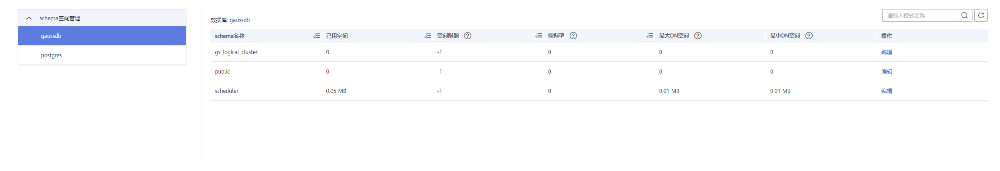
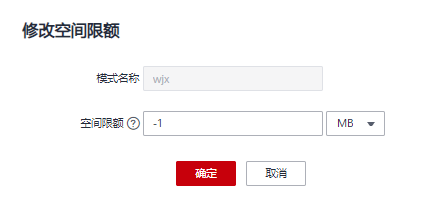

# 空间管理

## 空间管理简介

存储资源无节制的使用可能导致磁盘满，进而导致集群异常、业务中断。磁盘满问题具有业务恢复难度大、恢复时间长的特点，通过引入数据库只读，极大概率降低了磁盘满问题的发生，但是数据库只读同样会导致业务中断，影响业务连续性。为解决数据库只读问题，GaussDB\(DWS\)提供了多维度的存储资源管理能力，一方面在schema维度实现了schema空间管理，用于限制schema使用的永久空间大小；一方面在用户维度实现了永久空间、临时空间和算子空间管理，防止单用户业务异常导致数据库只读。

-   schema维度：schema空间管理模块可查询集群下数据库和模式空间信息，并支持修改模式空间总值。
-   用户维度：用户空间管理用于限定不同用户可以使用的空间限额，防止用户使用存储空间过大导致业务执行受阻。GaussDB\(DWS\)通过在创建用户时指定空间大小的方式实现对存储资源的管理，支持管理的存储空间类型包括：
    -   永久表存储空间（PREM SPACE）

        用于限制用户创建的永久表\(非临时表\)占用的空间限额。

    -   临时表存储空间（TEMP SPACE）

        用于限制用户创建的临时表占用的空间限额。

    -   算子落盘空间（SPILL SPACE）

        查询执行过程中，如果实际使用内存大于估算内存，则查询可能产生落盘，我们将这种查询执行过程中落盘占用的存储空间称为算子落盘空间。用户算子落盘空间管理就用于限制用户查询执行过程中算子落盘占用的空间限额。

> **说明：** 
>-   该特性仅8.1.1及以上的集群版本支持。
>-   GaussDB\(DWS\)管控面目前仅支持模式空间管理。

## 操作步骤

1.  登录GaussDB\(DWS\) 管理控制台。
2.  在集群列表中单击需要访问“资源管理”页面的集群名称。
3.  切换至“资源管理”页签。
4.  进入“schema空间管理”模块，单击需要查看的数据库。
5.  在需要修改空间限额模式的所在行操作列，单击“编辑”按钮，修改合适的空间限额。

    

6.  单击“确认”提交。

    

    > **说明：** 
    >-   空间限额仅对普通用户有效，数据库系统管理员用户依然不受限制\(因此当显示已用空间等于空间限额时，真实使用空间可能已超出设置的值\)。
    >-   单DN限额=总限额/DN节点数，所以设置值可能与最终显示值有细微波动。

