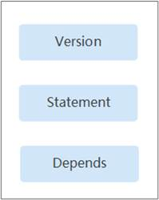

# 策略语法：RBAC<a name="ZH-CN_TOPIC_0000001098816680"></a>

## 策略结构<a name="section16899132910417"></a>

策略结构包括：策略版本号（Version）、策略授权语句（Statement）和策略依赖（Depends）。

**图 1**  RBAC策略结构<a name="fig86683014414"></a>  


## 策略语法<a name="section1590162924117"></a>

给用户组选择策略时，单击策略下方的，可以查看策略的详细内容，以“DWS Administrator”为例，说明RBAC策略的语法。

**图 2**  RBAC策略语法<a name="fig13383143711518"></a>  


```
{
        "Version": "1.0",
        "Statement": [
                {
                        "Effect": "Allow",
                        "Action": [
                                "dws:dws:*"
                        ]
                }
        ],
        "Depends": [
                {
                        "catalog": "BASE",
                        "display_name": "Server Administrator"
                },
                {
                        "catalog": "BASE",
                        "display_name": "Tenant Guest"
                }
        ]
}
```

<a name="table3903162974115"></a>
<table><thead align="left"><tr id="row566730134116"><th class="cellrowborder" colspan="2" valign="top" id="mcps1.1.5.1.1"><p id="p166713044114"><a name="p166713044114"></a><a name="p166713044114"></a>参数</p>
</th>
<th class="cellrowborder" valign="top" id="mcps1.1.5.1.2"><p id="p967133084118"><a name="p967133084118"></a><a name="p967133084118"></a>含义</p>
</th>
<th class="cellrowborder" valign="top" id="mcps1.1.5.1.3"><p id="p1167230174111"><a name="p1167230174111"></a><a name="p1167230174111"></a>值</p>
</th>
</tr>
</thead>
<tbody><tr id="row7674301419"><td class="cellrowborder" colspan="2" valign="top" headers="mcps1.1.5.1.1 "><p id="p166711303412"><a name="p166711303412"></a><a name="p166711303412"></a>Version</p>
</td>
<td class="cellrowborder" valign="top" headers="mcps1.1.5.1.2 "><p id="p467430154112"><a name="p467430154112"></a><a name="p467430154112"></a>策略的版本</p>
</td>
<td class="cellrowborder" valign="top" headers="mcps1.1.5.1.3 "><p id="p96713016412"><a name="p96713016412"></a><a name="p96713016412"></a>固定为“1.0”</p>
</td>
</tr>
<tr id="row11671330204110"><td class="cellrowborder" rowspan="2" valign="top" width="17.17171717171717%" headers="mcps1.1.5.1.1 "><p id="p76763034113"><a name="p76763034113"></a><a name="p76763034113"></a>Statement</p>
</td>
<td class="cellrowborder" valign="top" width="17.17171717171717%" headers="mcps1.1.5.1.1 "><p id="p10671730184110"><a name="p10671730184110"></a><a name="p10671730184110"></a>Action</p>
</td>
<td class="cellrowborder" valign="top" width="28.28282828282828%" headers="mcps1.1.5.1.2 "><p id="p166818306418"><a name="p166818306418"></a><a name="p166818306418"></a>定义对GaussDB(DWS) 的具体操作。</p>
</td>
<td class="cellrowborder" valign="top" width="37.37373737373737%" headers="mcps1.1.5.1.3 "><p id="p26833014419"><a name="p26833014419"></a><a name="p26833014419"></a>格式为：服务名:资源类型:操作</p>
<p id="p146833094114"><a name="p146833094114"></a><a name="p146833094114"></a>"dws:dws:*"，表示对GaussDB(DWS) 的所有操作，其中dws为服务名称；“*”为通配符，表示对所有GaussDB(DWS) 的资源类型可以执行所有操作。</p>
</td>
</tr>
<tr id="row868173017418"><td class="cellrowborder" valign="top" headers="mcps1.1.5.1.1 "><p id="p76873044115"><a name="p76873044115"></a><a name="p76873044115"></a>Effect</p>
</td>
<td class="cellrowborder" valign="top" headers="mcps1.1.5.1.1 "><p id="p16681830134113"><a name="p16681830134113"></a><a name="p16681830134113"></a>定义Action中所包含的具体操作是否允许执行。</p>
</td>
<td class="cellrowborder" valign="top" headers="mcps1.1.5.1.2 "><a name="ul468830144114"></a><a name="ul468830144114"></a><ul id="ul468830144114"><li>Allow：允许执行。</li><li>Deny：不允许执行。</li></ul>
</td>
</tr>
<tr id="row1681030114110"><td class="cellrowborder" rowspan="2" valign="top" width="17.17171717171717%" headers="mcps1.1.5.1.1 "><p id="p36813024112"><a name="p36813024112"></a><a name="p36813024112"></a>Depends</p>
</td>
<td class="cellrowborder" valign="top" width="17.17171717171717%" headers="mcps1.1.5.1.1 "><p id="p568103017417"><a name="p568103017417"></a><a name="p568103017417"></a>catalog</p>
</td>
<td class="cellrowborder" valign="top" width="28.28282828282828%" headers="mcps1.1.5.1.2 "><p id="p166883020415"><a name="p166883020415"></a><a name="p166883020415"></a>依赖的其他策略的所属目录。</p>
</td>
<td class="cellrowborder" valign="top" width="37.37373737373737%" headers="mcps1.1.5.1.3 "><p id="p66993044118"><a name="p66993044118"></a><a name="p66993044118"></a>服务名称</p>
<p id="p136913074119"><a name="p136913074119"></a><a name="p136913074119"></a>例如：BASE</p>
</td>
</tr>
<tr id="row1969123084116"><td class="cellrowborder" valign="top" headers="mcps1.1.5.1.1 "><p id="p1669130104118"><a name="p1669130104118"></a><a name="p1669130104118"></a>display_name</p>
</td>
<td class="cellrowborder" valign="top" headers="mcps1.1.5.1.1 "><p id="p1691430134118"><a name="p1691430134118"></a><a name="p1691430134118"></a>依赖的其他权限的名称。</p>
</td>
<td class="cellrowborder" valign="top" headers="mcps1.1.5.1.2 "><p id="p569203014118"><a name="p569203014118"></a><a name="p569203014118"></a>权限名称</p>
<p id="p121171413417"><a name="p121171413417"></a><a name="p121171413417"></a>例如：Server Administrator</p>
</td>
</tr>
</tbody>
</table>

> **说明：** 
>在使用RBAC鉴权时要注意Depends参数，使用时要把依赖的其他权限同时授予。
>例如DWS Administrator权限使用时依赖Server Administrator以及Tenant Guest，在给用户授权时要同时把依赖的两个权限授予用户。

