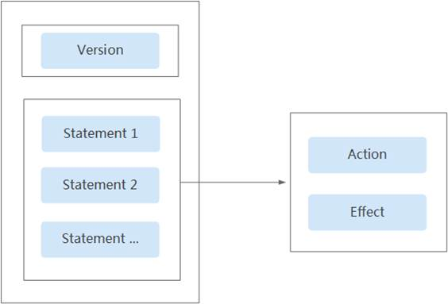
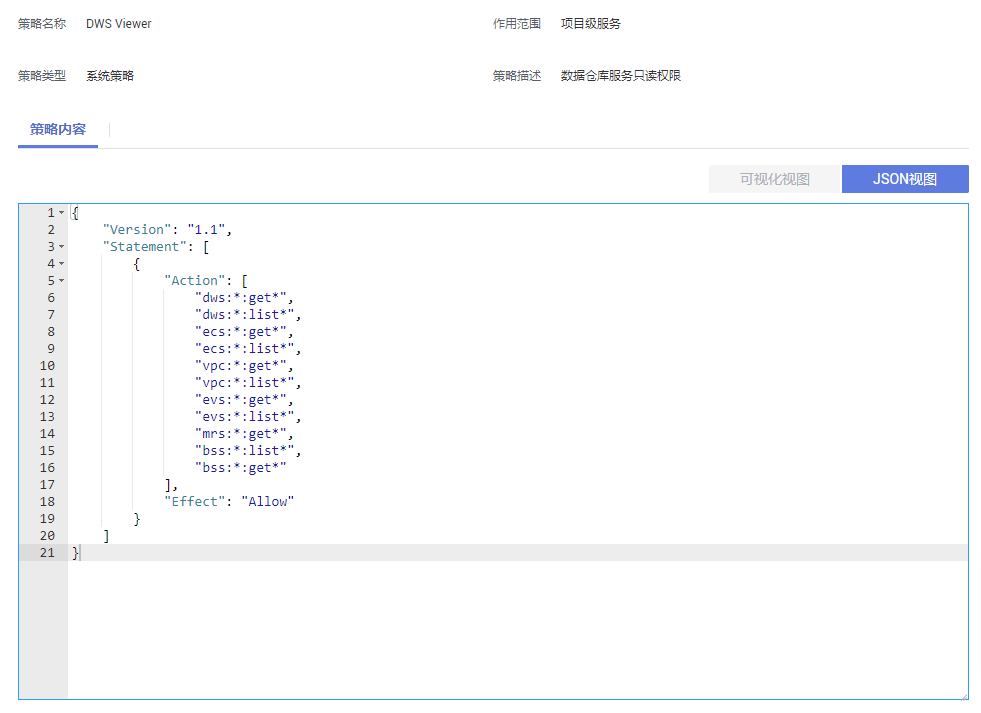
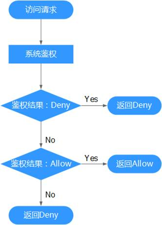

# 策略语法：细粒度策略<a name="ZH-CN_TOPIC_0000001405476942"></a>

在实际业务中，您可能需要给不同角色的用户授予不同的资源操作权限。IAM服务为用户提供了细粒度访问控制功能。在IAM中，IAM管理员用户（即属于admin用户组的用户）通过创建自定义策略，可以自由搭配需要授予的权限集。通过给用户组授予策略，用户组中的用户就能获得策略中定义的权限。IAM通过策略定义的权限内容实现精细的权限管理。

为了更精细地控制GaussDB\(DWS\) 资源的使用权限，您可以使用IAM的用户管理功能，实现细粒度权限控制，授予不同角色的用户不同的资源操作权限。

## 策略结构<a name="section19213979419"></a>

策略结构包括：Version（策略版本号）和Statement（策略权限语句），其中Statement可以有多个，表示不同的授权项。

**图 1**  策略结构<a name="fig19448177184118"></a>  


## 策略语法<a name="section321719715411"></a>

在IAM左侧导航窗格中，单击“策略“，单击策略名称，可以查看策略的详细内容，以“DWS ReadOnlyAccess“为例，说明细粒度策略的语法。

**图 2**  设置策略<a name="fig5104021368"></a>  


```
{
        "Version": "1.1",
        "Statement": [
                {
                        "Effect": "Allow",
                        "Action": [
                                "dws:*:get*",
                                "dws:*:list*",
                                "ecs:*:get*",
                                "ecs:*:list*",
                                "vpc:*:get*",
                                "vpc:*:list*",
                                "evs:*:get*",
                                "evs:*:list*",
                                "mrs:*:get*",
                                "bss:*:list*",
                                "bss:*:get*"
                        ]
                }
        ]
}
```

-   Version：标识策略的版本号，主要用于区分Role-Based Access Control（RBAC）策略和细粒度策略。
    -   1.0：RBAC策略。RBAC策略是将服务作为一个整体进行授权，授权后，用户可以拥有这个服务的所有权限。
    -   1.1：细粒度策略。相比RBAC策略，细粒度策略基于服务的API接口进行权限拆分，授权更加精细。授权后，用户可以对这个服务执行特定的操作。细粒度策略包括系统预置和用户自定义两种。

-   Statement：策略授权语句，描述策略的详细信息，包含Effect（作用）和Action（授权项）。
    -   Effect（作用）

        作用包含两种：Allow（允许）和Deny（Deny），系统预置策略仅包含允许的授权语句，自定义策略中可以同时包含允许和拒绝的授权语句，当策略中既有允许又有拒绝的授权语句时，遵循Deny优先的原则。

    -   Action（授权项）

        对资源的具体操作权限，格式为：服务名:资源类型:操作，支持单个或多个操作权限，支持通配符号\*，通配符号表示所有。

        示例："dws:cluster:create"，其中dws为服务名，cluster为资源类型，create为操作，该授权项表示创建GaussDB\(DWS\) 集群的权限。


## 授权项列表<a name="section89181381475"></a>

在IAM中创建自定义策略时，您可以根据需求在策略授权语句的Action列表中添加GaussDB\(DWS\) 资源操作或REST API所对应的“授权项”，使得该策略具有相应的操作权限。GaussDB\(DWS\) 细粒度策略的授权项列表如下：

-   **REST API**

    GaussDB\(DWS\)  REST API的授权项列表，请参见[权限策略和授权项](https://support.huaweicloud.com/api-dws/dws_02_0056.html)。

-   **管理控制台操作**

    GaussDB\(DWS\) 资源操作及对应的授权项如[表1](#table42061239124614)所示。

    > **说明：** 
    >GaussDB\(DWS\)部分授权项依赖的授权项包括了ECS、VPC、EVS、ELB、MRS或OBS等服务的授权项，如果这些服务没有对接相应的服务授权项，则需要添加对应服务的Admin系统权限。


**表 1**  GaussDB\(DWS\) 资源操作授权项列表

<a name="table42061239124614"></a>
<table><thead align="left"><tr id="row126809551465"><th class="cellrowborder" valign="top" width="22.56%" id="mcps1.2.5.1.1"><p id="p6682105517467"><a name="p6682105517467"></a><a name="p6682105517467"></a>GaussDB(DWS) 资源操作</p>
</th>
<th class="cellrowborder" valign="top" width="31.480000000000004%" id="mcps1.2.5.1.2"><p id="p1568215520468"><a name="p1568215520468"></a><a name="p1568215520468"></a>授权项</p>
</th>
<th class="cellrowborder" valign="top" width="26.56%" id="mcps1.2.5.1.3"><p id="p19816133712378"><a name="p19816133712378"></a><a name="p19816133712378"></a>依赖的授权项</p>
</th>
<th class="cellrowborder" valign="top" width="19.400000000000002%" id="mcps1.2.5.1.4"><p id="p29118351780"><a name="p29118351780"></a><a name="p29118351780"></a>授权项作用域</p>
</th>
</tr>
</thead>
<tbody><tr id="row1251733919468"><td class="cellrowborder" valign="top" width="22.56%" headers="mcps1.2.5.1.1 "><p id="p1951710394465"><a name="p1951710394465"></a><a name="p1951710394465"></a>创建集群</p>
</td>
<td class="cellrowborder" valign="top" width="31.480000000000004%" headers="mcps1.2.5.1.2 "><p id="p251773918465"><a name="p251773918465"></a><a name="p251773918465"></a>"dws:cluster:create"</p>
</td>
<td class="cellrowborder" valign="top" width="26.56%" headers="mcps1.2.5.1.3 "><p id="p18466195820403"><a name="p18466195820403"></a><a name="p18466195820403"></a>"dws:*:get*",</p>
<p id="p124661058174012"><a name="p124661058174012"></a><a name="p124661058174012"></a>"dws:*:list*",</p>
<p id="p446655811403"><a name="p446655811403"></a><a name="p446655811403"></a>"ecs:*:get*",</p>
<p id="p174662585409"><a name="p174662585409"></a><a name="p174662585409"></a>"ecs:*:list*",</p>
<p id="p5437182411460"><a name="p5437182411460"></a><a name="p5437182411460"></a>"ecs:*:create*",</p>
<p id="p8466458154015"><a name="p8466458154015"></a><a name="p8466458154015"></a>"vpc:*:get*",</p>
<p id="p846605874012"><a name="p846605874012"></a><a name="p846605874012"></a>"vpc:*:list*",</p>
<p id="p175636481462"><a name="p175636481462"></a><a name="p175636481462"></a>"vpc:*:create*",</p>
<p id="p83335221049"><a name="p83335221049"></a><a name="p83335221049"></a>"vpc:securityGroupRules:delete",</p>
<p id="p744160113411"><a name="p744160113411"></a><a name="p744160113411"></a>"vpc:ports:update",</p>
<p id="p9466155818405"><a name="p9466155818405"></a><a name="p9466155818405"></a>"evs:*:get*",</p>
<p id="p746625854020"><a name="p746625854020"></a><a name="p746625854020"></a>"evs:*:list*",</p>
<p id="p11641633174712"><a name="p11641633174712"></a><a name="p11641633174712"></a>"evs:*:create*",</p>
</td>
<td class="cellrowborder" valign="top" width="19.400000000000002%" headers="mcps1.2.5.1.4 "><a name="ul256051910917"></a><a name="ul256051910917"></a><ul id="ul256051910917"><li>支持：<a name="ul116171620113612"></a><a name="ul116171620113612"></a><ul id="ul116171620113612"><li>项目(Project)</li><li>企业项目(Enterprise Project)</li></ul>
</li></ul>
</td>
</tr>
<tr id="row66381515377"><td class="cellrowborder" valign="top" width="22.56%" headers="mcps1.2.5.1.1 "><p id="p1664915153712"><a name="p1664915153712"></a><a name="p1664915153712"></a>获取集群列表</p>
</td>
<td class="cellrowborder" valign="top" width="31.480000000000004%" headers="mcps1.2.5.1.2 "><p id="p1337420187387"><a name="p1337420187387"></a><a name="p1337420187387"></a>"dws:cluster:list"</p>
</td>
<td class="cellrowborder" valign="top" width="26.56%" headers="mcps1.2.5.1.3 "><p id="p1585518082516"><a name="p1585518082516"></a><a name="p1585518082516"></a>--</p>
</td>
<td class="cellrowborder" valign="top" width="19.400000000000002%" headers="mcps1.2.5.1.4 "><a name="ul59551841194911"></a><a name="ul59551841194911"></a><ul id="ul59551841194911"><li>支持：<a name="ul79551541144912"></a><a name="ul79551541144912"></a><ul id="ul79551541144912"><li>项目(Project)</li><li>企业项目(Enterprise Project)</li></ul>
</li></ul>
</td>
</tr>
<tr id="row3462101724118"><td class="cellrowborder" valign="top" width="22.56%" headers="mcps1.2.5.1.1 "><p id="p2462217134117"><a name="p2462217134117"></a><a name="p2462217134117"></a>获取单个集群详情</p>
</td>
<td class="cellrowborder" valign="top" width="31.480000000000004%" headers="mcps1.2.5.1.2 "><p id="p32111415193917"><a name="p32111415193917"></a><a name="p32111415193917"></a>"dws:cluster:getDetail"</p>
</td>
<td class="cellrowborder" valign="top" width="26.56%" headers="mcps1.2.5.1.3 "><p id="p39402517421"><a name="p39402517421"></a><a name="p39402517421"></a>"dws:*:get*",</p>
<p id="p794010510424"><a name="p794010510424"></a><a name="p794010510424"></a>"dws:*:list*",</p>
<p id="p10634134212418"><a name="p10634134212418"></a><a name="p10634134212418"></a>"vpc:vpcs:list",</p>
<p id="p206341242548"><a name="p206341242548"></a><a name="p206341242548"></a>"vpc:securityGroups:get"</p>
</td>
<td class="cellrowborder" valign="top" width="19.400000000000002%" headers="mcps1.2.5.1.4 "><a name="ul185353433497"></a><a name="ul185353433497"></a><ul id="ul185353433497"><li>支持：<a name="ul125351643194910"></a><a name="ul125351643194910"></a><ul id="ul125351643194910"><li>项目(Project)</li><li>企业项目(Enterprise Project)</li></ul>
</li></ul>
</td>
</tr>
<tr id="row17517439134615"><td class="cellrowborder" valign="top" width="22.56%" headers="mcps1.2.5.1.1 "><p id="p1051710394469"><a name="p1051710394469"></a><a name="p1051710394469"></a>设置自动快照</p>
</td>
<td class="cellrowborder" valign="top" width="31.480000000000004%" headers="mcps1.2.5.1.2 "><p id="p951715398468"><a name="p951715398468"></a><a name="p951715398468"></a>"dws:cluster:setAutomatedSnapshot"</p>
</td>
<td class="cellrowborder" valign="top" width="26.56%" headers="mcps1.2.5.1.3 "><p id="p1857671614216"><a name="p1857671614216"></a><a name="p1857671614216"></a>"dws:backupPolicy:list"</p>
</td>
<td class="cellrowborder" valign="top" width="19.400000000000002%" headers="mcps1.2.5.1.4 "><a name="ul4837194617495"></a><a name="ul4837194617495"></a><ul id="ul4837194617495"><li>支持：<a name="ul158371946144910"></a><a name="ul158371946144910"></a><ul id="ul158371946144910"><li>项目(Project)</li><li>企业项目(Enterprise Project)</li></ul>
</li></ul>
</td>
</tr>
<tr id="row65171439164611"><td class="cellrowborder" valign="top" width="22.56%" headers="mcps1.2.5.1.1 "><p id="p651703920469"><a name="p651703920469"></a><a name="p651703920469"></a>设置安全参数/参数组</p>
</td>
<td class="cellrowborder" valign="top" width="31.480000000000004%" headers="mcps1.2.5.1.2 "><p id="p451733910466"><a name="p451733910466"></a><a name="p451733910466"></a>"dws:cluster:setSecuritySettings"</p>
</td>
<td class="cellrowborder" valign="top" width="26.56%" headers="mcps1.2.5.1.3 "><p id="p141711925154215"><a name="p141711925154215"></a><a name="p141711925154215"></a>"dws:*:get*",</p>
<p id="p51711250428"><a name="p51711250428"></a><a name="p51711250428"></a>"dws:*:list*",</p>
</td>
<td class="cellrowborder" valign="top" width="19.400000000000002%" headers="mcps1.2.5.1.4 "><a name="ul6124749134914"></a><a name="ul6124749134914"></a><ul id="ul6124749134914"><li>支持：<a name="ul412417497499"></a><a name="ul412417497499"></a><ul id="ul412417497499"><li>项目(Project)</li><li>企业项目(Enterprise Project)</li></ul>
</li></ul>
</td>
</tr>
<tr id="row251718395468"><td class="cellrowborder" valign="top" width="22.56%" headers="mcps1.2.5.1.1 "><p id="p9517639154610"><a name="p9517639154610"></a><a name="p9517639154610"></a>重启集群</p>
</td>
<td class="cellrowborder" valign="top" width="31.480000000000004%" headers="mcps1.2.5.1.2 "><p id="p18517639104615"><a name="p18517639104615"></a><a name="p18517639104615"></a>"dws:cluster:restart"</p>
</td>
<td class="cellrowborder" valign="top" width="26.56%" headers="mcps1.2.5.1.3 "><p id="p15218633184217"><a name="p15218633184217"></a><a name="p15218633184217"></a>"dws:*:get*",</p>
<p id="p721815339423"><a name="p721815339423"></a><a name="p721815339423"></a>"dws:*:list*",</p>
</td>
<td class="cellrowborder" valign="top" width="19.400000000000002%" headers="mcps1.2.5.1.4 "><a name="ul142518516492"></a><a name="ul142518516492"></a><ul id="ul142518516492"><li>支持：<a name="ul62615134919"></a><a name="ul62615134919"></a><ul id="ul62615134919"><li>项目(Project)</li><li>企业项目(Enterprise Project)</li></ul>
</li></ul>
</td>
</tr>
<tr id="row15517143911462"><td class="cellrowborder" valign="top" width="22.56%" headers="mcps1.2.5.1.1 "><p id="p451710393460"><a name="p451710393460"></a><a name="p451710393460"></a>扩容集群</p>
</td>
<td class="cellrowborder" valign="top" width="31.480000000000004%" headers="mcps1.2.5.1.2 "><p id="p14517183912467"><a name="p14517183912467"></a><a name="p14517183912467"></a>"dws:cluster:scaleOut"</p>
</td>
<td class="cellrowborder" valign="top" width="26.56%" headers="mcps1.2.5.1.3 "><p id="p1949819717431"><a name="p1949819717431"></a><a name="p1949819717431"></a>"dws:*:get*",</p>
<p id="p24981571437"><a name="p24981571437"></a><a name="p24981571437"></a>"dws:*:list*",</p>
<p id="p15946140165110"><a name="p15946140165110"></a><a name="p15946140165110"></a>"dws:cluster:scaleOutOrOpenAPIResize",</p>
<p id="p1498273439"><a name="p1498273439"></a><a name="p1498273439"></a>"ecs:*:get*",</p>
<p id="p94988764311"><a name="p94988764311"></a><a name="p94988764311"></a>"ecs:*:list*",</p>
<p id="p16416112665110"><a name="p16416112665110"></a><a name="p16416112665110"></a>"ecs:*:create*",</p>
<p id="p84983716432"><a name="p84983716432"></a><a name="p84983716432"></a>"vpc:*:get*",</p>
<p id="p849867174316"><a name="p849867174316"></a><a name="p849867174316"></a>"vpc:*:list*",</p>
<p id="p889573435111"><a name="p889573435111"></a><a name="p889573435111"></a>"vpc:*:create*",</p>
<p id="p432614618598"><a name="p432614618598"></a><a name="p432614618598"></a>"vpc:*:update*",</p>
<p id="p1049815714316"><a name="p1049815714316"></a><a name="p1049815714316"></a>"evs:*:get*",</p>
<p id="p16498177194313"><a name="p16498177194313"></a><a name="p16498177194313"></a>"evs:*:list*",</p>
<p id="p8586174419515"><a name="p8586174419515"></a><a name="p8586174419515"></a>"evs:*:create*",</p>
</td>
<td class="cellrowborder" valign="top" width="19.400000000000002%" headers="mcps1.2.5.1.4 "><a name="ul63713520492"></a><a name="ul63713520492"></a><ul id="ul63713520492"><li>支持：<a name="ul1372155215493"></a><a name="ul1372155215493"></a><ul id="ul1372155215493"><li>项目(Project)</li><li>企业项目(Enterprise Project)</li></ul>
</li></ul>
</td>
</tr>
<tr id="row12802102424413"><td class="cellrowborder" valign="top" width="22.56%" headers="mcps1.2.5.1.1 "><p id="p177041043145115"><a name="p177041043145115"></a><a name="p177041043145115"></a>使用API扩容集群或调整大小</p>
</td>
<td class="cellrowborder" valign="top" width="31.480000000000004%" headers="mcps1.2.5.1.2 "><p id="p48031124174418"><a name="p48031124174418"></a><a name="p48031124174418"></a>"dws:cluster:scaleOutOrOpenAPIResize"</p>
</td>
<td class="cellrowborder" valign="top" width="26.56%" headers="mcps1.2.5.1.3 "><p id="p13992162012524"><a name="p13992162012524"></a><a name="p13992162012524"></a>"dws:*:get*",</p>
<p id="p7992162025213"><a name="p7992162025213"></a><a name="p7992162025213"></a>"dws:*:list*",</p>
<p id="p19992172005219"><a name="p19992172005219"></a><a name="p19992172005219"></a>"vpc:vpcs:list",</p>
<p id="p199202045211"><a name="p199202045211"></a><a name="p199202045211"></a>"vpc:ports:create",</p>
<p id="p799242065220"><a name="p799242065220"></a><a name="p799242065220"></a>"vpc:ports:get",</p>
<p id="p20992192013523"><a name="p20992192013523"></a><a name="p20992192013523"></a>"vpc:ports:update",</p>
<p id="p1399232055216"><a name="p1399232055216"></a><a name="p1399232055216"></a>"vpc:subnets:get",</p>
<p id="p79921220165218"><a name="p79921220165218"></a><a name="p79921220165218"></a>"vpc:subnets:update",</p>
<p id="p899272012523"><a name="p899272012523"></a><a name="p899272012523"></a>"vpc:subnets:create",</p>
<p id="p159921420195212"><a name="p159921420195212"></a><a name="p159921420195212"></a>"vpc:routers:get",</p>
<p id="p169929201526"><a name="p169929201526"></a><a name="p169929201526"></a>"vpc:routers:update",</p>
<p id="p1799272045216"><a name="p1799272045216"></a><a name="p1799272045216"></a>"vpc:networks:create",</p>
<p id="p4992142085218"><a name="p4992142085218"></a><a name="p4992142085218"></a>"vpc:networks:get",</p>
<p id="p149921220135216"><a name="p149921220135216"></a><a name="p149921220135216"></a>"vpc:networks:update",</p>
<p id="p9992182015212"><a name="p9992182015212"></a><a name="p9992182015212"></a>"ecs:serverInterfaces:use",</p>
<p id="p299292019525"><a name="p299292019525"></a><a name="p299292019525"></a>"ecs:serverInterfaces:get",</p>
<p id="p12992152035218"><a name="p12992152035218"></a><a name="p12992152035218"></a>"ecs:cloudServerFlavors:get"</p>
</td>
<td class="cellrowborder" valign="top" width="19.400000000000002%" headers="mcps1.2.5.1.4 "><a name="ul1423082665217"></a><a name="ul1423082665217"></a><ul id="ul1423082665217"><li>支持：<a name="ul122301626125210"></a><a name="ul122301626125210"></a><ul id="ul122301626125210"><li>项目(Project)</li><li>企业项目(Enterprise Project)</li></ul>
</li></ul>
</td>
</tr>
<tr id="row19517193934617"><td class="cellrowborder" valign="top" width="22.56%" headers="mcps1.2.5.1.1 "><p id="p4517173917468"><a name="p4517173917468"></a><a name="p4517173917468"></a>重置密码</p>
</td>
<td class="cellrowborder" valign="top" width="31.480000000000004%" headers="mcps1.2.5.1.2 "><p id="p1751703919469"><a name="p1751703919469"></a><a name="p1751703919469"></a>"dws:cluster:resetPassword"</p>
</td>
<td class="cellrowborder" valign="top" width="26.56%" headers="mcps1.2.5.1.3 "><p id="p1664710159444"><a name="p1664710159444"></a><a name="p1664710159444"></a>"dws:*:get*",</p>
<p id="p6647121524416"><a name="p6647121524416"></a><a name="p6647121524416"></a>"dws:*:list*",</p>
</td>
<td class="cellrowborder" valign="top" width="19.400000000000002%" headers="mcps1.2.5.1.4 "><a name="ul1150035714492"></a><a name="ul1150035714492"></a><ul id="ul1150035714492"><li>支持：<a name="ul750045714493"></a><a name="ul750045714493"></a><ul id="ul750045714493"><li>项目(Project)</li><li>企业项目(Enterprise Project)</li></ul>
</li></ul>
</td>
</tr>
<tr id="row15171539134619"><td class="cellrowborder" valign="top" width="22.56%" headers="mcps1.2.5.1.1 "><p id="p13517123912467"><a name="p13517123912467"></a><a name="p13517123912467"></a>删除集群</p>
</td>
<td class="cellrowborder" valign="top" width="31.480000000000004%" headers="mcps1.2.5.1.2 "><p id="p5517163913466"><a name="p5517163913466"></a><a name="p5517163913466"></a>"dws:cluster:delete"</p>
</td>
<td class="cellrowborder" valign="top" width="26.56%" headers="mcps1.2.5.1.3 "><p id="p11694149154715"><a name="p11694149154715"></a><a name="p11694149154715"></a>"dws:*:get*",</p>
<p id="p186945495478"><a name="p186945495478"></a><a name="p186945495478"></a>"dws:*:list*",</p>
<p id="p369415495472"><a name="p369415495472"></a><a name="p369415495472"></a>"ecs:*:get*",</p>
<p id="p10694249174712"><a name="p10694249174712"></a><a name="p10694249174712"></a>"ecs:*:list*",</p>
<p id="p124571814125813"><a name="p124571814125813"></a><a name="p124571814125813"></a>"ecs:*:delete*",</p>
<p id="p1169411493474"><a name="p1169411493474"></a><a name="p1169411493474"></a>"vpc:*:get*",</p>
<p id="p6694164915478"><a name="p6694164915478"></a><a name="p6694164915478"></a>"vpc:*:list*",</p>
<p id="p1810913316580"><a name="p1810913316580"></a><a name="p1810913316580"></a>"vpc:*:delete*",</p>
<p id="p12694124984715"><a name="p12694124984715"></a><a name="p12694124984715"></a>"evs:*:get*",</p>
<p id="p4694949194716"><a name="p4694949194716"></a><a name="p4694949194716"></a>"evs:*:list*",</p>
<p id="p522917717592"><a name="p522917717592"></a><a name="p522917717592"></a>"evs:*:delete*",</p>
</td>
<td class="cellrowborder" valign="top" width="19.400000000000002%" headers="mcps1.2.5.1.4 "><a name="ul1791612175018"></a><a name="ul1791612175018"></a><ul id="ul1791612175018"><li>支持：<a name="ul891681175012"></a><a name="ul891681175012"></a><ul id="ul891681175012"><li>项目(Project)</li><li>企业项目(Enterprise Project)</li></ul>
</li></ul>
</td>
</tr>
<tr id="row15517339114613"><td class="cellrowborder" valign="top" width="22.56%" headers="mcps1.2.5.1.1 "><p id="p1551763904612"><a name="p1551763904612"></a><a name="p1551763904612"></a>设置可维护时间段</p>
</td>
<td class="cellrowborder" valign="top" width="31.480000000000004%" headers="mcps1.2.5.1.2 "><p id="p17517183954617"><a name="p17517183954617"></a><a name="p17517183954617"></a>"dws:cluster:setMaintainceWindow"</p>
</td>
<td class="cellrowborder" valign="top" width="26.56%" headers="mcps1.2.5.1.3 "><p id="p1272392440"><a name="p1272392440"></a><a name="p1272392440"></a>"dws:*:get*",</p>
<p id="p17271539194415"><a name="p17271539194415"></a><a name="p17271539194415"></a>"dws:*:list*",</p>
</td>
<td class="cellrowborder" valign="top" width="19.400000000000002%" headers="mcps1.2.5.1.4 "><a name="ul192601942507"></a><a name="ul192601942507"></a><ul id="ul192601942507"><li>支持：<a name="ul13260134115011"></a><a name="ul13260134115011"></a><ul id="ul13260134115011"><li>项目(Project)</li><li>企业项目(Enterprise Project)</li></ul>
</li></ul>
</td>
</tr>
<tr id="row451733964610"><td class="cellrowborder" valign="top" width="22.56%" headers="mcps1.2.5.1.1 "><p id="p6517173919466"><a name="p6517173919466"></a><a name="p6517173919466"></a>绑定EIP</p>
</td>
<td class="cellrowborder" valign="top" width="31.480000000000004%" headers="mcps1.2.5.1.2 "><p id="p15179392462"><a name="p15179392462"></a><a name="p15179392462"></a>"dws:eip:operate"</p>
</td>
<td class="cellrowborder" valign="top" width="26.56%" headers="mcps1.2.5.1.3 "><p id="p17401124204418"><a name="p17401124204418"></a><a name="p17401124204418"></a>"dws:*:get*",</p>
<p id="p5401124220447"><a name="p5401124220447"></a><a name="p5401124220447"></a>"dws:*:list*",</p>
<p id="p640614418186"><a name="p640614418186"></a><a name="p640614418186"></a>"eip:*:get*",</p>
<p id="p64061448184"><a name="p64061448184"></a><a name="p64061448184"></a>"eip:*:list*"</p>
</td>
<td class="cellrowborder" valign="top" width="19.400000000000002%" headers="mcps1.2.5.1.4 "><a name="ul118106135015"></a><a name="ul118106135015"></a><ul id="ul118106135015"><li>支持：<a name="ul1418116125017"></a><a name="ul1418116125017"></a><ul id="ul1418116125017"><li>项目(Project)</li><li>企业项目(Enterprise Project)</li></ul>
</li></ul>
</td>
</tr>
<tr id="row10517173919460"><td class="cellrowborder" valign="top" width="22.56%" headers="mcps1.2.5.1.1 "><p id="p2051763964619"><a name="p2051763964619"></a><a name="p2051763964619"></a>解绑EIP</p>
</td>
<td class="cellrowborder" valign="top" width="31.480000000000004%" headers="mcps1.2.5.1.2 "><p id="p20517183974617"><a name="p20517183974617"></a><a name="p20517183974617"></a>"dws:eip:operate"</p>
</td>
<td class="cellrowborder" valign="top" width="26.56%" headers="mcps1.2.5.1.3 "><p id="p3468174674411"><a name="p3468174674411"></a><a name="p3468174674411"></a>"dws:*:get*",</p>
<p id="p446864674412"><a name="p446864674412"></a><a name="p446864674412"></a>"dws:*:list*",</p>
<p id="p14586104519183"><a name="p14586104519183"></a><a name="p14586104519183"></a>"eip:*:get*",</p>
<p id="p2058634513189"><a name="p2058634513189"></a><a name="p2058634513189"></a>"eip:*:list*"</p>
</td>
<td class="cellrowborder" valign="top" width="19.400000000000002%" headers="mcps1.2.5.1.4 "><a name="ul109106817502"></a><a name="ul109106817502"></a><ul id="ul109106817502"><li>支持：<a name="ul1691018812506"></a><a name="ul1691018812506"></a><ul id="ul1691018812506"><li>项目(Project)</li><li>企业项目(Enterprise Project)</li></ul>
</li></ul>
</td>
</tr>
<tr id="row1851710393464"><td class="cellrowborder" valign="top" width="22.56%" headers="mcps1.2.5.1.1 "><p id="p1851716395462"><a name="p1851716395462"></a><a name="p1851716395462"></a>创建DNS域名</p>
</td>
<td class="cellrowborder" valign="top" width="31.480000000000004%" headers="mcps1.2.5.1.2 "><p id="p65172039164617"><a name="p65172039164617"></a><a name="p65172039164617"></a>"dws:dns:create"</p>
</td>
<td class="cellrowborder" valign="top" width="26.56%" headers="mcps1.2.5.1.3 "><p id="p1175313499443"><a name="p1175313499443"></a><a name="p1175313499443"></a>"dws:*:get*",</p>
<p id="p12753349144416"><a name="p12753349144416"></a><a name="p12753349144416"></a>"dws:*:list*",</p>
</td>
<td class="cellrowborder" valign="top" width="19.400000000000002%" headers="mcps1.2.5.1.4 "><a name="ul8740101065011"></a><a name="ul8740101065011"></a><ul id="ul8740101065011"><li>支持：<a name="ul15740141065016"></a><a name="ul15740141065016"></a><ul id="ul15740141065016"><li>项目(Project)</li><li>企业项目(Enterprise Project)</li></ul>
</li></ul>
</td>
</tr>
<tr id="row12517143964618"><td class="cellrowborder" valign="top" width="22.56%" headers="mcps1.2.5.1.1 "><p id="p5517439164619"><a name="p5517439164619"></a><a name="p5517439164619"></a>释放DNS域名</p>
</td>
<td class="cellrowborder" valign="top" width="31.480000000000004%" headers="mcps1.2.5.1.2 "><p id="p65191439194611"><a name="p65191439194611"></a><a name="p65191439194611"></a>"dws:dns:release"</p>
</td>
<td class="cellrowborder" valign="top" width="26.56%" headers="mcps1.2.5.1.3 "><p id="p583855364415"><a name="p583855364415"></a><a name="p583855364415"></a>"dws:*:get*",</p>
<p id="p178381253174410"><a name="p178381253174410"></a><a name="p178381253174410"></a>"dws:*:list*",</p>
</td>
<td class="cellrowborder" valign="top" width="19.400000000000002%" headers="mcps1.2.5.1.4 "><a name="ul1214511345013"></a><a name="ul1214511345013"></a><ul id="ul1214511345013"><li>支持：<a name="ul111451713185010"></a><a name="ul111451713185010"></a><ul id="ul111451713185010"><li>项目(Project)</li><li>企业项目(Enterprise Project)</li></ul>
</li></ul>
</td>
</tr>
<tr id="row851903916463"><td class="cellrowborder" valign="top" width="22.56%" headers="mcps1.2.5.1.1 "><p id="p135191739104613"><a name="p135191739104613"></a><a name="p135191739104613"></a>修改DNS域名</p>
</td>
<td class="cellrowborder" valign="top" width="31.480000000000004%" headers="mcps1.2.5.1.2 "><p id="p2519139114618"><a name="p2519139114618"></a><a name="p2519139114618"></a>"dws:dns:edit"</p>
</td>
<td class="cellrowborder" valign="top" width="26.56%" headers="mcps1.2.5.1.3 "><p id="p915917575448"><a name="p915917575448"></a><a name="p915917575448"></a>"dws:*:get*",</p>
<p id="p21594579449"><a name="p21594579449"></a><a name="p21594579449"></a>"dws:*:list*",</p>
<p id="p518864918264"><a name="p518864918264"></a><a name="p518864918264"></a></p>
</td>
<td class="cellrowborder" valign="top" width="19.400000000000002%" headers="mcps1.2.5.1.4 "><a name="ul171718159508"></a><a name="ul171718159508"></a><ul id="ul171718159508"><li>支持：<a name="ul91718156508"></a><a name="ul91718156508"></a><ul id="ul91718156508"><li>项目(Project)</li><li>企业项目(Enterprise Project)</li></ul>
</li></ul>
</td>
</tr>
<tr id="row19519133914613"><td class="cellrowborder" valign="top" width="22.56%" headers="mcps1.2.5.1.1 "><p id="p14519133974620"><a name="p14519133974620"></a><a name="p14519133974620"></a>创建MRS连接</p>
</td>
<td class="cellrowborder" valign="top" width="31.480000000000004%" headers="mcps1.2.5.1.2 "><p id="p17519839134612"><a name="p17519839134612"></a><a name="p17519839134612"></a>"dws:MRSConnection:create"</p>
</td>
<td class="cellrowborder" valign="top" width="26.56%" headers="mcps1.2.5.1.3 "><p id="p63537134515"><a name="p63537134515"></a><a name="p63537134515"></a>"dws:*:get*",</p>
<p id="p0353315459"><a name="p0353315459"></a><a name="p0353315459"></a>"dws:*:list*",</p>
<p id="p23429197613"><a name="p23429197613"></a><a name="p23429197613"></a>"mrs:*:get*",</p>
<p id="p33424198618"><a name="p33424198618"></a><a name="p33424198618"></a>"mrs:*:list*",</p>
<p id="p193426191168"><a name="p193426191168"></a><a name="p193426191168"></a>"mrs:cluster:create",</p>
<p id="p1819214338284"><a name="p1819214338284"></a><a name="p1819214338284"></a>"ecs:*:get*",</p>
<p id="p51926336289"><a name="p51926336289"></a><a name="p51926336289"></a>"ecs:*:list*",</p>
<p id="p319233313283"><a name="p319233313283"></a><a name="p319233313283"></a>"ecs:*:create*",</p>
<p id="p119243372811"><a name="p119243372811"></a><a name="p119243372811"></a>"vpc:*:get*",</p>
<p id="p51921733202817"><a name="p51921733202817"></a><a name="p51921733202817"></a>"vpc:*:list*",</p>
<p id="p1919223312815"><a name="p1919223312815"></a><a name="p1919223312815"></a>"vpc:*:create*",</p>
<p id="p161921333182818"><a name="p161921333182818"></a><a name="p161921333182818"></a>"evs:*:get*",</p>
<p id="p14192183313283"><a name="p14192183313283"></a><a name="p14192183313283"></a>"evs:*:list*",</p>
<p id="p16192833182820"><a name="p16192833182820"></a><a name="p16192833182820"></a>"evs:*:create*"</p>
</td>
<td class="cellrowborder" valign="top" width="19.400000000000002%" headers="mcps1.2.5.1.4 "><a name="ul1589631705018"></a><a name="ul1589631705018"></a><ul id="ul1589631705018"><li>支持：<a name="ul148971417115011"></a><a name="ul148971417115011"></a><ul id="ul148971417115011"><li>项目(Project)</li><li>企业项目(Enterprise Project)</li></ul>
</li></ul>
</td>
</tr>
<tr id="row165191739144619"><td class="cellrowborder" valign="top" width="22.56%" headers="mcps1.2.5.1.1 "><p id="p14519183917463"><a name="p14519183917463"></a><a name="p14519183917463"></a>更新MRS连接</p>
</td>
<td class="cellrowborder" valign="top" width="31.480000000000004%" headers="mcps1.2.5.1.2 "><p id="p4519153914614"><a name="p4519153914614"></a><a name="p4519153914614"></a>"dws:MRSConnection:update"</p>
</td>
<td class="cellrowborder" valign="top" width="26.56%" headers="mcps1.2.5.1.3 "><p id="p12506849455"><a name="p12506849455"></a><a name="p12506849455"></a>"dws:*:get*",</p>
<p id="p1150612414459"><a name="p1150612414459"></a><a name="p1150612414459"></a>"dws:*:list*",</p>
<p id="p65531438154512"><a name="p65531438154512"></a><a name="p65531438154512"></a>"mrs:*:get*",</p>
<p id="p755313813459"><a name="p755313813459"></a><a name="p755313813459"></a>"mrs:*:list*",</p>
<p id="p13553103824518"><a name="p13553103824518"></a><a name="p13553103824518"></a>"mrs:cluster:create",</p>
<p id="p13170193872716"><a name="p13170193872716"></a><a name="p13170193872716"></a>"ecs:*:get*",</p>
<p id="p1317073820279"><a name="p1317073820279"></a><a name="p1317073820279"></a>"ecs:*:list*",</p>
<p id="p9170438162715"><a name="p9170438162715"></a><a name="p9170438162715"></a>"ecs:*:create*",</p>
<p id="p3170738102714"><a name="p3170738102714"></a><a name="p3170738102714"></a>"vpc:*:get*",</p>
<p id="p11170143819276"><a name="p11170143819276"></a><a name="p11170143819276"></a>"vpc:*:list*",</p>
<p id="p1617083813270"><a name="p1617083813270"></a><a name="p1617083813270"></a>"vpc:*:create*",</p>
<p id="p81706387276"><a name="p81706387276"></a><a name="p81706387276"></a>"evs:*:get*",</p>
<p id="p8170103882718"><a name="p8170103882718"></a><a name="p8170103882718"></a>"evs:*:list*",</p>
<p id="p181701238172710"><a name="p181701238172710"></a><a name="p181701238172710"></a>"evs:*:create*"</p>
</td>
<td class="cellrowborder" valign="top" width="19.400000000000002%" headers="mcps1.2.5.1.4 "><a name="ul1716141905012"></a><a name="ul1716141905012"></a><ul id="ul1716141905012"><li>支持：<a name="ul11717161920508"></a><a name="ul11717161920508"></a><ul id="ul11717161920508"><li>项目(Project)</li><li>企业项目(Enterprise Project)</li></ul>
</li></ul>
</td>
</tr>
<tr id="row1951914391467"><td class="cellrowborder" valign="top" width="22.56%" headers="mcps1.2.5.1.1 "><p id="p125191539154618"><a name="p125191539154618"></a><a name="p125191539154618"></a>删除MRS连接</p>
</td>
<td class="cellrowborder" valign="top" width="31.480000000000004%" headers="mcps1.2.5.1.2 "><p id="p12519113915465"><a name="p12519113915465"></a><a name="p12519113915465"></a>"dws:MRSConnection:delete"</p>
</td>
<td class="cellrowborder" valign="top" width="26.56%" headers="mcps1.2.5.1.3 "><p id="p83521582455"><a name="p83521582455"></a><a name="p83521582455"></a>"dws:*:get*",</p>
<p id="p13531683451"><a name="p13531683451"></a><a name="p13531683451"></a>"dws:*:list*",</p>
<p id="p114364664518"><a name="p114364664518"></a><a name="p114364664518"></a>"mrs:*:get*",</p>
<p id="p1914310463456"><a name="p1914310463456"></a><a name="p1914310463456"></a>"mrs:*:list*",</p>
<p id="p17167145712611"><a name="p17167145712611"></a><a name="p17167145712611"></a>"mrs:cluster:create"</p>
<p id="p1455554112715"><a name="p1455554112715"></a><a name="p1455554112715"></a>"ecs:*:get*",</p>
<p id="p185551841132717"><a name="p185551841132717"></a><a name="p185551841132717"></a>"ecs:*:list*",</p>
<p id="p14555114110278"><a name="p14555114110278"></a><a name="p14555114110278"></a>"ecs:*:delete*",</p>
<p id="p3555141152718"><a name="p3555141152718"></a><a name="p3555141152718"></a>"vpc:*:get*",</p>
<p id="p1655554116278"><a name="p1655554116278"></a><a name="p1655554116278"></a>"vpc:*:list*",</p>
<p id="p155544110274"><a name="p155544110274"></a><a name="p155544110274"></a>"vpc:*:delete*",</p>
<p id="p185558414273"><a name="p185558414273"></a><a name="p185558414273"></a>"evs:*:get*",</p>
<p id="p355514142712"><a name="p355514142712"></a><a name="p355514142712"></a>"evs:*:list*",</p>
<p id="p15555184111278"><a name="p15555184111278"></a><a name="p15555184111278"></a>"evs:*:delete*",</p>
</td>
<td class="cellrowborder" valign="top" width="19.400000000000002%" headers="mcps1.2.5.1.4 "><a name="ul11249102245014"></a><a name="ul11249102245014"></a><ul id="ul11249102245014"><li>支持：<a name="ul122506225502"></a><a name="ul122506225502"></a><ul id="ul122506225502"><li>项目(Project)</li><li>企业项目(Enterprise Project)</li></ul>
</li></ul>
</td>
</tr>
<tr id="row457319531444"><td class="cellrowborder" valign="top" width="22.56%" headers="mcps1.2.5.1.1 "><p id="p9573953640"><a name="p9573953640"></a><a name="p9573953640"></a>MRS数据源列表</p>
</td>
<td class="cellrowborder" valign="top" width="31.480000000000004%" headers="mcps1.2.5.1.2 "><p id="p1657317531043"><a name="p1657317531043"></a><a name="p1657317531043"></a>"dws:MRSSource:list"</p>
</td>
<td class="cellrowborder" valign="top" width="26.56%" headers="mcps1.2.5.1.3 "><p id="p135748534420"><a name="p135748534420"></a><a name="p135748534420"></a>"mrs:cluster:list",</p>
<p id="p865213151659"><a name="p865213151659"></a><a name="p865213151659"></a>"mrs:tag:listResource",</p>
<p id="p5663620451"><a name="p5663620451"></a><a name="p5663620451"></a>"mrs:tag:list",</p>
<p id="p1022242617517"><a name="p1022242617517"></a><a name="p1022242617517"></a>"dws:*:get*",</p>
<p id="p6448163019517"><a name="p6448163019517"></a><a name="p6448163019517"></a>"dws:*:list*"</p>
</td>
<td class="cellrowborder" valign="top" width="19.400000000000002%" headers="mcps1.2.5.1.4 "><a name="ul7320194119512"></a><a name="ul7320194119512"></a><ul id="ul7320194119512"><li>支持：<a name="ul932017419520"></a><a name="ul932017419520"></a><ul id="ul932017419520"><li>项目(Project)</li><li>企业项目(Enterprise Project)</li></ul>
</li></ul>
</td>
</tr>
<tr id="row951943954612"><td class="cellrowborder" valign="top" width="22.56%" headers="mcps1.2.5.1.1 "><p id="p55191839174618"><a name="p55191839174618"></a><a name="p55191839174618"></a>添加/删除标签</p>
</td>
<td class="cellrowborder" valign="top" width="31.480000000000004%" headers="mcps1.2.5.1.2 "><p id="p175191139194616"><a name="p175191139194616"></a><a name="p175191139194616"></a>"dws:tag:addAndDelete"</p>
</td>
<td class="cellrowborder" valign="top" width="26.56%" headers="mcps1.2.5.1.3 "><p id="p352351194520"><a name="p352351194520"></a><a name="p352351194520"></a>"dws:*:get*",</p>
<p id="p652313117456"><a name="p652313117456"></a><a name="p652313117456"></a>"dws:*:list*",</p>
<p id="p25261216182717"><a name="p25261216182717"></a><a name="p25261216182717"></a>"dws:openAPITag:update",</p>
<p id="p46671428112714"><a name="p46671428112714"></a><a name="p46671428112714"></a>"dws:openAPITag:getResourceTag",</p>
</td>
<td class="cellrowborder" valign="top" width="19.400000000000002%" headers="mcps1.2.5.1.4 "><a name="ul19144624165010"></a><a name="ul19144624165010"></a><ul id="ul19144624165010"><li>支持：<a name="ul3144624195016"></a><a name="ul3144624195016"></a><ul id="ul3144624195016"><li>项目(Project)</li><li>企业项目(Enterprise Project)</li></ul>
</li></ul>
</td>
</tr>
<tr id="row1651993914460"><td class="cellrowborder" valign="top" width="22.56%" headers="mcps1.2.5.1.1 "><p id="p951953984616"><a name="p951953984616"></a><a name="p951953984616"></a>编辑标签</p>
</td>
<td class="cellrowborder" valign="top" width="31.480000000000004%" headers="mcps1.2.5.1.2 "><p id="p125197391461"><a name="p125197391461"></a><a name="p125197391461"></a>"dws:tag:edit"</p>
</td>
<td class="cellrowborder" valign="top" width="26.56%" headers="mcps1.2.5.1.3 "><p id="p13388171594515"><a name="p13388171594515"></a><a name="p13388171594515"></a>"dws:*:get*",</p>
<p id="p153886151456"><a name="p153886151456"></a><a name="p153886151456"></a>"dws:*:list*",</p>
<p id="p982764714280"><a name="p982764714280"></a><a name="p982764714280"></a>"dws:openAPITag:update",</p>
<p id="p282744742819"><a name="p282744742819"></a><a name="p282744742819"></a>"dws:openAPITag:getResourceTag",</p>
</td>
<td class="cellrowborder" valign="top" width="19.400000000000002%" headers="mcps1.2.5.1.4 "><a name="ul165545115502"></a><a name="ul165545115502"></a><ul id="ul165545115502"><li>支持：<a name="ul165519511504"></a><a name="ul165519511504"></a><ul id="ul165519511504"><li>项目(Project)</li><li>企业项目(Enterprise Project)</li></ul>
</li></ul>
</td>
</tr>
<tr id="row1251993924617"><td class="cellrowborder" valign="top" width="22.56%" headers="mcps1.2.5.1.1 "><p id="p551923934612"><a name="p551923934612"></a><a name="p551923934612"></a>创建快照</p>
</td>
<td class="cellrowborder" valign="top" width="31.480000000000004%" headers="mcps1.2.5.1.2 "><p id="p1051910399466"><a name="p1051910399466"></a><a name="p1051910399466"></a>"dws:snapshot:create"</p>
</td>
<td class="cellrowborder" valign="top" width="26.56%" headers="mcps1.2.5.1.3 "><p id="p82031917457"><a name="p82031917457"></a><a name="p82031917457"></a>"dws:*:get*",</p>
<p id="p1520131954515"><a name="p1520131954515"></a><a name="p1520131954515"></a>"dws:*:list*",</p>
</td>
<td class="cellrowborder" valign="top" width="19.400000000000002%" headers="mcps1.2.5.1.4 "><a name="ul7706115315012"></a><a name="ul7706115315012"></a><ul id="ul7706115315012"><li>支持：<a name="ul47069535503"></a><a name="ul47069535503"></a><ul id="ul47069535503"><li>项目(Project)</li><li>企业项目(Enterprise Project)</li></ul>
</li></ul>
</td>
</tr>
<tr id="row16984715449"><td class="cellrowborder" valign="top" width="22.56%" headers="mcps1.2.5.1.1 "><p id="p698519113443"><a name="p698519113443"></a><a name="p698519113443"></a>获取快照列表</p>
</td>
<td class="cellrowborder" valign="top" width="31.480000000000004%" headers="mcps1.2.5.1.2 "><p id="p8756712407"><a name="p8756712407"></a><a name="p8756712407"></a>"dws:snapshot:list"</p>
</td>
<td class="cellrowborder" valign="top" width="26.56%" headers="mcps1.2.5.1.3 "><p id="p13101131534716"><a name="p13101131534716"></a><a name="p13101131534716"></a>--</p>
</td>
<td class="cellrowborder" valign="top" width="19.400000000000002%" headers="mcps1.2.5.1.4 "><a name="ul6881455205019"></a><a name="ul6881455205019"></a><ul id="ul6881455205019"><li>支持：<a name="ul15881145514505"></a><a name="ul15881145514505"></a><ul id="ul15881145514505"><li>项目(Project)</li><li>企业项目(Enterprise Project)</li></ul>
</li></ul>
</td>
</tr>
<tr id="row282551625112"><td class="cellrowborder" valign="top" width="22.56%" headers="mcps1.2.5.1.1 "><p id="p082521618517"><a name="p082521618517"></a><a name="p082521618517"></a>查看单个集群快照列表</p>
</td>
<td class="cellrowborder" valign="top" width="31.480000000000004%" headers="mcps1.2.5.1.2 "><p id="p17825131645111"><a name="p17825131645111"></a><a name="p17825131645111"></a>"dws:clusterSnapshot:list"</p>
</td>
<td class="cellrowborder" valign="top" width="26.56%" headers="mcps1.2.5.1.3 "><p id="p11825616125114"><a name="p11825616125114"></a><a name="p11825616125114"></a>"dws:cluster:list",</p>
<p id="p1089317334291"><a name="p1089317334291"></a><a name="p1089317334291"></a>"dws:openAPICluster:getDetail"</p>
</td>
<td class="cellrowborder" valign="top" width="19.400000000000002%" headers="mcps1.2.5.1.4 "><a name="ul155414955118"></a><a name="ul155414955118"></a><ul id="ul155414955118"><li>支持：<a name="ul2541049155112"></a><a name="ul2541049155112"></a><ul id="ul2541049155112"><li>项目(Project)</li><li>企业项目(Enterprise Project)</li></ul>
</li></ul>
</td>
</tr>
<tr id="row751993994619"><td class="cellrowborder" valign="top" width="22.56%" headers="mcps1.2.5.1.1 "><p id="p751973915466"><a name="p751973915466"></a><a name="p751973915466"></a>删除快照</p>
</td>
<td class="cellrowborder" valign="top" width="31.480000000000004%" headers="mcps1.2.5.1.2 "><p id="p11519173964616"><a name="p11519173964616"></a><a name="p11519173964616"></a>"dws:snapshot:delete"</p>
</td>
<td class="cellrowborder" valign="top" width="26.56%" headers="mcps1.2.5.1.3 "><p id="p242145114716"><a name="p242145114716"></a><a name="p242145114716"></a>"dws:snapshot:list"</p>
</td>
<td class="cellrowborder" valign="top" width="19.400000000000002%" headers="mcps1.2.5.1.4 "><a name="ul6928058105010"></a><a name="ul6928058105010"></a><ul id="ul6928058105010"><li>支持：<a name="ul17928458145014"></a><a name="ul17928458145014"></a><ul id="ul17928458145014"><li>项目(Project)</li><li>企业项目(Enterprise Project)</li></ul>
</li></ul>
</td>
</tr>
<tr id="row1451917394462"><td class="cellrowborder" valign="top" width="22.56%" headers="mcps1.2.5.1.1 "><p id="p18519123915462"><a name="p18519123915462"></a><a name="p18519123915462"></a>复制快照</p>
</td>
<td class="cellrowborder" valign="top" width="31.480000000000004%" headers="mcps1.2.5.1.2 "><p id="p145192039134616"><a name="p145192039134616"></a><a name="p145192039134616"></a>"dws:snapshot:copy"</p>
</td>
<td class="cellrowborder" valign="top" width="26.56%" headers="mcps1.2.5.1.3 "><p id="p131752194713"><a name="p131752194713"></a><a name="p131752194713"></a>"dws:snapshot:list",</p>
<p id="p38802442210"><a name="p38802442210"></a><a name="p38802442210"></a>"dws:snapshot:create"</p>
</td>
<td class="cellrowborder" valign="top" width="19.400000000000002%" headers="mcps1.2.5.1.4 "><a name="ul978660135116"></a><a name="ul978660135116"></a><ul id="ul978660135116"><li>支持：<a name="ul878620145119"></a><a name="ul878620145119"></a><ul id="ul878620145119"><li>项目(Project)</li><li>企业项目(Enterprise Project)</li></ul>
</li></ul>
</td>
</tr>
<tr id="row114527175018"><td class="cellrowborder" valign="top" width="22.56%" headers="mcps1.2.5.1.1 "><p id="p2432775018"><a name="p2432775018"></a><a name="p2432775018"></a>恢复到新集群</p>
</td>
<td class="cellrowborder" valign="top" width="31.480000000000004%" headers="mcps1.2.5.1.2 "><p id="p11552735019"><a name="p11552735019"></a><a name="p11552735019"></a>"dws:cluster:restore"</p>
</td>
<td class="cellrowborder" valign="top" width="26.56%" headers="mcps1.2.5.1.3 "><p id="p433115515113"><a name="p433115515113"></a><a name="p433115515113"></a>"dws:*:get*",</p>
<p id="p113314559513"><a name="p113314559513"></a><a name="p113314559513"></a>"dws:*:list*",</p>
<p id="p5331155512517"><a name="p5331155512517"></a><a name="p5331155512517"></a>"ecs:*:get*",</p>
<p id="p10331135516514"><a name="p10331135516514"></a><a name="p10331135516514"></a>"ecs:*:list*",</p>
<p id="p17331355165111"><a name="p17331355165111"></a><a name="p17331355165111"></a>"ecs:*:create*",</p>
<p id="p12331755185114"><a name="p12331755185114"></a><a name="p12331755185114"></a>"vpc:*:get*",</p>
<p id="p163311755105119"><a name="p163311755105119"></a><a name="p163311755105119"></a>"vpc:*:list*",</p>
<p id="p13331205525115"><a name="p13331205525115"></a><a name="p13331205525115"></a>"vpc:*:create*",</p>
<p id="p83312554510"><a name="p83312554510"></a><a name="p83312554510"></a>"evs:*:get*",</p>
<p id="p63317558512"><a name="p63317558512"></a><a name="p63317558512"></a>"evs:*:list*",</p>
<p id="p123311355125115"><a name="p123311355125115"></a><a name="p123311355125115"></a>"evs:*:create*"</p>
</td>
<td class="cellrowborder" valign="top" width="19.400000000000002%" headers="mcps1.2.5.1.4 "><a name="ul164571659195115"></a><a name="ul164571659195115"></a><ul id="ul164571659195115"><li>支持：<a name="ul245810596511"></a><a name="ul245810596511"></a><ul id="ul245810596511"><li>项目(Project)</li><li>企业项目(Enterprise Project)</li></ul>
</li></ul>
</td>
</tr>
<tr id="row13156112113111"><td class="cellrowborder" valign="top" width="22.56%" headers="mcps1.2.5.1.1 "><p id="p11567214117"><a name="p11567214117"></a><a name="p11567214117"></a>集群调整大小</p>
</td>
<td class="cellrowborder" valign="top" width="31.480000000000004%" headers="mcps1.2.5.1.2 "><p id="p41566216118"><a name="p41566216118"></a><a name="p41566216118"></a>"dws:cluster:resize"</p>
</td>
<td class="cellrowborder" valign="top" width="26.56%" headers="mcps1.2.5.1.3 "><p id="p10788236216"><a name="p10788236216"></a><a name="p10788236216"></a>"dws:*:get*",</p>
<p id="p15781723728"><a name="p15781723728"></a><a name="p15781723728"></a>"dws:*:list*",</p>
<p id="p87815231722"><a name="p87815231722"></a><a name="p87815231722"></a>"ecs:*:get*",</p>
<p id="p1178823126"><a name="p1178823126"></a><a name="p1178823126"></a>"ecs:*:list*",</p>
<p id="p67822318211"><a name="p67822318211"></a><a name="p67822318211"></a>"ecs:*:create*",</p>
<p id="p684117337"><a name="p684117337"></a><a name="p684117337"></a>"ecs:*:delete*",</p>
<p id="p1178523822"><a name="p1178523822"></a><a name="p1178523822"></a>"vpc:*:get*",</p>
<p id="p7789231622"><a name="p7789231622"></a><a name="p7789231622"></a>"vpc:*:list*",</p>
<p id="p1878112312214"><a name="p1878112312214"></a><a name="p1878112312214"></a>"vpc:*:create*",</p>
<p id="p13713288339"><a name="p13713288339"></a><a name="p13713288339"></a>"vpc:*:delete*",</p>
<p id="p11781023526"><a name="p11781023526"></a><a name="p11781023526"></a>"evs:*:get*",</p>
<p id="p107819231722"><a name="p107819231722"></a><a name="p107819231722"></a>"evs:*:list*",</p>
<p id="p14780230212"><a name="p14780230212"></a><a name="p14780230212"></a>"evs:*:create*",</p>
<p id="p17353155334"><a name="p17353155334"></a><a name="p17353155334"></a>"evs:*:delete*"</p>
</td>
<td class="cellrowborder" valign="top" width="19.400000000000002%" headers="mcps1.2.5.1.4 "><a name="ul15163134191314"></a><a name="ul15163134191314"></a><ul id="ul15163134191314"><li>支持：<a name="ul6163143431316"></a><a name="ul6163143431316"></a><ul id="ul6163143431316"><li>项目(Project)</li><li>企业项目(Enterprise Project)</li></ul>
</li></ul>
</td>
</tr>
<tr id="row16575142419113"><td class="cellrowborder" valign="top" width="22.56%" headers="mcps1.2.5.1.1 "><p id="p957512241319"><a name="p957512241319"></a><a name="p957512241319"></a>主备恢复</p>
</td>
<td class="cellrowborder" valign="top" width="31.480000000000004%" headers="mcps1.2.5.1.2 "><p id="p11575924617"><a name="p11575924617"></a><a name="p11575924617"></a>"dws:cluster:switchover"</p>
</td>
<td class="cellrowborder" valign="top" width="26.56%" headers="mcps1.2.5.1.3 "><p id="p188431701737"><a name="p188431701737"></a><a name="p188431701737"></a>"dws:*:get*",</p>
<p id="p0843701531"><a name="p0843701531"></a><a name="p0843701531"></a>"dws:*:list*"</p>
</td>
<td class="cellrowborder" valign="top" width="19.400000000000002%" headers="mcps1.2.5.1.4 "><a name="ul1289743517133"></a><a name="ul1289743517133"></a><ul id="ul1289743517133"><li>支持：<a name="ul289703519132"></a><a name="ul289703519132"></a><ul id="ul289703519132"><li>项目(Project)</li><li>企业项目(Enterprise Project)</li></ul>
</li></ul>
</td>
</tr>
<tr id="row153381727015"><td class="cellrowborder" valign="top" width="22.56%" headers="mcps1.2.5.1.1 "><p id="p1533817277113"><a name="p1533817277113"></a><a name="p1533817277113"></a>查询弹性负载均衡列表</p>
</td>
<td class="cellrowborder" valign="top" width="31.480000000000004%" headers="mcps1.2.5.1.2 "><p id="p153381027814"><a name="p153381027814"></a><a name="p153381027814"></a>"dws:elb:list"</p>
</td>
<td class="cellrowborder" valign="top" width="26.56%" headers="mcps1.2.5.1.3 "><p id="p62999111048"><a name="p62999111048"></a><a name="p62999111048"></a>"dws:*:get*",</p>
<p id="p92991111742"><a name="p92991111742"></a><a name="p92991111742"></a>"dws:*:list*",</p>
<p id="p72991111348"><a name="p72991111348"></a><a name="p72991111348"></a>"elb:*:get*",</p>
<p id="p14299101111415"><a name="p14299101111415"></a><a name="p14299101111415"></a>"elb:*:list*",</p>
</td>
<td class="cellrowborder" valign="top" width="19.400000000000002%" headers="mcps1.2.5.1.4 "><a name="ul10532036201310"></a><a name="ul10532036201310"></a><ul id="ul10532036201310"><li>支持：<a name="ul11532203612136"></a><a name="ul11532203612136"></a><ul id="ul11532203612136"><li>项目(Project)</li><li>企业项目(Enterprise Project)</li></ul>
</li></ul>
</td>
</tr>
<tr id="row107711309113"><td class="cellrowborder" valign="top" width="22.56%" headers="mcps1.2.5.1.1 "><p id="p377114301811"><a name="p377114301811"></a><a name="p377114301811"></a>绑定弹性负载均衡</p>
</td>
<td class="cellrowborder" valign="top" width="31.480000000000004%" headers="mcps1.2.5.1.2 "><p id="p107711301511"><a name="p107711301511"></a><a name="p107711301511"></a>"dws:elb:bind"</p>
</td>
<td class="cellrowborder" valign="top" width="26.56%" headers="mcps1.2.5.1.3 "><p id="p72341441740"><a name="p72341441740"></a><a name="p72341441740"></a>"dws:*:get*",</p>
<p id="p4234184417413"><a name="p4234184417413"></a><a name="p4234184417413"></a>"dws:*:list*",</p>
<p id="p369017593411"><a name="p369017593411"></a><a name="p369017593411"></a>"ecs:*:get*",</p>
<p id="p126901559946"><a name="p126901559946"></a><a name="p126901559946"></a>"ecs:*:list*",</p>
<p id="p166900591043"><a name="p166900591043"></a><a name="p166900591043"></a>"vpc:*:get*",</p>
<p id="p166901759444"><a name="p166901759444"></a><a name="p166901759444"></a>"vpc:*:list*",</p>
<p id="p196905594420"><a name="p196905594420"></a><a name="p196905594420"></a>"evs:*:get*",</p>
<p id="p186905598418"><a name="p186905598418"></a><a name="p186905598418"></a>"evs:*:list*",</p>
<p id="p1829311815369"><a name="p1829311815369"></a><a name="p1829311815369"></a>"elb:*:get*",</p>
<p id="p9293138163611"><a name="p9293138163611"></a><a name="p9293138163611"></a>"elb:*:list*",</p>
<p id="p144532099426"><a name="p144532099426"></a><a name="p144532099426"></a>"elb:*:delete*",</p>
<p id="p923414419414"><a name="p923414419414"></a><a name="p923414419414"></a>"elb:*:create*",</p>
</td>
<td class="cellrowborder" valign="top" width="19.400000000000002%" headers="mcps1.2.5.1.4 "><a name="ul112783821317"></a><a name="ul112783821317"></a><ul id="ul112783821317"><li>支持：<a name="ul1128143821318"></a><a name="ul1128143821318"></a><ul id="ul1128143821318"><li>项目(Project)</li><li>企业项目(Enterprise Project)</li></ul>
</li></ul>
</td>
</tr>
<tr id="row73821733316"><td class="cellrowborder" valign="top" width="22.56%" headers="mcps1.2.5.1.1 "><p id="p153823338112"><a name="p153823338112"></a><a name="p153823338112"></a>解绑弹性负载均衡</p>
</td>
<td class="cellrowborder" valign="top" width="31.480000000000004%" headers="mcps1.2.5.1.2 "><p id="p1138219339115"><a name="p1138219339115"></a><a name="p1138219339115"></a>"dws:elb:unbind"</p>
</td>
<td class="cellrowborder" valign="top" width="26.56%" headers="mcps1.2.5.1.3 "><p id="p10588174234213"><a name="p10588174234213"></a><a name="p10588174234213"></a>"dws:*:get*",</p>
<p id="p7588164214219"><a name="p7588164214219"></a><a name="p7588164214219"></a>"dws:*:list*",</p>
<p id="p228453616610"><a name="p228453616610"></a><a name="p228453616610"></a>"ecs:*:get*",</p>
<p id="p1928419361065"><a name="p1928419361065"></a><a name="p1928419361065"></a>"ecs:*:list*",</p>
<p id="p1928410369615"><a name="p1928410369615"></a><a name="p1928410369615"></a>"vpc:*:get*",</p>
<p id="p10284163618618"><a name="p10284163618618"></a><a name="p10284163618618"></a>"vpc:*:list*",</p>
<p id="p1028453612611"><a name="p1028453612611"></a><a name="p1028453612611"></a>"evs:*:get*",</p>
<p id="p192841366610"><a name="p192841366610"></a><a name="p192841366610"></a>"evs:*:list*",</p>
<p id="p11589842174219"><a name="p11589842174219"></a><a name="p11589842174219"></a>"elb:*:get*",</p>
<p id="p95894422425"><a name="p95894422425"></a><a name="p95894422425"></a>"elb:*:list*",</p>
<p id="p258934244212"><a name="p258934244212"></a><a name="p258934244212"></a>"elb:*:delete*",</p>
</td>
<td class="cellrowborder" valign="top" width="19.400000000000002%" headers="mcps1.2.5.1.4 "><a name="ul457563821320"></a><a name="ul457563821320"></a><ul id="ul457563821320"><li>支持：<a name="ul14575938191319"></a><a name="ul14575938191319"></a><ul id="ul14575938191319"><li>项目(Project)</li><li>企业项目(Enterprise Project)</li></ul>
</li></ul>
</td>
</tr>
<tr id="row365951250"><td class="cellrowborder" valign="top" width="22.56%" headers="mcps1.2.5.1.1 "><p id="p6661151654"><a name="p6661151654"></a><a name="p6661151654"></a>查询快照配置参数</p>
</td>
<td class="cellrowborder" valign="top" width="31.480000000000004%" headers="mcps1.2.5.1.2 "><p id="p17663514510"><a name="p17663514510"></a><a name="p17663514510"></a>"dws:snapshotConfig:list"</p>
</td>
<td class="cellrowborder" valign="top" width="26.56%" headers="mcps1.2.5.1.3 "><p id="p63651554054"><a name="p63651554054"></a><a name="p63651554054"></a>"dws:*:get*",</p>
<p id="p193651754154"><a name="p193651754154"></a><a name="p193651754154"></a>"dws:*:list*",</p>
<p id="p18494105613"><a name="p18494105613"></a><a name="p18494105613"></a></p>
</td>
<td class="cellrowborder" valign="top" width="19.400000000000002%" headers="mcps1.2.5.1.4 "><a name="ul83431040101314"></a><a name="ul83431040101314"></a><ul id="ul83431040101314"><li>支持：<a name="ul3343140201314"></a><a name="ul3343140201314"></a><ul id="ul3343140201314"><li>项目(Project)</li><li>企业项目(Enterprise Project)</li></ul>
</li></ul>
</td>
</tr>
<tr id="row5503677512"><td class="cellrowborder" valign="top" width="22.56%" headers="mcps1.2.5.1.1 "><p id="p12503197055"><a name="p12503197055"></a><a name="p12503197055"></a>更新快照策略</p>
</td>
<td class="cellrowborder" valign="top" width="31.480000000000004%" headers="mcps1.2.5.1.2 "><p id="p18503879515"><a name="p18503879515"></a><a name="p18503879515"></a>"dws:backupPolicyDetail:update"</p>
</td>
<td class="cellrowborder" valign="top" width="26.56%" headers="mcps1.2.5.1.3 "><p id="p206023391373"><a name="p206023391373"></a><a name="p206023391373"></a>"dws:*:get*",</p>
<p id="p1060210398711"><a name="p1060210398711"></a><a name="p1060210398711"></a>"dws:*:list*",</p>
</td>
<td class="cellrowborder" valign="top" width="19.400000000000002%" headers="mcps1.2.5.1.4 "><a name="ul103811841161311"></a><a name="ul103811841161311"></a><ul id="ul103811841161311"><li>支持：<a name="ul4381124161312"></a><a name="ul4381124161312"></a><ul id="ul4381124161312"><li>项目(Project)</li><li>企业项目(Enterprise Project)</li></ul>
</li></ul>
</td>
</tr>
<tr id="row194111391558"><td class="cellrowborder" valign="top" width="22.56%" headers="mcps1.2.5.1.1 "><p id="p164114919511"><a name="p164114919511"></a><a name="p164114919511"></a>删除快照策略</p>
</td>
<td class="cellrowborder" valign="top" width="31.480000000000004%" headers="mcps1.2.5.1.2 "><p id="p2411097515"><a name="p2411097515"></a><a name="p2411097515"></a>"dws:backupPolicy:delete"</p>
</td>
<td class="cellrowborder" valign="top" width="26.56%" headers="mcps1.2.5.1.3 "><p id="p1939836287"><a name="p1939836287"></a><a name="p1939836287"></a>"dws:*:get*",</p>
<p id="p16398126881"><a name="p16398126881"></a><a name="p16398126881"></a>"dws:*:list*",</p>
</td>
<td class="cellrowborder" valign="top" width="19.400000000000002%" headers="mcps1.2.5.1.4 "><a name="ul2895941111310"></a><a name="ul2895941111310"></a><ul id="ul2895941111310"><li>支持：<a name="ul16895154114138"></a><a name="ul16895154114138"></a><ul id="ul16895154114138"><li>项目(Project)</li><li>企业项目(Enterprise Project)</li></ul>
</li></ul>
</td>
</tr>
<tr id="row1328313118519"><td class="cellrowborder" valign="top" width="22.56%" headers="mcps1.2.5.1.1 "><p id="p162831211752"><a name="p162831211752"></a><a name="p162831211752"></a>查询快照策略</p>
</td>
<td class="cellrowborder" valign="top" width="31.480000000000004%" headers="mcps1.2.5.1.2 "><p id="p142837116516"><a name="p142837116516"></a><a name="p142837116516"></a>"dws:backupPolicy:list"</p>
</td>
<td class="cellrowborder" valign="top" width="26.56%" headers="mcps1.2.5.1.3 "><p id="p992212296820"><a name="p992212296820"></a><a name="p992212296820"></a>"dws:cluster:list"</p>
</td>
<td class="cellrowborder" valign="top" width="19.400000000000002%" headers="mcps1.2.5.1.4 "><a name="ul159238425132"></a><a name="ul159238425132"></a><ul id="ul159238425132"><li>支持：<a name="ul1592434212136"></a><a name="ul1592434212136"></a><ul id="ul1592434212136"><li>项目(Project)</li><li>企业项目(Enterprise Project)</li></ul>
</li></ul>
</td>
</tr>
<tr id="row1228913131656"><td class="cellrowborder" valign="top" width="22.56%" headers="mcps1.2.5.1.1 "><p id="p1428971315517"><a name="p1428971315517"></a><a name="p1428971315517"></a>查询集群加密信息</p>
</td>
<td class="cellrowborder" valign="top" width="31.480000000000004%" headers="mcps1.2.5.1.2 "><p id="p112891137512"><a name="p112891137512"></a><a name="p112891137512"></a>"dws:clusterEncryptInfo:list"</p>
</td>
<td class="cellrowborder" valign="top" width="26.56%" headers="mcps1.2.5.1.3 "><p id="p32031850789"><a name="p32031850789"></a><a name="p32031850789"></a>"dws:*:get*",</p>
<p id="p192032507820"><a name="p192032507820"></a><a name="p192032507820"></a>"dws:*:list*",</p>
<p id="p14525127122820"><a name="p14525127122820"></a><a name="p14525127122820"></a>"KMS Administrator"</p>
</td>
<td class="cellrowborder" valign="top" width="19.400000000000002%" headers="mcps1.2.5.1.4 "><a name="ul13361143141314"></a><a name="ul13361143141314"></a><ul id="ul13361143141314"><li>支持：<a name="ul433619438138"></a><a name="ul433619438138"></a><ul id="ul433619438138"><li>项目(Project)</li><li>企业项目(Enterprise Project)</li></ul>
</li></ul>
</td>
</tr>
<tr id="row8541191516514"><td class="cellrowborder" valign="top" width="22.56%" headers="mcps1.2.5.1.1 "><p id="p854115151756"><a name="p854115151756"></a><a name="p854115151756"></a>创建代理</p>
</td>
<td class="cellrowborder" valign="top" width="31.480000000000004%" headers="mcps1.2.5.1.2 "><p id="p1454112151552"><a name="p1454112151552"></a><a name="p1454112151552"></a>"dws:createAgency:create"</p>
</td>
<td class="cellrowborder" valign="top" width="26.56%" headers="mcps1.2.5.1.3 "><p id="p1074045694"><a name="p1074045694"></a><a name="p1074045694"></a>"dws:*:get*",</p>
<p id="p9740151916"><a name="p9740151916"></a><a name="p9740151916"></a>"dws:*:list*",</p>
<p id="p20591115711114"><a name="p20591115711114"></a><a name="p20591115711114"></a>"security administrator"</p>
</td>
<td class="cellrowborder" valign="top" width="19.400000000000002%" headers="mcps1.2.5.1.4 "><a name="ul20369184410132"></a><a name="ul20369184410132"></a><ul id="ul20369184410132"><li>支持：<a name="ul73704441138"></a><a name="ul73704441138"></a><ul id="ul73704441138"><li>项目(Project)</li><li>企业项目(Enterprise Project)</li></ul>
</li></ul>
</td>
</tr>
<tr id="row997581716517"><td class="cellrowborder" valign="top" width="22.56%" headers="mcps1.2.5.1.1 "><p id="p839381543116"><a name="p839381543116"></a><a name="p839381543116"></a>查询obs桶信息</p>
</td>
<td class="cellrowborder" valign="top" width="31.480000000000004%" headers="mcps1.2.5.1.2 "><p id="p4975817352"><a name="p4975817352"></a><a name="p4975817352"></a>"dws:queryBuckets:list"</p>
</td>
<td class="cellrowborder" valign="top" width="26.56%" headers="mcps1.2.5.1.3 "><p id="p108598242914"><a name="p108598242914"></a><a name="p108598242914"></a>"dws:*:get*",</p>
<p id="p19859524392"><a name="p19859524392"></a><a name="p19859524392"></a>"dws:*:list*",</p>
</td>
<td class="cellrowborder" valign="top" width="19.400000000000002%" headers="mcps1.2.5.1.4 "><a name="ul7381746191320"></a><a name="ul7381746191320"></a><ul id="ul7381746191320"><li>支持：<a name="ul18382346171316"></a><a name="ul18382346171316"></a><ul id="ul18382346171316"><li>项目(Project)</li><li>企业项目(Enterprise Project)</li></ul>
</li></ul>
</td>
</tr>
<tr id="row10507201755"><td class="cellrowborder" valign="top" width="22.56%" headers="mcps1.2.5.1.1 "><p id="p55022013520"><a name="p55022013520"></a><a name="p55022013520"></a>扩容节点</p>
</td>
<td class="cellrowborder" valign="top" width="31.480000000000004%" headers="mcps1.2.5.1.2 "><p id="p185052010510"><a name="p185052010510"></a><a name="p185052010510"></a>"dws:expandWithExistedNodes:update"</p>
</td>
<td class="cellrowborder" valign="top" width="26.56%" headers="mcps1.2.5.1.3 "><p id="p151422029181016"><a name="p151422029181016"></a><a name="p151422029181016"></a>"dws:*:get*",</p>
<p id="p114212991020"><a name="p114212991020"></a><a name="p114212991020"></a>"dws:*:list*",</p>
<p id="p5142162912104"><a name="p5142162912104"></a><a name="p5142162912104"></a>"ecs:*:get*",</p>
<p id="p1514262911106"><a name="p1514262911106"></a><a name="p1514262911106"></a>"ecs:*:list*",</p>
<p id="p31422029121010"><a name="p31422029121010"></a><a name="p31422029121010"></a>"ecs:*:create*",</p>
<p id="p1214212298100"><a name="p1214212298100"></a><a name="p1214212298100"></a>"vpc:*:get*",</p>
<p id="p1014217297104"><a name="p1014217297104"></a><a name="p1014217297104"></a>"vpc:*:list*",</p>
<p id="p1514218290103"><a name="p1514218290103"></a><a name="p1514218290103"></a>"vpc:*:create*",</p>
<p id="p917913115820"><a name="p917913115820"></a><a name="p917913115820"></a>"vpc:*:update*",</p>
<p id="p2143182931018"><a name="p2143182931018"></a><a name="p2143182931018"></a>"evs:*:get*",</p>
<p id="p14143429171015"><a name="p14143429171015"></a><a name="p14143429171015"></a>"evs:*:list*",</p>
<p id="p2014372915102"><a name="p2014372915102"></a><a name="p2014372915102"></a>"evs:*:create*"，</p>
</td>
<td class="cellrowborder" valign="top" width="19.400000000000002%" headers="mcps1.2.5.1.4 "><a name="ul17961746121313"></a><a name="ul17961746121313"></a><ul id="ul17961746121313"><li>支持：<a name="ul8796154601318"></a><a name="ul8796154601318"></a><ul id="ul8796154601318"><li>项目(Project)</li><li>企业项目(Enterprise Project)</li></ul>
</li></ul>
</td>
</tr>
<tr id="row5129162211512"><td class="cellrowborder" valign="top" width="22.56%" headers="mcps1.2.5.1.1 "><p id="p01298221354"><a name="p01298221354"></a><a name="p01298221354"></a>删除容灾备份</p>
</td>
<td class="cellrowborder" valign="top" width="31.480000000000004%" headers="mcps1.2.5.1.2 "><p id="p012915221651"><a name="p012915221651"></a><a name="p012915221651"></a>"dws:disasterRecovery:delete"</p>
</td>
<td class="cellrowborder" valign="top" width="26.56%" headers="mcps1.2.5.1.3 "><p id="p16389616121213"><a name="p16389616121213"></a><a name="p16389616121213"></a>"dws:*:get*",</p>
<p id="p17389416181213"><a name="p17389416181213"></a><a name="p17389416181213"></a>"dws:*:list*",</p>
<p id="p183898162123"><a name="p183898162123"></a><a name="p183898162123"></a>"ecs:*:get*",</p>
<p id="p2389161612127"><a name="p2389161612127"></a><a name="p2389161612127"></a>"ecs:*:list*",</p>
<p id="p039071631215"><a name="p039071631215"></a><a name="p039071631215"></a>"ecs:*:delete*",</p>
<p id="p33901916101217"><a name="p33901916101217"></a><a name="p33901916101217"></a>"vpc:*:get*",</p>
<p id="p33908169128"><a name="p33908169128"></a><a name="p33908169128"></a>"vpc:*:list*",</p>
<p id="p15390121651216"><a name="p15390121651216"></a><a name="p15390121651216"></a>"vpc:*:delete*",</p>
<p id="p153901316141210"><a name="p153901316141210"></a><a name="p153901316141210"></a>"evs:*:get*",</p>
<p id="p10390216111215"><a name="p10390216111215"></a><a name="p10390216111215"></a>"evs:*:list*",</p>
<p id="p16390816181215"><a name="p16390816181215"></a><a name="p16390816181215"></a>"evs:*:delete*"</p>
</td>
<td class="cellrowborder" valign="top" width="19.400000000000002%" headers="mcps1.2.5.1.4 "><a name="ul9624488138"></a><a name="ul9624488138"></a><ul id="ul9624488138"><li>支持：<a name="ul186210487136"></a><a name="ul186210487136"></a><ul id="ul186210487136"><li>项目(Project)</li><li>企业项目(Enterprise Project)</li></ul>
</li></ul>
</td>
</tr>
<tr id="row1023122417518"><td class="cellrowborder" valign="top" width="22.56%" headers="mcps1.2.5.1.1 "><p id="p823182415514"><a name="p823182415514"></a><a name="p823182415514"></a>创建容灾备份</p>
</td>
<td class="cellrowborder" valign="top" width="31.480000000000004%" headers="mcps1.2.5.1.2 "><p id="p15231924753"><a name="p15231924753"></a><a name="p15231924753"></a>"dws:disasterRecovery:create"</p>
</td>
<td class="cellrowborder" valign="top" width="26.56%" headers="mcps1.2.5.1.3 "><p id="p17711162514123"><a name="p17711162514123"></a><a name="p17711162514123"></a>"dws:*:get*",</p>
<p id="p7711112519126"><a name="p7711112519126"></a><a name="p7711112519126"></a>"dws:*:list*",</p>
<p id="p17112254121"><a name="p17112254121"></a><a name="p17112254121"></a>"ecs:*:get*",</p>
<p id="p1771120257128"><a name="p1771120257128"></a><a name="p1771120257128"></a>"ecs:*:list*",</p>
<p id="p17113257127"><a name="p17113257127"></a><a name="p17113257127"></a>"ecs:*:create*",</p>
<p id="p1271182514126"><a name="p1271182514126"></a><a name="p1271182514126"></a>"vpc:*:get*",</p>
<p id="p15711112513121"><a name="p15711112513121"></a><a name="p15711112513121"></a>"vpc:*:list*",</p>
<p id="p37113257121"><a name="p37113257121"></a><a name="p37113257121"></a>"vpc:*:create*",</p>
<p id="p1671142514125"><a name="p1671142514125"></a><a name="p1671142514125"></a>"evs:*:get*",</p>
<p id="p271117254126"><a name="p271117254126"></a><a name="p271117254126"></a>"evs:*:list*",</p>
<p id="p11711172561212"><a name="p11711172561212"></a><a name="p11711172561212"></a>"evs:*:create*"，</p>
</td>
<td class="cellrowborder" valign="top" width="19.400000000000002%" headers="mcps1.2.5.1.4 "><a name="ul464694810139"></a><a name="ul464694810139"></a><ul id="ul464694810139"><li>支持：<a name="ul1364664801313"></a><a name="ul1364664801313"></a><ul id="ul1364664801313"><li>项目(Project)</li><li>企业项目(Enterprise Project)</li></ul>
</li></ul>
</td>
</tr>
<tr id="row1792071225310"><td class="cellrowborder" valign="top" width="22.56%" headers="mcps1.2.5.1.1 "><p id="p292013121533"><a name="p292013121533"></a><a name="p292013121533"></a>容灾备份其他操作</p>
</td>
<td class="cellrowborder" valign="top" width="31.480000000000004%" headers="mcps1.2.5.1.2 "><p id="p99201512135312"><a name="p99201512135312"></a><a name="p99201512135312"></a>"dws:disasterRecovery:otherOperate"</p>
</td>
<td class="cellrowborder" valign="top" width="26.56%" headers="mcps1.2.5.1.3 "><p id="p169201712145311"><a name="p169201712145311"></a><a name="p169201712145311"></a>"dws:*:get*",</p>
<p id="p1056011598533"><a name="p1056011598533"></a><a name="p1056011598533"></a>"dws:*:list*",</p>
<p id="p356095985315"><a name="p356095985315"></a><a name="p356095985315"></a>"ecs:*:get*",</p>
<p id="p1956045920537"><a name="p1956045920537"></a><a name="p1956045920537"></a>"ecs:*:list*",</p>
<p id="p1756075955320"><a name="p1756075955320"></a><a name="p1756075955320"></a>"ecs:*:create*",</p>
<p id="p12560759135314"><a name="p12560759135314"></a><a name="p12560759135314"></a>"vpc:*:get*",</p>
<p id="p5560135913535"><a name="p5560135913535"></a><a name="p5560135913535"></a>"vpc:*:list*",</p>
<p id="p1956020591535"><a name="p1956020591535"></a><a name="p1956020591535"></a>"vpc:*:create*",</p>
<p id="p1656195945313"><a name="p1656195945313"></a><a name="p1656195945313"></a>"evs:*:get*",</p>
<p id="p856195912533"><a name="p856195912533"></a><a name="p856195912533"></a>"evs:*:list*",</p>
<p id="p556105925316"><a name="p556105925316"></a><a name="p556105925316"></a>"evs:*:create*"</p>
</td>
<td class="cellrowborder" valign="top" width="19.400000000000002%" headers="mcps1.2.5.1.4 "><a name="ul1547364310548"></a><a name="ul1547364310548"></a><ul id="ul1547364310548"><li>支持：<a name="ul114730434549"></a><a name="ul114730434549"></a><ul id="ul114730434549"><li>项目(Project)</li><li>企业项目(Enterprise Project)</li></ul>
</li></ul>
</td>
</tr>
<tr id="row42756415513"><td class="cellrowborder" valign="top" width="22.56%" headers="mcps1.2.5.1.1 "><p id="p427554145512"><a name="p427554145512"></a><a name="p427554145512"></a>容灾备份查询操作</p>
</td>
<td class="cellrowborder" valign="top" width="31.480000000000004%" headers="mcps1.2.5.1.2 "><p id="p127515411557"><a name="p127515411557"></a><a name="p127515411557"></a>"dws:disasterRecovery:get"</p>
</td>
<td class="cellrowborder" valign="top" width="26.56%" headers="mcps1.2.5.1.3 "><p id="p192751242556"><a name="p192751242556"></a><a name="p192751242556"></a>"dws:*:get*",</p>
<p id="p1046619332551"><a name="p1046619332551"></a><a name="p1046619332551"></a>"dws:*:list*",</p>
<p id="p346618331555"><a name="p346618331555"></a><a name="p346618331555"></a>"ecs:*:get*",</p>
<p id="p16466163314559"><a name="p16466163314559"></a><a name="p16466163314559"></a>"ecs:*:list*",</p>
<p id="p1146613365510"><a name="p1146613365510"></a><a name="p1146613365510"></a>"vpc:*:get*",</p>
<p id="p346616331557"><a name="p346616331557"></a><a name="p346616331557"></a>"vpc:*:list*",</p>
<p id="p6466433195520"><a name="p6466433195520"></a><a name="p6466433195520"></a>"evs:*:get*",</p>
<p id="p20466113325511"><a name="p20466113325511"></a><a name="p20466113325511"></a>"evs:*:list*"</p>
</td>
<td class="cellrowborder" valign="top" width="19.400000000000002%" headers="mcps1.2.5.1.4 "><a name="ul103541659185518"></a><a name="ul103541659185518"></a><ul id="ul103541659185518"><li>支持：<a name="ul14354175919553"></a><a name="ul14354175919553"></a><ul id="ul14354175919553"><li>项目(Project)</li><li>企业项目(Enterprise Project)</li></ul>
</li></ul>
</td>
</tr>
<tr id="row4191626953"><td class="cellrowborder" valign="top" width="22.56%" headers="mcps1.2.5.1.1 "><p id="p19493143611117"><a name="p19493143611117"></a><a name="p19493143611117"></a>增加CN节点</p>
</td>
<td class="cellrowborder" valign="top" width="31.480000000000004%" headers="mcps1.2.5.1.2 "><p id="p15191152615515"><a name="p15191152615515"></a><a name="p15191152615515"></a>"dws:module:install"</p>
</td>
<td class="cellrowborder" valign="top" width="26.56%" headers="mcps1.2.5.1.3 "><p id="p5911192711123"><a name="p5911192711123"></a><a name="p5911192711123"></a>"dws:*:get*",</p>
<p id="p09111327181220"><a name="p09111327181220"></a><a name="p09111327181220"></a>"dws:*:list*",</p>
<p id="p1491122701216"><a name="p1491122701216"></a><a name="p1491122701216"></a></p>
</td>
<td class="cellrowborder" valign="top" width="19.400000000000002%" headers="mcps1.2.5.1.4 "><a name="ul1925615509136"></a><a name="ul1925615509136"></a><ul id="ul1925615509136"><li>支持：<a name="ul7256750101312"></a><a name="ul7256750101312"></a><ul id="ul7256750101312"><li>项目(Project)</li><li>企业项目(Enterprise Project)</li></ul>
</li></ul>
</td>
</tr>
<tr id="row8213162818516"><td class="cellrowborder" valign="top" width="22.56%" headers="mcps1.2.5.1.1 "><p id="p2550154512119"><a name="p2550154512119"></a><a name="p2550154512119"></a>删除CN节点</p>
</td>
<td class="cellrowborder" valign="top" width="31.480000000000004%" headers="mcps1.2.5.1.2 "><p id="p1421362815516"><a name="p1421362815516"></a><a name="p1421362815516"></a>"dws:module:uninstall"</p>
</td>
<td class="cellrowborder" valign="top" width="26.56%" headers="mcps1.2.5.1.3 "><p id="p174511633131212"><a name="p174511633131212"></a><a name="p174511633131212"></a>"dws:*:get*",</p>
<p id="p19451133351211"><a name="p19451133351211"></a><a name="p19451133351211"></a>"dws:*:list*",</p>
<p id="p1745103311218"><a name="p1745103311218"></a><a name="p1745103311218"></a></p>
</td>
<td class="cellrowborder" valign="top" width="19.400000000000002%" headers="mcps1.2.5.1.4 "><a name="ul1984555016137"></a><a name="ul1984555016137"></a><ul id="ul1984555016137"><li>支持：<a name="ul5845155014135"></a><a name="ul5845155014135"></a><ul id="ul5845155014135"><li>项目(Project)</li><li>企业项目(Enterprise Project)</li></ul>
</li></ul>
</td>
</tr>
<tr id="row1148716150566"><td class="cellrowborder" valign="top" width="22.56%" headers="mcps1.2.5.1.1 "><p id="p548771516569"><a name="p548771516569"></a><a name="p548771516569"></a>删除节点</p>
</td>
<td class="cellrowborder" valign="top" width="31.480000000000004%" headers="mcps1.2.5.1.2 "><p id="p144871115175618"><a name="p144871115175618"></a><a name="p144871115175618"></a>"dws:clusterNodes:operate"</p>
</td>
<td class="cellrowborder" valign="top" width="26.56%" headers="mcps1.2.5.1.3 "><p id="p20487715135613"><a name="p20487715135613"></a><a name="p20487715135613"></a>"dws:*:get*",</p>
<p id="p87551743135610"><a name="p87551743135610"></a><a name="p87551743135610"></a>"dws:*:list*"</p>
</td>
<td class="cellrowborder" valign="top" width="19.400000000000002%" headers="mcps1.2.5.1.4 "><a name="ul12255183095719"></a><a name="ul12255183095719"></a><ul id="ul12255183095719"><li>支持：<a name="ul8255430155711"></a><a name="ul8255430155711"></a><ul id="ul8255430155711"><li>项目(Project)</li><li>企业项目(Enterprise Project)</li></ul>
</li></ul>
</td>
</tr>
<tr id="row470352217163"><td class="cellrowborder" valign="top" width="22.56%" headers="mcps1.2.5.1.1 "><p id="p4703122151614"><a name="p4703122151614"></a><a name="p4703122151614"></a>更新节点别名</p>
</td>
<td class="cellrowborder" valign="top" width="31.480000000000004%" headers="mcps1.2.5.1.2 "><p id="p16703822191612"><a name="p16703822191612"></a><a name="p16703822191612"></a>dws:instanceAliasName:update</p>
</td>
<td class="cellrowborder" valign="top" width="26.56%" headers="mcps1.2.5.1.3 "><p id="p15703142218162"><a name="p15703142218162"></a><a name="p15703142218162"></a>dws:cluster:list</p>
</td>
<td class="cellrowborder" valign="top" width="19.400000000000002%" headers="mcps1.2.5.1.4 "><a name="ul1034415494161"></a><a name="ul1034415494161"></a><ul id="ul1034415494161"><li>支持：<a name="ul134474961612"></a><a name="ul134474961612"></a><ul id="ul134474961612"><li>项目(Project)</li><li>企业项目(Enterprise Project)</li></ul>
</li></ul>
</td>
</tr>
<tr id="row15401915151314"><td class="cellrowborder" valign="top" width="22.56%" headers="mcps1.2.5.1.1 "><p id="p140181591313"><a name="p140181591313"></a><a name="p140181591313"></a>实施重分布</p>
</td>
<td class="cellrowborder" valign="top" width="31.480000000000004%" headers="mcps1.2.5.1.2 "><p id="p144071515139"><a name="p144071515139"></a><a name="p144071515139"></a>"dws:redistribution:operate"</p>
</td>
<td class="cellrowborder" valign="top" width="26.56%" headers="mcps1.2.5.1.3 "><p id="p1566923841411"><a name="p1566923841411"></a><a name="p1566923841411"></a>"dws:*:get*",</p>
<p id="p1566973816143"><a name="p1566973816143"></a><a name="p1566973816143"></a>"dws:*:list*",</p>
</td>
<td class="cellrowborder" valign="top" width="19.400000000000002%" headers="mcps1.2.5.1.4 "><a name="ul16471175261310"></a><a name="ul16471175261310"></a><ul id="ul16471175261310"><li>支持：<a name="ul174719525131"></a><a name="ul174719525131"></a><ul id="ul174719525131"><li>项目(Project)</li><li>企业项目(Enterprise Project)</li></ul>
</li></ul>
</td>
</tr>
<tr id="row1786431610138"><td class="cellrowborder" valign="top" width="22.56%" headers="mcps1.2.5.1.1 "><p id="p1386451671311"><a name="p1386451671311"></a><a name="p1386451671311"></a>查询重分布</p>
</td>
<td class="cellrowborder" valign="top" width="31.480000000000004%" headers="mcps1.2.5.1.2 "><p id="p15864181621311"><a name="p15864181621311"></a><a name="p15864181621311"></a>"dws:redistributionInfo:list"</p>
</td>
<td class="cellrowborder" valign="top" width="26.56%" headers="mcps1.2.5.1.3 "><p id="p49801419151"><a name="p49801419151"></a><a name="p49801419151"></a>"dws:*:get*",</p>
<p id="p1098019451512"><a name="p1098019451512"></a><a name="p1098019451512"></a>"dws:*:list*",</p>
</td>
<td class="cellrowborder" valign="top" width="19.400000000000002%" headers="mcps1.2.5.1.4 "><a name="ul5338135320133"></a><a name="ul5338135320133"></a><ul id="ul5338135320133"><li>支持：<a name="ul53392532132"></a><a name="ul53392532132"></a><ul id="ul53392532132"><li>项目(Project)</li><li>企业项目(Enterprise Project)</li></ul>
</li></ul>
</td>
</tr>
<tr id="row29293915124"><td class="cellrowborder" valign="top" width="22.56%" headers="mcps1.2.5.1.1 "><p id="p17921939141210"><a name="p17921939141210"></a><a name="p17921939141210"></a>停止重分布</p>
</td>
<td class="cellrowborder" valign="top" width="31.480000000000004%" headers="mcps1.2.5.1.2 "><p id="p1292193911211"><a name="p1292193911211"></a><a name="p1292193911211"></a>"dws:redistribution:suspend"</p>
</td>
<td class="cellrowborder" valign="top" width="26.56%" headers="mcps1.2.5.1.3 "><p id="p1879814233154"><a name="p1879814233154"></a><a name="p1879814233154"></a>"dws:*:get*",</p>
<p id="p9798122320157"><a name="p9798122320157"></a><a name="p9798122320157"></a>"dws:*:list*",</p>
</td>
<td class="cellrowborder" valign="top" width="19.400000000000002%" headers="mcps1.2.5.1.4 "><a name="ul12319185491318"></a><a name="ul12319185491318"></a><ul id="ul12319185491318"><li>支持：<a name="ul23191754111311"></a><a name="ul23191754111311"></a><ul id="ul23191754111311"><li>项目(Project)</li><li>企业项目(Enterprise Project)</li></ul>
</li></ul>
</td>
</tr>
<tr id="row1429101291314"><td class="cellrowborder" valign="top" width="22.56%" headers="mcps1.2.5.1.1 "><p id="p242917129138"><a name="p242917129138"></a><a name="p242917129138"></a>恢复重分布</p>
</td>
<td class="cellrowborder" valign="top" width="31.480000000000004%" headers="mcps1.2.5.1.2 "><p id="p1242941251320"><a name="p1242941251320"></a><a name="p1242941251320"></a>"dws:redistribution:recover"</p>
</td>
<td class="cellrowborder" valign="top" width="26.56%" headers="mcps1.2.5.1.3 "><p id="p7911139141510"><a name="p7911139141510"></a><a name="p7911139141510"></a>"dws:*:get*",</p>
<p id="p1920394155"><a name="p1920394155"></a><a name="p1920394155"></a>"dws:*:list*",</p>
</td>
<td class="cellrowborder" valign="top" width="19.400000000000002%" headers="mcps1.2.5.1.4 "><a name="ul1314025511319"></a><a name="ul1314025511319"></a><ul id="ul1314025511319"><li>支持：<a name="ul514035591317"></a><a name="ul514035591317"></a><ul id="ul514035591317"><li>项目(Project)</li><li>企业项目(Enterprise Project)</li></ul>
</li></ul>
</td>
</tr>
<tr id="row57671528136"><td class="cellrowborder" valign="top" width="22.56%" headers="mcps1.2.5.1.1 "><p id="p15767122131318"><a name="p15767122131318"></a><a name="p15767122131318"></a>磁盘扩容</p>
</td>
<td class="cellrowborder" valign="top" width="31.480000000000004%" headers="mcps1.2.5.1.2 "><p id="p276716211314"><a name="p276716211314"></a><a name="p276716211314"></a>"dws:disk:expand"</p>
</td>
<td class="cellrowborder" valign="top" width="26.56%" headers="mcps1.2.5.1.3 "><p id="p18873127167"><a name="p18873127167"></a><a name="p18873127167"></a>"dws:*:get*",</p>
<p id="p108742261610"><a name="p108742261610"></a><a name="p108742261610"></a>"dws:*:list*",</p>
<p id="p11874112121618"><a name="p11874112121618"></a><a name="p11874112121618"></a>"ecs:*:get*",</p>
<p id="p1487416210165"><a name="p1487416210165"></a><a name="p1487416210165"></a>"ecs:*:list*",</p>
<p id="p14874192121619"><a name="p14874192121619"></a><a name="p14874192121619"></a>"ecs:*:create*",</p>
<p id="p1987418241619"><a name="p1987418241619"></a><a name="p1987418241619"></a>"vpc:*:get*",</p>
<p id="p13874172111610"><a name="p13874172111610"></a><a name="p13874172111610"></a>"vpc:*:list*",</p>
<p id="p158742024168"><a name="p158742024168"></a><a name="p158742024168"></a>"vpc:*:create*",</p>
<p id="p10874192151610"><a name="p10874192151610"></a><a name="p10874192151610"></a>"evs:*:get*",</p>
<p id="p48747218162"><a name="p48747218162"></a><a name="p48747218162"></a>"evs:*:list*",</p>
<p id="p287416214163"><a name="p287416214163"></a><a name="p287416214163"></a>"evs:*:create*"，</p>
</td>
<td class="cellrowborder" valign="top" width="19.400000000000002%" headers="mcps1.2.5.1.4 "><a name="ul1232215615136"></a><a name="ul1232215615136"></a><ul id="ul1232215615136"><li>支持：<a name="ul173234560134"></a><a name="ul173234560134"></a><ul id="ul173234560134"><li>项目(Project)</li><li>企业项目(Enterprise Project)</li></ul>
</li></ul>
</td>
</tr>
<tr id="row834491081320"><td class="cellrowborder" valign="top" width="22.56%" headers="mcps1.2.5.1.1 "><p id="p11344161018131"><a name="p11344161018131"></a><a name="p11344161018131"></a>集群缩容</p>
</td>
<td class="cellrowborder" valign="top" width="31.480000000000004%" headers="mcps1.2.5.1.2 "><p id="p12344151014137"><a name="p12344151014137"></a><a name="p12344151014137"></a>"dws:cluster:shrink"</p>
</td>
<td class="cellrowborder" valign="top" width="26.56%" headers="mcps1.2.5.1.3 "><p id="p268112211718"><a name="p268112211718"></a><a name="p268112211718"></a>"dws:*:get*",</p>
<p id="p2681202211172"><a name="p2681202211172"></a><a name="p2681202211172"></a>"dws:*:list*",</p>
<p id="p24831990143"><a name="p24831990143"></a><a name="p24831990143"></a>"dws:createAgency:create",</p>
<p id="p2068142215171"><a name="p2068142215171"></a><a name="p2068142215171"></a>"ecs:*:get*",</p>
<p id="p868132251714"><a name="p868132251714"></a><a name="p868132251714"></a>"ecs:*:list*",</p>
<p id="p1668122214172"><a name="p1668122214172"></a><a name="p1668122214172"></a>"ecs:*:delete*",</p>
<p id="p868152220174"><a name="p868152220174"></a><a name="p868152220174"></a>"vpc:*:get*",</p>
<p id="p56811022111718"><a name="p56811022111718"></a><a name="p56811022111718"></a>"vpc:*:list*",</p>
<p id="p16811922151718"><a name="p16811922151718"></a><a name="p16811922151718"></a>"vpc:*:delete*",</p>
<p id="p1568112281718"><a name="p1568112281718"></a><a name="p1568112281718"></a>"evs:*:get*",</p>
<p id="p14681182241717"><a name="p14681182241717"></a><a name="p14681182241717"></a>"evs:*:list*",</p>
<p id="p1568122210177"><a name="p1568122210177"></a><a name="p1568122210177"></a>"evs:*:delete*"</p>
<p id="p41541700132"><a name="p41541700132"></a><a name="p41541700132"></a></p>
</td>
<td class="cellrowborder" valign="top" width="19.400000000000002%" headers="mcps1.2.5.1.4 "><a name="ul43072057181313"></a><a name="ul43072057181313"></a><ul id="ul43072057181313"><li>支持：<a name="ul2307175711314"></a><a name="ul2307175711314"></a><ul id="ul2307175711314"><li>项目(Project)</li><li>企业项目(Enterprise Project)</li></ul>
</li></ul>
</td>
</tr>
<tr id="row8222126101310"><td class="cellrowborder" valign="top" width="22.56%" headers="mcps1.2.5.1.1 "><p id="p18223196101316"><a name="p18223196101316"></a><a name="p18223196101316"></a>查询规格产品信息</p>
</td>
<td class="cellrowborder" valign="top" width="31.480000000000004%" headers="mcps1.2.5.1.2 "><p id="p72235631316"><a name="p72235631316"></a><a name="p72235631316"></a>"dws:specProduct:list"</p>
</td>
<td class="cellrowborder" valign="top" width="26.56%" headers="mcps1.2.5.1.3 "><p id="p359651814172"><a name="p359651814172"></a><a name="p359651814172"></a>"dws:*:get*",</p>
<p id="p85961185175"><a name="p85961185175"></a><a name="p85961185175"></a>"dws:*:list*",</p>
<p id="p857819195416"><a name="p857819195416"></a><a name="p857819195416"></a>"ecs:*:get*",</p>
<p id="p1357879135419"><a name="p1357879135419"></a><a name="p1357879135419"></a>"ecs:*:list*"</p>
</td>
<td class="cellrowborder" valign="top" width="19.400000000000002%" headers="mcps1.2.5.1.4 "><a name="ul1380358111317"></a><a name="ul1380358111317"></a><ul id="ul1380358111317"><li>支持：<a name="ul1680115831312"></a><a name="ul1680115831312"></a><ul id="ul1680115831312"><li>项目(Project)</li><li>企业项目(Enterprise Project)</li></ul>
</li></ul>
</td>
</tr>
<tr id="row04484831312"><td class="cellrowborder" valign="top" width="22.56%" headers="mcps1.2.5.1.1 "><p id="p9448581134"><a name="p9448581134"></a><a name="p9448581134"></a>按需转包周期</p>
</td>
<td class="cellrowborder" valign="top" width="31.480000000000004%" headers="mcps1.2.5.1.2 "><p id="p8448988137"><a name="p8448988137"></a><a name="p8448988137"></a>"dws:ondemandToPeriod:operate"</p>
</td>
<td class="cellrowborder" valign="top" width="26.56%" headers="mcps1.2.5.1.3 "><p id="p154811213101818"><a name="p154811213101818"></a><a name="p154811213101818"></a>"dws:*:get*",</p>
<p id="p1548111315182"><a name="p1548111315182"></a><a name="p1548111315182"></a>"dws:*:list*",</p>
<p id="p948119138187"><a name="p948119138187"></a><a name="p948119138187"></a>"ecs:*:get*",</p>
<p id="p15481121391814"><a name="p15481121391814"></a><a name="p15481121391814"></a>"ecs:*:list*",</p>
<p id="p7481191371810"><a name="p7481191371810"></a><a name="p7481191371810"></a>"ecs:*:create*",</p>
<p id="p9481141310188"><a name="p9481141310188"></a><a name="p9481141310188"></a>"vpc:*:get*",</p>
<p id="p3481913141816"><a name="p3481913141816"></a><a name="p3481913141816"></a>"vpc:*:list*",</p>
<p id="p13481113201816"><a name="p13481113201816"></a><a name="p13481113201816"></a>"vpc:*:create*",</p>
<p id="p157786361478"><a name="p157786361478"></a><a name="p157786361478"></a>"vpc:securityGroupRules:delete",</p>
<p id="p1448151311816"><a name="p1448151311816"></a><a name="p1448151311816"></a>"evs:*:get*",</p>
<p id="p24811913131810"><a name="p24811913131810"></a><a name="p24811913131810"></a>"evs:*:list*",</p>
<p id="p4481101341819"><a name="p4481101341819"></a><a name="p4481101341819"></a>"evs:*:create*"，</p>
<p id="p159683501211"><a name="p159683501211"></a><a name="p159683501211"></a>"bss:coupon:view",</p>
<p id="p11968115181211"><a name="p11968115181211"></a><a name="p11968115181211"></a>"bss:order:pay",</p>
<p id="p17968145171212"><a name="p17968145171212"></a><a name="p17968145171212"></a>"bss:order:view",</p>
<p id="p11968857127"><a name="p11968857127"></a><a name="p11968857127"></a>"bss:contract:update",</p>
<p id="p396812515127"><a name="p396812515127"></a><a name="p396812515127"></a>"bss:balance:view",</p>
<p id="p69681857127"><a name="p69681857127"></a><a name="p69681857127"></a>"bss:renewal:view",</p>
<p id="p296816521219"><a name="p296816521219"></a><a name="p296816521219"></a>"bss:unsubscribe:update",</p>
<p id="p1968851122"><a name="p1968851122"></a><a name="p1968851122"></a>"bss:renewal:update",</p>
<p id="p896875151213"><a name="p896875151213"></a><a name="p896875151213"></a>"bss:order:update"</p>
</td>
<td class="cellrowborder" valign="top" width="19.400000000000002%" headers="mcps1.2.5.1.4 "><a name="ul1368959141315"></a><a name="ul1368959141315"></a><ul id="ul1368959141315"><li>支持：<a name="ul6681259191312"></a><a name="ul6681259191312"></a><ul id="ul6681259191312"><li>项目(Project)</li><li>企业项目(Enterprise Project)</li></ul>
</li></ul>
</td>
</tr>
<tr id="row119618017135"><td class="cellrowborder" valign="top" width="22.56%" headers="mcps1.2.5.1.1 "><p id="p3962506132"><a name="p3962506132"></a><a name="p3962506132"></a>获取DWS资源</p>
</td>
<td class="cellrowborder" valign="top" width="31.480000000000004%" headers="mcps1.2.5.1.2 "><p id="p1796210101312"><a name="p1796210101312"></a><a name="p1796210101312"></a>"dws:resources:list"</p>
</td>
<td class="cellrowborder" valign="top" width="26.56%" headers="mcps1.2.5.1.3 "><p id="p87481938152411"><a name="p87481938152411"></a><a name="p87481938152411"></a>"dws:*:get*",</p>
<p id="p274893852413"><a name="p274893852413"></a><a name="p274893852413"></a>"dws:*:list*",</p>
<p id="p19748738132413"><a name="p19748738132413"></a><a name="p19748738132413"></a>"ecs:*:get*",</p>
<p id="p67489381246"><a name="p67489381246"></a><a name="p67489381246"></a>"ecs:*:list*",</p>
<p id="p1748123810248"><a name="p1748123810248"></a><a name="p1748123810248"></a>"ecs:*:create*",</p>
<p id="p167486385243"><a name="p167486385243"></a><a name="p167486385243"></a>"vpc:*:get*",</p>
<p id="p13748123812419"><a name="p13748123812419"></a><a name="p13748123812419"></a>"vpc:*:list*",</p>
<p id="p3748133811245"><a name="p3748133811245"></a><a name="p3748133811245"></a>"vpc:*:create*",</p>
<p id="p5748938172419"><a name="p5748938172419"></a><a name="p5748938172419"></a>"evs:*:get*",</p>
<p id="p7749138142411"><a name="p7749138142411"></a><a name="p7749138142411"></a>"evs:*:list*",</p>
<p id="p107491938182410"><a name="p107491938182410"></a><a name="p107491938182410"></a>"evs:*:create*"，</p>
<p id="p1774933815244"><a name="p1774933815244"></a><a name="p1774933815244"></a>"bss:coupon:view",</p>
<p id="p17749143818248"><a name="p17749143818248"></a><a name="p17749143818248"></a>"bss:order:pay",</p>
<p id="p117491238182415"><a name="p117491238182415"></a><a name="p117491238182415"></a>"bss:order:view",</p>
<p id="p13749738172413"><a name="p13749738172413"></a><a name="p13749738172413"></a>"bss:contract:update",</p>
<p id="p137491538102417"><a name="p137491538102417"></a><a name="p137491538102417"></a>"bss:balance:view",</p>
<p id="p19749123862414"><a name="p19749123862414"></a><a name="p19749123862414"></a>"bss:renewal:view",</p>
<p id="p117491438142419"><a name="p117491438142419"></a><a name="p117491438142419"></a>"bss:unsubscribe:update",</p>
<p id="p1974913817249"><a name="p1974913817249"></a><a name="p1974913817249"></a>"bss:renewal:update",</p>
<p id="p1174916386246"><a name="p1174916386246"></a><a name="p1174916386246"></a>"bss:order:update"</p>
</td>
<td class="cellrowborder" valign="top" width="19.400000000000002%" headers="mcps1.2.5.1.4 "><a name="ul18930659151314"></a><a name="ul18930659151314"></a><ul id="ul18930659151314"><li>支持：<a name="ul89302598134"></a><a name="ul89302598134"></a><ul id="ul89302598134"><li>项目(Project)</li><li>企业项目(Enterprise Project)</li></ul>
</li></ul>
</td>
</tr>
<tr id="row1338093741210"><td class="cellrowborder" valign="top" width="22.56%" headers="mcps1.2.5.1.1 "><p id="p1827162202213"><a name="p1827162202213"></a><a name="p1827162202213"></a>修改包周期集群</p>
</td>
<td class="cellrowborder" valign="top" width="31.480000000000004%" headers="mcps1.2.5.1.2 "><p id="p1338073711124"><a name="p1338073711124"></a><a name="p1338073711124"></a>"dws:periodCluster:modify"</p>
</td>
<td class="cellrowborder" valign="top" width="26.56%" headers="mcps1.2.5.1.3 "><p id="p633112251225"><a name="p633112251225"></a><a name="p633112251225"></a>"dws:*:get*",</p>
<p id="p1933120254225"><a name="p1933120254225"></a><a name="p1933120254225"></a>"dws:*:list*",</p>
<p id="p10331202522213"><a name="p10331202522213"></a><a name="p10331202522213"></a>"ecs:*:get*",</p>
<p id="p7331202517223"><a name="p7331202517223"></a><a name="p7331202517223"></a>"ecs:*:list*",</p>
<p id="p16331525162214"><a name="p16331525162214"></a><a name="p16331525162214"></a>"ecs:*:delete*",</p>
<p id="p123311025162213"><a name="p123311025162213"></a><a name="p123311025162213"></a>"vpc:*:get*",</p>
<p id="p143311225202220"><a name="p143311225202220"></a><a name="p143311225202220"></a>"vpc:*:list*",</p>
<p id="p113317256222"><a name="p113317256222"></a><a name="p113317256222"></a>"vpc:*:delete*",</p>
<p id="p113311425182212"><a name="p113311425182212"></a><a name="p113311425182212"></a>"evs:*:get*",</p>
<p id="p8331102513229"><a name="p8331102513229"></a><a name="p8331102513229"></a>"evs:*:list*",</p>
<p id="p18331225162216"><a name="p18331225162216"></a><a name="p18331225162216"></a>"evs:*:delete*",</p>
<p id="p232716176113"><a name="p232716176113"></a><a name="p232716176113"></a>"bss:coupon:view",</p>
<p id="p1132751761116"><a name="p1132751761116"></a><a name="p1132751761116"></a>"bss:order:pay",</p>
<p id="p73271417181119"><a name="p73271417181119"></a><a name="p73271417181119"></a>"bss:order:view",</p>
<p id="p1632721741110"><a name="p1632721741110"></a><a name="p1632721741110"></a>"bss:contract:update",</p>
<p id="p143271217131119"><a name="p143271217131119"></a><a name="p143271217131119"></a>"bss:balance:view",</p>
<p id="p15327141761115"><a name="p15327141761115"></a><a name="p15327141761115"></a>"bss:renewal:view",</p>
<p id="p15327717101115"><a name="p15327717101115"></a><a name="p15327717101115"></a>"bss:unsubscribe:update",</p>
<p id="p532731714116"><a name="p532731714116"></a><a name="p532731714116"></a>"bss:renewal:update",</p>
<p id="p13327181713118"><a name="p13327181713118"></a><a name="p13327181713118"></a>"bss:order:update"</p>
</td>
<td class="cellrowborder" valign="top" width="19.400000000000002%" headers="mcps1.2.5.1.4 "><a name="ul156216131419"></a><a name="ul156216131419"></a><ul id="ul156216131419"><li>支持：<a name="ul56219115142"></a><a name="ul56219115142"></a><ul id="ul56219115142"><li>项目(Project)</li><li>企业项目(Enterprise Project)</li></ul>
</li></ul>
</td>
</tr>
<tr id="row662203851811"><td class="cellrowborder" valign="top" width="22.56%" headers="mcps1.2.5.1.1 "><p id="p4622238151816"><a name="p4622238151816"></a><a name="p4622238151816"></a>创建包周期集群</p>
</td>
<td class="cellrowborder" valign="top" width="31.480000000000004%" headers="mcps1.2.5.1.2 "><p id="p562213861819"><a name="p562213861819"></a><a name="p562213861819"></a>"dws:periodCluster:create"</p>
</td>
<td class="cellrowborder" valign="top" width="26.56%" headers="mcps1.2.5.1.3 "><p id="p12715185492220"><a name="p12715185492220"></a><a name="p12715185492220"></a>"dws:*:get*",</p>
<p id="p127151354162217"><a name="p127151354162217"></a><a name="p127151354162217"></a>"dws:*:list*",</p>
<p id="p9715145410228"><a name="p9715145410228"></a><a name="p9715145410228"></a>"ecs:*:get*",</p>
<p id="p16715105492219"><a name="p16715105492219"></a><a name="p16715105492219"></a>"ecs:*:list*",</p>
<p id="p20715105418229"><a name="p20715105418229"></a><a name="p20715105418229"></a>"ecs:*:create*",</p>
<p id="p157159549227"><a name="p157159549227"></a><a name="p157159549227"></a>"vpc:*:get*",</p>
<p id="p57155548221"><a name="p57155548221"></a><a name="p57155548221"></a>"vpc:*:list*",</p>
<p id="p1071515541228"><a name="p1071515541228"></a><a name="p1071515541228"></a>"vpc:*:create*",</p>
<p id="p871565410228"><a name="p871565410228"></a><a name="p871565410228"></a>"evs:*:get*",</p>
<p id="p1715145415224"><a name="p1715145415224"></a><a name="p1715145415224"></a>"evs:*:list*",</p>
<p id="p071555452211"><a name="p071555452211"></a><a name="p071555452211"></a>"evs:*:create*"，</p>
<p id="p1769263681114"><a name="p1769263681114"></a><a name="p1769263681114"></a>"bss:coupon:view",</p>
<p id="p1569273614111"><a name="p1569273614111"></a><a name="p1569273614111"></a>"bss:order:pay",</p>
<p id="p769253651116"><a name="p769253651116"></a><a name="p769253651116"></a>"bss:order:view",</p>
<p id="p14692143611113"><a name="p14692143611113"></a><a name="p14692143611113"></a>"bss:contract:update",</p>
<p id="p10692203613110"><a name="p10692203613110"></a><a name="p10692203613110"></a>"bss:balance:view",</p>
<p id="p1369363601118"><a name="p1369363601118"></a><a name="p1369363601118"></a>"bss:renewal:view",</p>
<p id="p1369363619115"><a name="p1369363619115"></a><a name="p1369363619115"></a>"bss:unsubscribe:update",</p>
<p id="p10693193671113"><a name="p10693193671113"></a><a name="p10693193671113"></a>"bss:renewal:update",</p>
<p id="p6693193614111"><a name="p6693193614111"></a><a name="p6693193614111"></a>"bss:order:update"</p>
</td>
<td class="cellrowborder" valign="top" width="19.400000000000002%" headers="mcps1.2.5.1.4 "><a name="ul1971175811285"></a><a name="ul1971175811285"></a><ul id="ul1971175811285"><li>支持：<a name="ul1171135852820"></a><a name="ul1171135852820"></a><ul id="ul1171135852820"><li>项目(Project)</li><li>企业项目(Enterprise Project)</li></ul>
</li></ul>
</td>
</tr>
<tr id="row53641936121812"><td class="cellrowborder" valign="top" width="22.56%" headers="mcps1.2.5.1.1 "><p id="p1736433617183"><a name="p1736433617183"></a><a name="p1736433617183"></a>创建集群前检查</p>
</td>
<td class="cellrowborder" valign="top" width="31.480000000000004%" headers="mcps1.2.5.1.2 "><p id="p1136511368187"><a name="p1136511368187"></a><a name="p1136511368187"></a>"dws:checkCluster:create"</p>
</td>
<td class="cellrowborder" valign="top" width="26.56%" headers="mcps1.2.5.1.3 "><p id="p17455145013233"><a name="p17455145013233"></a><a name="p17455145013233"></a>"dws:*:get*",</p>
<p id="p124551450152315"><a name="p124551450152315"></a><a name="p124551450152315"></a>"dws:*:list*",</p>
<p id="p19455050142312"><a name="p19455050142312"></a><a name="p19455050142312"></a>"ecs:*:get*",</p>
<p id="p144551750112315"><a name="p144551750112315"></a><a name="p144551750112315"></a>"ecs:*:list*",</p>
<p id="p1145585012313"><a name="p1145585012313"></a><a name="p1145585012313"></a>"ecs:*:create*",</p>
<p id="p045565016233"><a name="p045565016233"></a><a name="p045565016233"></a>"vpc:*:get*",</p>
<p id="p6455195010234"><a name="p6455195010234"></a><a name="p6455195010234"></a>"vpc:*:list*",</p>
<p id="p8455950102315"><a name="p8455950102315"></a><a name="p8455950102315"></a>"vpc:*:create*",</p>
<p id="p24550509237"><a name="p24550509237"></a><a name="p24550509237"></a>"evs:*:get*",</p>
<p id="p9456165072312"><a name="p9456165072312"></a><a name="p9456165072312"></a>"evs:*:list*",</p>
<p id="p9456155013235"><a name="p9456155013235"></a><a name="p9456155013235"></a>"evs:*:create*"，</p>
</td>
<td class="cellrowborder" valign="top" width="19.400000000000002%" headers="mcps1.2.5.1.4 "><a name="ul8623959142811"></a><a name="ul8623959142811"></a><ul id="ul8623959142811"><li>支持：<a name="ul14623359182810"></a><a name="ul14623359182810"></a><ul id="ul14623359182810"><li>项目(Project)</li><li>企业项目(Enterprise Project)</li></ul>
</li></ul>
</td>
</tr>
<tr id="row33259405182"><td class="cellrowborder" valign="top" width="22.56%" headers="mcps1.2.5.1.1 "><p id="p1132634081814"><a name="p1132634081814"></a><a name="p1132634081814"></a>包周期集群磁盘扩容前检查</p>
</td>
<td class="cellrowborder" valign="top" width="31.480000000000004%" headers="mcps1.2.5.1.2 "><p id="p93264403185"><a name="p93264403185"></a><a name="p93264403185"></a>"dws:periodExpandPrecheck:operate"</p>
</td>
<td class="cellrowborder" valign="top" width="26.56%" headers="mcps1.2.5.1.3 "><p id="p21941619142412"><a name="p21941619142412"></a><a name="p21941619142412"></a>"dws:*:get*",</p>
<p id="p21941419112414"><a name="p21941419112414"></a><a name="p21941419112414"></a>"dws:*:list*",</p>
<p id="p12194151922413"><a name="p12194151922413"></a><a name="p12194151922413"></a>"ecs:*:get*",</p>
<p id="p0194111932417"><a name="p0194111932417"></a><a name="p0194111932417"></a>"ecs:*:list*",</p>
<p id="p11194919182412"><a name="p11194919182412"></a><a name="p11194919182412"></a>"ecs:*:create*",</p>
<p id="p2194131911244"><a name="p2194131911244"></a><a name="p2194131911244"></a>"vpc:*:get*",</p>
<p id="p919419193249"><a name="p919419193249"></a><a name="p919419193249"></a>"vpc:*:list*",</p>
<p id="p11194191982412"><a name="p11194191982412"></a><a name="p11194191982412"></a>"vpc:*:create*",</p>
<p id="p14194181962411"><a name="p14194181962411"></a><a name="p14194181962411"></a>"evs:*:get*",</p>
<p id="p161941119142412"><a name="p161941119142412"></a><a name="p161941119142412"></a>"evs:*:list*",</p>
<p id="p519411197249"><a name="p519411197249"></a><a name="p519411197249"></a>"evs:*:create*"，</p>
</td>
<td class="cellrowborder" valign="top" width="19.400000000000002%" headers="mcps1.2.5.1.4 "><a name="ul115691406298"></a><a name="ul115691406298"></a><ul id="ul115691406298"><li>支持：<a name="ul205694015291"></a><a name="ul205694015291"></a><ul id="ul205694015291"><li>项目(Project)</li><li>企业项目(Enterprise Project)</li></ul>
</li></ul>
</td>
</tr>
<tr id="row11414745101817"><td class="cellrowborder" valign="top" width="22.56%" headers="mcps1.2.5.1.1 "><p id="p13414104517182"><a name="p13414104517182"></a><a name="p13414104517182"></a>查询是否支持DAS</p>
</td>
<td class="cellrowborder" valign="top" width="31.480000000000004%" headers="mcps1.2.5.1.2 "><p id="p194143455188"><a name="p194143455188"></a><a name="p194143455188"></a>"dws:supportDas:list"</p>
</td>
<td class="cellrowborder" valign="top" width="26.56%" headers="mcps1.2.5.1.3 "><p id="p849274113243"><a name="p849274113243"></a><a name="p849274113243"></a>"dws:*:get*",</p>
<p id="p44925417246"><a name="p44925417246"></a><a name="p44925417246"></a>"dws:*:list*",</p>
<p id="p256442164511"><a name="p256442164511"></a><a name="p256442164511"></a>"das:*:get*",</p>
<p id="p11121205274518"><a name="p11121205274518"></a><a name="p11121205274518"></a>"das:*:list*",</p>
</td>
<td class="cellrowborder" valign="top" width="19.400000000000002%" headers="mcps1.2.5.1.4 "><a name="ul10691181142912"></a><a name="ul10691181142912"></a><ul id="ul10691181142912"><li>支持：<a name="ul969120132912"></a><a name="ul969120132912"></a><ul id="ul969120132912"><li>项目(Project)</li><li>企业项目(Enterprise Project)</li></ul>
</li></ul>
</td>
</tr>
<tr id="row16937124615182"><td class="cellrowborder" valign="top" width="22.56%" headers="mcps1.2.5.1.1 "><p id="p693874631810"><a name="p693874631810"></a><a name="p693874631810"></a>绑定管理面IP</p>
</td>
<td class="cellrowborder" valign="top" width="31.480000000000004%" headers="mcps1.2.5.1.2 "><p id="p893815463189"><a name="p893815463189"></a><a name="p893815463189"></a>"dws:bindManageIp:operate"</p>
</td>
<td class="cellrowborder" valign="top" width="26.56%" headers="mcps1.2.5.1.3 "><p id="p991918492511"><a name="p991918492511"></a><a name="p991918492511"></a>"dws:*:get*",</p>
<p id="p15919144254"><a name="p15919144254"></a><a name="p15919144254"></a>"dws:*:list*"</p>
</td>
<td class="cellrowborder" valign="top" width="19.400000000000002%" headers="mcps1.2.5.1.4 "><a name="ul16655202122916"></a><a name="ul16655202122916"></a><ul id="ul16655202122916"><li>支持：<a name="ul1965516211290"></a><a name="ul1965516211290"></a><ul id="ul1965516211290"><li>项目(Project)</li><li>企业项目(Enterprise Project)</li></ul>
</li></ul>
</td>
</tr>
<tr id="row293025119180"><td class="cellrowborder" valign="top" width="22.56%" headers="mcps1.2.5.1.1 "><p id="p49304517187"><a name="p49304517187"></a><a name="p49304517187"></a>获取用户授权</p>
</td>
<td class="cellrowborder" valign="top" width="31.480000000000004%" headers="mcps1.2.5.1.2 "><p id="p393085112183"><a name="p393085112183"></a><a name="p393085112183"></a>"dws:checkAuthorize:operate"</p>
</td>
<td class="cellrowborder" valign="top" width="26.56%" headers="mcps1.2.5.1.3 "><p id="p017761811255"><a name="p017761811255"></a><a name="p017761811255"></a>"dws:*:get*",</p>
<p id="p217712187257"><a name="p217712187257"></a><a name="p217712187257"></a>"dws:*:list*",</p>
<p id="p1052617296236"><a name="p1052617296236"></a><a name="p1052617296236"></a>"dws:checkSupport:operate"</p>
</td>
<td class="cellrowborder" valign="top" width="19.400000000000002%" headers="mcps1.2.5.1.4 "><a name="ul467703192910"></a><a name="ul467703192910"></a><ul id="ul467703192910"><li>支持：<a name="ul6677133192918"></a><a name="ul6677133192918"></a><ul id="ul6677133192918"><li>项目(Project)</li><li>企业项目(Enterprise Project)</li></ul>
</li></ul>
</td>
</tr>
<tr id="row49468541184"><td class="cellrowborder" valign="top" width="22.56%" headers="mcps1.2.5.1.1 "><p id="p15946115461817"><a name="p15946115461817"></a><a name="p15946115461817"></a>用户授权</p>
</td>
<td class="cellrowborder" valign="top" width="31.480000000000004%" headers="mcps1.2.5.1.2 "><p id="p3946195410186"><a name="p3946195410186"></a><a name="p3946195410186"></a>"dws:authorize:operate"</p>
</td>
<td class="cellrowborder" valign="top" width="26.56%" headers="mcps1.2.5.1.3 "><p id="p9388114232517"><a name="p9388114232517"></a><a name="p9388114232517"></a>"dws:*:get*",</p>
<p id="p73884427252"><a name="p73884427252"></a><a name="p73884427252"></a>"dws:*:list*",</p>
<p id="p9834123152317"><a name="p9834123152317"></a><a name="p9834123152317"></a>"dws:checkSupport:operate"</p>
</td>
<td class="cellrowborder" valign="top" width="19.400000000000002%" headers="mcps1.2.5.1.4 "><a name="ul148977416296"></a><a name="ul148977416296"></a><ul id="ul148977416296"><li>支持：<a name="ul289794132918"></a><a name="ul289794132918"></a><ul id="ul289794132918"><li>项目(Project)</li><li>企业项目(Enterprise Project)</li></ul>
</li></ul>
</td>
</tr>
<tr id="row113341753171816"><td class="cellrowborder" valign="top" width="22.56%" headers="mcps1.2.5.1.1 "><p id="p14334125316182"><a name="p14334125316182"></a><a name="p14334125316182"></a>获取用户数据库</p>
</td>
<td class="cellrowborder" valign="top" width="31.480000000000004%" headers="mcps1.2.5.1.2 "><p id="p1733418536185"><a name="p1733418536185"></a><a name="p1733418536185"></a>"dws:userDatabase:list"</p>
</td>
<td class="cellrowborder" valign="top" width="26.56%" headers="mcps1.2.5.1.3 "><p id="p1793835772515"><a name="p1793835772515"></a><a name="p1793835772515"></a>"dws:*:get*",</p>
<p id="p1393811573255"><a name="p1393811573255"></a><a name="p1393811573255"></a>"dws:*:list*",</p>
<p id="p1693183318235"><a name="p1693183318235"></a><a name="p1693183318235"></a>"dws:checkSupport:operate"</p>
</td>
<td class="cellrowborder" valign="top" width="19.400000000000002%" headers="mcps1.2.5.1.4 "><a name="ul10925452293"></a><a name="ul10925452293"></a><ul id="ul10925452293"><li>支持：<a name="ul092555162917"></a><a name="ul092555162917"></a><ul id="ul092555162917"><li>项目(Project)</li><li>企业项目(Enterprise Project)</li></ul>
</li></ul>
</td>
</tr>
<tr id="row1219114576188"><td class="cellrowborder" valign="top" width="22.56%" headers="mcps1.2.5.1.1 "><p id="p181919574182"><a name="p181919574182"></a><a name="p181919574182"></a>获取用户结构</p>
</td>
<td class="cellrowborder" valign="top" width="31.480000000000004%" headers="mcps1.2.5.1.2 "><p id="p619195710183"><a name="p619195710183"></a><a name="p619195710183"></a>"dws:schemas:list"</p>
</td>
<td class="cellrowborder" valign="top" width="26.56%" headers="mcps1.2.5.1.3 "><p id="p1181515952615"><a name="p1181515952615"></a><a name="p1181515952615"></a>"dws:*:get*",</p>
<p id="p0815179152616"><a name="p0815179152616"></a><a name="p0815179152616"></a>"dws:*:list*",</p>
<p id="p173217362239"><a name="p173217362239"></a><a name="p173217362239"></a>"dws:checkSupport:operate"</p>
</td>
<td class="cellrowborder" valign="top" width="19.400000000000002%" headers="mcps1.2.5.1.4 "><a name="ul177241462295"></a><a name="ul177241462295"></a><ul id="ul177241462295"><li>支持：<a name="ul14724196102916"></a><a name="ul14724196102916"></a><ul id="ul14724196102916"><li>项目(Project)</li><li>企业项目(Enterprise Project)</li></ul>
</li></ul>
</td>
</tr>
<tr id="row72865509188"><td class="cellrowborder" valign="top" width="22.56%" headers="mcps1.2.5.1.1 "><p id="p3286950131820"><a name="p3286950131820"></a><a name="p3286950131820"></a>获取用户表</p>
</td>
<td class="cellrowborder" valign="top" width="31.480000000000004%" headers="mcps1.2.5.1.2 "><p id="p9286125010180"><a name="p9286125010180"></a><a name="p9286125010180"></a>"dws:tables:list"</p>
</td>
<td class="cellrowborder" valign="top" width="26.56%" headers="mcps1.2.5.1.3 "><p id="p11527102072612"><a name="p11527102072612"></a><a name="p11527102072612"></a>"dws:*:get*",</p>
<p id="p45278200261"><a name="p45278200261"></a><a name="p45278200261"></a>"dws:*:list*",</p>
</td>
<td class="cellrowborder" valign="top" width="19.400000000000002%" headers="mcps1.2.5.1.4 "><a name="ul1582257112917"></a><a name="ul1582257112917"></a><ul id="ul1582257112917"><li>支持：<a name="ul15822137192912"></a><a name="ul15822137192912"></a><ul id="ul15822137192912"><li>项目(Project)</li><li>企业项目(Enterprise Project)</li></ul>
</li></ul>
</td>
</tr>
<tr id="row1335364318188"><td class="cellrowborder" valign="top" width="22.56%" headers="mcps1.2.5.1.1 "><p id="p335317433184"><a name="p335317433184"></a><a name="p335317433184"></a>表恢复</p>
</td>
<td class="cellrowborder" valign="top" width="31.480000000000004%" headers="mcps1.2.5.1.2 "><p id="p143531643191817"><a name="p143531643191817"></a><a name="p143531643191817"></a>"dws:tableRestore:operate"</p>
</td>
<td class="cellrowborder" valign="top" width="26.56%" headers="mcps1.2.5.1.3 "><p id="p102117392263"><a name="p102117392263"></a><a name="p102117392263"></a>"dws:*:get*",</p>
<p id="p1121123916263"><a name="p1121123916263"></a><a name="p1121123916263"></a>"dws:*:list*",</p>
</td>
<td class="cellrowborder" valign="top" width="19.400000000000002%" headers="mcps1.2.5.1.4 "><a name="ul1188714872918"></a><a name="ul1188714872918"></a><ul id="ul1188714872918"><li>支持：<a name="ul198871483299"></a><a name="ul198871483299"></a><ul id="ul198871483299"><li>项目(Project)</li><li>企业项目(Enterprise Project)</li></ul>
</li></ul>
</td>
</tr>
<tr id="row18799144111182"><td class="cellrowborder" valign="top" width="22.56%" headers="mcps1.2.5.1.1 "><p id="p179910415183"><a name="p179910415183"></a><a name="p179910415183"></a>用户恢复表名检测</p>
</td>
<td class="cellrowborder" valign="top" width="31.480000000000004%" headers="mcps1.2.5.1.2 "><p id="p27995416184"><a name="p27995416184"></a><a name="p27995416184"></a>"dws:tableRestoreCheck:operate"</p>
</td>
<td class="cellrowborder" valign="top" width="26.56%" headers="mcps1.2.5.1.3 "><p id="p9770102112711"><a name="p9770102112711"></a><a name="p9770102112711"></a>"dws:*:get*",</p>
<p id="p1177019215279"><a name="p1177019215279"></a><a name="p1177019215279"></a>"dws:*:list*",</p>
</td>
<td class="cellrowborder" valign="top" width="19.400000000000002%" headers="mcps1.2.5.1.4 "><a name="ul195849102917"></a><a name="ul195849102917"></a><ul id="ul195849102917"><li>支持：<a name="ul14958898295"></a><a name="ul14958898295"></a><ul id="ul14958898295"><li>项目(Project)</li><li>企业项目(Enterprise Project)</li></ul>
</li></ul>
</td>
</tr>
<tr id="row1744683119187"><td class="cellrowborder" valign="top" width="22.56%" headers="mcps1.2.5.1.1 "><p id="p44461131171817"><a name="p44461131171817"></a><a name="p44461131171817"></a>检测集群是否支持细粒度备份</p>
</td>
<td class="cellrowborder" valign="top" width="31.480000000000004%" headers="mcps1.2.5.1.2 "><p id="p9446231191812"><a name="p9446231191812"></a><a name="p9446231191812"></a>"dws:checkSupport:operate"</p>
</td>
<td class="cellrowborder" valign="top" width="26.56%" headers="mcps1.2.5.1.3 "><p id="p8807191662717"><a name="p8807191662717"></a><a name="p8807191662717"></a>"dws:*:get*",</p>
<p id="p1780791618272"><a name="p1780791618272"></a><a name="p1780791618272"></a>"dws:*:list*",</p>
</td>
<td class="cellrowborder" valign="top" width="19.400000000000002%" headers="mcps1.2.5.1.4 "><a name="ul10925111022917"></a><a name="ul10925111022917"></a><ul id="ul10925111022917"><li>支持：<a name="ul3926101014292"></a><a name="ul3926101014292"></a><ul id="ul3926101014292"><li>项目(Project)</li><li>企业项目(Enterprise Project)</li></ul>
</li></ul>
</td>
</tr>
<tr id="row6675234131812"><td class="cellrowborder" valign="top" width="22.56%" headers="mcps1.2.5.1.1 "><p id="p18676934151810"><a name="p18676934151810"></a><a name="p18676934151810"></a>查询支持变更的规格列表</p>
</td>
<td class="cellrowborder" valign="top" width="31.480000000000004%" headers="mcps1.2.5.1.2 "><p id="p367614347187"><a name="p367614347187"></a><a name="p367614347187"></a>"dws:supportFlavors:list"</p>
</td>
<td class="cellrowborder" valign="top" width="26.56%" headers="mcps1.2.5.1.3 "><p id="p353015415278"><a name="p353015415278"></a><a name="p353015415278"></a>"dws:*:get*",</p>
<p id="p1953044115279"><a name="p1953044115279"></a><a name="p1953044115279"></a>"dws:*:list*",</p>
</td>
<td class="cellrowborder" valign="top" width="19.400000000000002%" headers="mcps1.2.5.1.4 "><a name="ul1973201122917"></a><a name="ul1973201122917"></a><ul id="ul1973201122917"><li>支持：<a name="ul6733121113292"></a><a name="ul6733121113292"></a><ul id="ul6733121113292"><li>项目(Project)</li><li>企业项目(Enterprise Project)</li></ul>
</li></ul>
</td>
</tr>
<tr id="row353018179205"><td class="cellrowborder" valign="top" width="22.56%" headers="mcps1.2.5.1.1 "><p id="p16530517172015"><a name="p16530517172015"></a><a name="p16530517172015"></a>执行规格变更</p>
</td>
<td class="cellrowborder" valign="top" width="31.480000000000004%" headers="mcps1.2.5.1.2 "><p id="p1753141712018"><a name="p1753141712018"></a><a name="p1753141712018"></a>"dws:specResize:operate"</p>
</td>
<td class="cellrowborder" valign="top" width="26.56%" headers="mcps1.2.5.1.3 "><p id="p15771165010275"><a name="p15771165010275"></a><a name="p15771165010275"></a>"dws:*:get*",</p>
<p id="p107722050152712"><a name="p107722050152712"></a><a name="p107722050152712"></a>"dws:*:list*",</p>
<p id="p193317115513"><a name="p193317115513"></a><a name="p193317115513"></a>"ecs:*:get*",</p>
<p id="p1493301195512"><a name="p1493301195512"></a><a name="p1493301195512"></a>"ecs:*:list*",</p>
<p id="p1293317195514"><a name="p1293317195514"></a><a name="p1293317195514"></a>"ecs:*:create*"</p>
</td>
<td class="cellrowborder" valign="top" width="19.400000000000002%" headers="mcps1.2.5.1.4 "><a name="ul118056129294"></a><a name="ul118056129294"></a><ul id="ul118056129294"><li>支持：<a name="ul19805161202913"></a><a name="ul19805161202913"></a><ul id="ul19805161202913"><li>项目(Project)</li><li>企业项目(Enterprise Project)</li></ul>
</li></ul>
</td>
</tr>
<tr id="row88421019172013"><td class="cellrowborder" valign="top" width="22.56%" headers="mcps1.2.5.1.1 "><p id="p1784271992010"><a name="p1784271992010"></a><a name="p1784271992010"></a>停止快照</p>
</td>
<td class="cellrowborder" valign="top" width="31.480000000000004%" headers="mcps1.2.5.1.2 "><p id="p19842919132018"><a name="p19842919132018"></a><a name="p19842919132018"></a>"dws:snapshot:stop"</p>
</td>
<td class="cellrowborder" valign="top" width="26.56%" headers="mcps1.2.5.1.3 "><p id="p176441138122818"><a name="p176441138122818"></a><a name="p176441138122818"></a>"dws:snapshot:list"</p>
</td>
<td class="cellrowborder" valign="top" width="19.400000000000002%" headers="mcps1.2.5.1.4 "><a name="ul518811472913"></a><a name="ul518811472913"></a><ul id="ul518811472913"><li>支持：<a name="ul118831452920"></a><a name="ul118831452920"></a><ul id="ul118831452920"><li>项目(Project)</li><li>企业项目(Enterprise Project)</li></ul>
</li></ul>
</td>
</tr>
<tr id="row67010433113"><td class="cellrowborder" valign="top" width="22.56%" headers="mcps1.2.5.1.1 "><p id="p67174153119"><a name="p67174153119"></a><a name="p67174153119"></a>终止会话</p>
</td>
<td class="cellrowborder" valign="top" width="31.480000000000004%" headers="mcps1.2.5.1.2 "><p id="p157174193118"><a name="p157174193118"></a><a name="p157174193118"></a>"dws:dmsSession:terminate"</p>
</td>
<td class="cellrowborder" valign="top" width="26.56%" headers="mcps1.2.5.1.3 "><p id="p199176541339"><a name="p199176541339"></a><a name="p199176541339"></a>"dws:dmsGrpcOuter:operation"</p>
</td>
<td class="cellrowborder" valign="top" width="19.400000000000002%" headers="mcps1.2.5.1.4 "><a name="ul10932191715342"></a><a name="ul10932191715342"></a><ul id="ul10932191715342"><li>支持：<a name="ul169331917113413"></a><a name="ul169331917113413"></a><ul id="ul169331917113413"><li>项目(Project)</li><li>企业项目(Enterprise Project)</li></ul>
</li></ul>
</td>
</tr>
<tr id="row2595534173414"><td class="cellrowborder" valign="top" width="22.56%" headers="mcps1.2.5.1.1 "><p id="p6596113412342"><a name="p6596113412342"></a><a name="p6596113412342"></a>负荷诊断报告操作</p>
</td>
<td class="cellrowborder" valign="top" width="31.480000000000004%" headers="mcps1.2.5.1.2 "><p id="p259683493411"><a name="p259683493411"></a><a name="p259683493411"></a>"dws:dmsWorkloadDiagnosisReport:create"</p>
</td>
<td class="cellrowborder" valign="top" width="26.56%" headers="mcps1.2.5.1.3 "><p id="p1388512294402"><a name="p1388512294402"></a><a name="p1388512294402"></a>"dws:dmsGrpcOuter:operation"</p>
</td>
<td class="cellrowborder" valign="top" width="19.400000000000002%" headers="mcps1.2.5.1.4 "><a name="ul520816209419"></a><a name="ul520816209419"></a><ul id="ul520816209419"><li>支持：<a name="ul1920812016414"></a><a name="ul1920812016414"></a><ul id="ul1920812016414"><li>项目(Project)</li><li>企业项目(Enterprise Project)</li></ul>
</li></ul>
</td>
</tr>
<tr id="row095099173515"><td class="cellrowborder" valign="top" width="22.56%" headers="mcps1.2.5.1.1 "><p id="p1195069143516"><a name="p1195069143516"></a><a name="p1195069143516"></a>修改告警规则</p>
</td>
<td class="cellrowborder" valign="top" width="31.480000000000004%" headers="mcps1.2.5.1.2 "><p id="p595079153516"><a name="p595079153516"></a><a name="p595079153516"></a>"dws:dmsAlarmRule:update"</p>
</td>
<td class="cellrowborder" valign="top" width="26.56%" headers="mcps1.2.5.1.3 "><p id="p132667311405"><a name="p132667311405"></a><a name="p132667311405"></a>"dws:dmsQuery:list"</p>
</td>
<td class="cellrowborder" valign="top" width="19.400000000000002%" headers="mcps1.2.5.1.4 "><a name="ul1132314237413"></a><a name="ul1132314237413"></a><ul id="ul1132314237413"><li>支持：<a name="ul16324152310410"></a><a name="ul16324152310410"></a><ul id="ul16324152310410"><li>项目(Project)</li><li>企业项目(Enterprise Project)</li></ul>
</li></ul>
</td>
</tr>
<tr id="row147527148352"><td class="cellrowborder" valign="top" width="22.56%" headers="mcps1.2.5.1.1 "><p id="p18752111414352"><a name="p18752111414352"></a><a name="p18752111414352"></a>启用告警规则</p>
</td>
<td class="cellrowborder" valign="top" width="31.480000000000004%" headers="mcps1.2.5.1.2 "><p id="p117521514193516"><a name="p117521514193516"></a><a name="p117521514193516"></a>"dws:dmsAlarmRule:enable"</p>
</td>
<td class="cellrowborder" valign="top" width="26.56%" headers="mcps1.2.5.1.3 "><p id="p14841132144017"><a name="p14841132144017"></a><a name="p14841132144017"></a>"dws:dmsQuery:list"</p>
</td>
<td class="cellrowborder" valign="top" width="19.400000000000002%" headers="mcps1.2.5.1.4 "><a name="ul174773243412"></a><a name="ul174773243412"></a><ul id="ul174773243412"><li>支持：<a name="ul5477162417417"></a><a name="ul5477162417417"></a><ul id="ul5477162417417"><li>项目(Project)</li><li>企业项目(Enterprise Project)</li></ul>
</li></ul>
</td>
</tr>
<tr id="row15858171815357"><td class="cellrowborder" valign="top" width="22.56%" headers="mcps1.2.5.1.1 "><p id="p685821813512"><a name="p685821813512"></a><a name="p685821813512"></a>启用集群告警</p>
</td>
<td class="cellrowborder" valign="top" width="31.480000000000004%" headers="mcps1.2.5.1.2 "><p id="p1985831813350"><a name="p1985831813350"></a><a name="p1985831813350"></a>"dws:dmsClusterAlarm:enable"</p>
</td>
<td class="cellrowborder" valign="top" width="26.56%" headers="mcps1.2.5.1.3 "><p id="p5704173334012"><a name="p5704173334012"></a><a name="p5704173334012"></a>"dws:dmsQuery:list"</p>
</td>
<td class="cellrowborder" valign="top" width="19.400000000000002%" headers="mcps1.2.5.1.4 "><a name="ul3777726114112"></a><a name="ul3777726114112"></a><ul id="ul3777726114112"><li>支持：<a name="ul11777102624114"></a><a name="ul11777102624114"></a><ul id="ul11777102624114"><li>项目(Project)</li><li>企业项目(Enterprise Project)</li></ul>
</li></ul>
</td>
</tr>
<tr id="row18530162263515"><td class="cellrowborder" valign="top" width="22.56%" headers="mcps1.2.5.1.1 "><p id="p1353012215355"><a name="p1353012215355"></a><a name="p1353012215355"></a>禁用集群告警</p>
</td>
<td class="cellrowborder" valign="top" width="31.480000000000004%" headers="mcps1.2.5.1.2 "><p id="p3530192220353"><a name="p3530192220353"></a><a name="p3530192220353"></a>"dws:dmsClusterAlarm:disable"</p>
</td>
<td class="cellrowborder" valign="top" width="26.56%" headers="mcps1.2.5.1.3 "><p id="p013113684015"><a name="p013113684015"></a><a name="p013113684015"></a>"dws:dmsQuery:list"</p>
</td>
<td class="cellrowborder" valign="top" width="19.400000000000002%" headers="mcps1.2.5.1.4 "><a name="ul8775172794117"></a><a name="ul8775172794117"></a><ul id="ul8775172794117"><li>支持：<a name="ul16776927134114"></a><a name="ul16776927134114"></a><ul id="ul16776927134114"><li>项目(Project)</li><li>企业项目(Enterprise Project)</li></ul>
</li></ul>
</td>
</tr>
<tr id="row182229267357"><td class="cellrowborder" valign="top" width="22.56%" headers="mcps1.2.5.1.1 "><p id="p6222172603511"><a name="p6222172603511"></a><a name="p6222172603511"></a>GRPC对外服务</p>
</td>
<td class="cellrowborder" valign="top" width="31.480000000000004%" headers="mcps1.2.5.1.2 "><p id="p022214268358"><a name="p022214268358"></a><a name="p022214268358"></a>"dws:dmsGrpcOuter:operation"</p>
</td>
<td class="cellrowborder" valign="top" width="26.56%" headers="mcps1.2.5.1.3 "><p id="p846932712184"><a name="p846932712184"></a><a name="p846932712184"></a>"dws:dmsQuery:list",</p>
<p id="p13151837114018"><a name="p13151837114018"></a><a name="p13151837114018"></a>"dws:cluster:setSecuritySettings",</p>
<p id="p11407203310010"><a name="p11407203310010"></a><a name="p11407203310010"></a>"obs:bucket:ListAllMyBuckets"</p>
<p id="p1810814338187"><a name="p1810814338187"></a><a name="p1810814338187"></a></p>
</td>
<td class="cellrowborder" valign="top" width="19.400000000000002%" headers="mcps1.2.5.1.4 "><a name="ul10201929114114"></a><a name="ul10201929114114"></a><ul id="ul10201929114114"><li>支持：<a name="ul52082974119"></a><a name="ul52082974119"></a><ul id="ul52082974119"><li>项目(Project)</li><li>企业项目(Enterprise Project)</li></ul>
</li></ul>
</td>
</tr>
<tr id="row462333143516"><td class="cellrowborder" valign="top" width="22.56%" headers="mcps1.2.5.1.1 "><p id="p1862323133513"><a name="p1862323133513"></a><a name="p1862323133513"></a>新增SQL探针</p>
</td>
<td class="cellrowborder" valign="top" width="31.480000000000004%" headers="mcps1.2.5.1.2 "><p id="p13623193118359"><a name="p13623193118359"></a><a name="p13623193118359"></a>"dws:dmsProbe:add"</p>
</td>
<td class="cellrowborder" valign="top" width="26.56%" headers="mcps1.2.5.1.3 "><p id="p31889386404"><a name="p31889386404"></a><a name="p31889386404"></a>"dws:dmsGrpcOuter:operation"</p>
</td>
<td class="cellrowborder" valign="top" width="19.400000000000002%" headers="mcps1.2.5.1.4 "><a name="ul990513019414"></a><a name="ul990513019414"></a><ul id="ul990513019414"><li>支持：<a name="ul16905173094115"></a><a name="ul16905173094115"></a><ul id="ul16905173094115"><li>项目(Project)</li><li>企业项目(Enterprise Project)</li></ul>
</li></ul>
</td>
</tr>
<tr id="row15721236103514"><td class="cellrowborder" valign="top" width="22.56%" headers="mcps1.2.5.1.1 "><p id="p19721103663516"><a name="p19721103663516"></a><a name="p19721103663516"></a>修改SQL探针</p>
</td>
<td class="cellrowborder" valign="top" width="31.480000000000004%" headers="mcps1.2.5.1.2 "><p id="p572173615352"><a name="p572173615352"></a><a name="p572173615352"></a>"dws:dmsProbe:update"</p>
</td>
<td class="cellrowborder" valign="top" width="26.56%" headers="mcps1.2.5.1.3 "><p id="p1350683917405"><a name="p1350683917405"></a><a name="p1350683917405"></a>"dws:dmsGrpcOuter:operation"</p>
</td>
<td class="cellrowborder" valign="top" width="19.400000000000002%" headers="mcps1.2.5.1.4 "><a name="ul14827031174113"></a><a name="ul14827031174113"></a><ul id="ul14827031174113"><li>支持：<a name="ul582713174114"></a><a name="ul582713174114"></a><ul id="ul582713174114"><li>项目(Project)</li><li>企业项目(Enterprise Project)</li></ul>
</li></ul>
</td>
</tr>
<tr id="row86251140103519"><td class="cellrowborder" valign="top" width="22.56%" headers="mcps1.2.5.1.1 "><p id="p66251540193514"><a name="p66251540193514"></a><a name="p66251540193514"></a>删除SQL探针</p>
</td>
<td class="cellrowborder" valign="top" width="31.480000000000004%" headers="mcps1.2.5.1.2 "><p id="p186251408353"><a name="p186251408353"></a><a name="p186251408353"></a>"dws:dmsProbe:delete"</p>
</td>
<td class="cellrowborder" valign="top" width="26.56%" headers="mcps1.2.5.1.3 "><p id="p336934184016"><a name="p336934184016"></a><a name="p336934184016"></a>"dws:dmsGrpcOuter:operation"</p>
</td>
<td class="cellrowborder" valign="top" width="19.400000000000002%" headers="mcps1.2.5.1.4 "><a name="ul2057415363419"></a><a name="ul2057415363419"></a><ul id="ul2057415363419"><li>支持：<a name="ul757423624114"></a><a name="ul757423624114"></a><ul id="ul757423624114"><li>项目(Project)</li><li>企业项目(Enterprise Project)</li></ul>
</li></ul>
</td>
</tr>
<tr id="row328244973519"><td class="cellrowborder" valign="top" width="22.56%" headers="mcps1.2.5.1.1 "><p id="p3282949123510"><a name="p3282949123510"></a><a name="p3282949123510"></a>启用/禁用SQL探针</p>
</td>
<td class="cellrowborder" valign="top" width="31.480000000000004%" headers="mcps1.2.5.1.2 "><p id="p12821049103516"><a name="p12821049103516"></a><a name="p12821049103516"></a>"dws:dmsProbe:enable"</p>
</td>
<td class="cellrowborder" valign="top" width="26.56%" headers="mcps1.2.5.1.3 "><p id="p1333724294019"><a name="p1333724294019"></a><a name="p1333724294019"></a>"dws:dmsGrpcOuter:operation"</p>
</td>
<td class="cellrowborder" valign="top" width="19.400000000000002%" headers="mcps1.2.5.1.4 "><a name="ul15575136164111"></a><a name="ul15575136164111"></a><ul id="ul15575136164111"><li>支持：<a name="ul185751836164119"></a><a name="ul185751836164119"></a><ul id="ul185751836164119"><li>项目(Project)</li><li>企业项目(Enterprise Project)</li></ul>
</li></ul>
</td>
</tr>
<tr id="row12813175313358"><td class="cellrowborder" valign="top" width="22.56%" headers="mcps1.2.5.1.1 "><p id="p12813145314357"><a name="p12813145314357"></a><a name="p12813145314357"></a>创建用户面板</p>
</td>
<td class="cellrowborder" valign="top" width="31.480000000000004%" headers="mcps1.2.5.1.2 "><p id="p2081315539357"><a name="p2081315539357"></a><a name="p2081315539357"></a>"dws:dmsUserBoard:create"</p>
</td>
<td class="cellrowborder" valign="top" width="26.56%" headers="mcps1.2.5.1.3 "><p id="p66141043104017"><a name="p66141043104017"></a><a name="p66141043104017"></a>"dws:dmsQuery:list"</p>
</td>
<td class="cellrowborder" valign="top" width="19.400000000000002%" headers="mcps1.2.5.1.4 "><a name="ul1557513363412"></a><a name="ul1557513363412"></a><ul id="ul1557513363412"><li>支持：<a name="ul205754367413"></a><a name="ul205754367413"></a><ul id="ul205754367413"><li>项目(Project)</li><li>企业项目(Enterprise Project)</li></ul>
</li></ul>
</td>
</tr>
<tr id="row17388145710359"><td class="cellrowborder" valign="top" width="22.56%" headers="mcps1.2.5.1.1 "><p id="p73883577351"><a name="p73883577351"></a><a name="p73883577351"></a>修改用户面板</p>
</td>
<td class="cellrowborder" valign="top" width="31.480000000000004%" headers="mcps1.2.5.1.2 "><p id="p1388125718358"><a name="p1388125718358"></a><a name="p1388125718358"></a>"dws:dmsUserBoard:update"</p>
</td>
<td class="cellrowborder" valign="top" width="26.56%" headers="mcps1.2.5.1.3 "><p id="p1268918447407"><a name="p1268918447407"></a><a name="p1268918447407"></a>"dws:dmsQuery:list"</p>
</td>
<td class="cellrowborder" valign="top" width="19.400000000000002%" headers="mcps1.2.5.1.4 "><a name="ul637043814416"></a><a name="ul637043814416"></a><ul id="ul637043814416"><li>支持：<a name="ul1837193816416"></a><a name="ul1837193816416"></a><ul id="ul1837193816416"><li>项目(Project)</li><li>企业项目(Enterprise Project)</li></ul>
</li></ul>
</td>
</tr>
<tr id="row12323202363"><td class="cellrowborder" valign="top" width="22.56%" headers="mcps1.2.5.1.1 "><p id="p10323100113614"><a name="p10323100113614"></a><a name="p10323100113614"></a>删除用户面板</p>
</td>
<td class="cellrowborder" valign="top" width="31.480000000000004%" headers="mcps1.2.5.1.2 "><p id="p153231101363"><a name="p153231101363"></a><a name="p153231101363"></a>"dws:dmsUserBoard:delete"</p>
</td>
<td class="cellrowborder" valign="top" width="26.56%" headers="mcps1.2.5.1.3 "><p id="p475918456409"><a name="p475918456409"></a><a name="p475918456409"></a>"dws:dmsQuery:list"</p>
</td>
<td class="cellrowborder" valign="top" width="19.400000000000002%" headers="mcps1.2.5.1.4 "><a name="ul337113815411"></a><a name="ul337113815411"></a><ul id="ul337113815411"><li>支持：<a name="ul1937113814415"></a><a name="ul1937113814415"></a><ul id="ul1937113814415"><li>项目(Project)</li><li>企业项目(Enterprise Project)</li></ul>
</li></ul>
</td>
</tr>
<tr id="row774449103610"><td class="cellrowborder" valign="top" width="22.56%" headers="mcps1.2.5.1.1 "><p id="p258019155018"><a name="p258019155018"></a><a name="p258019155018"></a>终止查询</p>
</td>
<td class="cellrowborder" valign="top" width="31.480000000000004%" headers="mcps1.2.5.1.2 "><p id="p474413917367"><a name="p474413917367"></a><a name="p474413917367"></a>"dws:dmsQuery:terminate"</p>
</td>
<td class="cellrowborder" valign="top" width="26.56%" headers="mcps1.2.5.1.3 "><p id="p109421147114020"><a name="p109421147114020"></a><a name="p109421147114020"></a>"dws:dmsGrpcOuter:operation"</p>
</td>
<td class="cellrowborder" valign="top" width="19.400000000000002%" headers="mcps1.2.5.1.4 "><a name="ul29381139104113"></a><a name="ul29381139104113"></a><ul id="ul29381139104113"><li>支持：<a name="ul693873916417"></a><a name="ul693873916417"></a><ul id="ul693873916417"><li>项目(Project)</li><li>企业项目(Enterprise Project)</li></ul>
</li></ul>
</td>
</tr>
<tr id="row1111691412367"><td class="cellrowborder" valign="top" width="22.56%" headers="mcps1.2.5.1.1 "><p id="p1579513549500"><a name="p1579513549500"></a><a name="p1579513549500"></a>启停DMS监控服务</p>
</td>
<td class="cellrowborder" valign="top" width="31.480000000000004%" headers="mcps1.2.5.1.2 "><p id="p211613145365"><a name="p211613145365"></a><a name="p211613145365"></a>"dws:dmsService:enableOrDisable"</p>
</td>
<td class="cellrowborder" valign="top" width="26.56%" headers="mcps1.2.5.1.3 "><p id="p1733184919403"><a name="p1733184919403"></a><a name="p1733184919403"></a>"dws:dmsQuery:list"</p>
</td>
<td class="cellrowborder" valign="top" width="19.400000000000002%" headers="mcps1.2.5.1.4 "><a name="ul39394393410"></a><a name="ul39394393410"></a><ul id="ul39394393410"><li>支持：<a name="ul119393398416"></a><a name="ul119393398416"></a><ul id="ul119393398416"><li>项目(Project)</li><li>企业项目(Enterprise Project)</li></ul>
</li></ul>
</td>
</tr>
<tr id="row47081217173619"><td class="cellrowborder" valign="top" width="22.56%" headers="mcps1.2.5.1.1 "><p id="p370841753610"><a name="p370841753610"></a><a name="p370841753610"></a>修改DMS存储配置</p>
</td>
<td class="cellrowborder" valign="top" width="31.480000000000004%" headers="mcps1.2.5.1.2 "><p id="p19708191793618"><a name="p19708191793618"></a><a name="p19708191793618"></a>"dws:dmsStorageConfig:modify"</p>
</td>
<td class="cellrowborder" valign="top" width="26.56%" headers="mcps1.2.5.1.3 "><p id="p1178615014404"><a name="p1178615014404"></a><a name="p1178615014404"></a>"dws:dmsQuery:list"</p>
</td>
<td class="cellrowborder" valign="top" width="19.400000000000002%" headers="mcps1.2.5.1.4 "><a name="ul18939203916419"></a><a name="ul18939203916419"></a><ul id="ul18939203916419"><li>支持：<a name="ul129392391418"></a><a name="ul129392391418"></a><ul id="ul129392391418"><li>项目(Project)</li><li>企业项目(Enterprise Project)</li></ul>
</li></ul>
</td>
</tr>
<tr id="row16894421203616"><td class="cellrowborder" valign="top" width="22.56%" headers="mcps1.2.5.1.1 "><p id="p17894921153614"><a name="p17894921153614"></a><a name="p17894921153614"></a>DDL审核创建获取</p>
</td>
<td class="cellrowborder" valign="top" width="31.480000000000004%" headers="mcps1.2.5.1.2 "><p id="p118942211365"><a name="p118942211365"></a><a name="p118942211365"></a>"dws:dmsDdlExamine:getOrCreate"</p>
</td>
<td class="cellrowborder" valign="top" width="26.56%" headers="mcps1.2.5.1.3 "><p id="p207896510408"><a name="p207896510408"></a><a name="p207896510408"></a>"dws:dmsGrpcOuter:operation"</p>
</td>
<td class="cellrowborder" valign="top" width="19.400000000000002%" headers="mcps1.2.5.1.4 "><a name="ul342511418411"></a><a name="ul342511418411"></a><ul id="ul342511418411"><li>支持：<a name="ul1342610412415"></a><a name="ul1342610412415"></a><ul id="ul1342610412415"><li>项目(Project)</li><li>企业项目(Enterprise Project)</li></ul>
</li></ul>
</td>
</tr>
<tr id="row1979306384"><td class="cellrowborder" valign="top" width="22.56%" headers="mcps1.2.5.1.1 "><p id="p11137104205314"><a name="p11137104205314"></a><a name="p11137104205314"></a>负荷快照操作</p>
</td>
<td class="cellrowborder" valign="top" width="31.480000000000004%" headers="mcps1.2.5.1.2 "><p id="p149791063814"><a name="p149791063814"></a><a name="p149791063814"></a>"dws:dmsWorkloadDiagnosisSnapshot:create"</p>
</td>
<td class="cellrowborder" valign="top" width="26.56%" headers="mcps1.2.5.1.3 "><p id="p118133523401"><a name="p118133523401"></a><a name="p118133523401"></a>"dws:dmsGrpcOuter:operation"</p>
</td>
<td class="cellrowborder" valign="top" width="19.400000000000002%" headers="mcps1.2.5.1.4 "><a name="ul17426341124118"></a><a name="ul17426341124118"></a><ul id="ul17426341124118"><li>支持：<a name="ul20426104116418"></a><a name="ul20426104116418"></a><ul id="ul20426104116418"><li>项目(Project)</li><li>企业项目(Enterprise Project)</li></ul>
</li></ul>
</td>
</tr>
<tr id="row186467411383"><td class="cellrowborder" valign="top" width="22.56%" headers="mcps1.2.5.1.1 "><p id="p1064624173810"><a name="p1064624173810"></a><a name="p1064624173810"></a>创建告警规则</p>
</td>
<td class="cellrowborder" valign="top" width="31.480000000000004%" headers="mcps1.2.5.1.2 "><p id="p1564694173814"><a name="p1564694173814"></a><a name="p1564694173814"></a>"dws:dmsAlarmRule:add"</p>
</td>
<td class="cellrowborder" valign="top" width="26.56%" headers="mcps1.2.5.1.3 "><p id="p1279065384015"><a name="p1279065384015"></a><a name="p1279065384015"></a>"dws:dmsQuery:list"</p>
</td>
<td class="cellrowborder" valign="top" width="19.400000000000002%" headers="mcps1.2.5.1.4 "><a name="ul34271041144115"></a><a name="ul34271041144115"></a><ul id="ul34271041144115"><li>支持：<a name="ul342784124111"></a><a name="ul342784124111"></a><ul id="ul342784124111"><li>项目(Project)</li><li>企业项目(Enterprise Project)</li></ul>
</li></ul>
</td>
</tr>
<tr id="row19729101053815"><td class="cellrowborder" valign="top" width="22.56%" headers="mcps1.2.5.1.1 "><p id="p3729191013385"><a name="p3729191013385"></a><a name="p3729191013385"></a>删除告警规则</p>
</td>
<td class="cellrowborder" valign="top" width="31.480000000000004%" headers="mcps1.2.5.1.2 "><p id="p127293100387"><a name="p127293100387"></a><a name="p127293100387"></a>"dws:dmsAlarmRule:delete"</p>
</td>
<td class="cellrowborder" valign="top" width="26.56%" headers="mcps1.2.5.1.3 "><p id="p20203755114016"><a name="p20203755114016"></a><a name="p20203755114016"></a>"dws:dmsQuery:list"</p>
</td>
<td class="cellrowborder" valign="top" width="19.400000000000002%" headers="mcps1.2.5.1.4 "><a name="ul01118432412"></a><a name="ul01118432412"></a><ul id="ul01118432412"><li>支持：<a name="ul111113431415"></a><a name="ul111113431415"></a><ul id="ul111113431415"><li>项目(Project)</li><li>企业项目(Enterprise Project)</li></ul>
</li></ul>
</td>
</tr>
<tr id="row5459151411387"><td class="cellrowborder" valign="top" width="22.56%" headers="mcps1.2.5.1.1 "><p id="p0459111483816"><a name="p0459111483816"></a><a name="p0459111483816"></a>执行SQL探针</p>
</td>
<td class="cellrowborder" valign="top" width="31.480000000000004%" headers="mcps1.2.5.1.2 "><p id="p1545981410380"><a name="p1545981410380"></a><a name="p1545981410380"></a>"dws:dmsProbe:execute"</p>
</td>
<td class="cellrowborder" valign="top" width="26.56%" headers="mcps1.2.5.1.3 "><p id="p20137456174020"><a name="p20137456174020"></a><a name="p20137456174020"></a>"dws:dmsGrpcOuter:operation"</p>
</td>
<td class="cellrowborder" valign="top" width="19.400000000000002%" headers="mcps1.2.5.1.4 "><a name="ul181119434413"></a><a name="ul181119434413"></a><ul id="ul181119434413"><li>支持：<a name="ul311124311419"></a><a name="ul311124311419"></a><ul id="ul311124311419"><li>项目(Project)</li><li>企业项目(Enterprise Project)</li></ul>
</li></ul>
</td>
</tr>
<tr id="row19274191717388"><td class="cellrowborder" valign="top" width="22.56%" headers="mcps1.2.5.1.1 "><p id="p499914514217"><a name="p499914514217"></a><a name="p499914514217"></a>删除监控项</p>
</td>
<td class="cellrowborder" valign="top" width="31.480000000000004%" headers="mcps1.2.5.1.2 "><p id="p12274717103814"><a name="p12274717103814"></a><a name="p12274717103814"></a>"dws:dmsPerformanceMonitor:delete"</p>
</td>
<td class="cellrowborder" valign="top" width="26.56%" headers="mcps1.2.5.1.3 "><p id="p98411578409"><a name="p98411578409"></a><a name="p98411578409"></a>"dws:dmsQuery:list"</p>
</td>
<td class="cellrowborder" valign="top" width="19.400000000000002%" headers="mcps1.2.5.1.4 "><a name="ul5121643184119"></a><a name="ul5121643184119"></a><ul id="ul5121643184119"><li>支持：<a name="ul3121043154113"></a><a name="ul3121043154113"></a><ul id="ul3121043154113"><li>项目(Project)</li><li>企业项目(Enterprise Project)</li></ul>
</li></ul>
</td>
</tr>
<tr id="row22252020163816"><td class="cellrowborder" valign="top" width="22.56%" headers="mcps1.2.5.1.1 "><p id="p226843715111"><a name="p226843715111"></a><a name="p226843715111"></a>启停DMS监控采集项</p>
</td>
<td class="cellrowborder" valign="top" width="31.480000000000004%" headers="mcps1.2.5.1.2 "><p id="p1322592012384"><a name="p1322592012384"></a><a name="p1322592012384"></a>"dws:dmsCollectItem:enableOrDisable"</p>
</td>
<td class="cellrowborder" valign="top" width="26.56%" headers="mcps1.2.5.1.3 "><p id="p14880135813405"><a name="p14880135813405"></a><a name="p14880135813405"></a>"dws:dmsGrpcOuter:operation"</p>
</td>
<td class="cellrowborder" valign="top" width="19.400000000000002%" headers="mcps1.2.5.1.4 "><a name="ul75831044194116"></a><a name="ul75831044194116"></a><ul id="ul75831044194116"><li>支持：<a name="ul6584114464113"></a><a name="ul6584114464113"></a><ul id="ul6584114464113"><li>项目(Project)</li><li>企业项目(Enterprise Project)</li></ul>
</li></ul>
</td>
</tr>
<tr id="row6102132323810"><td class="cellrowborder" valign="top" width="22.56%" headers="mcps1.2.5.1.1 "><p id="p141021323183816"><a name="p141021323183816"></a><a name="p141021323183816"></a>修改DMS监控采集配置</p>
</td>
<td class="cellrowborder" valign="top" width="31.480000000000004%" headers="mcps1.2.5.1.2 "><p id="p510212239383"><a name="p510212239383"></a><a name="p510212239383"></a>"dws:dmsCollectConfig:modify"</p>
</td>
<td class="cellrowborder" valign="top" width="26.56%" headers="mcps1.2.5.1.3 "><p id="p15385140114111"><a name="p15385140114111"></a><a name="p15385140114111"></a>"dws:dmsGrpcOuter:operation"</p>
</td>
<td class="cellrowborder" valign="top" width="19.400000000000002%" headers="mcps1.2.5.1.4 "><a name="ul25847443411"></a><a name="ul25847443411"></a><ul id="ul25847443411"><li>支持：<a name="ul758444411414"></a><a name="ul758444411414"></a><ul id="ul758444411414"><li>项目(Project)</li><li>企业项目(Enterprise Project)</li></ul>
</li></ul>
</td>
</tr>
<tr id="row412113263382"><td class="cellrowborder" valign="top" width="22.56%" headers="mcps1.2.5.1.1 "><p id="p1012122615388"><a name="p1012122615388"></a><a name="p1012122615388"></a>条件查询</p>
</td>
<td class="cellrowborder" valign="top" width="31.480000000000004%" headers="mcps1.2.5.1.2 "><p id="p151211726133814"><a name="p151211726133814"></a><a name="p151211726133814"></a>"dws:dmsQuery:list"</p>
</td>
<td class="cellrowborder" valign="top" width="26.56%" headers="mcps1.2.5.1.3 "><p id="p2501201204120"><a name="p2501201204120"></a><a name="p2501201204120"></a>"dws:cluster:list"</p>
</td>
<td class="cellrowborder" valign="top" width="19.400000000000002%" headers="mcps1.2.5.1.4 "><a name="ul35841844154113"></a><a name="ul35841844154113"></a><ul id="ul35841844154113"><li>支持：<a name="ul5585144114117"></a><a name="ul5585144114117"></a><ul id="ul5585144114117"><li>项目(Project)</li><li>企业项目(Enterprise Project)</li></ul>
</li></ul>
</td>
</tr>
<tr id="row59781541207"><td class="cellrowborder" valign="top" width="22.56%" headers="mcps1.2.5.1.1 "><p id="p39781054162020"><a name="p39781054162020"></a><a name="p39781054162020"></a>OPENAPI条件查询</p>
</td>
<td class="cellrowborder" valign="top" width="31.480000000000004%" headers="mcps1.2.5.1.2 "><p id="p697811547206"><a name="p697811547206"></a><a name="p697811547206"></a>"dws:dmsOpenapiQuery:list"</p>
</td>
<td class="cellrowborder" valign="top" width="26.56%" headers="mcps1.2.5.1.3 "><p id="p1997818545207"><a name="p1997818545207"></a><a name="p1997818545207"></a>"dws:cluster:list"</p>
</td>
<td class="cellrowborder" valign="top" width="19.400000000000002%" headers="mcps1.2.5.1.4 "><a name="ul1823382482619"></a><a name="ul1823382482619"></a><ul id="ul1823382482619"><li>支持：<a name="ul423372402614"></a><a name="ul423372402614"></a><ul id="ul423372402614"><li>项目(Project)</li><li>企业项目(Enterprise Project)</li></ul>
</li></ul>
</td>
</tr>
<tr id="row384724620386"><td class="cellrowborder" valign="top" width="22.56%" headers="mcps1.2.5.1.1 "><p id="p138471046113818"><a name="p138471046113818"></a><a name="p138471046113818"></a>禁用告警规则</p>
</td>
<td class="cellrowborder" valign="top" width="31.480000000000004%" headers="mcps1.2.5.1.2 "><p id="p4848104633818"><a name="p4848104633818"></a><a name="p4848104633818"></a>"dws:dmsAlarmRule:disable"</p>
</td>
<td class="cellrowborder" valign="top" width="26.56%" headers="mcps1.2.5.1.3 "><p id="p8498732415"><a name="p8498732415"></a><a name="p8498732415"></a>"dws:dmsQuery:list"</p>
</td>
<td class="cellrowborder" valign="top" width="19.400000000000002%" headers="mcps1.2.5.1.4 "><a name="ul4993462413"></a><a name="ul4993462413"></a><ul id="ul4993462413"><li>支持：<a name="ul299204618415"></a><a name="ul299204618415"></a><ul id="ul299204618415"><li>项目(Project)</li><li>企业项目(Enterprise Project)</li></ul>
</li></ul>
</td>
</tr>
<tr id="row17692149153810"><td class="cellrowborder" valign="top" width="22.56%" headers="mcps1.2.5.1.1 "><p id="p1469264919381"><a name="p1469264919381"></a><a name="p1469264919381"></a>删除告警记录</p>
</td>
<td class="cellrowborder" valign="top" width="31.480000000000004%" headers="mcps1.2.5.1.2 "><p id="p136921549163819"><a name="p136921549163819"></a><a name="p136921549163819"></a>"dws:dmsAlarmRecord:delete"</p>
</td>
<td class="cellrowborder" valign="top" width="26.56%" headers="mcps1.2.5.1.3 "><p id="p94641446413"><a name="p94641446413"></a><a name="p94641446413"></a>"dws:dmsQuery:list"</p>
</td>
<td class="cellrowborder" valign="top" width="19.400000000000002%" headers="mcps1.2.5.1.4 "><a name="ul13100246174117"></a><a name="ul13100246174117"></a><ul id="ul13100246174117"><li>支持：<a name="ul151001446104118"></a><a name="ul151001446104118"></a><ul id="ul151001446104118"><li>项目(Project)</li><li>企业项目(Enterprise Project)</li></ul>
</li></ul>
</td>
</tr>
<tr id="row976120525387"><td class="cellrowborder" valign="top" width="22.56%" headers="mcps1.2.5.1.1 "><p id="p876214523388"><a name="p876214523388"></a><a name="p876214523388"></a>检查SQL探针</p>
</td>
<td class="cellrowborder" valign="top" width="31.480000000000004%" headers="mcps1.2.5.1.2 "><p id="p17622525389"><a name="p17622525389"></a><a name="p17622525389"></a>"dws:dmsProbe:check"</p>
</td>
<td class="cellrowborder" valign="top" width="26.56%" headers="mcps1.2.5.1.3 "><p id="p204861654419"><a name="p204861654419"></a><a name="p204861654419"></a>"dws:dmsGrpcOuter:operation"</p>
</td>
<td class="cellrowborder" valign="top" width="19.400000000000002%" headers="mcps1.2.5.1.4 "><a name="ul39205472411"></a><a name="ul39205472411"></a><ul id="ul39205472411"><li>支持：<a name="ul109202477413"></a><a name="ul109202477413"></a><ul id="ul109202477413"><li>项目(Project)</li><li>企业项目(Enterprise Project)</li></ul>
</li></ul>
</td>
</tr>
<tr id="row221115613382"><td class="cellrowborder" valign="top" width="22.56%" headers="mcps1.2.5.1.1 "><p id="p1321195633818"><a name="p1321195633818"></a><a name="p1321195633818"></a>新增监控项</p>
</td>
<td class="cellrowborder" valign="top" width="31.480000000000004%" headers="mcps1.2.5.1.2 "><p id="p121556123818"><a name="p121556123818"></a><a name="p121556123818"></a>"dws:dmsPerformanceMonitor:add"</p>
</td>
<td class="cellrowborder" valign="top" width="26.56%" headers="mcps1.2.5.1.3 "><p id="p166436613416"><a name="p166436613416"></a><a name="p166436613416"></a>"dws:dmsQuery:list"</p>
</td>
<td class="cellrowborder" valign="top" width="19.400000000000002%" headers="mcps1.2.5.1.4 "><a name="ul1692154711410"></a><a name="ul1692154711410"></a><ul id="ul1692154711410"><li>支持：<a name="ul992115474413"></a><a name="ul992115474413"></a><ul id="ul992115474413"><li>项目(Project)</li><li>企业项目(Enterprise Project)</li></ul>
</li></ul>
</td>
</tr>
<tr id="row1888775893818"><td class="cellrowborder" valign="top" width="22.56%" headers="mcps1.2.5.1.1 "><p id="p2887558163818"><a name="p2887558163818"></a><a name="p2887558163818"></a>修改监控项</p>
</td>
<td class="cellrowborder" valign="top" width="31.480000000000004%" headers="mcps1.2.5.1.2 "><p id="p488720589387"><a name="p488720589387"></a><a name="p488720589387"></a>"dws:dmsPerformanceMonitor:update"</p>
</td>
<td class="cellrowborder" valign="top" width="26.56%" headers="mcps1.2.5.1.3 "><p id="p374920794117"><a name="p374920794117"></a><a name="p374920794117"></a>"dws:dmsQuery:list"</p>
</td>
<td class="cellrowborder" valign="top" width="19.400000000000002%" headers="mcps1.2.5.1.4 "><a name="ul592184714414"></a><a name="ul592184714414"></a><ul id="ul592184714414"><li>支持：<a name="ul109211647124115"></a><a name="ul109211647124115"></a><ul id="ul109211647124115"><li>项目(Project)</li><li>企业项目(Enterprise Project)</li></ul>
</li></ul>
</td>
</tr>
<tr id="row13326201054011"><td class="cellrowborder" valign="top" width="22.56%" headers="mcps1.2.5.1.1 "><p id="p33268106408"><a name="p33268106408"></a><a name="p33268106408"></a>下载历史监控趋势</p>
</td>
<td class="cellrowborder" valign="top" width="31.480000000000004%" headers="mcps1.2.5.1.2 "><p id="p7326171010405"><a name="p7326171010405"></a><a name="p7326171010405"></a>"dws:dmsTrendHistory:down"</p>
</td>
<td class="cellrowborder" valign="top" width="26.56%" headers="mcps1.2.5.1.3 "><p id="p1533114919414"><a name="p1533114919414"></a><a name="p1533114919414"></a>"dws:dmsQuery:list"</p>
</td>
<td class="cellrowborder" valign="top" width="19.400000000000002%" headers="mcps1.2.5.1.4 "><a name="ul199505274110"></a><a name="ul199505274110"></a><ul id="ul199505274110"><li>支持：<a name="ul29515234111"></a><a name="ul29515234111"></a><ul id="ul29515234111"><li>项目(Project)</li><li>企业项目(Enterprise Project)</li></ul>
</li></ul>
</td>
</tr>
<tr id="row14143172561920"><td class="cellrowborder" valign="top" width="22.56%" headers="mcps1.2.5.1.1 "><p id="p10143162512192"><a name="p10143162512192"></a><a name="p10143162512192"></a>获取集群ring环信息</p>
</td>
<td class="cellrowborder" valign="top" width="31.480000000000004%" headers="mcps1.2.5.1.2 "><p id="p414482513192"><a name="p414482513192"></a><a name="p414482513192"></a>"dws:ring:list"</p>
</td>
<td class="cellrowborder" valign="top" width="26.56%" headers="mcps1.2.5.1.3 "><p id="p1161526163111"><a name="p1161526163111"></a><a name="p1161526163111"></a>"dws:*:get*",</p>
<p id="p15128219133116"><a name="p15128219133116"></a><a name="p15128219133116"></a>"dws:*:list*"</p>
</td>
<td class="cellrowborder" valign="top" width="19.400000000000002%" headers="mcps1.2.5.1.4 "><a name="ul12824128162214"></a><a name="ul12824128162214"></a><ul id="ul12824128162214"><li>支持：<a name="ul6825828182220"></a><a name="ul6825828182220"></a><ul id="ul6825828182220"><li>项目(Project)</li><li>企业项目(Enterprise Project)</li></ul>
</li></ul>
</td>
</tr>
<tr id="row1768342951920"><td class="cellrowborder" valign="top" width="22.56%" headers="mcps1.2.5.1.1 "><p id="p1683329161919"><a name="p1683329161919"></a><a name="p1683329161919"></a>获取群进程拓扑</p>
</td>
<td class="cellrowborder" valign="top" width="31.480000000000004%" headers="mcps1.2.5.1.2 "><p id="p1668311290193"><a name="p1668311290193"></a><a name="p1668311290193"></a>"dws:processTopo:list"</p>
</td>
<td class="cellrowborder" valign="top" width="26.56%" headers="mcps1.2.5.1.3 "><p id="p19502737143115"><a name="p19502737143115"></a><a name="p19502737143115"></a>"dws:*:get*",</p>
<p id="p1468315293197"><a name="p1468315293197"></a><a name="p1468315293197"></a>"dws:*:list*"</p>
</td>
<td class="cellrowborder" valign="top" width="19.400000000000002%" headers="mcps1.2.5.1.4 "><a name="ul5411134314319"></a><a name="ul5411134314319"></a><ul id="ul5411134314319"><li>支持：<a name="ul1941194312318"></a><a name="ul1941194312318"></a><ul id="ul1941194312318"><li>项目(Project)</li><li>企业项目(Enterprise Project)</li></ul>
</li></ul>
</td>
</tr>
<tr id="row7240114564012"><td class="cellrowborder" valign="top" width="22.56%" headers="mcps1.2.5.1.1 "><p id="p5241184534015"><a name="p5241184534015"></a><a name="p5241184534015"></a>查询智能运维信息</p>
</td>
<td class="cellrowborder" valign="top" width="31.480000000000004%" headers="mcps1.2.5.1.2 "><p id="p10241045164013"><a name="p10241045164013"></a><a name="p10241045164013"></a>"dws:operationalTask:get"</p>
</td>
<td class="cellrowborder" valign="top" width="26.56%" headers="mcps1.2.5.1.3 "><p id="p72418457409"><a name="p72418457409"></a><a name="p72418457409"></a>"dws:*:get*",</p>
<p id="p119001214104918"><a name="p119001214104918"></a><a name="p119001214104918"></a>"dws:*:list*"</p>
</td>
<td class="cellrowborder" valign="top" width="19.400000000000002%" headers="mcps1.2.5.1.4 "><a name="ul261381019513"></a><a name="ul261381019513"></a><ul id="ul261381019513"><li>支持：<a name="ul941116517490"></a><a name="ul941116517490"></a><ul id="ul941116517490"><li>项目(Project)</li><li>企业项目(Enterprise Project)</li></ul>
</li></ul>
</td>
</tr>
<tr id="row9630127195020"><td class="cellrowborder" valign="top" width="22.56%" headers="mcps1.2.5.1.1 "><p id="p1863111716507"><a name="p1863111716507"></a><a name="p1863111716507"></a>智能运维执行操作</p>
</td>
<td class="cellrowborder" valign="top" width="31.480000000000004%" headers="mcps1.2.5.1.2 "><p id="p9631673502"><a name="p9631673502"></a><a name="p9631673502"></a>"dws:operationalTask:operate"</p>
</td>
<td class="cellrowborder" valign="top" width="26.56%" headers="mcps1.2.5.1.3 "><p id="p163116711500"><a name="p163116711500"></a><a name="p163116711500"></a>"dws:*:get*",</p>
<p id="p151566462505"><a name="p151566462505"></a><a name="p151566462505"></a>"dws:*:list*"</p>
</td>
<td class="cellrowborder" valign="top" width="19.400000000000002%" headers="mcps1.2.5.1.4 "><a name="ul14418155535018"></a><a name="ul14418155535018"></a><ul id="ul14418155535018"><li>支持：<a name="ul1541915559504"></a><a name="ul1541915559504"></a><ul id="ul1541915559504"><li>项目(Project)</li><li>企业项目(Enterprise Project)</li></ul>
</li></ul>
</td>
</tr>
<tr id="row7226399517"><td class="cellrowborder" valign="top" width="22.56%" headers="mcps1.2.5.1.1 "><p id="p923839175117"><a name="p923839175117"></a><a name="p923839175117"></a>逻辑集群增删改操作</p>
</td>
<td class="cellrowborder" valign="top" width="31.480000000000004%" headers="mcps1.2.5.1.2 "><p id="p42343915114"><a name="p42343915114"></a><a name="p42343915114"></a>"dws:logicalCluster:operate"</p>
</td>
<td class="cellrowborder" valign="top" width="26.56%" headers="mcps1.2.5.1.3 "><p id="p1523103995117"><a name="p1523103995117"></a><a name="p1523103995117"></a>"dws:*:get*",</p>
<p id="p1338395885815"><a name="p1338395885815"></a><a name="p1338395885815"></a>"dws:*:list*"</p>
</td>
<td class="cellrowborder" valign="top" width="19.400000000000002%" headers="mcps1.2.5.1.4 "><a name="ul113002819592"></a><a name="ul113002819592"></a><ul id="ul113002819592"><li>支持：<a name="ul430120825917"></a><a name="ul430120825917"></a><ul id="ul430120825917"><li>项目(Project)</li><li>企业项目(Enterprise Project)</li></ul>
</li></ul>
</td>
</tr>
<tr id="row1841314459513"><td class="cellrowborder" valign="top" width="22.56%" headers="mcps1.2.5.1.1 "><p id="p041324515514"><a name="p041324515514"></a><a name="p041324515514"></a>逻辑集群查询操作</p>
</td>
<td class="cellrowborder" valign="top" width="31.480000000000004%" headers="mcps1.2.5.1.2 "><p id="p341334515516"><a name="p341334515516"></a><a name="p341334515516"></a>"dws:logicalCluster:get"</p>
</td>
<td class="cellrowborder" valign="top" width="26.56%" headers="mcps1.2.5.1.3 "><p id="p141344520516"><a name="p141344520516"></a><a name="p141344520516"></a>"dws:*:get*",</p>
<p id="p1289962313597"><a name="p1289962313597"></a><a name="p1289962313597"></a>"dws:*:list*"</p>
</td>
<td class="cellrowborder" valign="top" width="19.400000000000002%" headers="mcps1.2.5.1.4 "><a name="ul74563405916"></a><a name="ul74563405916"></a><ul id="ul74563405916"><li>支持：<a name="ul144533495912"></a><a name="ul144533495912"></a><ul id="ul144533495912"><li>项目(Project)</li><li>企业项目(Enterprise Project)</li></ul>
</li></ul>
</td>
</tr>
<tr id="row1950820503514"><td class="cellrowborder" valign="top" width="22.56%" headers="mcps1.2.5.1.1 "><p id="p650815010516"><a name="p650815010516"></a><a name="p650815010516"></a>创建终端节点服务</p>
</td>
<td class="cellrowborder" valign="top" width="31.480000000000004%" headers="mcps1.2.5.1.2 "><p id="p650812503514"><a name="p650812503514"></a><a name="p650812503514"></a>"dws:vpcEndpointService:create"</p>
</td>
<td class="cellrowborder" valign="top" width="26.56%" headers="mcps1.2.5.1.3 "><p id="p1850875019513"><a name="p1850875019513"></a><a name="p1850875019513"></a>"dws:*:get*",</p>
<p id="p1094511540592"><a name="p1094511540592"></a><a name="p1094511540592"></a>"dws:*:list*"</p>
</td>
<td class="cellrowborder" valign="top" width="19.400000000000002%" headers="mcps1.2.5.1.4 "><a name="ul159110310012"></a><a name="ul159110310012"></a><ul id="ul159110310012"><li>支持：<a name="ul1959117316012"></a><a name="ul1959117316012"></a><ul id="ul1959117316012"><li>项目(Project)</li><li>企业项目(Enterprise Project)</li></ul>
</li></ul>
</td>
</tr>
<tr id="row139793557518"><td class="cellrowborder" valign="top" width="22.56%" headers="mcps1.2.5.1.1 "><p id="p1979175555110"><a name="p1979175555110"></a><a name="p1979175555110"></a>查询资源管理信息</p>
</td>
<td class="cellrowborder" valign="top" width="31.480000000000004%" headers="mcps1.2.5.1.2 "><p id="p097925517515"><a name="p097925517515"></a><a name="p097925517515"></a>"dws:workLoadManager:get"</p>
</td>
<td class="cellrowborder" valign="top" width="26.56%" headers="mcps1.2.5.1.3 "><p id="p19979145517511"><a name="p19979145517511"></a><a name="p19979145517511"></a>"dws:*:get*",</p>
<p id="p5839519015"><a name="p5839519015"></a><a name="p5839519015"></a>"dws:*:list*"</p>
</td>
<td class="cellrowborder" valign="top" width="19.400000000000002%" headers="mcps1.2.5.1.4 "><a name="ul43261959605"></a><a name="ul43261959605"></a><ul id="ul43261959605"><li>支持：<a name="ul832612591704"></a><a name="ul832612591704"></a><ul id="ul832612591704"><li>项目(Project)</li><li>企业项目(Enterprise Project)</li></ul>
</li></ul>
</td>
</tr>
<tr id="row156761185220"><td class="cellrowborder" valign="top" width="22.56%" headers="mcps1.2.5.1.1 "><p id="p56711125218"><a name="p56711125218"></a><a name="p56711125218"></a>资源管理相关操作</p>
</td>
<td class="cellrowborder" valign="top" width="31.480000000000004%" headers="mcps1.2.5.1.2 "><p id="p156714120529"><a name="p156714120529"></a><a name="p156714120529"></a>"dws:workLoadManager:operate"</p>
</td>
<td class="cellrowborder" valign="top" width="26.56%" headers="mcps1.2.5.1.3 "><p id="p2067119526"><a name="p2067119526"></a><a name="p2067119526"></a>"dws:*:get*",</p>
<p id="p485571410114"><a name="p485571410114"></a><a name="p485571410114"></a>"dws:*:list*"</p>
</td>
<td class="cellrowborder" valign="top" width="19.400000000000002%" headers="mcps1.2.5.1.4 "><a name="ul84848211816"></a><a name="ul84848211816"></a><ul id="ul84848211816"><li>支持：<a name="ul948482115115"></a><a name="ul948482115115"></a><ul id="ul948482115115"><li>项目(Project)</li><li>企业项目(Enterprise Project)</li></ul>
</li></ul>
</td>
</tr>
<tr id="row183135341115"><td class="cellrowborder" valign="top" width="22.56%" headers="mcps1.2.5.1.1 "><p id="p1031363418117"><a name="p1031363418117"></a><a name="p1031363418117"></a>云日志服务相关操作</p>
</td>
<td class="cellrowborder" valign="top" width="31.480000000000004%" headers="mcps1.2.5.1.2 "><p id="p14313434814"><a name="p14313434814"></a><a name="p14313434814"></a>"dws:ltsAccess:operate"</p>
</td>
<td class="cellrowborder" valign="top" width="26.56%" headers="mcps1.2.5.1.3 "><p id="p1231311341717"><a name="p1231311341717"></a><a name="p1231311341717"></a>"dws:*:get*",</p>
<p id="p237664914114"><a name="p237664914114"></a><a name="p237664914114"></a>"dws:*:list*"</p>
</td>
<td class="cellrowborder" valign="top" width="19.400000000000002%" headers="mcps1.2.5.1.4 "><a name="ul9903356715"></a><a name="ul9903356715"></a><ul id="ul9903356715"><li>支持：<a name="ul59033568115"></a><a name="ul59033568115"></a><ul id="ul59033568115"><li>项目(Project)</li><li>企业项目(Enterprise Project)</li></ul>
</li></ul>
</td>
</tr>
<tr id="row1456318301812"><td class="cellrowborder" valign="top" width="22.56%" headers="mcps1.2.5.1.1 "><p id="p135634301017"><a name="p135634301017"></a><a name="p135634301017"></a>查询云日志服务信息</p>
</td>
<td class="cellrowborder" valign="top" width="31.480000000000004%" headers="mcps1.2.5.1.2 "><p id="p13563183018110"><a name="p13563183018110"></a><a name="p13563183018110"></a>"dws:ltsAccess:get"</p>
</td>
<td class="cellrowborder" valign="top" width="26.56%" headers="mcps1.2.5.1.3 "><p id="p1556311307112"><a name="p1556311307112"></a><a name="p1556311307112"></a>"dws:*:get*",</p>
<p id="p208421412223"><a name="p208421412223"></a><a name="p208421412223"></a>"dws:*:list*"</p>
</td>
<td class="cellrowborder" valign="top" width="19.400000000000002%" headers="mcps1.2.5.1.4 "><a name="ul727620191829"></a><a name="ul727620191829"></a><ul id="ul727620191829"><li>支持：<a name="ul1027613191222"></a><a name="ul1027613191222"></a><ul id="ul1027613191222"><li>项目(Project)</li><li>企业项目(Enterprise Project)</li></ul>
</li></ul>
</td>
</tr>
<tr id="row16901751538"><td class="cellrowborder" valign="top" width="22.56%" headers="mcps1.2.5.1.1 "><p id="p149012520531"><a name="p149012520531"></a><a name="p149012520531"></a>查询事件信息</p>
</td>
<td class="cellrowborder" valign="top" width="31.480000000000004%" headers="mcps1.2.5.1.2 "><p id="p490135135314"><a name="p490135135314"></a><a name="p490135135314"></a>"dws:event:list"</p>
</td>
<td class="cellrowborder" valign="top" width="26.56%" headers="mcps1.2.5.1.3 "><p id="p1724144955515"><a name="p1724144955515"></a><a name="p1724144955515"></a>"dws:*:get*",</p>
<p id="p924114910555"><a name="p924114910555"></a><a name="p924114910555"></a>"dws:*:list*"</p>
</td>
<td class="cellrowborder" valign="top" width="19.400000000000002%" headers="mcps1.2.5.1.4 "><a name="ul39966202577"></a><a name="ul39966202577"></a><ul id="ul39966202577"><li>支持：<a name="ul10996102014575"></a><a name="ul10996102014575"></a><ul id="ul10996102014575"><li>项目(Project)</li></ul>
</li></ul>
</td>
</tr>
<tr id="row116382432573"><td class="cellrowborder" valign="top" width="22.56%" headers="mcps1.2.5.1.1 "><p id="p1263974319572"><a name="p1263974319572"></a><a name="p1263974319572"></a>查询事件规格信息</p>
</td>
<td class="cellrowborder" valign="top" width="31.480000000000004%" headers="mcps1.2.5.1.2 "><p id="p2639164319574"><a name="p2639164319574"></a><a name="p2639164319574"></a>"dws:event:list"</p>
</td>
<td class="cellrowborder" valign="top" width="26.56%" headers="mcps1.2.5.1.3 "><p id="p160172565820"><a name="p160172565820"></a><a name="p160172565820"></a>"dws:*:get*",</p>
<p id="p9601925195814"><a name="p9601925195814"></a><a name="p9601925195814"></a>"dws:*:list*"</p>
</td>
<td class="cellrowborder" valign="top" width="19.400000000000002%" headers="mcps1.2.5.1.4 "><a name="ul1938843320584"></a><a name="ul1938843320584"></a><ul id="ul1938843320584"><li>支持：<a name="ul14388233125819"></a><a name="ul14388233125819"></a><ul id="ul14388233125819"><li>项目(Project)</li></ul>
</li></ul>
</td>
</tr>
<tr id="row4218133975816"><td class="cellrowborder" valign="top" width="22.56%" headers="mcps1.2.5.1.1 "><p id="p148154815586"><a name="p148154815586"></a><a name="p148154815586"></a>查询事件订阅信息</p>
</td>
<td class="cellrowborder" valign="top" width="31.480000000000004%" headers="mcps1.2.5.1.2 "><p id="p481104813584"><a name="p481104813584"></a><a name="p481104813584"></a>"dws:eventSub:list"</p>
</td>
<td class="cellrowborder" valign="top" width="26.56%" headers="mcps1.2.5.1.3 "><p id="p48120484583"><a name="p48120484583"></a><a name="p48120484583"></a>"dws:*:get*",</p>
<p id="p6810487584"><a name="p6810487584"></a><a name="p6810487584"></a>"dws:*:list*"</p>
</td>
<td class="cellrowborder" valign="top" width="19.400000000000002%" headers="mcps1.2.5.1.4 "><a name="ul108114815815"></a><a name="ul108114815815"></a><ul id="ul108114815815"><li>支持：<a name="ul482748195812"></a><a name="ul482748195812"></a><ul id="ul482748195812"><li>项目(Project)</li></ul>
</li></ul>
</td>
</tr>
<tr id="row205405425915"><td class="cellrowborder" valign="top" width="22.56%" headers="mcps1.2.5.1.1 "><p id="p11191496599"><a name="p11191496599"></a><a name="p11191496599"></a>创建事件订阅信息</p>
</td>
<td class="cellrowborder" valign="top" width="31.480000000000004%" headers="mcps1.2.5.1.2 "><p id="p0203919597"><a name="p0203919597"></a><a name="p0203919597"></a>"dws:eventSub:create"</p>
</td>
<td class="cellrowborder" valign="top" width="26.56%" headers="mcps1.2.5.1.3 "><p id="p10201596591"><a name="p10201596591"></a><a name="p10201596591"></a>"dws:*:get*",</p>
<p id="p10201495591"><a name="p10201495591"></a><a name="p10201495591"></a>"dws:*:list*",</p>
</td>
<td class="cellrowborder" valign="top" width="19.400000000000002%" headers="mcps1.2.5.1.4 "><a name="ul162059185916"></a><a name="ul162059185916"></a><ul id="ul162059185916"><li>支持：<a name="ul72019913592"></a><a name="ul72019913592"></a><ul id="ul72019913592"><li>项目(Project)</li></ul>
</li></ul>
</td>
</tr>
<tr id="row8748205785811"><td class="cellrowborder" valign="top" width="22.56%" headers="mcps1.2.5.1.1 "><p id="p188771211596"><a name="p188771211596"></a><a name="p188771211596"></a>更新事件订阅信息</p>
</td>
<td class="cellrowborder" valign="top" width="31.480000000000004%" headers="mcps1.2.5.1.2 "><p id="p13887101214593"><a name="p13887101214593"></a><a name="p13887101214593"></a>"dws:eventSub:update"</p>
</td>
<td class="cellrowborder" valign="top" width="26.56%" headers="mcps1.2.5.1.3 "><p id="p78874124594"><a name="p78874124594"></a><a name="p78874124594"></a>"dws:*:get*",</p>
<p id="p2887101216596"><a name="p2887101216596"></a><a name="p2887101216596"></a>"dws:*:list*"</p>
</td>
<td class="cellrowborder" valign="top" width="19.400000000000002%" headers="mcps1.2.5.1.4 "><a name="ul16887151245914"></a><a name="ul16887151245914"></a><ul id="ul16887151245914"><li>支持：<a name="ul5887412195911"></a><a name="ul5887412195911"></a><ul id="ul5887412195911"><li>项目(Project)</li></ul>
</li></ul>
</td>
</tr>
<tr id="row1124125412584"><td class="cellrowborder" valign="top" width="22.56%" headers="mcps1.2.5.1.1 "><p id="p280691519596"><a name="p280691519596"></a><a name="p280691519596"></a>删除事件订阅信息</p>
</td>
<td class="cellrowborder" valign="top" width="31.480000000000004%" headers="mcps1.2.5.1.2 "><p id="p3806615105914"><a name="p3806615105914"></a><a name="p3806615105914"></a>"dws:eventSub:delete"</p>
</td>
<td class="cellrowborder" valign="top" width="26.56%" headers="mcps1.2.5.1.3 "><p id="p480651505920"><a name="p480651505920"></a><a name="p480651505920"></a>"dws:*:get*",</p>
<p id="p15806181510594"><a name="p15806181510594"></a><a name="p15806181510594"></a>"dws:*:list*"</p>
</td>
<td class="cellrowborder" valign="top" width="19.400000000000002%" headers="mcps1.2.5.1.4 "><a name="ul1380601512597"></a><a name="ul1380601512597"></a><ul id="ul1380601512597"><li>支持：<a name="ul1880619151596"></a><a name="ul1880619151596"></a><ul id="ul1880619151596"><li>项目(Project)</li></ul>
</li></ul>
</td>
</tr>
<tr id="row2820541181418"><td class="cellrowborder" valign="top" width="22.56%" headers="mcps1.2.5.1.1 "><p id="p9192898294"><a name="p9192898294"></a><a name="p9192898294"></a>查询告警统计信息</p>
</td>
<td class="cellrowborder" valign="top" width="31.480000000000004%" headers="mcps1.2.5.1.2 "><p id="p119216922910"><a name="p119216922910"></a><a name="p119216922910"></a>"dws:alarmStatistic:list"</p>
</td>
<td class="cellrowborder" valign="top" width="26.56%" headers="mcps1.2.5.1.3 "><p id="p31936962913"><a name="p31936962913"></a><a name="p31936962913"></a>"dws:*:get*",</p>
<p id="p151931994291"><a name="p151931994291"></a><a name="p151931994291"></a>"dws:*:list*"</p>
</td>
<td class="cellrowborder" valign="top" width="19.400000000000002%" headers="mcps1.2.5.1.4 "><a name="ul919316942910"></a><a name="ul919316942910"></a><ul id="ul919316942910"><li>支持：<a name="ul519313916295"></a><a name="ul519313916295"></a><ul id="ul519313916295"><li>项目(Project)</li></ul>
</li></ul>
</td>
</tr>
<tr id="row203541638131415"><td class="cellrowborder" valign="top" width="22.56%" headers="mcps1.2.5.1.1 "><p id="p4610192093713"><a name="p4610192093713"></a><a name="p4610192093713"></a>查询告警详情信息</p>
</td>
<td class="cellrowborder" valign="top" width="31.480000000000004%" headers="mcps1.2.5.1.2 "><p id="p1761112208378"><a name="p1761112208378"></a><a name="p1761112208378"></a>"dws:alarmDetail:list"</p>
</td>
<td class="cellrowborder" valign="top" width="26.56%" headers="mcps1.2.5.1.3 "><p id="p1461117201373"><a name="p1461117201373"></a><a name="p1461117201373"></a>"dws:*:get*",</p>
<p id="p1361182018377"><a name="p1361182018377"></a><a name="p1361182018377"></a>"dws:*:list*"</p>
</td>
<td class="cellrowborder" valign="top" width="19.400000000000002%" headers="mcps1.2.5.1.4 "><a name="ul961113208376"></a><a name="ul961113208376"></a><ul id="ul961113208376"><li>支持：<a name="ul1361122010377"></a><a name="ul1361122010377"></a><ul id="ul1361122010377"><li>项目(Project)</li></ul>
</li></ul>
</td>
</tr>
<tr id="row2992183312146"><td class="cellrowborder" valign="top" width="22.56%" headers="mcps1.2.5.1.1 "><p id="p4564112193918"><a name="p4564112193918"></a><a name="p4564112193918"></a>查询告警配置信息</p>
</td>
<td class="cellrowborder" valign="top" width="31.480000000000004%" headers="mcps1.2.5.1.2 "><p id="p155648263917"><a name="p155648263917"></a><a name="p155648263917"></a>"dws:alarmConfig:list"</p>
</td>
<td class="cellrowborder" valign="top" width="26.56%" headers="mcps1.2.5.1.3 "><p id="p1156411233911"><a name="p1156411233911"></a><a name="p1156411233911"></a>"dws:*:get*",</p>
<p id="p1456462143917"><a name="p1456462143917"></a><a name="p1456462143917"></a>"dws:*:list*"</p>
</td>
<td class="cellrowborder" valign="top" width="19.400000000000002%" headers="mcps1.2.5.1.4 "><a name="ul1156442193915"></a><a name="ul1156442193915"></a><ul id="ul1156442193915"><li>支持：<a name="ul6564102153915"></a><a name="ul6564102153915"></a><ul id="ul6564102153915"><li>项目(Project)</li></ul>
</li></ul>
</td>
</tr>
<tr id="row193707267141"><td class="cellrowborder" valign="top" width="22.56%" headers="mcps1.2.5.1.1 "><p id="p1416956131512"><a name="p1416956131512"></a><a name="p1416956131512"></a>查询告警订阅信息</p>
</td>
<td class="cellrowborder" valign="top" width="31.480000000000004%" headers="mcps1.2.5.1.2 "><p id="p14170967152"><a name="p14170967152"></a><a name="p14170967152"></a>"dws:alarmSub:list"</p>
</td>
<td class="cellrowborder" valign="top" width="26.56%" headers="mcps1.2.5.1.3 "><p id="p12170167157"><a name="p12170167157"></a><a name="p12170167157"></a>"dws:*:get*",</p>
<p id="p61702064153"><a name="p61702064153"></a><a name="p61702064153"></a>"dws:*:list*"</p>
</td>
<td class="cellrowborder" valign="top" width="19.400000000000002%" headers="mcps1.2.5.1.4 "><a name="ul1917011661517"></a><a name="ul1917011661517"></a><ul id="ul1917011661517"><li>支持：<a name="ul117006181511"></a><a name="ul117006181511"></a><ul id="ul117006181511"><li>项目(Project)</li></ul>
</li></ul>
</td>
</tr>
<tr id="row114161622121417"><td class="cellrowborder" valign="top" width="22.56%" headers="mcps1.2.5.1.1 "><p id="p1917113614159"><a name="p1917113614159"></a><a name="p1917113614159"></a>创建告警订阅信息</p>
</td>
<td class="cellrowborder" valign="top" width="31.480000000000004%" headers="mcps1.2.5.1.2 "><p id="p7171967156"><a name="p7171967156"></a><a name="p7171967156"></a>"dws:alarmSub:create"</p>
</td>
<td class="cellrowborder" valign="top" width="26.56%" headers="mcps1.2.5.1.3 "><p id="p117120615157"><a name="p117120615157"></a><a name="p117120615157"></a>"dws:*:get*",</p>
<p id="p61711867154"><a name="p61711867154"></a><a name="p61711867154"></a>"dws:*:list*",</p>
</td>
<td class="cellrowborder" valign="top" width="19.400000000000002%" headers="mcps1.2.5.1.4 "><a name="ul151717681511"></a><a name="ul151717681511"></a><ul id="ul151717681511"><li>支持：<a name="ul191711067153"></a><a name="ul191711067153"></a><ul id="ul191711067153"><li>项目(Project)</li></ul>
</li></ul>
</td>
</tr>
<tr id="row127551911410"><td class="cellrowborder" valign="top" width="22.56%" headers="mcps1.2.5.1.1 "><p id="p1217136191511"><a name="p1217136191511"></a><a name="p1217136191511"></a>更新告警订阅信息</p>
</td>
<td class="cellrowborder" valign="top" width="31.480000000000004%" headers="mcps1.2.5.1.2 "><p id="p31721764153"><a name="p31721764153"></a><a name="p31721764153"></a>"dws:alarmSub:update"</p>
</td>
<td class="cellrowborder" valign="top" width="26.56%" headers="mcps1.2.5.1.3 "><p id="p1617211616152"><a name="p1617211616152"></a><a name="p1617211616152"></a>"dws:*:get*",</p>
<p id="p141728617150"><a name="p141728617150"></a><a name="p141728617150"></a>"dws:*:list*"</p>
</td>
<td class="cellrowborder" valign="top" width="19.400000000000002%" headers="mcps1.2.5.1.4 "><a name="ul117246171519"></a><a name="ul117246171519"></a><ul id="ul117246171519"><li>支持：<a name="ul1817214661515"></a><a name="ul1817214661515"></a><ul id="ul1817214661515"><li>项目(Project)</li></ul>
</li></ul>
</td>
</tr>
<tr id="row1464217155141"><td class="cellrowborder" valign="top" width="22.56%" headers="mcps1.2.5.1.1 "><p id="p181737612153"><a name="p181737612153"></a><a name="p181737612153"></a>删除告警订阅信息</p>
</td>
<td class="cellrowborder" valign="top" width="31.480000000000004%" headers="mcps1.2.5.1.2 "><p id="p51733611517"><a name="p51733611517"></a><a name="p51733611517"></a>"dws:alarmSub:delete"</p>
</td>
<td class="cellrowborder" valign="top" width="26.56%" headers="mcps1.2.5.1.3 "><p id="p81734611518"><a name="p81734611518"></a><a name="p81734611518"></a>"dws:*:get*",</p>
<p id="p131737614154"><a name="p131737614154"></a><a name="p131737614154"></a>"dws:*:list*"</p>
</td>
<td class="cellrowborder" valign="top" width="19.400000000000002%" headers="mcps1.2.5.1.4 "><a name="ul111731366157"></a><a name="ul111731366157"></a><ul id="ul111731366157"><li>支持：<a name="ul217313631510"></a><a name="ul217313631510"></a><ul id="ul217313631510"><li>项目(Project)</li></ul>
</li></ul>
</td>
</tr>
</tbody>
</table>

## 细粒度策略授权<a name="section447711462541"></a>

1.  登录IAM服务管理控制台，创建自定义策略。

    具体操作，请参见《统一身份认证服务用户指南》中的[创建自定义策略](https://support.huaweicloud.com/usermanual-iam/iam_01_0016.html)。

    说明如下：

    -   您必须使用IAM管理员用户，即属于admin用户组的用户，因为只有IAM管理员用户具备创建用户组及用户、修改用户组权限等操作权限。
    -   由于GaussDB\(DWS\) 服务属于项目级服务，“作用范围“必须选择“项目级服务“，如果需要该策略对多个项目生效，需要对多个项目分别授权。
    -   在IAM中，预置了以下两种GaussDB\(DWS\) 策略模板。在创建自定义策略时，您可以选择以下模板，然后基于模板修改策略授权语句。
        -   DWS Admin：拥有对数据仓库服务的所有执行权限。
        -   DWS Viewer：拥有对数据仓库服务的只读权限。

    -   在策略授权语句中，您可以在Action列表中，添加如[授权项列表](#section89181381475)所述的GaussDB\(DWS\) 资源操作或REST API对应的“授权项”，从而使策略获得相应的操作权限。

        例如，在策略语句的Action列表中，添加"dws:cluster:create"，那么该策略就拥有了创建/恢复集群的权限。

    -   如果需要使用其他服务，您同时还需授予其他服务的相关操作权限，具体内容请查阅相关服务的帮助文档。

        例如，创建GaussDB\(DWS\) 集群时，需要配置集群所属的虚拟私有云，为了能获取VPC列表，您需在策略语句中添加授权项"vpc:\*:get\*"。

2.  创建用户组。

    具体操作，请参见《统一身份认证服务用户指南》中的[创建用户组](https://support.huaweicloud.com/usermanual-iam/iam_03_0001.html)。

3.  将用户加入用户组，并将新创建的自定义策略授权给用户组，使用户组中的用户具有策略定义的权限。

    具体操作，请参见《统一身份认证服务用户指南》中的[查看或修改用户组](https://support.huaweicloud.com/usermanual-iam/iam_03_0003.html)。


## 检查规则<a name="section17298117184116"></a>

当用户被授予多个策略，或者一个策略中包含多个授权语句，这些策略中既有Allow又有Deny的授权语句时，遵循Deny优先的原则。在用户访问资源时，权限检查逻辑如下。

**图 3**  系统鉴权逻辑图<a name="fig04511576415"></a>  


> **说明：** 
>每条策略做评估时， Action之间是或\(or\)的关系。

1.  用户访问系统，发起操作请求。
2.  系统评估用户被授予的访问策略，鉴权开始。
3.  在用户被授予的访问策略中，系统将优先寻找显式拒绝指令。如找到一个适用的显式拒绝，系统将返回Deny决定。
4.  如果没有找到显式拒绝指令，系统将寻找适用于请求的任何Allow指令。如果找到一个显式允许指令，系统将返回Allow决定。
5.  如果找不到显式允许，最终决定为Deny，鉴权结束。

