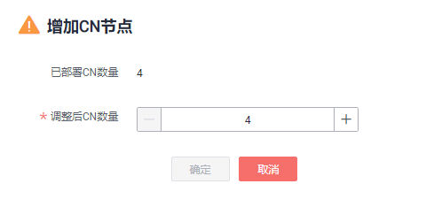
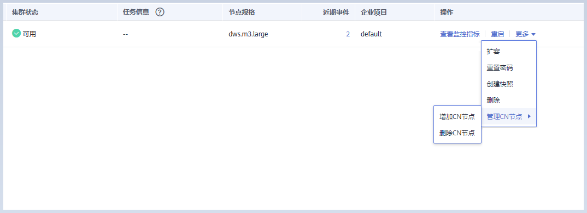
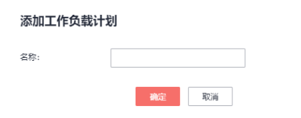

# 管理CN节点

## 概述

当用户集群创建后，实际需要的CN数量会随着业务需求而发生变化，因此管理CN节点功能的实现使用户可以根据实际需求动态调整集群CN数量。具体操作如下：

-   [增加CN节点](#zh-cn_topic_0000001083058054_section941730165216)
-   [删除CN节点](#zh-cn_topic_0000001083058054_section7292342175210)

    > **说明：** 
    >该特性仅8.1.1及以上集群版本支持。

## 约束与限制

-   资源发放时默认CN数量为3，用户可以根据实际发放节点数量调整CN数量，范围为2\~20。
-   增删CN节点过程中不允许执行其他运维操作。
-   增删CN节点过程中需要停止业务操作，建议在业务低峰期或业务中断情况下进行操作。
-   增删CN节点时发生故障且回滚失败，需要用户登录后台进行处理，处理方案请参见《故障排除》中的“集群使用\>增删CN回滚失败”章节。

## 增加CN节点

1.  登录GaussDB\(DWS\) 管理控制台。
2.  在“集群管理”页面，找到需要增加CN节点的集群。
3.  在指定集群所在行的“操作”列，选择“更多\>管理CN节点\>增加CN节点”。

    

4.  在跳出页面根据用户需求选择调整后的CN数量，单击“确定”。

    

    > **须知：** 
    >-   进行增加CN节点操作需要集群处于“可用”、“不均衡”或者“重分布”任意一种状态。
    >-   调整后CN数量需大于已部署的CN数量，小于等于20且小于等于节点数量。

## 删除CN节点

1.  登录GaussDB\(DWS\) 管理控制台。
2.  在“集群管理”页面，找到需要删除CN节点的集群。
3.  在指定集群所在行的“操作”列，选择“更多\>管理CN节点\>删除CN节点”。

    

4.  在跳出页面根据用户需求勾选需要删除的CN节点，单击“确定”。

    

    > **须知：** 
    >-   删除CN节点时需至少保留两个CN节点。
    >-   删除CN节点时集群需要处于“可用”、“节点故障”或者“非均衡”任意一种状态。
    >-   如果CN节点已经绑定弹性IP，则禁止删除。
    >-   如果存在异常节点，则只允许删除异常状态的CN节点。
    >    -   存在一个节点故障，则只允许删除该CN节点。
    >    -   存在两个或两个以上节点故障，则不允许删除CN节点。

