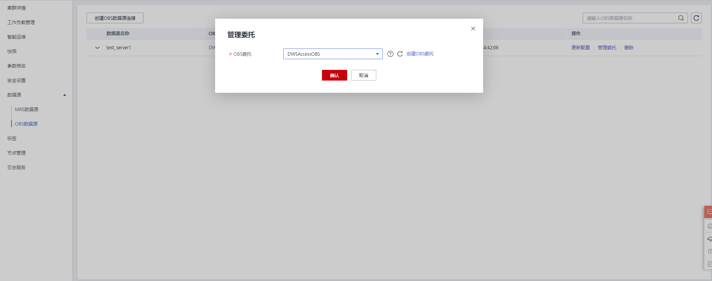

# 管理OBS数据源<a name="ZH-CN_TOPIC_0000001455556849"></a>

GaussDB\(DWS\)支持以委托方式访问客户OBS上的数据，客户通过创建DWS云服务委托并授予OBS OperateAccess或OBS Administrator权限，然后在创建OBS数据源绑定该委托，便可通过OBS外表的方式访问OBS上的数据。

> **说明：** 
>-   该特性仅8.2.0及以上集群版本支持。
>-   同一个集群的OBS数据源在创建、修改、删除时是互斥的，不支持同时执行多个操作。

## 创建OBS委托<a name="section1274613691116"></a>

**操作场景**

创建OBS数据源前需要用户提前创建好授权给GaussDB\(DWS\)具有OBS OperateAccess或OBS Administrator权限的委托。

**操作步骤**

1.  鼠标移动至页面右上角账号，单击“统一身份认证”，进入统一身份认证服务页面。

    

2.  在左侧导航栏单击“委托”，在委托页面右上角单击“创建委托”。

    

3.  创建委托时委托类型选择“云服务”，云服务选择“DWS”。

    

4.  单击“下一步”，对委托授予OBS服务的“OBS OperateAccess”或“OBS Administrator”权限。

    

5.  单击“下一步”，选择授权资源范围为“所有资源”或需要访问的资源，然后确认无误后提交。

    


## 创建OBS数据源<a name="section179961432121715"></a>

**前提条件**

已创建好授权给GaussDB\(DWS\)具有OBS OperateAccess权限的委托。

**操作步骤**

1.  在GaussDB\(DWS\)管理管制台，单击“集群管理“。
2.  在集群列表，单击指定集群的名称，然后选择“数据源\>OBS数据源”。
3.  在OBS数据源页面，单击“创建OBS数据源连接”，填写配置参数。

    

    **表 1**  OBS数据源连接参数说明

    <a name="table42714451329"></a>
    <table><thead align="left"><tr id="row18271645173219"><th class="cellrowborder" valign="top" width="23.98%" id="mcps1.2.3.1.1"><p id="p20278452325"><a name="p20278452325"></a><a name="p20278452325"></a>参数名称</p>
    </th>
    <th class="cellrowborder" valign="top" width="76.02%" id="mcps1.2.3.1.2"><p id="p152704523218"><a name="p152704523218"></a><a name="p152704523218"></a>说明</p>
    </th>
    </tr>
    </thead>
    <tbody><tr id="row10271745143214"><td class="cellrowborder" valign="top" width="23.98%" headers="mcps1.2.3.1.1 "><p id="p927184512321"><a name="p927184512321"></a><a name="p927184512321"></a>数据源名称</p>
    </td>
    <td class="cellrowborder" valign="top" width="76.02%" headers="mcps1.2.3.1.2 "><p id="p172774533217"><a name="p172774533217"></a><a name="p172774533217"></a>要创建的OBS数据源连接名称。</p>
    </td>
    </tr>
    <tr id="row427124563218"><td class="cellrowborder" valign="top" width="23.98%" headers="mcps1.2.3.1.1 "><p id="p327104519328"><a name="p327104519328"></a><a name="p327104519328"></a>OBS委托</p>
    </td>
    <td class="cellrowborder" valign="top" width="76.02%" headers="mcps1.2.3.1.2 "><p id="p8271453320"><a name="p8271453320"></a><a name="p8271453320"></a>当前用户授权给DWS服务的具有OBS OperateAccess权限的委托。</p>
    </td>
    </tr>
    <tr id="row19271245143217"><td class="cellrowborder" valign="top" width="23.98%" headers="mcps1.2.3.1.1 "><p id="p1281545133218"><a name="p1281545133218"></a><a name="p1281545133218"></a>数据库</p>
    </td>
    <td class="cellrowborder" valign="top" width="76.02%" headers="mcps1.2.3.1.2 "><p id="p1628645173217"><a name="p1628645173217"></a><a name="p1628645173217"></a>要创建的OBS数据源连接所在的数据库。</p>
    </td>
    </tr>
    <tr id="row828104512327"><td class="cellrowborder" valign="top" width="23.98%" headers="mcps1.2.3.1.1 "><p id="p628174583219"><a name="p628174583219"></a><a name="p628174583219"></a>描述</p>
    </td>
    <td class="cellrowborder" valign="top" width="76.02%" headers="mcps1.2.3.1.2 "><p id="p2028745143215"><a name="p2028745143215"></a><a name="p2028745143215"></a>要创建的OBS数据源连接的描述信息。</p>
    </td>
    </tr>
    </tbody>
    </table>

4.  确认无误后，单击“确认”按钮，提交创建操作，创建过程大约需要10秒钟左右。

## 更新OBS数据源配置<a name="section82211219102418"></a>

**操作场景**

当OBS数据源连接创建之后，GaussDB\(DWS\)会定期更新数据源使用的临时委托授权信息，如果24小时内自动更新均失败的话，数据源连接将不可用，此时可以手动在控制台临时进行一次手动更新操作。

**操作步骤**

1.  在GaussDB\(DWS\) 管理管制台，单击“集群管理“。
2.  在集群列表，单击指定集群的名称，然后单击“数据源\>OBS数据源”。
3.  在“OBS数据源”列表中选择要更新的OBS数据源，单击所在行“操作”列的“更新配置”按钮。

    

4.  确认无误后，单击“确认”按钮，提交更新操作，更新过程大概需要10秒钟左右。

## 修改OBS数据源委托<a name="section1596052112917"></a>

**操作场景**

如果创建OBS数据源时绑定的委托不能满足使用需要，可以使用管理委托功能更换其他委托。

**操作步骤**

1.  在GaussDB\(DWS\) 管理管制台，单击“集群管理“。
2.  在集群列表，单击指定集群的名称，然后单击“数据源\>OBS数据源”。
3.  在“OBS数据源”列表中选择要修改的OBS数据源，单击所在行“操作”列的“管理委托”按钮，在弹窗中选择新的委托。

    

4.  确认无误后，单击“确认”按钮，提交修改委托操作，修改过程大概需要10秒钟左右。

## 删除OBS数据源<a name="section105051012308"></a>

1.  在GaussDB\(DWS\) 管理管制台，单击“集群管理“。
2.  在集群列表，单击指定集群的名称，然后单击“数据源\>OBS数据源”。
3.  在“OBS数据源”列表中选择要删除的OBS数据源，单击所在行“操作”列的“删除”按钮。

    

4.  确认无误后，单击“确认”按钮，提交删除操作，删除操作过程大概需要10秒钟左右。

## 使用OBS数据源<a name="section1252134203116"></a>

GaussDB\(DWS\)使用外表方式访问OBS上的数据。委托方式与非委托方式，在外表上体现出来的差异仅在于指定了不同的SERVER。

对于非委托方式，控制台提供的SERVER包含access\_key和secret\_access\_key参数，分别对应OBS访问协议的AK和SK值。

对于委托方式，控制台提供的SERVER包含access\_key、secret\_access\_key和security\_token参数，分别对应OBS访问协议的临时AK、临时SK和统一身份认证服务IAM中临时安全凭证的SecurityToken值。

在创建好OBS委托和OBS数据源之后，用户从控制台获得相应的包含委托信息的SERVER，假设为obs\_server。用户创建和使用外表与非委托方式无差异。关于如何使用OBS数据源，具体请参见[从OBS导入数据](https://support.huaweicloud.com/devg-dws/dws_04_0181.html)。

如下示例为通过外表读取OBS上的数据。

1.  建立OBS外表customer\_address，不包含分区列。obs\_server上的文件，其格式为‘orc’，对应的存储目录为'/user/obs/region\_orc11\_64stripe1/'。

    ```
    CREATE FOREIGN TABLE customer_address
    (
        ca_address_sk             integer               not null,
        ca_address_id             char(16)              not null,
        ca_street_number          char(10)                      ,   
        ca_street_name            varchar(60)                   ,   
        ca_street_type            char(15)                      ,   
        ca_suite_number           char(10)                      ,   
        ca_city                   varchar(60)                   ,   
        ca_county                 varchar(30)                   ,   
        ca_state                  char(2)                       ,   
        ca_zip                    char(10)                      ,   
        ca_country                varchar(20)                   ,   
        ca_gmt_offset             decimal(36,33)                  ,   
        ca_location_type          char(20)    
    ) 
    SERVER obs_server OPTIONS (
        FOLDERNAME '/user/obs/region_orc11_64stripe1/',
        FORMAT 'ORC',
        ENCODING 'utf8',
        TOTALROWS  '20'
    )
    DISTRIBUTE BY roundrobin;
    ```

2.  通过外表查询OBS上的数据。

    ```
    SELECT COUNT(*) FROM customer_address;
    count
    -------
    20
    (1row)
    ```


