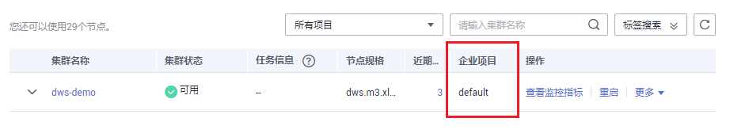

# 管理企业项目

企业项目是一种云资源管理方式。企业管理（Enterprise Management）提供面向企业客户的云上财务管理等综合管理服务。区别于管理控制台独立操控、配置云产品的方式，企业管理控制台以面向企业资源管理为出发点，帮助企业以公司、部门、项目等分级管理方式实现企业云上的财务的管理。

已开通企业项目服务的用户，可以使用企业项目管理云服务资源。

## 绑定企业项目

在GaussDB\(DWS\) 中，用户可以在创建集群时为集群选择所属的企业项目，从而将GaussDB\(DWS\) 集群与企业项目进行关联，详情请参见[创建集群](创建集群.md)。在选择“企业项目“的下拉列表中，将显示用户在企业项目服务中已创建的项目。系统还内置了一个缺省的企业项目“default“，如果用户没有为集群选择企业项目，将使用缺省项目“default“。

注意，目前企业项目服务仍处于公测期间，仅允许有公测权限的用户设置企业项目，普通用户无法看到企业项目相关信息。

在集群创建过程中，如果集群与企业项目绑定成功，则集群创建成功，如果绑定失败，系统会发送告警，集群就会创建失败。

在为GaussDB\(DWS\) 集群创建快照时，会同时保存集群与企业项目的关联关系，在恢复集群时，也会恢复企业项目的关联关系。

当删除GaussDB\(DWS\) 集群时，GaussDB\(DWS\) 集群与企业项目的关联关系就会被自动删除。

## 查看企业项目

在集群创建成功后，您可以在集群列表和集群详情页面查看集群关联的企业项目。用户只能查询到有访问权限的项目下的集群资源。

-   在集群管理页面的集群列表中，查看集群所属的企业项目。

    **图 1**  查看企业项目  
    

-   在集群列表中，找到所需要的集群，然后单击集群名称，进入“集群详情“页面，可以查看与集群关联的企业项目。单击企业项目的名称，可以跳转到企业管理的控制台页面对该企业项目进行查看或编辑。

    **图 2**  查看集群的企业项目  
    

-   同时，在企业管理的控制台上，查询指定项目中的资源列表时，也可以查询到GaussDB\(DWS\) 服务的资源。

## 按企业项目搜索集群

登录GaussDB\(DWS\) 管理控制台，单击“集群管理“，在集群列表上方单击“所有项目“，然后在下拉列表中选择所需搜索的项目名称，即可查看与该项目关联的所有集群。

**图 3**  按企业项目搜索  

## 将集群迁入或迁出企业项目

一个GaussDB\(DWS\) 集群只能关联一个企业项目。当集群创建成功后，可以在企业管理的控制台上，执行迁出操作，将GaussDB\(DWS\) 集群从当前所属的企业项目中迁出到另一个企业项目中；或者执行迁入操作，在指定的企业项目中迁入另一个企业项目中的GaussDB\(DWS\) 集群。迁入迁出后，GaussDB\(DWS\) 集群与新的企业项目进行关联，GaussDB\(DWS\) 集群与原企业项目的关联关系将被自动解除。

迁入的详细操作，请参考《企业管理用户指南》的[为企业项目迁入资源](https://support.huaweicloud.com/usermanual-em/zh-cn_topic_0108763967.html)。

迁出的详细操作，请参考《企业管理用户指南》的[迁出企业项目资源](https://support.huaweicloud.com/usermanual-em/zh-cn_topic_0108763973.html)。

## 企业项目级别细粒度授权

当系统预置的权限不能满足要求时，您可以创建自定义策略，并通过给用户组授予自定义策略来进行精细的访问控制。企业项目作为一个单独可管理的对象，可以和用户组绑定，策略可以授权给用户组，这就实现了企业项目级别的细粒度授权。

1.  登录IAM服务管理控制台，创建自定义策略。

    具体操作请参见[GaussDB\(DWS\)自定义策略](GaussDB(DWS)自定义策略.md)。

2.  单击管理控制台右上方的“企业”，进入企业管理控制台。
3.  在企业管理控制台的“人员管理 \> 用户组管理“页面中，创建用户组并添加用户，将用户组加入到项目，并将新创建的自定义策略授权给用户组，使用户组中的用户具有策略定义的权限。

    详细操作，请参考《企业管理用户指南》的[为企业项目添加用户组](https://support.huaweicloud.com/usermanual-em/zh-cn_topic_0109989489.html)章节。

