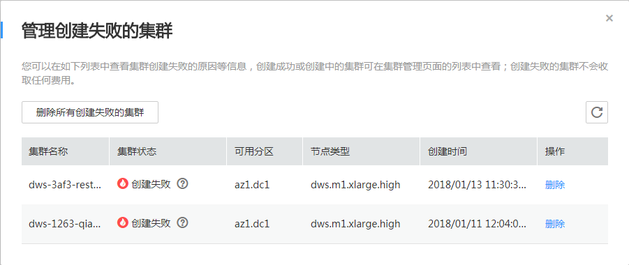

# 管理创建失败的集群

## 操作场景

在“管理创建失败的集群“页面，用户可以查看创建失败的集群个数，创建失败原因并对创建失败集群进行单个或者全部删除。

## 前提条件

-   DWS管理控制台中存在创建失败的集群。
-   在DWS管理控制台，单击“集群管理“，进入“集群管理“页面。

## 查看创建失败集群

在集群列表右上角，单击“创建失败的集群“旁边的数字，弹出“管理创建失败的集群“页面。

创建失败集群列表显示所有创建失败的集群，数量较多时，可采用翻页显示。

**图 1**  管理创建失败的集群  

## 查看集群创建失败原因

在“管理创建失败的集群“页面，在待查看集群的所在行，单击“集群状态“列的查看集群创建失败原因。

## 删除单个创建失败集群

1.  在“管理创建失败的集群“页面，在待删除集群的所在行，单击“操作“列的“删除“。
2.  在删除确认页面，单击“是“，删除此集群。

## 删除所有创建失败的集群

1.  在“管理创建失败的集群“页面，单击“删除所有创建失败的集群“。
2.  在删除确认页面，单击“是“，删除所有创建失败的集群。

