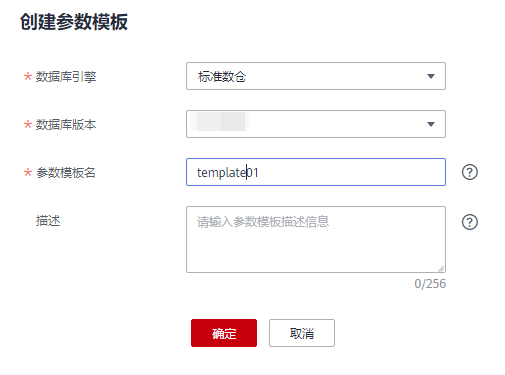

# 管理参数模板

为了方便您配置数据库参数，DWS提供了参数模板的功能，参数模板中包含了一些常用的数据库参数。您可以直接在DWS管理控制台上管理参数模板，将参数模板应用到集群后，可以直接在集群的“参数修改“页面中修改参数。

本章节将为您介绍参数模板的如下内容：

-   [参数模板概述](#section11563104515277)
-   [参数说明](#section926416313488)
-   [创建参数模板](#section197345189212)
-   [修改参数模板](#section940613324129)
-   [应用参数模板到集群](#section17765171763118)
-   [删除参数模板](#section18540123972615)

## 参数模板概述

参数模板是一组适用于数据仓库的参数，模板中的参数都设置了默认值，这些参数包括会话超时时间、日期和时间格式等，详情参见[参数说明](#section926416313488)。通过调整参数值，可以使数据库更好地适配实际业务。在创建集群时，您可以为集群指定一个参数模板，模板中的参数将被应用于该DWS集群中的所有数据库，如果您未指定参数模板，系统将为集群应用默认的参数模板。当集群创建成功后，您可以在集群“参数修改“页面修改参数，也可以在参数模板管理页面，选择其他参数模板或者创建新的参数模板重新应用到对应的集群。

DWS为每个版本的数据仓库预置了一个默认参数模板，默认参数模板不支持删除和修改。如果用户想要修改参数模板中的参数值，可以创建一个自定义参数模板，自定义参数模板中的参数值允许被修改。自定义参数模板被应用到集群后，它与集群并无关联关系，之后，如果您修改了该自定义模板中的参数值，其修改并不会同步到集群，您需要重新将该参数模板应用到集群，才能使修改后的参数值应用到集群。同样的，如果您在集群详情页面修改参数，其修改也不会同步到参数模板。

## 参数说明

**表 1**  参数说明

<table><thead align="left"><tr id="row92716201567"><th class="cellrowborder" valign="top" width="26.019801980198014%" id="mcps1.2.4.1.1">
<strong id="b192968471772">参数名称</strong>

</th>
<th class="cellrowborder" valign="top" width="57.18811881188118%" id="mcps1.2.4.1.2">
<strong id="b6296747077">参数描述</strong>

</th>
<th class="cellrowborder" valign="top" width="16.792079207920793%" id="mcps1.2.4.1.3">
<strong id="b429614479717">默认值</strong>

</th>
</tr>
</thead>
<tbody><tr id="row1632012371100"><td class="cellrowborder" valign="top" width="26.019801980198014%" headers="mcps1.2.4.1.1 ">
session_timeout

</td>
<td class="cellrowborder" valign="top" width="57.18811881188118%" headers="mcps1.2.4.1.2 ">
Session闲置超时时间，单位为秒，0表示关闭超时限制。取值范围：0 ~ 86400。

</td>
<td class="cellrowborder" valign="top" width="16.792079207920793%" headers="mcps1.2.4.1.3 ">
600

</td>
</tr>
<tr id="row7775151941619"><td class="cellrowborder" valign="top" width="26.019801980198014%" headers="mcps1.2.4.1.1 ">
datestyle

</td>
<td class="cellrowborder" valign="top" width="57.18811881188118%" headers="mcps1.2.4.1.2 ">
设置日期和时间值的显示格式。

</td>
<td class="cellrowborder" valign="top" width="16.792079207920793%" headers="mcps1.2.4.1.3 ">
ISO,MDY

</td>
</tr>
<tr id="row82351014638"><td class="cellrowborder" valign="top" width="26.019801980198014%" headers="mcps1.2.4.1.1 ">
failed_login_attempts

</td>
<td class="cellrowborder" valign="top" width="57.18811881188118%" headers="mcps1.2.4.1.2 ">
输入密码错误的次数达到该参数所设置的值时，帐户将会被自动锁定。配置为0时表示不限制密码输入错误的次数。取值范围：0 ~ 1000。

</td>
<td class="cellrowborder" valign="top" width="16.792079207920793%" headers="mcps1.2.4.1.3 ">
10

</td>
</tr>
<tr id="row19369518336"><td class="cellrowborder" valign="top" width="26.019801980198014%" headers="mcps1.2.4.1.1 ">
timezone

</td>
<td class="cellrowborder" valign="top" width="57.18811881188118%" headers="mcps1.2.4.1.2 ">
设置显示和解释时间类型数值时使用的时区。

</td>
<td class="cellrowborder" valign="top" width="16.792079207920793%" headers="mcps1.2.4.1.3 ">
UTC

</td>
</tr>
<tr id="row12638592033"><td class="cellrowborder" valign="top" width="26.019801980198014%" headers="mcps1.2.4.1.1 ">
log_timezone

</td>
<td class="cellrowborder" valign="top" width="57.18811881188118%" headers="mcps1.2.4.1.2 ">
设置服务器写日志文件时使用的时区。

</td>
<td class="cellrowborder" valign="top" width="16.792079207920793%" headers="mcps1.2.4.1.3 ">
UTC

</td>
</tr>
<tr id="row25788021713"><td class="cellrowborder" valign="top" width="26.019801980198014%" headers="mcps1.2.4.1.1 ">
enable_resource_record

</td>
<td class="cellrowborder" valign="top" width="57.18811881188118%" headers="mcps1.2.4.1.2 ">
设置是否开启资源记录功能。

当SQL语句实际执行时间大于resource_track_duration参数值（默认为60s，可自行设置）时，监控信息将会归档。

此功能开启后会引起存储空间膨胀及轻微性能影响，不用时请关闭。

 说明： 
<ul id="ul1659251813173"><li>归档：监控信息保存在history视图，归档在info表。归档时间为三分钟，归档后history视图中的记录会被清除。</li><li>history视图GS_WLM_SESSION_HISTORY，对应存入info表GS_WLM_SESSION_INFO。</li><li>history视图GS_WLM_OPERATOR_HISTORY，对应存入info表GS_WLM_OPERATOR_INFO。</li></ul>

</td>
<td class="cellrowborder" valign="top" width="16.792079207920793%" headers="mcps1.2.4.1.3 ">
off

</td>
</tr>
<tr id="row6271820468"><td class="cellrowborder" valign="top" width="26.019801980198014%" headers="mcps1.2.4.1.1 ">
resource_track_cost

</td>
<td class="cellrowborder" valign="top" width="57.18811881188118%" headers="mcps1.2.4.1.2 ">
设置对语句进行资源监控的最小执行代价。值为-1或者执行语句代价小于10时，不进行资源监控。值大于等于0时，执行语句的代价大于等于10并且超过这个参数的设定值就会进行资源监控。

SQL语句的预估执行代价可通过执行SQL命令Explain进行查询。

此参数在集群版本1.5.0或以上有效。

</td>
<td class="cellrowborder" valign="top" width="16.792079207920793%" headers="mcps1.2.4.1.3 ">
100000

</td>
</tr>
<tr id="row24934861917"><td class="cellrowborder" valign="top" width="26.019801980198014%" headers="mcps1.2.4.1.1 ">
resource_track_duration

</td>
<td class="cellrowborder" valign="top" width="57.18811881188118%" headers="mcps1.2.4.1.2 ">
设置当前会话资源监控实时视图中记录的语句执行结束后进行归档的最小执行时间。

<ul id="ul295922416142"><li>值为0时，资源监控实时视图中记录的所有语句都会进行历史信息归档。</li><li>值大于0时，资源监控实时视图中记录的语句的执行时间超过设定值就会进行历史信息归档。</li></ul>
</td>
<td class="cellrowborder" valign="top" width="16.792079207920793%" headers="mcps1.2.4.1.3 ">
60

</td>
</tr>
<tr id="row129915481845"><td class="cellrowborder" valign="top" width="26.019801980198014%" headers="mcps1.2.4.1.1 ">
password_effect_time

</td>
<td class="cellrowborder" valign="top" width="57.18811881188118%" headers="mcps1.2.4.1.2 ">
设置帐户密码的有效时间，临近或超过有效期系统会提示用户修改密码。

取值范围为0 ~999，单位为天。设置为0表示不开启有效期限制功能。

此参数在集群版本1.5.0或以上有效。

</td>
<td class="cellrowborder" valign="top" width="16.792079207920793%" headers="mcps1.2.4.1.3 ">
90

</td>
</tr>
<tr id="row157152131359"><td class="cellrowborder" valign="top" width="26.019801980198014%" headers="mcps1.2.4.1.1 ">
update_lockwait_timeout

</td>
<td class="cellrowborder" valign="top" width="57.18811881188118%" headers="mcps1.2.4.1.2 ">
该参数控制并发更新同一行时单个锁的最长等待时间。当申请的锁等待时间超过设定值时，系统会报错。0表示不等待，有锁时直接报错。默认值120000，单位为毫秒。

此参数在集群版本1.5.100或以上有效。

</td>
<td class="cellrowborder" valign="top" width="16.792079207920793%" headers="mcps1.2.4.1.3 ">
120000

</td>
</tr>
</tbody>
</table>

## 创建参数模板

如果默认参数模板中的参数值无法满足业务，用户可以创建自定义参数模板，并修改其中的参数值，从而更好地适配业务。

创建参数模板操作步骤如下：

1.  通过访问以下地址登录DWS管理控制台：[https://console.huaweicloud.com/dws](https://console.huaweicloud.com/dws)。
2.  在左侧导航栏中，单击“参数模板管理“。
3.  单击“创建参数模板“，然后设置以下参数。

    -   “数据库引擎“：选择一个数据库引擎。
    -   “数据库版本“：选择一个数据库版本。
    -   “参数模板名“：填写新参数模板的名称。

        参数模板名称长度为4～64个字符，必须以字母开头，不区分大小写，可以包含字母、数字、中划线或者下划线，不能包含其他的特殊字符。

    -   “描述“：填写新参数模板的描述信息。此参数为可选参数。

        参数模板描述的字符长度为0～256，且特殊字符!<\>'=&"不支持。

    > **说明：**   
    >创建参数模板时选择的“数据库引擎“和“数据库版本“需与待应用参数模板的集群的类型和版本一致。  

    **图 1**  创建参数模板  
    

4.  单击“确定“，开始创建参数模板。

## 修改参数模板

对于用户自定义创建的参数模板，可以修改其中的参数值，但是默认参数模板中的参数值不支持修改。

1.  通过访问以下地址登录DWS管理控制台：[https://console.huaweicloud.com/dws](https://console.huaweicloud.com/dws)。
2.  在左侧导航栏中，单击“参数模板管理“。
3.  在“名称“列单击待修改的参数模板名称，进入对应模板的参数列表页面。
4.  在待修改的参数所对应的“值“中，输入新的值。修改完，单击“保存“。
5.  在“修改预览“对话框中，确认参数值修改无误后，单击“保存“。

## 应用参数模板到集群

集群创建成功后，用户可以为集群应用一个新的参数模板，将参数模板中所有参数的值应用到对应的集群中。

应用参数模板的操作步骤如下：

1.  通过访问以下地址登录DWS管理控制台：[https://console.huaweicloud.com/dws](https://console.huaweicloud.com/dws)。
2.  在左侧导航栏中，单击“参数模板管理“。
3.  选择一个目标参数模板，在“操作“列中单击“应用“。
4.  在“参数模板应用“对话框，选择目标集群。

    您可以将所选的参数模板应用到与该参数模板对应版本的集群上。

    **图 2**  参数模板应用  
    

5.  单击“确定“。

    如果重新应用的参数模板与集群原来的参数取值不同，系统会弹窗显示两组参数值的对比。

## 删除参数模板

对于多余或者不再使用的参数模板，用户可以将其删除，但是不支持删除默认参数模板。成功删除的参数模板无法恢复，请用户谨慎操作。

1.  通过访问以下地址登录DWS管理控制台：[https://console.huaweicloud.com/dws](https://console.huaweicloud.com/dws)。
2.  在左侧导航栏中，单击“参数模板管理“。
3.  在待删除的参数模板右侧操作列，单击“删除“。
4.  在弹出的对话框，单击“是“。

