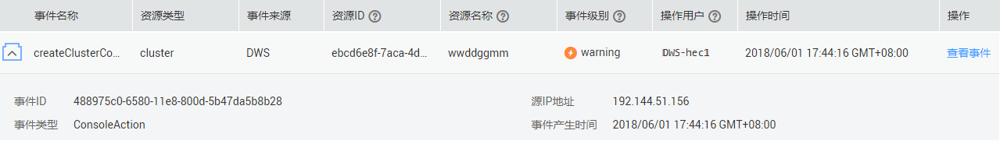

# 管理控制台审计日志

本章节包含如下内容：

-   [开启审计服务](#zh-cn_topic_0000001098976722_section41571451122610)
-   [关闭审计日志](#zh-cn_topic_0000001098976722_section1247674310321)
-   [支持审计的关键操作列表](#zh-cn_topic_0000001098976722_section6775838155314)
-   [查看审计日志](#zh-cn_topic_0000001098976722_section5922593541)

## 开启审计服务

使用云审计服务前需要开启云审计服务，开启云审计服务后系统会自动创建一个追踪器，系统记录的所有操作将关联在该追踪器中。目前，一个云账户系统仅支持创建一个追踪器。

1.  登录管理控制台，选择“服务列表 \> 管理与监管 \> 云审计服务“，进入云审计服务信息页面。
2.  单击左侧导航树的“追踪器“，进入追踪器信息页面。
3.  开启云审计服务。

    如果您是首次使用云审计服务，在追踪器列表中还没有已创建的追踪器，则请参考《云审计服务快速入门》中的[开通云审计服务](https://support.huaweicloud.com/qs-cts/cts_02_0001.html)章节开启云审计服务。

    如果您已开通过云审计服务了，开通时系统已为您自动创建了一个管理事件追踪器，管理事件追踪器只能有一个且不可删除。您也可以自行创建数据事件追踪器，详细内容请参见《云审计服务用户指南》中的[创建追踪器](https://support.huaweicloud.com/usermanual-cts/cts_03_0001.html)。

## 关闭审计日志

如果用户想关闭审计日志，需要在云审计服务中停用追踪器。

1.  登录管理控制台，选择“服务列表 \> 管理与监管\> 云审计服务“，进入云审计服务信息页面。
2.  通过停用追踪器，关闭审计日志。如需重新开启审计日志，只要启用追踪器即可。

    有关停用/启用追踪器的更多信息，请参考《云审计服务快速入门》中的[停用/启用追踪器](https://support.huaweicloud.com/usermanual-cts/cts_03_0003.html)。

## 支持审计的关键操作列表

通过云审计服务，您可以记录与GaussDB\(DWS\) 服务相关的操作事件，便于日后的查询、审计和回溯。

> **说明：** 
>自动快照的创建，删除走系统内部调度，非用户操作，不记录审计日志。

**表 1**  云审计服务支持审计的GaussDB\(DWS\) 操作列表

<table><thead align="left"><tr id="zh-cn_topic_0000001098976722_row13512483544"><th class="cellrowborder" valign="top" width="25.979999999999997%" id="mcps1.2.4.1.1">
操作名称

</th>
<th class="cellrowborder" valign="top" width="31.78%" id="mcps1.2.4.1.2">
资源类型

</th>
<th class="cellrowborder" valign="top" width="42.24%" id="mcps1.2.4.1.3">
事件名称

</th>
</tr>
</thead>
<tbody><tr id="zh-cn_topic_0000001098976722_row3934935145410"><td class="cellrowborder" valign="top" width="25.979999999999997%" headers="mcps1.2.4.1.1 ">
创建集群/恢复集群

</td>
<td class="cellrowborder" valign="top" width="31.78%" headers="mcps1.2.4.1.2 ">
cluster

</td>
<td class="cellrowborder" valign="top" width="42.24%" headers="mcps1.2.4.1.3 ">
createCluster

</td>
</tr>
<tr id="zh-cn_topic_0000001098976722_row1293463514543"><td class="cellrowborder" valign="top" width="25.979999999999997%" headers="mcps1.2.4.1.1 ">
删除集群

</td>
<td class="cellrowborder" valign="top" width="31.78%" headers="mcps1.2.4.1.2 ">
cluster

</td>
<td class="cellrowborder" valign="top" width="42.24%" headers="mcps1.2.4.1.3 ">
deleteCluster

</td>
</tr>
<tr id="zh-cn_topic_0000001098976722_row179346353547"><td class="cellrowborder" valign="top" width="25.979999999999997%" headers="mcps1.2.4.1.1 ">
扩容集群

</td>
<td class="cellrowborder" valign="top" width="31.78%" headers="mcps1.2.4.1.2 ">
cluster

</td>
<td class="cellrowborder" valign="top" width="42.24%" headers="mcps1.2.4.1.3 ">
resizeCluster

</td>
</tr>
<tr id="zh-cn_topic_0000001098976722_row4934203595417"><td class="cellrowborder" valign="top" width="25.979999999999997%" headers="mcps1.2.4.1.1 ">
重启集群

</td>
<td class="cellrowborder" valign="top" width="31.78%" headers="mcps1.2.4.1.2 ">
cluster

</td>
<td class="cellrowborder" valign="top" width="42.24%" headers="mcps1.2.4.1.3 ">
restartCluster

</td>
</tr>
<tr id="zh-cn_topic_0000001098976722_row4935143555411"><td class="cellrowborder" valign="top" width="25.979999999999997%" headers="mcps1.2.4.1.1 ">
创建快照

</td>
<td class="cellrowborder" valign="top" width="31.78%" headers="mcps1.2.4.1.2 ">
backup

</td>
<td class="cellrowborder" valign="top" width="42.24%" headers="mcps1.2.4.1.3 ">
createBackup

</td>
</tr>
<tr id="zh-cn_topic_0000001098976722_row1893543510548"><td class="cellrowborder" valign="top" width="25.979999999999997%" headers="mcps1.2.4.1.1 ">
删除快照

</td>
<td class="cellrowborder" valign="top" width="31.78%" headers="mcps1.2.4.1.2 ">
backup

</td>
<td class="cellrowborder" valign="top" width="42.24%" headers="mcps1.2.4.1.3 ">
deleteBackup

</td>
</tr>
<tr id="zh-cn_topic_0000001098976722_row893593514540"><td class="cellrowborder" valign="top" width="25.979999999999997%" headers="mcps1.2.4.1.1 ">
设置安全参数

</td>
<td class="cellrowborder" valign="top" width="31.78%" headers="mcps1.2.4.1.2 ">
configurations

</td>
<td class="cellrowborder" valign="top" width="42.24%" headers="mcps1.2.4.1.3 ">
updateConfigurations

</td>
</tr>
<tr id="zh-cn_topic_0000001098976722_row17935113525410"><td class="cellrowborder" valign="top" width="25.979999999999997%" headers="mcps1.2.4.1.1 ">
创建MRS数据源

</td>
<td class="cellrowborder" valign="top" width="31.78%" headers="mcps1.2.4.1.2 ">
dataSource

</td>
<td class="cellrowborder" valign="top" width="42.24%" headers="mcps1.2.4.1.3 ">
createExtDataSource

</td>
</tr>
<tr id="zh-cn_topic_0000001098976722_row13935153525412"><td class="cellrowborder" valign="top" width="25.979999999999997%" headers="mcps1.2.4.1.1 ">
删除MRS数据源

</td>
<td class="cellrowborder" valign="top" width="31.78%" headers="mcps1.2.4.1.2 ">
dataSource

</td>
<td class="cellrowborder" valign="top" width="42.24%" headers="mcps1.2.4.1.3 ">
deleteExtDataSource

</td>
</tr>
<tr id="zh-cn_topic_0000001098976722_row119354358545"><td class="cellrowborder" valign="top" width="25.979999999999997%" headers="mcps1.2.4.1.1 ">
更新MRS数据源

</td>
<td class="cellrowborder" valign="top" width="31.78%" headers="mcps1.2.4.1.2 ">
dataSource

</td>
<td class="cellrowborder" valign="top" width="42.24%" headers="mcps1.2.4.1.3 ">
updateExtDataSource

</td>
</tr>
</tbody>
</table>

## 查看审计日志

1.  登录管理控制台，选择“服务列表 \> 管理与监管\> 云审计服务“，进入云审计服务信息页面。
2.  单击左侧导航树的“事件列表”，进入事件列表信息页面。
3.  单击事件列表右上方的“筛选”，设置对应的操作事件条件。

    当前事件列表支持四个维度的组合查询，详细信息如下：

    -   “事件来源”、“资源类型”和“筛选类型”。
        -   “事件来源”：选择“GaussDB\(DWS\) ”。
        -   “资源类型”：选择“所有资源类型”，或者指定具体的资源类型。
        -   “筛选类型”：选择“所有筛选类型”，或者选择以下任一选项。
            -   “按事件名称”：选择该选项时，还需选择某个具体的事件名称。
            -   “按资源ID”：选择该选项时，还需选择或者手动输入某个具体的资源ID。
            -   “按资源名称”：选择该选项时，还需选择或手动输入某个具体的资源名称。

    -   “操作用户”：在下拉框中选择某一具体的操作用户，此操作用户指用户级别，而非租户级别。
    -   “事件级别”：可选项为“所有事件级别”、“normal”、“warning”、“incident”，只可选择其中一项。
    -   “起始时间”、“结束时间”：可通过选择时间段查询操作事件。

        **图 1**  查询事件  
        

4.  单击“查询”，查看对应的操作事件。
5.  在需要查看的事件左侧，单击展开该记录的详细信息。

    **图 2**  事件  
    

6.  在需要查看的事件右侧，单击“查看事件”，弹出一个窗口，显示了该操作事件结构的详细信息。

    **图 3**  查看事件  
    

    关于云审计服务事件结构的关键字段详解，请参见《云审计服务用户指南》中的“云审计服务事件参考 \> 事件结构”和“云审计服务事件参考 \> 事件样例”章节。

