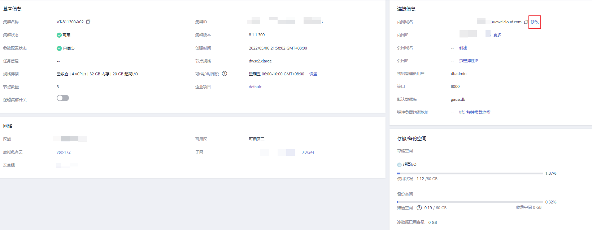
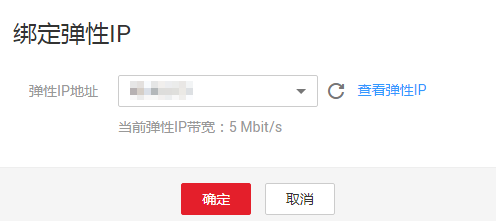
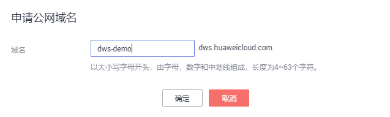

# 管理集群访问域名

## 概述

域名（Domain Name）是由一串用“点”分隔的字符组成的Internet上某一台计算机或计算机组的名称，如www.example.com。用户在Web浏览器的地址栏输入域名来访问某个网站或者Web应用程序。

DWS支持通过内网域名和公网域名访问集群。

内网域名是指通过内部网络访问集群数据库的域名地址。内网域名在创建集群时自动生成。默认命名规则为：集群名称.dws.myhuaweicloud.com。如果集群名称不符合域名规范，默认的访问域名前缀会相应做一些调整。

公网域名是指通过外部网络访问集群数据库的域名地址。如果集群没有绑定弹性IP，则不支持以“公网域名“的方式访问集群。如果集群在创建时绑定了弹性IP，公网域名在创建集群时自动生成。默认命名规则为：集群名称.dws.huaweiclouds.com。

创建了集群后，用户可以根据实际需求设置访问集群的内网域名和公网域名，具体包含如下操作：

-   [修改内网域名](#section1443581220337)
-   [创建公网域名](#section14447182917335)
-   [修改公网域名](#section220113419330)
-   [释放公网域名](#section1267743817334)

## 修改内网域名

内网域名在创建集群时自动生成，集群创建成功后用户可以根据实际情况修改默认生成的域名。

修改内网域名的操作步骤如下：

1.  通过访问以下地址登录DWS管理控制台：[https://console.huaweicloud.com/dws](https://console.huaweicloud.com/dws)。
2.  在左侧导航栏中，单击“集群管理“。
3.  在集群列表中找到所需要的集群，然后单击集群名称，进入集群“基本信息“页面。
4.  在“数据库属性“区域下，显示自动生成的内网域名，单击“内网域名“旁边的“修改“按钮。

    **图 1**  查看内网域名  
    

5.  在“修改内网域名“对话框中，输入目标域名，然后单击“确定“完成域名的修改。

    **图 2**  修改内网域名  
    

    内网域名由字母，数字和中划线组成，以大小写字母开头，长度为4\~63个字符。

    域名修改完成后，单击内网域名旁边的复制按钮，可以复制内网域名。

## 创建公网域名

创建集群时默认不绑定弹性IP，即不启用公网访问集群。集群创建成功后，如果用户想通过公网访问集群，可以先为集群绑定弹性IP再创建公网域名。

创建公网域名的操作步骤如下：

1.  通过访问以下地址登录DWS管理控制台：[https://console.huaweicloud.com/dws](https://console.huaweicloud.com/dws)。
2.  在左侧导航栏中，单击“集群管理“。
3.  在集群列表中找到所需要的集群，然后单击集群名称，进入集群“基本信息“页面。
4.  在“数据库属性“区域下，“公网域名“和“公网IP“显示为空，单击“绑定弹性IP“为集群绑定弹性IP。
5.  在“绑定弹性IP“弹出窗的下拉框中，选择一个弹性IP。

    如果下拉框中没有可用的弹性IP，可以单击“查看弹性IP“进入弹性公网IP页面创建一个满足需要的弹性IP。新的弹性IP创建成功后，单击下拉框旁边的刷新图标按钮，“弹性IP地址“下拉框中就会出现新创建的弹性IP。

    弹性IP绑定成功后，在“数据库属性“区域下显示具体的公网IP。

    **图 3**  绑定弹性IP  
    

6.  在“数据库属性“区域下，单击“公网域名“旁边的“创建“为集群创建公网域名。
7.  在“申请公网域名“弹出窗口中，输入目标域名，单击“确定“。

    **图 4**  申请公网域名  
    

    公网域名由字母、数字和中划线组成，以大小写字母开头，长度为4\~63个字符。

    公网域名创建成功后，在“数据库属性“区域下显示具体的公网域名。单击复制按钮，可以复制公网域名。

## 修改公网域名

如果集群在创建时绑定了弹性IP，公网域名在创建集群时自动生成。集群创建成功后，用户可以根据实际需求修改公网域名。

修改公网域名的操作步骤如下：

1.  通过访问以下地址登录DWS管理控制台：[https://console.huaweicloud.com/dws](https://console.huaweicloud.com/dws)。
2.  在左侧导航栏中，单击“集群管理“。
3.  在集群列表中找到所需要的集群，然后单击集群名称，进入集群“基本信息“页面。
4.  在“数据库属性“区域下，显示“公网域名“，单击“修改“。
5.  在“修改公网域名“弹出窗口中，输入目标域名，单击“确定“。

    **图 5**  修改公网域名  
    

## 释放公网域名

集群创建成功后，对于不需要通过公网访问的集群，用户可以释放集群的公网域名。

释放公网域名的操作步骤如下：

1.  通过访问以下地址登录DWS管理控制台：[https://console.huaweicloud.com/dws](https://console.huaweicloud.com/dws)。
2.  在左侧导航栏中，单击“集群管理“。
3.  在集群列表中找到所需要的集群，然后单击集群名称，进入集群“基本信息“页面。
4.  在“数据库属性“区域下，显示公网域名，单击“释放“。
5.  在“释放域名“确认窗口中，单击“是“。

