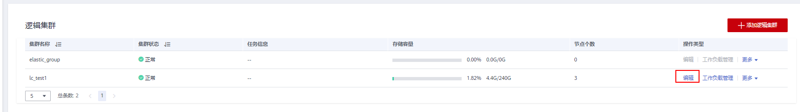
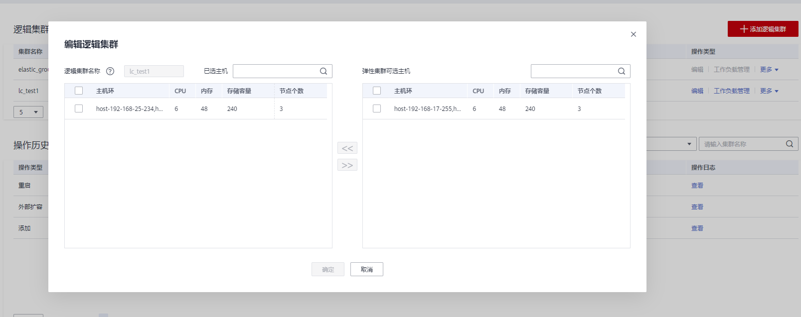
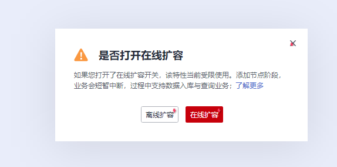

# 编辑逻辑集群

1.  登录GaussDB\(DWS\) 管理控制台。
2.  在集群列表中单击指定集群名称。
3.  切换至“逻辑集群管理”页签，在需要编辑的逻辑集群所在行的“操作类型”列单击“编辑”按钮。

    

4.  在弹出窗口中根据需求选择向逻辑集群中添加节点（从右侧将选中的环移动到左侧），或从逻辑集群中减少节点（从左侧将选中环移动到右侧），并单击“确定”。

    

5.  在添加节点时，根据弹出框中提示选择在线/离线扩容。

    

> **说明：** 
>-   向逻辑集群中添加节点或删除节点都以“环”为单位。
>-   逻辑集群中至少要保留一个“环”。
>-   从逻辑集群中删除的“环”将落入到弹性集群中。
>-   逻辑集群在8.1.3及以上版本支持在线扩容。

