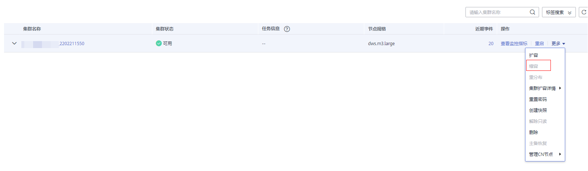
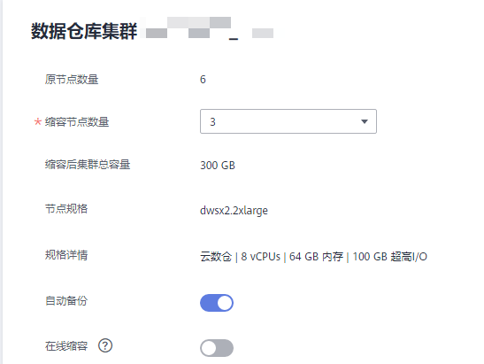

# 缩容集群<a name="ZH-CN_TOPIC_0000001405636874"></a>

当用户需要的计算或者存储资源冗余超出业务需求时，可在管理控制台对已有集群进行缩容操作，以便充分利用GaussDB\(DWS\) 提供的计算资源和存储资源。

> **说明：** 
>-   缩容集群仅8.1.1.300及以上版本支持。
>-   缩容的节点默认是按节点数计费。用户若购买折扣套餐节点，需要手动退订折扣套餐，以免继续按原节点套餐收费。
>-   云数仓集群缩容时只支持缩容与当前集群相同的存储规格。
>-   实时数仓（集群部署）不支持缩容至单机部署集群。

## 缩容对系统的影响<a name="section13554122617360"></a>

-   缩容前，需退出创建了临时表的客户端连接，因为在缩容过程中及缩容成功之前创建的临时表将会失效，操作临时表也会失败。但是缩容后创建的临时表不受影响。
-   在执行缩容操作后，集群会进行一次自动快照，快照创建成功后进行集群缩容，若用户不想自动创建快照，可以在缩容界面选择取消自动备份功能。
-   正在缩容的集群将禁用重启集群、扩容集群、创建快照、节点管理、智能运维、资源管理、参数修改、安全设置、日志服务、重置数据库管理员密码和删除集群的功能。
-   离线缩容过程中，用户应该停止所有业务或运行少量查询语句。表重分布期间会对表加共享锁，所有插入、更新、删除操作和表DDL操作都会长时间阻塞，会出现等锁超时情况。一旦表重分布完成，用户可以正常访问该表。在重分布执行过程中，用户应当避免执行超过20分钟的查询（在重分布执行时申请写锁的默认时间为20分钟）。否则可能导致重分布出现等待加锁超时失败的问题。
-   在线缩容过程中，表重分布期间用户可以对该表执行插入、更新、删除，但重分布过程仍然会短时间阻塞用户的数据更新操作，会影响用户语句的执行性能。缩容重分布过程会消耗大量的CPU和IO资源，因此会对用户作业性能影响较大，用户应该尽可能在停止业务情况下或业务轻载的情况下执行缩容重分布。
-   如果集群缩容失败，数据库不会在后台自动执行缩容回滚操作，此时数据库所有运维操作不可用，需要用户在管理控制页面上单击缩容按钮来重新执行数据库缩容操作。

## **前提条件**<a name="section2621350104513"></a>

-   集群状态需为可用状态，不支持只读状态，并且确保集群没有进行重分布操作。
-   集群配置文件已经生成，配置的信息正确并且和当前集群状态一致。
-   缩容前用户需要确保default\_storage\_nodegroup参数值为installation。
-   集群按照环的方式配置，比如4个或5个主机组成一个环，这些主机上的DN主节点、备节点和从节点都部署在这个环里， 缩容的最小单元是一个环。
-   缩容的主机不能包含ETCD组件，GTM组件，CM Server组件。
-   缩容不支持包括CN的节点，如果包括CN，先进行删除CN操作后再缩容。
-   缩容不支持回滚，支持重入。缩容数据重分布失败，不影响业务，用户可选择合适的时间尽快完成重分布，否则会导致数据长期分布不均匀。
-   重分布前，需要保证对应数据库下的data\_redis为重分布预留schema，不允许用户操作该schema和其内部表。因为在重分布过程中，会使用到data\_redis并且重分布。结束后会删除该schema，如果存在用户表，则可能会出现数据误删。
-   缩容过程不支持gs\_cgroup操作。
-   缩容后的节点必须有足够的存储空间存放整个集群的数据，否则缩容无法正常进行，执行缩容前，需对集群剩余容量进行检查，条件满足后可进行缩容。
    -   所有节点已使用物理磁盘空间均小于80%。
    -   所有用户和角色的使用量均小于配额的80%。
    -   总数据量缩容后的空间预估要小于80%。
    -   所有剩余可用空间均是最大单表大小的1.5倍以上

        > **说明：** 
        >请参考巡检工具部署后执行此巡检项，即可获取最大单表的大小：
        >```
        >gs_check -i CheckBiggestTable -L
        >```


-   缩容过程中系统将关闭“自动剔除故障CN”功能，在缩容完成后系统再次打开该功能。

## 操作步骤<a name="section17438181076"></a>

1.  登录GaussDB\(DWS\) 管理控制台。
2.  单击“集群管理”，默认显示用户所有的集群列表。
3.  在集群列表中，在指定集群所在行的“操作”列，选择“更多\>缩容”。

    

4.  系统将显示缩容页面，用户可选择缩容节点的数量，“自动备份”按钮默认开启。

    

5.  单击“下一步：确认”，确认无误后，单击“确认缩容”。返回集群列表，集群显示“缩容中”，请耐心等待一段时间。

    

    > **说明：** 
    >-   缩容完成后系统会默认保留节点2天，到期后系统将在后台自动删除节点，以防备数据丢失情况。
    >-   缩容完成后节点不会收取用户费用。
    >-   如果在待删除节点时间内用户删除集群，用户需手动处理待删除节点。


