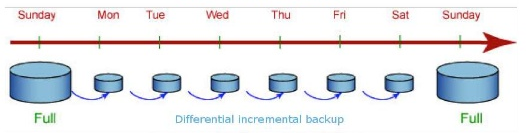

# 自动快照概述

自动快照采用差异增量备份，第一次创建自动快照为全量备份，以后每间隔一段时间就会做一次全量备份，全量备份作为基础版本。两次全量备份之间都是做增量备份，增量备份记录基于前一次备份所发生的更改。

在恢复快照时，GaussDB\(DWS\) 会将最近一次的全量备份到本次备份之间的所有备份一起用于恢复集群，因此不会产生数据丢失。

为了保证每个增量快照都能够正常进行数据恢复，如果增量快照的保存时间超过了保留天数，GaussDB\(DWS\) 不会立即删除过期的增量快照，而是仍然保留这部分快照，以便提供给后续其他增量快照恢复集群时使用，直到下一次做全量快照为止，GaussDB\(DWS\) 才会一并删除已过期的上一次的全量自动快照和相关的增量快照。

**图 1**  快照备份过程  

当创建集群时，自动快照默认处于启用状态。当集群启用了自动快照时，GaussDB\(DWS\) 将按照设定的时间和周期以及快照类型自动创建快照，默认为每8小时一次。用户也可以对集群设置自动快照策略，并根据自身需求，对集群设置一个或多个自动快照策略。GaussDB\(DWS\)管理控制台设置集群的自动快照策略，具体操作请参见[自动快照策略](自动快照策略.md)。

自动快照有保留期，可设置为1\~31天，默认为3天，系统会在保留期结束时删除这些快照。如果将自动快照保留更长时间，可以创建一份副本作为手动快照。自动快照会保留至保留期结束，而手动快照在手动删除前将会一直保留。如何复制自动快照，详情见[复制自动快照](复制自动快照.md)。

> **注意：** 
>如果对已有集群关闭自动快照功能，则会删除该集群所有的自动快照，但手动快照不会被删除。

