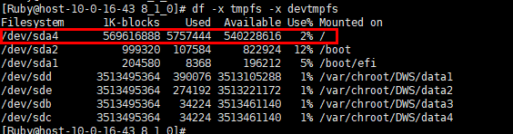

# 节点监控

## 进入节点监控页面

1.  登录GaussDB\(DWS\) 管理控制台。
2.  在“集群管理”页面，找到需要查看监控的集群。
3.  在指定集群所在行的“操作”列，单击“监控面板”。系统将显示数据库监控页面。
4.  在左侧导航栏选择“监控\>节点监控”，进入节点监控页面。

    在节点监控页面展示了节点，内存，磁盘，磁盘I/O，网络I/O的实时消耗。

## 概览

在“概览”一栏页面您可以根据节点名浏览指定节点的关键资源情况。其中包括:

-   节点名称
-   CPU使用率（%）
-   内存使用率（%）
-   平均磁盘使用率（%）
-   IP地址
-   磁盘I/O（KB/s）
-   TCP协议栈重传率（%）
-   网络I/O（KB/s）
-   状态
-   监控：用户可单击指定节点名称所在行监控列的图标查看具体节点近1小时、近3小时、近12小时或近24小时概览性能指标拓扑图。

## 磁盘

在“磁盘”一栏页面您可以根据节点和磁盘名浏览指定节点中磁盘的实时消耗使用情况。其中包括：

-   节点名称
-   磁盘名称
-   磁盘类型
    -   系统盘
    -   数据盘
    -   日志盘

-   磁盘容量（GB）
-   磁盘使用率（%）
-   磁盘读速率（KB/s）
-   磁盘写速率（KB/s）
-   I/O等待时间-await（ms）
-   I/O服务时间-svctm（ms）
-   I/O使用率-util（%）
-   监控：用户可单击指定节点名称所在行监控列的图标查看具体节点近1小时、近3小时、近12小时或近24小时磁盘性能指标拓扑图。

> **说明：** 
>根据页面显示磁盘使用率已使用与可用数据相加不等于总计。这是因为缺省的每个分区都留了少量空间供系统管理员使用。即使遇到普通用户空间已满的情况，系统管理员仍能登录和留有解决问题所需的工作空间。
>磁盘容量采集源自于linux的df命令，举例如下：
>
>/dev/sda4： Used\(5757444\) + Available\(540228616\) != Total\(569616888\)
>-   Filesystem：代表文件系统对应的设备文件的路径名（一般是硬盘上的分区）。
>-   IK-blocks：分区包含的数据块（1024字节）的数目。
>-   Used：磁盘已使用数据块数目。
>-   Available：磁盘可用的数据块数目。
>-   Use%：普通用户空间使用的百分比，即使空间使用率达到100％，分区仍然留有系统管理员使用的空间。
>-   Mounted on：表示文件系统的挂载点。

## 网络

在“网络”一栏页面您可以根据节点和网卡名称浏览指定节点的网络资源实时消耗情况。其中包括：

-   节点名称
-   网卡名称
-   网卡状态
-   网卡速度（Mbps）
-   接收包数
-   发送包数
-   接收丢包数
-   接收速率（KB/s）
-   发送速率（KB/s）
-   监控：用户可单击指定节点名称所在行监控列的图标查看具体节点近1小时、近3小时、近12小时或近24小时网络性能指标拓扑图。

