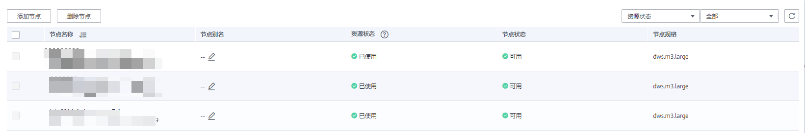
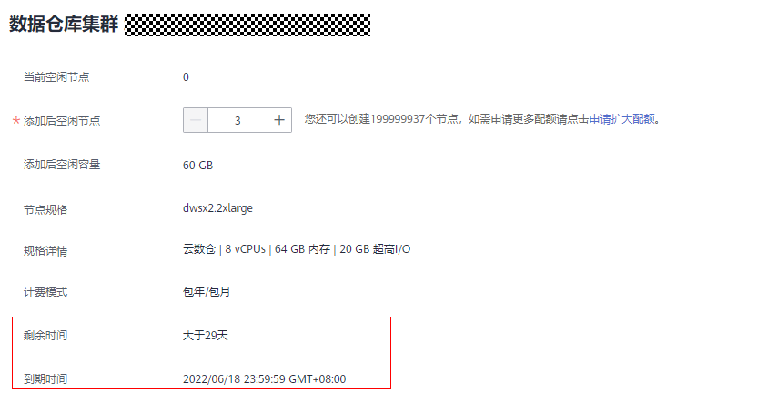
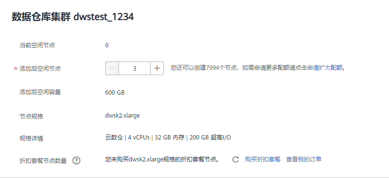
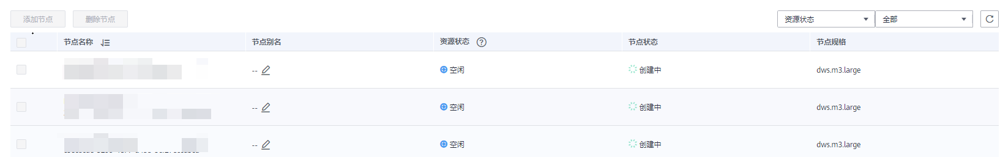
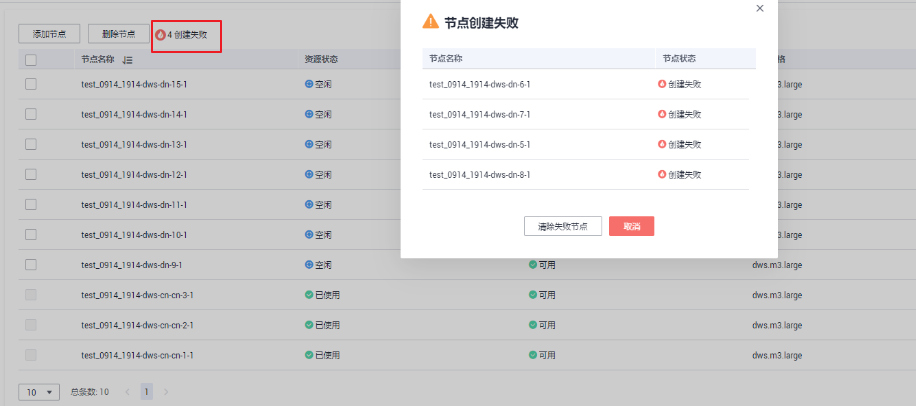
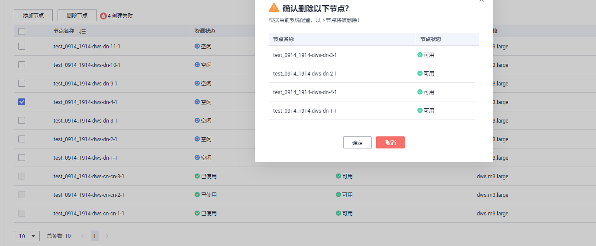
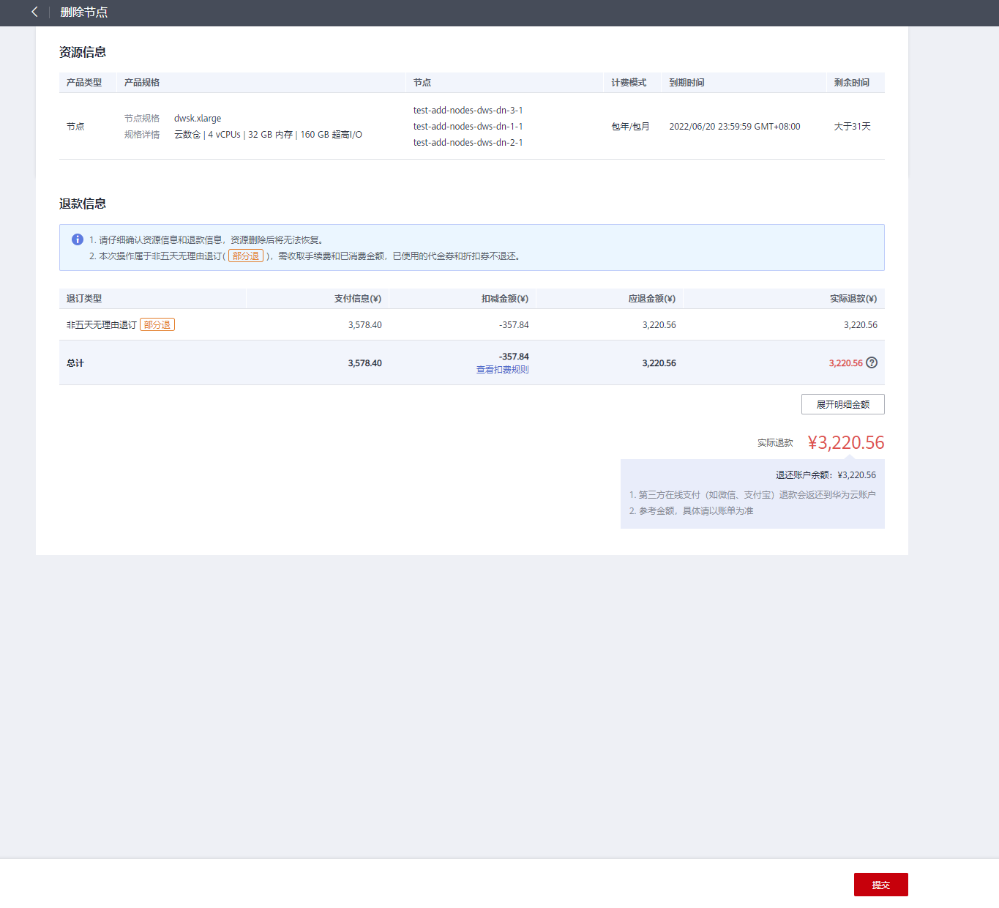

# 节点管理

## 节点管理概述

节点管理包含查看当前集群的节点列表、添加或删除用于扩容的新节点等功能，在节点管理页面可以清晰的看到各节点的状态、节点规格、是否已使用等信息。其中单击指定节点“节点别名”列文字后的图标可对节点别名进行修改。

> **说明：** 
>-   该特性仅8.1.1.200及以上版本支持。
>-   IoT数仓暂不支持节点管理。
>-   实时数仓（单机部署）不支持节点管理。

## 添加节点

添加节点主要用于大规模扩容场景，通过节点管理功能可以提前分批次添加准备好用于扩容的节点。例如需要新扩容180个BMS节点，可分3批各添加60个，如果其中有一部分添加失败，可再次添加失败数量的节点，等180个节点添加成功后，再使用这些添加好的节点进行扩容；添加节点过程中不影响集群业务。

**注意事项**

-   添加节点功能只能在管理侧任务列表中没有其他任务运行时才可使用。
-   添加节点的存储大小必须和该集群已有的节点保持一致。
-   添加成功的节点称为“空闲节点”，此节点主要用于扩容场景下，添加成功后即开始计费，建议需要使用时添加，并及时扩容到集群中；
-   在反亲和部署模式下，每次添加节点的数量只能是集群安全环大小的整数倍，如集群安全环大小为3，则添加节点时会强制数量为3的倍数；
-   在反亲和部署模式下，如果某个节点添加失败回滚，那么该节点所在服务器组正在创建的其他节点也将被回滚；

**操作步骤**

1.  登录GaussDB\(DWS\) 管理控制台。
2.  单击“集群管理“。默认显示用户所有的集群列表。
3.  在集群列表中，单击指定集群名称进入“集群详情”页面，单击“节点管理”进入页签。
4.  单击“添加节点”按钮，填写添加到节点的数量，单击“下一步:确认”。

    > **说明：** 
    >当用户在包周期计费模式下，界面会显示包周期的“剩余时间”和”到期时间”。
    >

    

5.  单击“提交”按钮后，跳转到节点管理页面，开始添加节点。

    

> **说明：** 
>添加失败的节点会自动回滚并记录在失败列表中，如下图：
>

## 删除节点

**注意事项**

-   删除节点功能只能在管理侧任务列表中没有其他任务运行时才可使用。
-   删除节点功能只支持删除资源状态为“空闲”的节点，此节点还未扩容至集群，可以删除，已使用的节点不支持删除；
-   在反亲和部署模式下，删除节点只能以集群的安全环为单位，如集群安全环大小为3，则选择某个节点删除时会自动选择并提示删除同一个安全环的其他节点。
-   包年/包月集群在宽限期和保留期内不支持删除节点，可在费用中心的续费管理处单击释放资源。

**操作步骤**

1.  登录GaussDB\(DWS\) 管理控制台。
2.  单击“集群管理“。默认显示用户所有的集群列表。
3.  在集群列表中，单击指定集群名称进入“集群详情”页面，单击“节点管理”进入页签。
4.  在“节点管理”页面选中要删除的节点，单击“删除节点”按钮，单击“是”按钮提交删除任务。

    

5.  （包周期计费模式）跳转至删除节点资源信息确认界面，确认无误后，单击“提交”。

    

6.  删除成功后，该节点将不再显示到节点管理页面。

