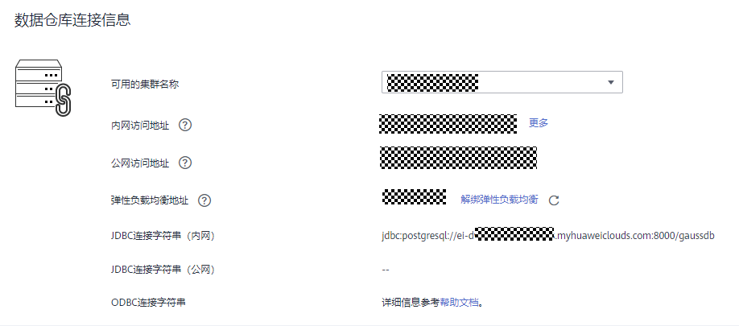
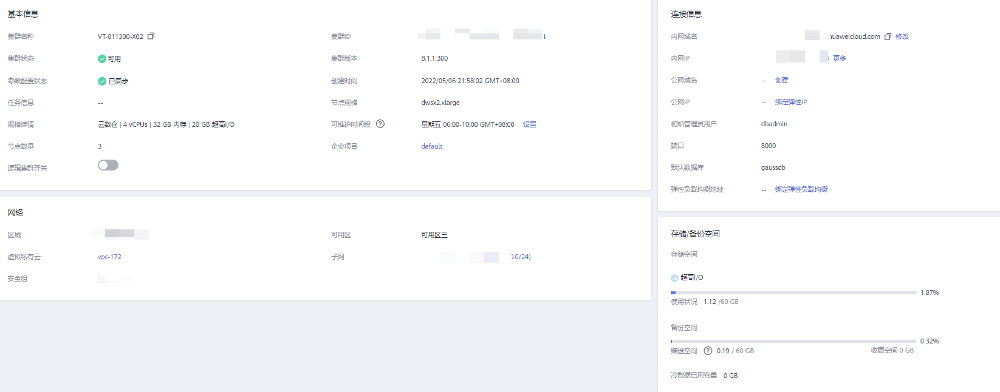

# 获取集群连接地址

## 操作场景

GaussDB\(DWS\) 支持不同方式连接集群，不同连接方式的连接地址也不同。支持查看并获取华为云平台环境的内网连接地址、互联网环境的公网访问地址和JDBC连接字符串。

获取集群连接地址有以下两种方式：

-   [在连接管理页面获取集群连接地址](#section5539467151713)
-   [在“集群详情”页面获取集群连接地址](#section149501253104810)

## 在“连接管理“页面获取集群连接地址

1.  登录GaussDB\(DWS\) 管理控制台。
2.  在左侧导航栏中，单击“连接管理“。
3.  在“数据仓库连接信息“区域，选择一个可用的集群名称。

    只能选择状态为“可用“的集群。

    **图 1**  数据仓库连接信息  
    

4.  查看并获取集群的连接信息。

    -   “内网访问地址“
    -   “公网访问地址“
    -   “弹性负载均衡地址“
    -   “JDBC连接字符串（内网）“
    -   “JDBC连接字符串（公网）“
    -   “ODBC连接字符串“

    > **说明：** 
    >-   如果创建集群时没有自动绑定弹性IP，“公网访问地址“显示为空。如果您想使用公网访问地址（由弹性IP和数据库端口组成）从互联网访问集群，可以单击“绑定弹性IP“为集群绑定弹性IP。
    >-   如果创建集群时绑定了弹性IP，如果您不想使用公网访问地址访问集群，可以单击“解绑弹性IP“为集群解绑弹性IP。弹性IP解绑后，“公网访问地址“显示为空。
    >-   如果创建集群时没有绑定弹性负载均衡，“弹性负载均衡地址“显示为空，可以单击“绑定弹性负载均衡“进行绑定，解决CN单点故障。
    >-   如果集群绑定了弹性负载均衡，为保证集群高可用，请优先使用**弹性负载均衡地址**连接集群。

## 在“集群详情”页面获取集群连接地址

1.  登录GaussDB\(DWS\) 管理控制台。
2.  在左侧导航栏中，单击“集群管理“。
3.  在集群列表中，单击指定集群的名称，打开“集群详情“页面。
4.  在“连接信息”区域，用户可以查看并获取集群的连接地址信息，包括内网地址、公网地址等。

    **图 2**  连接地址  
    

    **表 1**  连接信息

    
    <table><thead align="left"><tr id="zh-cn_topic_0000001455716669_r2b6913f2352a423d92e248eee4ed7ccf"><th class="cellrowborder" valign="top" width="19%" id="mcps1.2.3.1.1">
参数名

    </th>
    <th class="cellrowborder" valign="top" width="81%" id="mcps1.2.3.1.2">
参数解释

    </th>
    </tr>
    </thead>
    <tbody><tr id="zh-cn_topic_0000001455716669_row614113283186"><td class="cellrowborder" valign="top" width="19%" headers="mcps1.2.3.1.1 ">
内网域名

    </td>
    <td class="cellrowborder" valign="top" width="81%" headers="mcps1.2.3.1.2 ">
通过内部网络访问集群数据库的域名地址。内网访问域名在创建集群时自动生成。默认命名规则为：<em id="zh-cn_topic_0000001455716669_i1521904017188">集群名称.</em>dws.myhuaweicloud.com。通过域名访问DWS集群，域名解析器具有负载均衡的功能。

    
 说明： 

如果集群名称不符合域名规范，默认的访问域名前缀会相应做一些调整。

    

    
单击“修改”可以修改内网访问域名。访问域名由字母、数字、中划线组成，以大小写字母开头，长度为4~63个字符。

    
更多信息请参见<a href="管理集群访问域名.md">管理集群访问域名</a>。

    </td>
    </tr>
    <tr id="zh-cn_topic_0000001455716669_row1267154711810"><td class="cellrowborder" valign="top" width="19%" headers="mcps1.2.3.1.1 ">
内网IP

    </td>
    <td class="cellrowborder" valign="top" width="81%" headers="mcps1.2.3.1.2 ">
通过内部网络访问集群数据库的IP地址。

    
 说明： 
<ul id="zh-cn_topic_0000001455716669_ul173316457329"><li>内网访问IP地址在创建集群时自动生成，生成后的IP地址是固定的。</li><li>内网访问IP的数量对应的是CN节点的个数，可以通过登录任一节点连接到集群。</li><li>通过内网访问某个固定的IP，工作负载会集中在一个CN上。</li></ul>
    

    </td>
    </tr>
    <tr id="zh-cn_topic_0000001455716669_row1496320459196"><td class="cellrowborder" valign="top" width="19%" headers="mcps1.2.3.1.1 ">
公网域名

    </td>
    <td class="cellrowborder" valign="top" width="81%" headers="mcps1.2.3.1.2 ">
通过外部网络访问集群数据库的域名地址。

    
更多信息请参见<a href="管理集群访问域名.md">管理集群访问域名</a>。

    </td>
    </tr>
    <tr id="zh-cn_topic_0000001455716669_row14468195011915"><td class="cellrowborder" valign="top" width="19%" headers="mcps1.2.3.1.1 ">
公网IP

    </td>
    <td class="cellrowborder" valign="top" width="81%" headers="mcps1.2.3.1.2 ">
通过外部网络访问集群数据库的IP地址。

    
 说明： 
<ul id="zh-cn_topic_0000001455716669_ul176051606208"><li>如果创建集群时没有绑定弹性IP，“公网IP”显示为空，可以单击“绑定弹性IP”为集群绑定弹性IP。</li><li>如果创建集群时绑定了弹性IP，可以单击“解绑弹性IP”为集群解绑弹性IP。</li></ul>
    

    </td>
    </tr>
    <tr id="zh-cn_topic_0000001455716669_r4ff9b08ec9b64c62bd6bf3272c6eac82"><td class="cellrowborder" valign="top" width="19%" headers="mcps1.2.3.1.1 ">
初始管理员用户

    </td>
    <td class="cellrowborder" valign="top" width="81%" headers="mcps1.2.3.1.2 ">
创建集群时指定的数据库管理员用户。当用户第一次连接集群时，需要使用初始数据库管理员用户及其密码连接到默认数据库。

    </td>
    </tr>
    <tr id="zh-cn_topic_0000001455716669_r758c339bb9794651bc85a7d94aea003a"><td class="cellrowborder" valign="top" width="19%" headers="mcps1.2.3.1.1 ">
端口

    </td>
    <td class="cellrowborder" valign="top" width="81%" headers="mcps1.2.3.1.2 ">
通过公网或者内网访问集群数据库的端口号。端口号在创建集群时指定，它是集群监听客户端连接的端口。

    </td>
    </tr>
    <tr id="zh-cn_topic_0000001455716669_row11775171714206"><td class="cellrowborder" valign="top" width="19%" headers="mcps1.2.3.1.1 ">
默认数据库

    </td>
    <td class="cellrowborder" valign="top" width="81%" headers="mcps1.2.3.1.2 ">
创建集群时默认自动创建的数据库。当用户第一次连接集群时，需要连接到该默认数据库。

    </td>
    </tr>
    <tr id="zh-cn_topic_0000001455716669_row6395626202611"><td class="cellrowborder" valign="top" width="19%" headers="mcps1.2.3.1.1 ">
弹性负载均衡地址

    </td>
    <td class="cellrowborder" valign="top" width="81%" headers="mcps1.2.3.1.2 ">
为实现集群高可用，解决CN单点问题，集群创建后需手动绑定弹性负载均衡（ELB），连接集群时建议连接ELB地址。

    </td>
    </tr>
    </tbody>
    </table>

