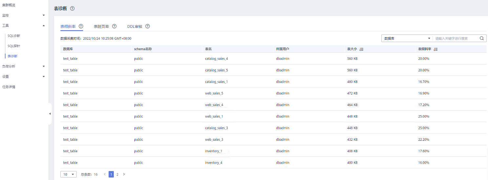
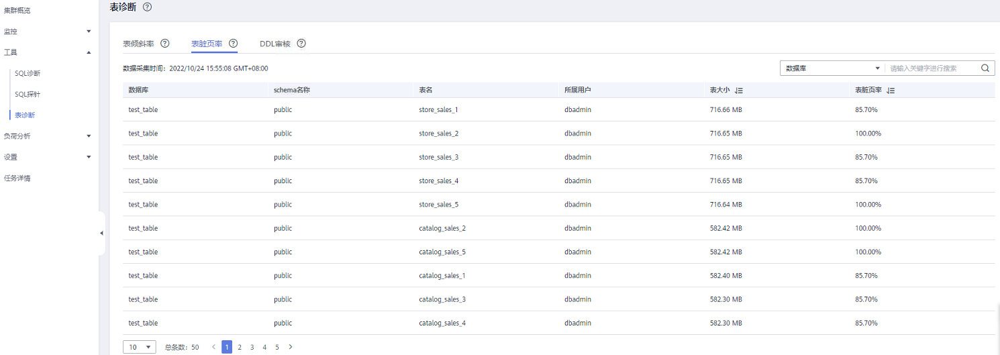
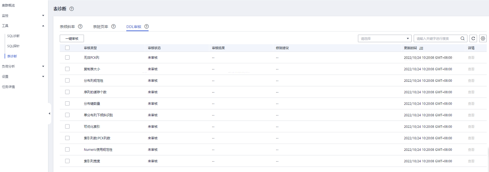
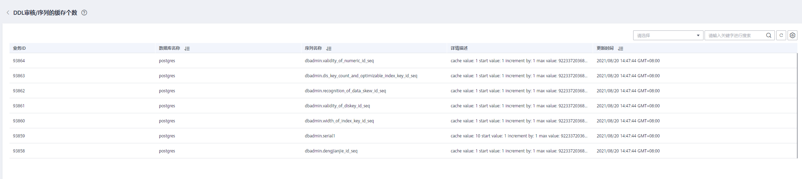
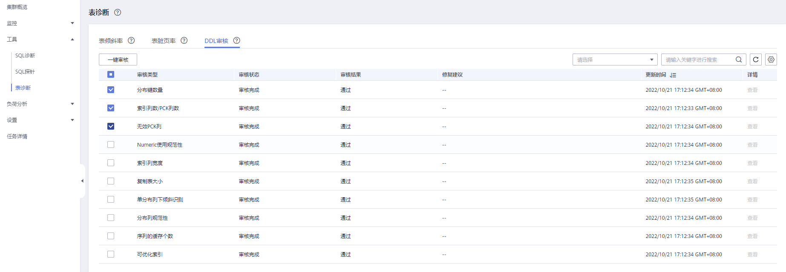

# 表诊断

GaussDB\(DWS\)提供了集群中数据表关键运行状态的统计数据与诊断工具。其中包括：

-   [表倾斜率](#section88392211094)：对于集群中数据表统计信息进行监控分析，展示倾斜率高于5%且表大小TOP50的表信息。
-   [表脏页率](#section199365318174)：对于集群中数据表统计信息进行监控分析，展示脏页率高于50%且表大小TOP50的表信息。
-   [DDL审核](#section251323071917)：DDL审核是SQL审核范畴，为了避免不合理的DDL设计影响实际业务运行，该工具会对DDL元数据进行规范性检测，方便用户对潜在的表定义问题提前感知，其结果也可作为性能问题定位的参考数据之一。

> **说明：** 
>-   表倾斜率和表脏页率特性仅8.1.1.x及以上集群版本支持，同时需保证dms-agent为8.2.0及以上版本。
>-   DDL审核特性仅8.1.1.300及以上集群版本支持，同时需保证dms-agent为8.1.2及以上版本。
>-   表倾斜率和脏页率数据采集周期可在集群[监控采集](监控设置.md#zh-cn_topic_0000001076708691_section149871230683)页面进行配置， 过于频繁的采集可能对集群性能有一定影响，请根据集群业务运行情况选择合适的采集周期。

## 表倾斜率

**背景信息**

不合理的分布列选择，将引发算子计算/数据下盘倾斜严重，导致不同DN的处理压力不同，影响业务性能，并容易造成单DN磁盘使用率过高。用户可通过查询表倾斜率，根据表的大小和倾斜率，对倾斜严重的表重新选择分布列，其中8.1.0及以上集群版本可直接通过[ALTER TABLE](https://support.huaweicloud.com/sqlreference-dws/dws_06_0142.html)语法进行调整，其他版本参见[如何调整分布列？](https://support.huaweicloud.com/dws_faq/dws_03_2126.html)。

**操作步骤**

1.  登录GaussDB\(DWS\) 管理控制台。
2.  在“集群管理”页面，找到需要查看监控的集群。
3.  在指定集群所在行的“操作”列，单击“监控面板”，系统将显示数据库监控页面。
4.  在左侧导航栏选择“工具\>表诊断\>表倾斜率”，页面将展示集群中符合统计条件的表信息。

    

## 表脏页率

**背景信息**

对于数据表的DML操作将影响数据表数据导致存在无用的脏数据， 过多的脏数据将占据磁盘空间，影响集群可用容量。用户可通过查询表的脏页率，根据表的大小和脏页率，对较大表和脏页率过高的表进行处理， 处理方式参考[磁盘使用率高&集群只读处理方案](https://support.huaweicloud.com/trouble-dws/dws_09_0031.html)。

**操作步骤**

1.  登录GaussDB\(DWS\) 管理控制台。
2.  在“集群管理”页面，找到需要查看监控的集群。
3.  在指定集群所在行的“操作”列，单击“监控面板”，系统将显示数据库监控页面。
4.  在左侧导航栏选择“工具\>表诊断\>表脏页率”，页面将展示集群中符合统计条件的表信息。

    

## DDL审核

**DDL审核结果查看及导出**

1.  登录GaussDB\(DWS\) 管理控制台。
2.  在“集群管理”页面，找到需要查看监控的集群。
3.  在指定集群所在行的“操作”列，单击“监控面板”，系统将显示数据库监控页面。
4.  在左侧导航栏选择“工具\>表诊断\>DDL审核”，右侧页面展示各审核项结果信息。

    

    > **说明：** 
    >“DDL审核”页面默认展示已勾选的审核项，可在集群[监控采集](监控设置.md#zh-cn_topic_0000001076708691_section149871230683)页面进行审核项配置，审核项详情请参见[表1](#table158169165618)。

    **表 1**  审核项介绍

    
    <table><thead align="left"><tr id="row5910905614"><th class="cellrowborder" valign="top" width="28.08%" id="mcps1.2.3.1.1">
<strong id="b8108925610">审核项</strong>

    </th>
    <th class="cellrowborder" valign="top" width="71.92%" id="mcps1.2.3.1.2">
<strong id="b91011975613">详细描述</strong>

    </th>
    </tr>
    </thead>
    <tbody><tr id="row1103955611"><td class="cellrowborder" valign="top" width="28.08%" headers="mcps1.2.3.1.1 ">
分布键数量 （disKeyCount）

    </td>
    <td class="cellrowborder" valign="top" width="71.92%" headers="mcps1.2.3.1.2 ">
在不倾斜的场景下，尽量使用较少的列和业务关联字段作为分布列，分布键数量建议不大于4。

    
在集群中，一般分布键较多时数据分布会比较均匀；即在单分布键下数据分布节点计算时的影响因素较少，一旦该分布键值存在聚集，数据在节点上的表现也会出现倾斜现象，而多分布键会增加分布节点计算的影响因素，减小数据倾斜。但分布键过多会出现存储性能和联合查询性能问题，建议不大于4个分布键。

    <ul id="ul1511591563"><li>存储性能问题：
在数据新增时，需要按hash函数计算每一分布列的结果，再将结果整合起来，作为确定分布节点参数，分布键越多，计算越复杂越耗时。

    </li><li>联合查询性能问题：
多表联合查询时，当分布键所有列为join条件涉及列的子集时，在执行计划中数据不需要做重新分布；反之，需要按join条件进行数据的重分布，分布键列指定的越多，其成为join条件涉及列的子集概率越小，越容易发生数据的重分布，而数据重分布则会消耗资源和时间。

    </li></ul>
    </td>
    </tr>
    <tr id="row11111298568"><td class="cellrowborder" valign="top" width="28.08%" headers="mcps1.2.3.1.1 ">
索引列数/PCK列数（indexKeyOrPckCount）

    </td>
    <td class="cellrowborder" valign="top" width="71.92%" headers="mcps1.2.3.1.2 ">
单个索引的索引列数/Partial Cluster Key（局部聚簇，以下简称PCK）列数建议不大于4。

    <ul id="ul17111935619"><li>索引列数越多，其维护索引数据需要的资源就越多，相对应出现重复索引概率越大。</li><li>PCK列越多，因在列存数据导入时需要对每一PCK列进行比较计算来划分CU，其过程将消耗越多的时间和资源，导入性能降低；而且在数据查询时，查询条件所涉及列的前缀需要是PCK列（如PCK列为a、b、c，则查询条件需要为a&gt;? and b&gt;? and c&gt;?类似样式的组合），这样才能在CU过滤时达到很好的效果，反之则需要遍历每一个CU，数据的聚簇没有发挥优势。</li></ul>
    

    </td>
    </tr>
    <tr id="row171219905619"><td class="cellrowborder" valign="top" width="28.08%" headers="mcps1.2.3.1.1 ">
无效的PCK列 （invalidPck）

    </td>
    <td class="cellrowborder" valign="top" width="71.92%" headers="mcps1.2.3.1.2 ">
避免创建无效PCK列。

    
在8.1.1及以上版本中，CU的过滤比较支持char，int8，int2，int4，text，bpchar，varchar，date，time，timestamp，timestamptz数据类型。所以PCK列指定了非上述类型的列时，在实际CU过滤时并没有起到作用，称之为无效PCK列，而维护这个无效PCK列需要占用一定资源，建议避免创建无效PCK列。

    

    </td>
    </tr>
    <tr id="row1812699565"><td class="cellrowborder" valign="top" width="28.08%" headers="mcps1.2.3.1.1 ">
Numeric使用规范性（validityOfNumeric）

    </td>
    <td class="cellrowborder" valign="top" width="71.92%" headers="mcps1.2.3.1.2 ">

    
在涉及数值类型使用时，尽量使用整型，或对精度要求不高的情况下，使用float定长类型，比numeric变长类型计算性能好。

    
即使用numeric类型，建议指明标度和精度，尽量在38位内，因为在涉及numeric类型数值计算时，底层会尝试将计算转换为int或bigint之间的计算，以提升计算效率，即数据类型的大整数优化。

    
在8.1.1及以上版本中指出未指定精度的情况下，小数点前最大131,072 位，小数点后最大 16,383位，即按最大标度和精度处理，在计算时将无法进行大整数优化，计算效率相应下降。

    </td>
    </tr>
    <tr id="row19123965614"><td class="cellrowborder" valign="top" width="28.08%" headers="mcps1.2.3.1.1 ">
索引列宽度（widthOfIndexKey）

    </td>
    <td class="cellrowborder" valign="top" width="71.92%" headers="mcps1.2.3.1.2 ">
过长字段一般都是字符串，这些字段基本不会执行比较操作，且会造成索引体积过大。建议在64字节内。

    </td>
    </tr>
    <tr id="row1012109195620"><td class="cellrowborder" valign="top" width="28.08%" headers="mcps1.2.3.1.1 ">
复制表大小（sizeOfCopyTable）

    </td>
    <td class="cellrowborder" valign="top" width="71.92%" headers="mcps1.2.3.1.2 ">
识别单DN的存储空间大于指定阈值(100MB)的表，建议修改为常用关联字段作为分布列（一般都有一个主键）。

    
集群支持复制表（replication）类型，该表会在每一个节点中维护一份全量数据，其较多应用于可枚举类数据的存储。如果表数据量过大，会占用较多空间；并且在实际联合查询中，节点会遍历所有表数据，可能会比将表类型改为分布表后的联合查询消耗时间还长（分布表虽然可能会产生数据重分布，但每个节点遍历的数据量会减少）。

    </td>
    </tr>
    <tr id="row151313985612"><td class="cellrowborder" valign="top" width="28.08%" headers="mcps1.2.3.1.1 ">
单分布列下倾斜识别（recognitionOfDataSkew）

    </td>
    <td class="cellrowborder" valign="top" width="71.92%" headers="mcps1.2.3.1.2 ">
针对单分布列的表下，根据统计信息判断当前分布列导致的数据分布倾斜。当前只能判断单分布列的场景，多分布列的无法判断。

    </td>
    </tr>
    <tr id="row21369135619"><td class="cellrowborder" valign="top" width="28.08%" headers="mcps1.2.3.1.1 ">
分布列规范性（validityOfDiskey）

    </td>
    <td class="cellrowborder" valign="top" width="71.92%" headers="mcps1.2.3.1.2 ">

    
在集群中，分布列建议不要指定为boolean或date类型字段，很容易出现数据的倾斜。

    </td>
    </tr>
    <tr id="row161418917569"><td class="cellrowborder" valign="top" width="28.08%" headers="mcps1.2.3.1.1 ">
序列的缓存个数（cacheSizeOfSequence）

    </td>
    <td class="cellrowborder" valign="top" width="71.92%" headers="mcps1.2.3.1.2 ">
序列指定的cache值不应过小，建议大于100。

    
在表字段使用到sequence时，其next_value首先从本节点预先获取缓存下来的值中获取，如果用完了则请求GTM服务再次获取，在大批量数据新增时，如果cache数量过少，会不断请求GTM，多个节点大批量请求会导致GTM压力过大，容易造成崩溃或阻塞，所以建议新建sequence时指定cache值大于100。

    </td>
    </tr>
    <tr id="row11147995614"><td class="cellrowborder" valign="top" width="28.08%" headers="mcps1.2.3.1.1 ">
可优化索引（optimizableIndexKey）

    </td>
    <td class="cellrowborder" valign="top" width="71.92%" headers="mcps1.2.3.1.2 ">
可优化场景包含：

    <ul id="ul9143915616"><li>索引的索引字段是另外一个索引的前N个字段。</li><li>两个索引的索引字段一致，只是顺序存在差异。</li></ul>
    </td>
    </tr>
    </tbody>
    </table>

5.  对于审核结果为“未通过”的审核项，可单击“查看”跳转至详情页面。

    

6.  在详情页面，点击左上角“结果导出”，即可导出审核结果。

    

**DDL手动审核**

1.  登录GaussDB\(DWS\) 管理控制台。
2.  在“集群管理”页面，找到需要查看监控的集群。
3.  在指定集群所在行的“操作”列，选择“监控面板”，系统将显示数据库监控页面。
4.  在左侧导航栏单击“工具\>表诊断\>DDL审核”，在右侧页面，选中需要审核的审核项，单击“一键审核”按钮触发手动审核操作。

    

