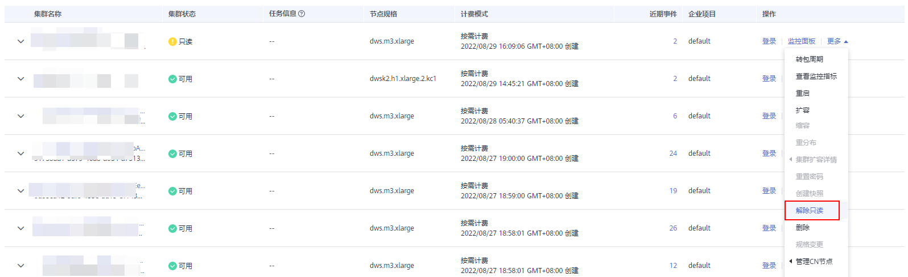

# 解除只读

当集群进入只读状态时，无法进行数据库写入相关操作，用户可以在管理控制台解除集群的只读状态。触发只读状态可能是由于磁盘使用率过高，因此需要对集群数据进行清理，详情请参见[磁盘使用率高&集群只读处理方案](https://support.huaweicloud.com/trouble-dws/dws_09_0031.html#section4)章节。

> **说明：** 
>-   解除只读支持1.7.2及以上版本。
>-   8.2.0集群版本开始支持只读状态下用户可以通过开启读写事务DROP/TRUNCATE TABLE的方式清理磁盘空间。

## 对系统的影响

-   集群状态为“只读”时，可进行解除只读操作。
-   集群处于“只读”状态时，应停止写入任务，避免磁盘被写满造成数据丢失的风险。
-   解除只读操作成功后，尽快清理数据，避免集群过一段时间再次进入“只读”状态。

## 解除只读

1.  登录GaussDB\(DWS\) 管理控制台。
2.  单击“集群管理“。

    默认显示用户所有的集群列表。

3.  在集群列表中，在指定集群所在行的“操作“列，选择“更多  \>  解除只读“。

    

4.  在弹出对话框中，单击“确定”，再次进行解除只读确认，对集群进行解除只读操作。

    

