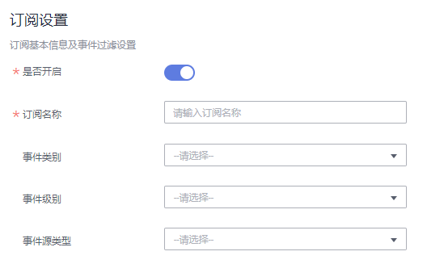
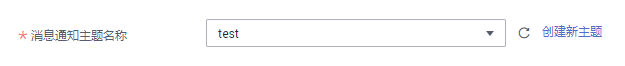
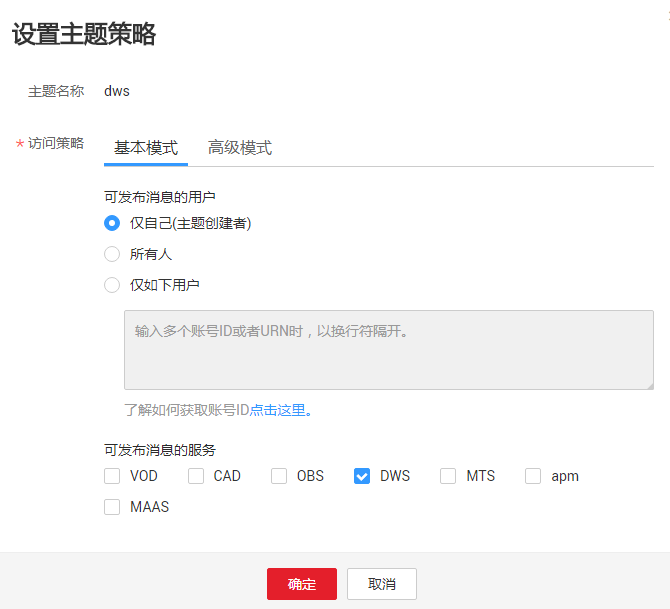
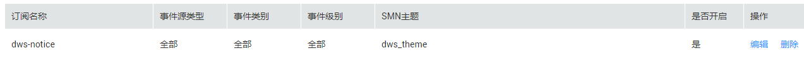

# 订阅事件通知

用户通过订阅DWS的事件通知，这样便能在特定集群或快照发生管理、监控或安全事件时收到通知消息。

## 创建订阅

1.  通过访问以下地址登录DWS管理控制台：[https://console.huaweicloud.com/dws](https://console.huaweicloud.com/dws)。
2.  在左侧导航树，单击“事件管理“。
3.  在“事件管理“页面中单击“订阅 \> 创建订阅“。
4.  在“订阅设置“区域，设置订阅基本信息及事件过滤。

    “订阅事件列表“区域显示系统根据订阅设置筛选出的事件。

    **图 1**  订阅设置  
    

    **表 1**  订阅参数

    
    <table><thead align="left"><tr id="row4704172711114"><th class="cellrowborder" valign="top" width="15.7%" id="mcps1.2.3.1.1">
参数名

    </th>
    <th class="cellrowborder" valign="top" width="84.3%" id="mcps1.2.3.1.2">
参数解释

    </th>
    </tr>
    </thead>
    <tbody><tr id="row127045270117"><td class="cellrowborder" valign="top" width="15.7%" headers="mcps1.2.3.1.1 ">
是否开启

    </td>
    <td class="cellrowborder" valign="top" width="84.3%" headers="mcps1.2.3.1.2 ">
设置是否开启事件订阅。

    
表示开启事件订阅，表示关闭事件订阅，默认为开启状态。关闭后停止发送已订阅事件的通知消息，不会删除该订阅。

    </td>
    </tr>
    <tr id="row137055276114"><td class="cellrowborder" valign="top" width="15.7%" headers="mcps1.2.3.1.1 ">
订阅名称

    </td>
    <td class="cellrowborder" valign="top" width="84.3%" headers="mcps1.2.3.1.2 ">
设置订阅事件的名称。

    <ul id="ul386613493427"><li>名称只能包含大写字母、小写字母、数字、-和_，且必须由大写字母、小写字母或数字开头。</li><li>名称长度为1～256字符。</li></ul>
    </td>
    </tr>
    <tr id="row0705027131110"><td class="cellrowborder" valign="top" width="15.7%" headers="mcps1.2.3.1.1 ">
事件类别

    </td>
    <td class="cellrowborder" valign="top" width="84.3%" headers="mcps1.2.3.1.2 ">
选择订阅事件的类别：管理，监控或安全。

    </td>
    </tr>
    <tr id="row1970515272116"><td class="cellrowborder" valign="top" width="15.7%" headers="mcps1.2.3.1.1 ">
事件级别

    </td>
    <td class="cellrowborder" valign="top" width="84.3%" headers="mcps1.2.3.1.2 ">
选择事件的告警级别：正常或警告。

    </td>
    </tr>
    <tr id="row2705027151112"><td class="cellrowborder" valign="top" width="15.7%" headers="mcps1.2.3.1.1 ">
事件源类型

    </td>
    <td class="cellrowborder" valign="top" width="84.3%" headers="mcps1.2.3.1.2 ">
选择事件源类型：集群或快照。

    </td>
    </tr>
    </tbody>
    </table>

5.  在“消息通知主题名称“下拉框中，选择合适的消息通知主题。

    用户可以根据需要，通过以下操作新建消息通知主题。

    1.  单击“创建新主题“，系统将跳转到消息通知服务的“主题“页面，用户可通过单击页面右上方的“创建主题“来新建主题，具体请参见《消息通知服务用户指南》中的“主体管理 \> 创建主题“章节。

        **图 2**  创建新主题  
        

    2.  在创建的主题行，单击“更多 \> 设置主题策略 ”，“可发布消息的服务“处勾选“DWS“，使消息通知服务发布DWS消息。

        **图 3**  设置主题策略  
        

6.  单击“确定“，完成创建订阅。

## 修改订阅

1.  在DWS管理控制台的“事件管理“页面中，单击“订阅“  页签。
2.  在指定订阅名称所在行的“操作“列，单击“编辑“，进入“编辑订阅“页面。

    **图 4**  选择编辑  
    

3.  在“编辑订阅“页面，选择要更改的参数项进行修改。具体修改方法参见创建订阅中的[4](#li18772435125416)～[6](#li164751612342)。

## 删除订阅

1.  在DWS管理控制台的“事件管理“页面中，单击“订阅“  页签。
2.  在指定订阅名称所在行的“操作“列，单击“删除“，弹出确认删除对话框。
3.  单击“是“，删除该订阅。

